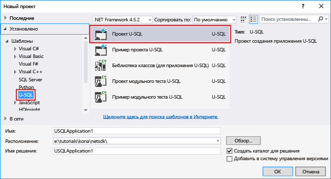

# Анализ журналов веб-сайта с помощью Azure Data Lake Analytics
Сведения об анализе журналов веб-сайтов с помощью службы аналитики озера, а также информация об источниках ссылок, которые столкнулись с ошибками во время попытки посетить веб-сайт.

## предварительным требованиям
* **Visual Studio 2015 или Visual Studio 2013**.
* **[Средства Data Lake для Visual Studio](http://aka.ms/adltoolsvs)**.

    После установки Средств Data Lake для Visual Studio вы увидите пункт **Data Lake** в меню **Сервис** Visual Studio.

    
* **Базовые знания о Data Lake Analytics и инструментах Data Lake для Visual Studio**. Чтобы начать работу, см. следующие статьи.

  * [Разработка сценария U-SQL с помощью средств озера данных для Visual Studio](data-lake-analytics-data-lake-tools-get-started.md).
* **Учетная запись Data Lake Analytics**.  Ознакомьтесь с разделом [Создание учетной записи Azure Data Lake Analytics](data-lake-analytics-get-started-portal.md).
* **Установка образца данных.** На портале Azure откройте учетную запись Data Lake Analytics и в левом меню щелкните **Примеры сценариев**, а затем — **Копировать демонстрационные данные**. 

## Подключение к Azure
Прежде чем можно будет скомпилировать и протестировать любой сценарий U-SQL, необходимо сначала подключиться к Azure.

**Подключение к аналитике озера данных**

1. Откройте Visual Studio.
2. Щелкните **Data Lake > Параметры и настройки**.
3. Щелкните **Вход** или **Изменить пользователя**, если кто-то уже выполнил вход, и выполните инструкции для входа.
4. Нажмите кнопку **ОК** , чтобы закрыть диалоговое окно параметров и настроек.

**Просмотр учетных записей аналитики озера данных**

1. В Visual Studio откройте **обозреватель серверов**, нажав клавиши **CTRL + ALT + S**.
2. В **обозревателе серверов** разверните **Azure**, а затем — **Data Lake Analytics**. Будет выведен список учетных записей аналитики озера данных, если они есть. Создать учетную запись аналитики озера данных в Studio невозможно. Описание создания учетной записи см. в [руководстве по началу работы с Azure Data Lake Analytics с помощью портала Azure](data-lake-analytics-get-started-portal.md) или [руководстве по началу работы с Azure Data Lake Analytics с помощью Azure PowerShell](data-lake-analytics-get-started-powershell.md).

## Разработка приложения U-SQL
Приложение U-SQL представляет собой главным образом сценарий U-SQL. Дополнительные сведения о языке U-SQL см. в статье [Приступая к работе с U-SQL](data-lake-analytics-u-sql-get-started.md).

Вы можете добавить в приложение пользовательские операторы сложения.  Дополнительные сведения см. в статье [Разработка пользовательских операторов U-SQL для заданий аналитики озера данных](data-lake-analytics-u-sql-develop-user-defined-operators.md).

**Создание и отправка задания аналитики озера данных**

1. Щелкните **Файл > Создать > Проект**.
2. Выберите тип «Проект U-SQL».

    
3. Последовательно выберите **ОК**. Visual Studio создает решение с помощью файла Script.usql.
4. Скопируйте следующий сценарий в файл Script.usql.

        // Create a database for easy reuse, so you don't need to read from a file every time.
        CREATE DATABASE IF NOT EXISTS SampleDBTutorials;

        // Create a Table valued function. TVF ensures that your jobs fetch data from the weblog file with the correct schema.
        DROP FUNCTION IF EXISTS SampleDBTutorials.dbo.WeblogsView;
        CREATE FUNCTION SampleDBTutorials.dbo.WeblogsView()
        RETURNS @result TABLE
        (
            s_date DateTime,
            s_time string,
            s_sitename string,
            cs_method string,
            cs_uristem string,
            cs_uriquery string,
            s_port int,
            cs_username string,
            c_ip string,
            cs_useragent string,
            cs_cookie string,
            cs_referer string,
            cs_host string,
            sc_status int,
            sc_substatus int,
            sc_win32status int,
            sc_bytes int,
            cs_bytes int,
            s_timetaken int
        )
        AS
        BEGIN

            @result = EXTRACT
                s_date DateTime,
                s_time string,
                s_sitename string,
                cs_method string,
                cs_uristem string,
                cs_uriquery string,
                s_port int,
                cs_username string,
                c_ip string,
                cs_useragent string,
                cs_cookie string,
                cs_referer string,
                cs_host string,
                sc_status int,
                sc_substatus int,
                sc_win32status int,
                sc_bytes int,
                cs_bytes int,
                s_timetaken int
            FROM @"/Samples/Data/WebLog.log"
            USING Extractors.Text(delimiter:' ');
            RETURN;
        END;

        // Create a table for storing referrers and status
        DROP TABLE IF EXISTS SampleDBTutorials.dbo.ReferrersPerDay;
        @weblog = SampleDBTutorials.dbo.WeblogsView();
        CREATE TABLE SampleDBTutorials.dbo.ReferrersPerDay
        (
            INDEX idx1
            CLUSTERED(Year ASC)
            DISTRIBUTED BY HASH(Year)
        ) AS

        SELECT s_date.Year AS Year,
            s_date.Month AS Month,
            s_date.Day AS Day,
            cs_referer,
            sc_status,
            COUNT(DISTINCT c_ip) AS cnt
        FROM @weblog
        GROUP BY s_date,
                cs_referer,
                sc_status;

    Для знакомства с U-SQL см. статью [Начало работы с языком U-SQL для аналитики озера данных Azure](data-lake-analytics-u-sql-get-started.md).    
5. Добавьте в проект новый скрипт U-SQL и введите следующую команду:

        // Query the referrers that ran into errors
        @content =
            SELECT *
            FROM SampleDBTutorials.dbo.ReferrersPerDay
            WHERE sc_status >=400 AND sc_status < 500;

        OUTPUT @content
        TO @"/Samples/Outputs/UnsuccessfulResponses.log"
        USING Outputters.Tsv();
6. Вернитесь к первому скрипту U-SQL и рядом с кнопкой **Отправить** укажите свою учетную запись аналитики.
7. В **обозревателе решений** щелкните правой кнопкой мыши файл **Script.usql** и выберите команду **Build Script** (Создать сценарий). Проверьте результаты на панели вывода.
8. В **обозревателе решений** щелкните правой кнопкой мыши файл **Script.usql** и выберите команду **Submit Script** (Отправить сценарий).
9. Убедитесь, что для запуска задания выбрана правильная **учетная запись аналитики**, и нажмите кнопку **Отправить**. Результаты отправки и ссылка на задание появятся в окне результатов средств озера данных для Visual Studio после завершения отправки.
10. Дождитесь успешного завершения задания.  Если задание не выполнено, скорее всего, отсутствует исходный файл.  См. раздел «Предварительные требования» этого руководства. Дополнительные сведения об устранении неполадок см. в статье [Мониторинг и устранение неполадок заданий аналитики озера данных Azure](data-lake-analytics-monitor-and-troubleshoot-jobs-tutorial.md).

    После выполнения задания вы должны увидеть такие результаты:

    
11. Теперь повторите шаги 7–10 для файла **Script1.usql**.

**Просмотр выходных данных задания**

1. В **обозревателе сервера** разверните узлы **Azure** и **Data Lake Analytics**, разверните учетную запись Data Lake Analytics и **учетные записи хранения**, а затем щелкните правой кнопкой мыши учетную запись хранения Data Lake по умолчанию и выберите **Обозреватель**.
2. Дважды щелкните **Образцы**, чтобы открыть папку с примерами, и дважды щелкните **Выходные данные**.
3. Дважды щелкните файл **UnsuccessfulResponsees.log**.
4. Кроме того, вы можете дважды щелкнуть выходной файл в графическом представлении задания для перехода непосредственно к выходным данным.

## См. также
Для начала работы с аналитикой озера данных с использованием различных средств см. следующие статьи.

* [Начало работы с аналитикой озера данных с помощью портала Azure](data-lake-analytics-get-started-portal.md)
* [Начало работы с аналитикой озера данных с помощью Azure PowerShell](data-lake-analytics-get-started-powershell.md)
* [Начало работы с аналитикой озера данных с помощью пакета SDK .NET.](data-lake-analytics-get-started-net-sdk.md)
