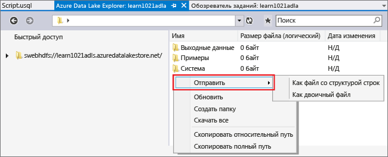
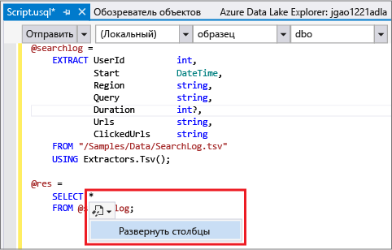
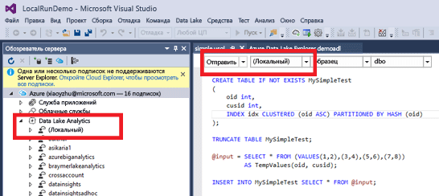
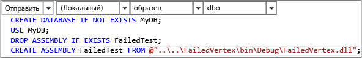

<properties
   pageTitle="Разработка скриптов U-SQL с помощью средств озера данных для Visual Studio | Azure"
   description="Сведения об установке средств озера данных для Visual Studio, разработке и тестировании скриптов U-SQL. "
   services="data-lake-analytics"
   documentationCenter=""
   authors="edmacauley"
   manager="jhubbard"
   editor="cgronlun"/>

<tags
   ms.service="data-lake-analytics"
   ms.devlang="na"
   ms.topic="get-started-article"
   ms.tgt_pltfrm="na"
   ms.workload="big-data"
   ms.date="05/16/2016"
   ms.author="edmaca"/>

# Учебник. Разработка скриптов U-SQL с помощью средств озера данных для Visual Studio

[AZURE.INCLUDE [get-started-selector](../../includes/data-lake-analytics-selector-get-started.md)]

Узнайте, как установить средства озера данных для Visual Studio и как их использовать для создания и тестирования скриптов U-SQL.

U-SQL — это высокомасштабируемый и расширяемый язык для подготовки, преобразования и анализа любых данных в озере данных и не только. Дополнительные сведения см. в [справке по U-SQL](http://go.microsoft.com/fwlink/p/?LinkId=691348).

###Предварительные требования

- **Visual Studio 2015, Visual Studio 2013 с обновлением 4 или Visual Studio 2012. Поддерживаются выпуски Enterprise (Ultimate/Premium), Professional и Community. Выпуск Express не поддерживается. Visual Studio 15 в настоящее время не поддерживается, но мы работаем над этим.**
- **Пакет SDK Microsoft Azure для .NET (версии 2.7.1 или более поздней версии)**. Установите его с помощью [установщика веб-платформы](http://www.microsoft.com/web/downloads/platform.aspx).
- **[Средства озера данных для Visual Studio](http://aka.ms/adltoolsvs)**.

    После установки средств озера данных для Visual Studio в обозревателе сервера в узле Azure появится узел "Аналитика озера данных". (Чтобы открыть обозреватель сервера, нажмите клавиши CTRL+ALT+S).

- **Ознакомьтесь со следующими разделами в статье [Начало работы с аналитикой озера данных Azure с использованием портала Azure](data-lake-analytics-get-started-portal.md)**.

	- [Создание учетной записи аналитики озера данных Azure](data-lake-analytics-get-started-portal.md#create_adl_analytics_account).
	- [Передача файла SearchLog.tsv в учетную запись хранения озера данных по умолчанию](data-lake-analytics-get-started-portal.md#update-data-to-the-default-adl-storage-account).

    Для удобства в разделе [Пример Appx-A PowerShell для подготовки руководства](data-lake-analytics-data-lake-tools-get-started.md#appx-a-powershell-sample-for-preparing-the-tutorial) вы можете найти пример сценария PowerShell для создания службы аналитики озера данных и загрузки файла источника данных.

	Средства озера данных не поддерживают создание учетных записей аналитики озера данных. Поэтому ее необходимо создать с помощью портала Azure, Azure PowerShell, пакета SDK .NET или интерфейса командной строки Azure. Чтобы выполнить задание аналитики озера данных, потребуются некоторые данные. Несмотря на то, что средства озера данных поддерживают передачу данных, чтобы упростить работу с этим руководством, для передачи примера данных мы используем портал.

## Подключение к Azure

**Подключение к аналитике озера данных**

1. Откройте Visual Studio.
2. В меню **Вид** выберите **Обозреватель серверов**, чтобы открыть окно обозревателя. Или нажмите **[CTRL] + [ALT] + S**.
3. Щелкните правой кнопкой мыши **Azure**, выберите "Подключиться к подписке Microsoft Azure" и следуйте инструкциям.
4. В **обозревателе серверов** разверните **Azure**, а затем — **Аналитика озера данных**. Будет выведен список учетных записей аналитики озера данных, если они есть. Создавать учетные записи аналитики озера данных из Visual Studio нельзя. Описание создания учетной записи см. в статье [Начало работы со службой аналитики озера данных Azure с использованием портала Azure](data-lake-analytics-get-started-portal.md) или [Начало работы со службой аналитики озера данных Azure с помощью Azure PowerShell](data-lake-analytics-get-started-powershell.md).

## Передача исходных файлов данных

Вы уже передали некоторые данные в разделе **Предварительные требования** ранее в этом учебнике.

Если вы хотите использовать собственные данные, ниже приводятся процедуры передачи данных с помощью средств озера данных.

**Передача файлов в зависимую учетную запись озера данных Azure**

1. В **обозревателе серверов** разверните узлы **Azure**, **Аналитика озера данных**, учетную запись аналитики озера данных и **Учетные записи хранения**. Появятся учетная запись хранения озера данных по умолчанию, связанные учетные записи хранения озера данных и связанные учетные записи хранения Azure. Учетная запись озера данных по умолчанию имеет метку «Учетная запись хранения по умолчанию».
2. Щелкните правой кнопкой мыши учетную запись хранения озера данных по умолчанию и выберите пункт меню **Обозреватель**. Откроется панель средств озера данных для обозревателя Visual Studio. Слева показано дерево, справа — содержимое.
3. Перейдите в папку, в которую нужно передать файлы.
4. Щелкните правой кнопкой мыши в пустом месте и выберите пункт меню **Передать**.

	

**Передача файлов в связанную учетную запись хранилища BLOB-объектов Azure**

1. В **обозревателе серверов** разверните узлы **Azure**, **Аналитика озера данных**, учетную запись аналитики озера данных и **Учетные записи хранения**. Появятся учетная запись хранения озера данных по умолчанию, связанные учетные записи хранения озера данных и связанные учетные записи хранения Azure.
2. Разверните учетную запись хранения Azure.
3. Щелкните правой кнопкой мыши контейнер, в который нужно передать файлы, и нажмите кнопку **Обозреватель**. Если у вас нет контейнера, сначала создайте его с помощью портала Azure, Azure PowerShell или других средств.
4. Перейдите в папку, в которую нужно передать файлы.
5. Щелкните правой кнопкой мыши в пустом месте и выберите пункт меню **Передать**.

## Разработка скриптов U-SQL

Задания аналитики озера данных пишутся на языке U-SQL. Дополнительные сведения о языке U-SQL см. в статье [Начало работы с языком U-SQL](data-lake-analytics-u-sql-get-started.md) и в [Справочнике по языку U-SQL](http://go.microsoft.com/fwlink/?LinkId=691348).

**Создание и отправка задания аналитики озера данных**

1. В меню **Файл** выберите команду **Создать**, а затем — **Проект**.
2. Выберите тип **Проект U-SQL**.

	

3. Нажмите кнопку **ОК**. Visual Studio создает решение с файлом **Script.usql**.
4. Скопируйте следующий скрипт в файл **Script.usql**:

        @searchlog =
            EXTRACT UserId          int,
                    Start           DateTime,
                    Region          string,
                    Query           string,
                    Duration        int?,
                    Urls            string,
                    ClickedUrls     string
            FROM "/Samples/Data/SearchLog.tsv"
            USING Extractors.Tsv();

		@res =
		    SELECT *
		    FROM @searchlog;        

        OUTPUT @res   
            TO "/Output/SearchLog-from-Data-Lake.csv"
        USING Outputters.Csv();

	Этот скрипт U-SQL считывает файл исходных данных с помощью **Extractors.Tsv()**, а затем создает CSV-файл с помощью **Outputters.Csv()**.

    Не меняйте эти два пути, если только исходный файл не был скопирован в другое место. Аналитика озера данных создаст выходную папку, если ее не существует.

	Проще использовать относительные пути для файлов, которые хранятся в учетных записях озера данных по умолчанию. Также можно использовать абсолютные пути. Например:

        adl://<Data LakeStorageAccountName>.azuredatalakestore.net:443/Samples/Data/SearchLog.tsv

    Необходимо использовать абсолютные пути для доступа к файлам в связанных учетных записях хранения. Для файлов, хранящихся в связанной учетной записи хранения Azure, используется следующий синтаксис:

        wasb://<BlobContainerName>@<StorageAccountName>.blob.core.windows.net/Samples/Data/SearchLog.tsv

    >[AZURE.NOTE] Контейнер больших двоичных объектов Azure с разрешениями на доступ к общедоступным большим двоичным объектам или общедоступным контейнерам в настоящее время не поддерживается.

	Обратите внимание на следующие возможности.

	- **IntelliSense**

		Автоматическое заполнение имени и отображение членов для наборов строк, классов, баз данных, схем и пользовательских объектов (UDO).

		IntelliSense для сущностей каталога (базы данных, схемы, таблицы, пользовательские объекты и т. д.) связывается с вашей учетной записью вычислений. Узнать текущую активную учетную запись вычислений, базу данных и схему можно в верхней панели инструментов, менять их можно в раскрывающихся списках.

    - **Развертывание столбцов***

        Щелкните справа от *. Под * вы увидите синюю линию подчеркивания. Наведите указатель мыши на синюю линию подчеркивания и нажмите кнопку со стрелкой вниз.  
    	

        Щелкните **Развернуть столбцы**, средство заменит * именами столбцов.

	- **Автоформат**

		В меню "Правка" -> "Дополнительно" пользователи могут менять отступы в скрипте в соответствии со структурой кода.

		- Форматировать документ (Ctrl + E, D): форматирует весь документ
		- Форматировать выделенный фрагмент (Ctrl + K, Ctrl + F): форматирует выделенный фрагмент. Если фрагмент не выделен, будет отформатирована строка, в которой находится курсор.

		Все правила форматирования можно настроить в меню Сервис -> Параметры -> Текстовый редактор - > SIP -> Форматирование.
	- **Автоматический отступ**

		Средства озера данных для Visual Studio позволяют автоматически вставлять отступы для выражений при написании скриптов. По умолчанию эта функция отключена. Чтобы включить ее, нужно выбрать параметр «Включить автоматический отступ» в меню U-SQL -> Параметры и настройки -> Параметры.

	- **Переход к определению и поиск всех ссылок**

		Щелкните правой кнопкой мыши имя набора строк, параметра, столбца, пользовательского объекта и пр. Выберите команду «Перейти к определению» (F12), чтобы перейти к определению объекта. Команда «Найти все ссылки» (Shift + F12) покажет все ссылки.

	- **Вставка пути Azure**

		Вместо того чтобы запоминать путь к файлу Azure и вводить его вручную при написании сценариев, воспользуйтесь простым способом средств Data Lake для Visual Studio: щелкните правой кнопкой мыши в редакторе и выберите команду Insert Azure Path (Вставить путь Azure). Перейдите к файлу в диалоговом окне браузера больших двоичных объектов Azure. Нажмите кнопку **ОК**. Путь к файлу будет вставлен в код.

5. Укажите учетную запись аналитики озера данных, базу данных и схему. Вы можете выбрать вариант **(локально)** для локального запуска скрипта в целях тестирования. Дополнительные сведения см. в разделе [Локальный запуск U-SQL](#run-u-sql-locally).

	

    Дополнительные сведения см. в разделе [Использование каталога U-SQL](data-lake-analytics-use-u-sql-catalog.md).

5. В **обозревателе решений** щелкните правой кнопкой мыши **Script.usql** и выберите команду **Build Script** (Создать сценарий). Проверьте результат на панели вывода.
6. В **обозревателе решений** щелкните правой кнопкой мыши **Script.usql** и выберите команду **Submit Script** (Отправить сценарий). Либо можно нажать кнопку **Отправить** на панели Script.usql. См. предыдущий снимок экрана. Щелкните стрелку вниз рядом с кнопкой «Отправить», чтобы отправить с использованием расширенных параметров.
7. Укажите значение в поле **Имя задания**, проверьте **учетную запись аналитики** и нажмите кнопку **Отправить**. Результаты отправки и ссылка на задание появятся в окне результатов средств озера данных для Visual Studio после завершения отправки.

	

8. Чтобы увидеть текущее состояние задания, нажмите кнопку «Обновить». Если задание завершилось успешно, будут показаны **График задания**, **Операции с метаданными**, **Журнал состояний**, **Диагностика**.

	

	* Обзор задания. Показывает сводку по текущему заданию, например состояние, ход выполнения, время выполнения, имя среды выполнения, отправителя и т. д.
	* Сведения о задании. Подробные сведения по этому заданию, включая скрипт, ресурсы, представление выполнения вершин.
	* График задания. Предлагается четыре графика для визуализации сведений о задании, включая ход выполнения, считанные данные, записанные данные, время выполнения, среднее время выполнения на каждом узле, пропускную способность ввода и пропускную способность вывода.
	* Операции с метаданными. Показываются все операции с метаданными.
	* Журнал состояний.
	* Диагностика. Средства озера данных для Visual Studio ведут автоматическую диагностику выполнения задания. При возникновении ошибок или проблем с производительностью в ваших заданиях будут выводиться предупреждения. Дополнительные сведения см. в разделе «Диагностика заданий» (link TBD).

**Проверка состояния задания**

1. В обозревателе серверов разверните узлы **Azure**, **Аналитика озера данных** и учетную запись аналитики озера данных.
2. Дважды щелкните **Задания** для вывода списка заданий.
2. Выберите задание, чтобы показать его состояние.

**Просмотр выходных данных задания**

1. В **обозревателе серверов** разверните узлы **Azure** и **Аналитика озера данных**, разверните учетную запись аналитики озера данных и **Учетные записи хранения**, а затем щелкните правой кнопкой мыши учетную запись хранения озера данных по умолчанию и выберите команду **Обозреватель**.
2.  Дважды щелкните **выходные данные**, чтобы открыть папку.
3.  Дважды щелкните файл **SearchLog-From-adltools.csv**.

###Воспроизведение задания

Воспроизведение задания позволяет отслеживать ход выполнения задания и визуально обнаруживать проблемы производительности и узкие места. Эта функция может использоваться до завершения задания (т. е. во время активного выполнения задания), а также после завершения выполнения. Воспроизведение во время выполнения задания позволяет пользователю воспроизвести ход выполнения до текущего времени.

**Просмотр хода выполнения задания**

1. Нажмите кнопку **Загрузить профиль** в правом верхнем углу. См. предыдущий снимок экрана.
2. Нажмите кнопку «Воспроизвести» в левом нижнем углу для просмотра хода выполнения задания.
3. Вы можете остановить воспроизведение с помощью кнопки **Пауза**, кроме того, вы можете перетащить ползунок хода выполнения в нужное положение.

###Тепловая карта

Средства озера данных для Visual Studio позволяют пользователю выбирать подходящие наложенные цвета в представлении задания для выделения хода выполнения, ввода-вывода данных, времени выполнения, пропускной способности ввода-вывода на каждом этапе. Благодаря этому можно наглядно и напрямую определять потенциальные проблемы и распределение свойств задания. Отображаемый источник данных можно выбрать в раскрывающемся списке.

## Локальный запуск U-SQL

Возможности локального запуска U-SQL в Visual Studio позволяют выполнять следующие задачи.

- Локальный запуск скриптов U-SQL вместе со сборками C#.
- Локальная отладка сборок C#.
- Создание/удаление/просмотр локальных баз данных, сборок, схем и таблиц в обозревателе серверов так же, как это можно сделать в службе аналитики озера данных Azure.

В Visual Studio будет отображена *локальная* учетная запись, и установщик создаст папку *DataRoot* в каталоге *C:\\LocalRunRoot*. Будет использоваться папка DataRoot:

- хранение метаданных, включая таблицы, базы данных, возвращающих табличные значения функции и т. д.;
- для определенного скрипта: если на относительный путь существует ссылка во входных и выходных путях, будет выполняться поиск DataRoot (а также путь скрипта, если он является входным);
- на папку DataRoot НЕ будет указывать ссылка, если вы пытаетесь зарегистрировать сборку и используете относительный путь (подробнее см. в разделе "Использование сборок во время локального запуска").

Следующий видеоролик демонстрирует функцию локального выполнения U-SQL:

>[AZURE.VIDEO usql-localrun]

### Известные проблемы и ограничения

- Локальный запуск U-SQL не поддерживает локальное выполнение запросов к наборам файлов. См. раздел [наборы файлов U-SQL](https://msdn.microsoft.com/library/azure/mt621294.aspx). Эта возможность будет добавлена в будущем.
- Невысокая производительность из-за низкого параллелизма, поскольку планы заданий выполняются последовательно в одном процессе.
- Локальный запуск не отображает графики заданий в Visual Studio. Эта возможность будет добавлена в будущем.
- Невозможно создавать таблицы и базы данных и т. д. в обозревателе серверов для локальной учетной записи.
- Если указывается относительный путь:

    - Во входных данных скрипта (EXTRACT * FROM "/path/abc"): поиск выполняется в пути к DataRoot и в пути к скрипту.
    - В выходных данных скрипта (OUTPUT TO "path/abc"): путь DataRoot будет использоваться в качестве папки выходных данных.
    - В регистрации сборки (CREATE ASSEMBLY xyz FROM "/path/abc"): поиск выполняется в пути к сценарию, но не к DataRoot.
    - В зарегистрированной возвращающей табличное значение функции и представлении или других сущностях метаданных: поиск выполняется в пути к DataRoot, но не в пути к сценарию.

    Для скриптов, которые выполнялись в службе озера данных, учетная запись хранения по умолчанию будет использоваться в качестве корневой папки и соответствующим образом просматриваться в ходе поиска.

### Локальное тестирование скриптов U-SQL
Инструкции по разработке скриптов U-SQL см. в разделе [Разработка скриптов U-SQL](#develop-and-test-u-sql-scripts). Чтобы выполнить локальное построение и запуск скриптов U-SQL, в раскрывающемся списке выберите**(Local)** (Локально), а затем нажмите кнопку **Submit** (Отправить). Убедитесь, что у вас есть ссылки на нужные данные — укажите ссылку на абсолютный путь или поместите данные в папку DataRoot.

Кроме того, вы можете щелкнуть скрипт правой кнопкой мыши и в контекстном меню выбрать команду **Запустить локальный план** либо нажать сочетание клавиш **CTRL + F5** для локального запуска.

### Использование сборок в локальном запуске

Существует два способа запуска настроенных файлов C#.

- Создание сборок в файле кода и сборки будут автоматически зарегистрированы и удалены после завершения выполнения скрипта.
- Создание сборки проекта C# и регистрация выходной библиотеки DLL в локальной учетной записи с помощью скрипта, аналогичного приведенному ниже. Обратите внимание, что путь является относительным для скрипта, а не папки DataRoot.

### Локальная отладка скриптов и сборок C#

Можно выполнять отладку сборок C# без их отправки и регистрации в службе аналитики озера данных. Точки останова можно установить в файле кода и в ссылочном проекте C#.

**Отладка локального кода в файле кода**
1.	Установите точки останова в файле кода.
2.	Нажмите клавишу **F5** для запуска локальной отладки скрипта.

Следующая процедура работает только в Visual Studio 2015. В более ранних версиях Visual Studio необходимо вручную добавить PDB-файлы.

**Отладка локального кода в указанном проекте C#**
1.	Создайте проект сборки C# и постройте его для создания выходной библиотеки DLL.
2.	Зарегистрируйте библиотеку DLL с помощью инструкции U-SQL:

        CREATE ASSEMBLY assemblyname FROM @"..\..\path\to\output\.dll";
3.	Установите точки останова в коде C#.
4.	Нажмите клавишу **F5** для локальной отладки скрипта со ссылками на DLL C# .

##См. также

Для начала работы с аналитикой озера данных с использованием различных средств см. следующие статьи.

- [Начало работы с аналитикой озера данных с помощью портала Azure](data-lake-analytics-get-started-portal.md)
- [Начало работы с аналитикой озера данных с помощью Azure PowerShell](data-lake-analytics-get-started-powershell.md)
- [Начало работы с аналитикой озера данных с помощью пакета SDK .NET.](data-lake-analytics-get-started-net-sdk.md)
- [Отладка заданий U-SQL](data-lake-analytics-debug-u-sql-jobs.md)

Другие ресурсы по разработке

- [Анализ журналов веб-сайтов с помощью аналитики озера данных](data-lake-analytics-analyze-weblogs.md)
- [Разработка скриптов U-SQL с помощью средств озера данных для Visual Studio](data-lake-analytics-data-lake-tools-get-started.md)
- [Начало работы с языком U-SQL в службе аналитики озера данных Azure.](data-lake-analytics-u-sql-get-started.md)
- [Разработка пользовательских операторов U-SQL для заданий аналитики озера данных](data-lake-analytics-u-sql-develop-user-defined-operators.md)

##Пример Appx-A PowerShell для подготовки руководства

Следующий сценарий PowerShell подготавливает учетную запись Azure Data Lake Analytics и источник данных, поэтому вы можете сразу перейти к статье [Учебник. Разработка скриптов U-SQL с помощью средств озера данных для Visual Studio](data-lake-analytics-data-lake-tools-get-started.md#develop-u-sql-scripts).

    #region - used for creating Azure service names
    $nameToken = "<Enter an alias>"
    $namePrefix = $nameToken.ToLower() + (Get-Date -Format "MMdd")
    #endregion

    #region - service names
    $resourceGroupName = $namePrefix + "rg"
    $dataLakeStoreName = $namePrefix + "adas"
    $dataLakeAnalyticsName = $namePrefix + "adla"
    $location = "East US 2"
    #endregion

    # Treat all errors as terminating
    $ErrorActionPreference = "Stop"

    #region - Connect to Azure subscription
    Write-Host "`nConnecting to your Azure subscription ..." -ForegroundColor Green
    try{Get-AzureRmContext}
    catch{Login-AzureRmAccount}
    #endregion

    #region - Create an Azure Data Lake Analytics service account
    Write-Host "Create a resource group ..." -ForegroundColor Green
    New-AzureRmResourceGroup `
        -Name  $resourceGroupName `
        -Location $location

    Write-Host "Create a Data Lake account ..."  -ForegroundColor Green
    New-AzureRmDataLakeStoreAccount `
        -ResourceGroupName $resourceGroupName `
        -Name $dataLakeStoreName `
        -Location $location

    Write-Host "Create a Data Lake Analytics account ..."  -ForegroundColor Green
    New-AzureRmDataLakeAnalyticsAccount `
        -Name $dataLakeAnalyticsName `
        -ResourceGroupName $resourceGroupName `
        -Location $location `
        -DefaultDataLake $dataLakeStoreName

    Write-Host "The newly created Data Lake Analytics account ..."  -ForegroundColor Green
    Get-AzureRmDataLakeAnalyticsAccount `
        -ResourceGroupName $resourceGroupName `
        -Name $dataLakeAnalyticsName  
    #endregion

    #region - prepare the source data
    Write-Host "Import the source data ..."  -ForegroundColor Green
    $localFolder = "C:\Tutorials\Downloads" # A temp location for the file.
    $storageAccount = "adltutorials"  # Don't modify this value.
    $container = "adls-sample-data"  #Don't modify this value.

    # Create the temp location  
    New-Item -Path $localFolder -ItemType Directory -Force

    # Download the sample file from Azure Blob storage
    $context = New-AzureStorageContext -StorageAccountName $storageAccount -Anonymous
    $blobs = Azure\Get-AzureStorageBlob -Container $container -Context $context
    $blobs | Get-AzureStorageBlobContent -Context $context -Destination $localFolder

    # Upload the file to the default Data Lake Store account    
    Import-AzureRmDataLakeStoreItem -AccountName $dataLakeStoreName -Path $localFolder"SearchLog.tsv" -Destination "/Samples/Data/SearchLog.tsv"

    Write-Host "List the source data ..."  -ForegroundColor Green
    Get-AzureRmDataLakeStoreChildItem -Account $dataLakeStoreName -Path  "/Samples/Data/"
    #endregion

<!---HONumber=AcomDC_0914_2016--->