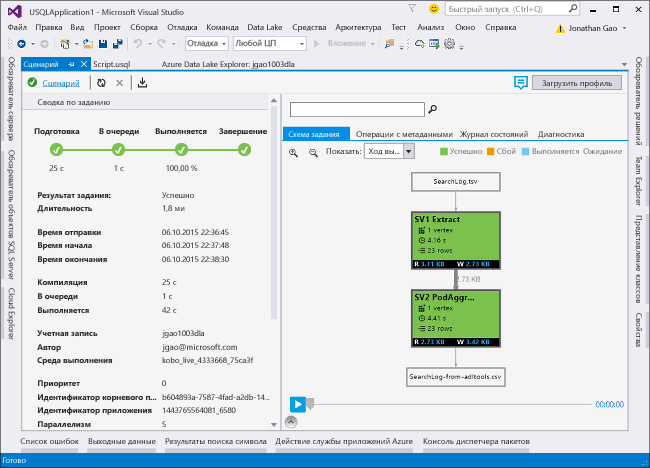

# <a name="develop-u-sql-scripts-by-using-data-lake-tools-for-visual-studio"></a>Разработка скриптов U-SQL с помощью средств Data Lake для Visual Studio
[!INCLUDE [get-started-selector](../../includes/data-lake-analytics-selector-get-started.md)]


Узнайте, как с помощью Visual Studio создавать учетные записи Azure Data Lake Analytics, определять задания в [U-SQL](data-lake-analytics-u-sql-get-started.md) и отправлять их в службу Data Lake Analytics. Дополнительные сведения о Data Lake Analytics см. в [обзоре Azure Data Lake Analytics](data-lake-analytics-overview.md).

>[!IMPORTANT]
>
>В рамках подготовки к вступлению в силу нового Общего регламента по защите данных (GDPR), которое состоится 25 мая 2018 года, пользователям Средств Azure Data Lake для Visual Studio рекомендуется выполнить обновление до версии 2.3.3000.4 или более поздней. Эта версия включает изменения на основе самых актуальных требований к защите данных. Обратите внимание, что предыдущие версии недоступны для загрузки и устарели. 
>
>**Что необходимо сделать?**
>
>1. Проверьте, не используете ли вы Средства Azure Data Lake для Visual Studio более ранней версии, чем 2.3.3000.4. 
>   
>   
> 
>2. Если у вас более ранняя версия, чем 2.3.3000.4, обновите Средства Azure Data Lake для Visual Studio, посетив сайт центра загрузки: 
>    - [для Visual Studio 2017;](https://marketplace.visualstudio.com/items?itemName=ADLTools.AzureDataLakeandStreamAnalyticsTools)
>    - [для Visual Studio 2013 и 2015.](https://www.microsoft.com/en-us/download/details.aspx?id=49504)


## <a name="prerequisites"></a>предварительным требованиям

* **Visual Studio**: поддерживаются все выпуски, кроме Express.
    * Visual Studio 2017
    * Visual Studio 2015
    * Visual Studio 2013
* **Microsoft Azure SDK для .NET** (версии 2.7.1 или выше).  Можно установить его с помощью [установщика веб-платформы](http://www.microsoft.com/web/downloads/platform.aspx).
* Учетная запись **Data Lake Analytics**. Чтобы создать учетную запись, ознакомьтесь со статьей [Руководство. Начало работы с Azure Data Lake Analytics с помощью портала Azure](data-lake-analytics-get-started-portal.md).

## <a name="install-azure-data-lake-tools-for-visual-studio"></a>Установка средств Azure Data Lake для Visual Studio

### <a name="install-azure-data-lake-tools-for-visual-studio-2017"></a>Установка Средств Azure Data Lake для Visual Studio 2017

Средства Azure Data Lake для Visual Studio не поддерживаются в Visual Studio 2017 15.3 или более поздних версий. Средства являются частью рабочей нагрузки **хранилища и обработки данных** и **разработки Azure** в Visual Studio Installer. Включите одну из этих рабочих нагрузок как часть установки Visual Studio.  

Включите рабочую нагрузку **хранилища и обработки данных**, как показано ниже: 

Включите рабочую нагрузку **разработки Azure**, как показано ниже: 

### <a name="install-azure-data-lake-tools-for-visual-studio-2013-and-2015"></a>Установка Средств Azure Data Lake для Visual Studio 2013 и 2015

Загрузите и установите средства Azure Data Lake для Visual Studio [из центра загрузки](http://aka.ms/adltoolsvs). После установки обратите внимание на следующее:
* узел **Обозреватель сервера** > **Azure** содержит узел **Data Lake Analytics**; 
* в меню **Средства** появился пункт **Data Lake**.

## <a name="connect-to-an-azure-data-lake-analytics-account"></a>Подключение к учетной записи Azure Data Lake Analytics

1. Откройте Visual Studio.
2. Откройте обозреватель сервера, последовательно выбрав пункты **Представление** > **Обозреватель сервера**.
3. Щелкните правой кнопкой мыши **Azure**. Затем выберите **Подключиться к подписке Microsoft Azure** и следуйте инструкциям.
4. В обозревателе сервера последовательно выберите пункты **Azure** > **Data Lake Analytics**. Отобразится список учетных записей Data Lake Analytics.


## <a name="write-your-first-u-sql-script"></a>Создание первого скрипта U-SQL

Ниже приводится простой скрипт U-SQL. Он определяет небольшой набор данных и по умолчанию записывает его в хранилище Data Lake Store как файл с именем `/data.csv`.

```
@a  = 
    SELECT * FROM 
        (VALUES
            ("Contoso", 1500.0),
            ("Woodgrove", 2700.0)
        ) AS 
              D( customer, amount );
OUTPUT @a
    TO "/data.csv"
    USING Outputters.Csv();
```

### <a name="submit-a-data-lake-analytics-job"></a>Отправка задания аналитики озера данных

1. Выберите **Файл** > **Создать** > **Проект**.

2. Выберите тип **Проект U-SQL** и нажмите кнопку **ОК**. Visual Studio создаст решение с помощью файла **Script.usql**.

3. Вставьте предыдущий скрипт в окно **Script.usql**.

4. В левом верхнем углу окна **Script.usql** укажите учетную запись Data Lake Analytics.

    

5. В левом верхнем углу окна **Script.usql** выберите **Отправить**.
6. Проверьте **учетную запись Analytics** и выберите **Отправить**. По завершении отправки ее результаты появятся в окне результатов средств Data Lake для Visual Studio.

    
7. Чтобы отобразились сведения о последнем состоянии задания, нажмите кнопку **Обновить**. Если задание завершилось успешно, отобразятся параметры **Граф задания**, **Операции с метаданными**, **Журнал состояний** и **Диагностика**:

    

   * В окне **Сводные данные задания** представлена сводка задания.   
   * В окне **Сведения о задании** содержатся более конкретные сведения о задании, в частности о скрипте, ресурсах и вершинах.
   * В окне **Граф задания** визуализируется ход выполнения задания.
   * В окне **Операции с метаданными** представлены сведения обо всех действиях, выполненных в каталоге U-SQL.
   * В окне **Данные** отображаются все входные и выходные данные.
   * В окне **Диагностика** представлены данные расширенного анализа для выполнения задания и оптимизации производительности.

### <a name="to-check-job-state"></a>Проверка состояния задания

1. В обозревателе сервера последовательно выберите пункты **Azure** > **Data Lake Analytics**. 
2. Разверните окно имени учетной записи Data Lake Analytics.
3. Дважды щелкните **Задания**.
4. Выберите задание, отправленное ранее.

### <a name="to-see-the-output-of-a-job"></a>Просмотр выходных данных задания

1. В обозревателе сервера перейдите к отправленному заданию.
2. Перейдите на вкладку **Данные** .
3. На вкладке **Job Outputs** (Выходные данные задания) выберите файл `"/data.csv"`.

## <a name="next-steps"></a>Дополнительная информация

* [Тестирование и отладка заданий U-SQL с помощью локального выполнения и пакета SDK U-SQL для Azure Data Lake](data-lake-analytics-data-lake-tools-local-run.md)
* [Локальный запуск и локальная отладка U-SQL в Visual Studio Code](data-lake-tools-for-vscode-local-run-and-debug.md)
* [Использование средств Azure Data Lake для Visual Studio Code](data-lake-analytics-data-lake-tools-for-vscode.md)
