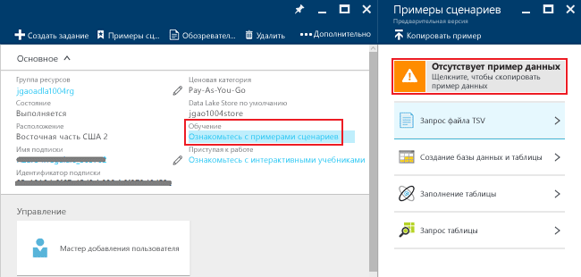

# Руководство. Начало работы с Azure Data Lake Analytics с помощью портала Azure
[!INCLUDE [get-started-selector](../../includes/data-lake-analytics-selector-get-started.md)]

Узнайте, как с помощью портала Azure создавать учетные записи Azure Data Lake Analytics, определять задания в [U-SQL](data-lake-analytics-u-sql-get-started.md) и отправлять их в службу Data Lake Analytics. Дополнительные сведения о Data Lake Analytics см. в [обзоре Azure Data Lake Analytics](data-lake-analytics-overview.md).

В этом учебнике вам предстоит разработать задание, которое считывает файл с разделителями-табуляциями (TSV) и преобразует его в файл с разделителями-запятыми (CSV). Для навигации по учебнику с помощью других поддерживаемых средств используйте вкладки в верхней части этого раздела. После успешного выполнения первого задания можно приступать к написанию более сложных преобразований данных с помощью U-SQL.

## Предварительные требования
Перед началом работы с этим руководством необходимо иметь следующее:

* **Подписка Azure**. Ознакомьтесь с [бесплатной пробной версией Azure](https://azure.microsoft.com/pricing/free-trial/).

## Создание учетной записи аналитики озера данных
Для выполнения любых заданий требуется учетная запись аналитики озера данных.

Каждая учетная запись Data Lake Analytics включает зависимую учетную запись Azure Data Lake Store.  Эта учетная запись называется учетной записью хранения озера данных по умолчанию.  Учетную запись хранения озера данных можно создать заранее или при создании учетной записи аналитики озера данных. В этом учебнике вы создадите учетную запись хранения озера данных вместе с учетной записью аналитики озера данных.

**Создание учетной записи Data Lake Analytics**

1. Выполните вход на [портал Azure](https://portal.azure.com).
2. Щелкните **Создать** >  **Аналитика** > **Data Lake Analytics**.
3. Выберите следующие значения:

    

   * **Имя**: имя учетной записи Data Lake Analytics (разрешены только строчные буквы и цифры).
   * **Подписка**: выберите подписку Azure, которая используется для учетной записи аналитики.
   * **Группа ресурсов**: выберите существующую группу ресурсов Azure или создайте новую группу. Обычно приложения состоят из множества компонентов, например веб-приложения, базы данных, сервера базы данных, хранилища и служб сторонних поставщиков.
   * **Расположение.** выберите центр обработки данных Azure для учетной записи аналитики озера данных.
   * **Data Lake Store.** Следуйте инструкциям для создания учетной записи Data Lake Store или выберите имеющуюся. 
4. Выбор ценовой категории  
5. Щелкните **Создать**. Вы вернетесь на начальный экран портала, где появится новая плитка с меткой "Развертывание Azure Data Lake Analytics". Процесс развертывания для создания учетной записи Data Lake Analytics займет несколько минут. После создания учетной записи она открывается в новой колонке.

После создания учетной записи аналитики озера данных можно добавить дополнительные учетные записи хранения озера данных и учетные записи хранения Azure. Инструкции см. в разделе [Управление источниками данных учетной записи](data-lake-analytics-manage-use-portal.md).

## Подготовка исходных данных
В этом руководстве описано, как выполнять обработку журналов поиска.  Журнал поиска может храниться в хранилище озера данных или в хранилище больших двоичных объектов Azure.

На портале Azure реализован пользовательский интерфейс для копирования файлов с образцами данных, включая файл журнала поиска, в учетную запись Data Lake Store по умолчанию.

**Копирование файлов с образцами данных**

1. На [портале Azure](https://portal.azure.com) выберите свою учетную запись Data Lake Analytics.  Сведения о том, как создать новую учетную запись или открыть существующую на портале, см. в [этой статье](data-lake-analytics-get-started-portal.md).
2. Разверните панель **Основные компоненты**, а затем щелкните **Изучите примеры сценариев**. Откроется другая колонка с названием **Примеры сценариев**.

    
3. Щелкните **Отсутствуют демонстрационные данные**, чтобы копировать файлы с образцами данных. После завершения этой операции на портале должна появиться запись **Демонстрационные данные успешно обновлены**.
4. В колонке учетной записи аналитики озера данных щелкните **Обозреватель данных** в верхней части.

    

    Откроются две колонки. Одна из них — **Обозреватель данных**, а вторая — учетная запись хранения озера данных по умолчанию.
5. В колонке с учетной записью хранения Data Lake Store по умолчанию щелкните **Образцы**, чтобы развернуть папку, а затем щелкните **Данные**. Вы должны увидеть следующие файлы и папки:

   * AmbulanceData/
   * AdsLog.tsv
   * SearchLog.tsv
   * version.txt
   * WebLog.log

     В этом руководстве будет использоваться файл SearchLog.tsv.

На практике вы будете либо программировать свои приложения для записи данных в связанные учетные записи хранения, либо передавать данные. См. сведения о передаче файлов в разделах о [передаче данных в Data Lake Store](data-lake-analytics-manage-use-portal.md) и [хранилище BLOB-объектов](data-lake-analytics-manage-use-portal.md).

## Создание и отправка заданий аналитики озера данных
После подготовки исходных данных можно приступать к разработке скрипта U-SQL.  

**Отправка задания**

1. В колонке учетной записи аналитики озера данных на портале щелкните **Создать задание**.

    

    Если колонка не отображается, см. раздел об [открытии учетной записи Data Lake Analytics из портала](data-lake-analytics-manage-use-portal.md).
2. Введите **Имя задания**и следующий скрипт U-SQL:

        @searchlog =
            EXTRACT UserId          int,
                    Start           DateTime,
                    Region          string,
                    Query           string,
                    Duration        int?,
                    Urls            string,
                    ClickedUrls     string
            FROM "/Samples/Data/SearchLog.tsv"
            USING Extractors.Tsv();

        OUTPUT @searchlog   
            TO "/Output/SearchLog-from-Data-Lake.csv"
        USING Outputters.Csv();

    

    Этот сценарий U-SQL считывает файл исходных данных с помощью **Extractors.Tsv()**, а затем создает CSV-файл с помощью **Outputters.Csv()**.

    Не меняйте эти два пути, если только исходный файл не был скопирован в другое место.  Data Lake Analytics создаст выходную папку, если ее не существует.  В этом случае мы используем простые относительные пути.  

    Проще использовать относительные пути для файлов, которые хранятся в учетных записях озера данных по умолчанию. Также можно использовать абсолютные пути.  Например:

        adl://<Data LakeStorageAccountName>.azuredatalakestore.net:443/Samples/Data/SearchLog.tsv

    Дополнительные сведения о языке U-SQL см. в статье [Приступая к работе с языком U-SQL для Azure Data Lake Analytics](data-lake-analytics-u-sql-get-started.md) и в [справочнике по языку U-SQL](http://go.microsoft.com/fwlink/?LinkId=691348).

1. Щелкните **Отправить задание** наверху.   
2. Подождите, пока состояние задания не изменится на **Успешно**. Вы увидите, что на выполнение задания понадобилась примерно одна минута.
3. Если задание завершилось сбоем, см. статью [Устранение неполадок с заданиями Azure Data Lake Analytics с помощью портала Azure](data-lake-analytics-monitor-and-troubleshoot-jobs-tutorial.md).
4. В нижней части колонки выберите вкладку **Выходные данные** и щелкните `SearchLog-from-Data-Lake.csv`. Выходной файл можно просмотреть, загрузить, переименовать и удалить.

    

## См. также

* Чтобы приступить к разработке приложений U-SQL, ознакомьтесь со статьей [Разработка скриптов U-SQL с помощью средств озера данных для Visual Studio](data-lake-analytics-data-lake-tools-get-started.md).
* Для знакомства с U-SQL см. статью о [начале работы с языком U-SQL для Azure Data Lake Analytics](data-lake-analytics-u-sql-get-started.md).
* Задачи управления описываются в руководстве по [управлению Azure Data Lake Analytics с помощью портала Azure](data-lake-analytics-manage-use-portal.md).

