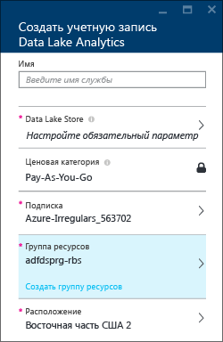
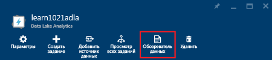
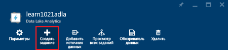
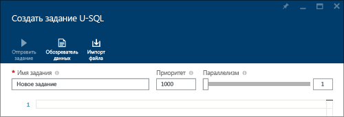
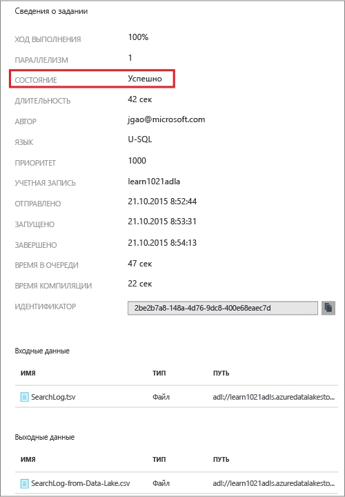
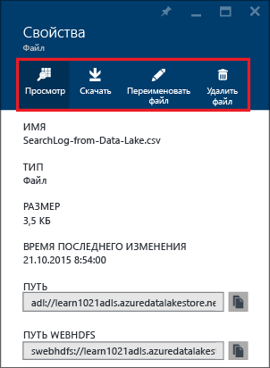

<properties 
   pageTitle="Начало работы с аналитикой озера данных Azure при помощи портала Azure | Azure" 
   description="Узнайте, как использовать портал Azure для создания учетной записи аналитики озера данных, создания задания аналитики озера данных с помощью U-SQL и отправки задания. " 
   services="data-lake-analytics" 
   documentationCenter="" 
   authors="edmacauley" 
   manager="jhubbard" 
   editor="cgronlun"/>
 
<tags
   ms.service="data-lake-analytics"
   ms.devlang="na"
   ms.topic="hero-article"
   ms.tgt_pltfrm="na"
   ms.workload="big-data" 
   ms.date="05/16/2016"
   ms.author="edmaca"/>

# Учебник. Начало работы с аналитикой озера данных Azure с помощью портала Azure

[AZURE.INCLUDE [get-started-selector](../../includes/data-lake-analytics-selector-get-started.md)]

Узнайте, как с помощью портала Azure создавать учетные записи аналитики озера данных Azure, формировать задания аналитики озера данных в [U-SQL](data-lake-analytics-u-sql-get-started.md) и отправлять их в учетные записи аналитики озера данных. Дополнительные сведения об аналитике озера данных см. в статье [Обзор аналитики озера данных Azure](data-lake-analytics-overview.md).

В этом учебнике вам предстоит разработать задание, которое считывает файл с разделителями-табуляциями (TSV) и преобразует его в файл с разделителями-запятыми (CSV). Для навигации по учебнику с помощью других поддерживаемых средств используйте вкладки в верхней части этого раздела. После успешного выполнения первого задания можно приступать к написанию более сложных преобразований данных с помощью U-SQL.

##Предварительные требования

Перед началом работы с этим учебником необходимо иметь следующее:

- **Подписка Azure.**. См. [Бесплатная пробная версия Azure](https://azure.microsoft.com/pricing/free-trial/).

##Создание учетной записи аналитики озера данных

Для выполнения любых заданий требуется учетная запись аналитики озера данных.

Каждая учетная запись аналитики озера данных имеет зависимую учетную запись [хранения озера данных Azure](). Эта учетная запись называется учетной записью хранения озера данных по умолчанию. Учетную запись хранения озера данных можно создать заранее или при создании учетной записи аналитики озера данных. В этом учебнике вы создадите учетную запись хранения озера данных вместе с учетной записью аналитики озера данных.

**Создание учетной записи аналитики озера данных**

1. Войдите на новый [классический портал Azure](https://portal.azure.com).
2. Последовательно выберите **Создать**, **Данные + аналитика**, а затем — **Аналитика озера данных**.
6. Введите или выберите следующие значения:

    

	- **Имя**: имя учетной записи аналитики.
	- **Хранилище озера данных**: каждая учетная запись аналитики озера данных имеет зависимую учетную запись хранения озера данных. Учетная запись аналитики озера данных и зависимая учетная запись хранения озера данных должны находиться в одном центре обработки данных Azure. Следуйте инструкциям для создания новой учетной записи хранения озера данных или выберите существующую.
	- **Подписка**: выберите подписку Azure, которая используется для учетной записи Analytics.
	- **Группа ресурсов**: выберите существующую группу ресурсов Azure или создайте новую группу. Диспетчер ресурсов Azure позволяет работать с ресурсами в приложении как с группой. Дополнительные сведения см. в статье [Обзор диспетчера ресурсов Azure](resource-group-overview.md).
	- **Расположение**: выберите центр обработки данных Azure для учетной записи аналитики озера данных.
7. Выберите **Закрепить на начальной панели**. Это требуется для выполнения инструкций из этого учебника.
8. Щелкните **Создать**. Откроется начальная панель портала. На начальную панель добавляется новый элемент с меткой «Развертывание аналитики озера данных Azure». Для создания учетной записи аналитики озера данных может потребоваться некоторое время. При создании учетной записи она открывается на портале в новой колонке.

	

После создания учетной записи аналитики озера данных можно добавить дополнительные учетные записи хранения озера данных и учетные записи хранения Azure. Инструкции см. в статье [Управление источниками данных в учетной записи аналитики озера данных](data-lake-analytics-manage-use-portal.md#manage-account-data-sources).

##Подготовка исходных данных

В этом учебнике обрабатываются некоторые журналы поиска. Журнал поиска может храниться в хранилище озера данных или в хранилище больших двоичных объектов Azure.

На портале Azure реализован пользовательский интерфейс для копирования файлов с образцами данных, включая файл журнала поиска, в учетную запись озера данных по умолчанию.

**Копирование файлов с образцами данных**

1. На портале Azure щелкните **Microsoft Azure** в левом верхнем углу.
2. Щелкните элемент с именем вашей учетной записи аналитики озера данных. Она была закреплена здесь при создании учетной записи. Если учетная запись здесь не закреплена, откройте учетную запись в соответствии с инструкциями из статьи [Открытие учетной записи аналитики озера данных из портала](data-lake-analytics-manage-use-portal.md#access-adla-account).
3. Разверните панель **Основные компоненты**, а затем щелкните **Просмотр образцов заданий**. Откроется другая колонка с названием **Образцы заданий**.
4. Щелкните **Копировать образец данных**, а затем нажмите кнопку **ОК** для подтверждения.
5. Щелкните **Уведомление** (это значок в виде колокольчика). Должна появиться запись журнала **Обновление образца данных завершено**. Щелкните в любом месте за пределами панели уведомлений, чтобы закрыть ее.
7. В колонке учетной записи аналитики озера данных щелкните **Обозреватель данных** в верхней части.

	

    Откроются две колонки. Одна из них — **Обозреватель данных**, а вторая — учетная запись хранения озера данных по умолчанию.
8. В колонке с учетной записью хранения озера данных по умолчанию щелкните **Образцы**, чтобы развернуть папку, а затем щелкните **Данные**. Вы должны увидеть следующие файлы и папки:

    - AmbulanceData/
    - AdsLog.tsv
    - SearchLog.tsv
    - version.txt
    - WebLog.log
    
    В этом учебнике будет использоваться файл SearchLog.tsv.

На практике вы будете либо программировать свои приложения для записи данных в связанные учетные записи хранения, либо передавать данные. Передача файлов описывается в статьях [Передача данных в хранилище озера данных](data-lake-analytics-manage-use-portal.md#upload-data-to-adls) и [Передача данных в хранилище больших двоичных объектов](data-lake-analytics-manage-use-portal.md#upload-data-to-wasb).

##Создание и отправка заданий аналитики озера данных

После подготовки исходных данных можно приступать к разработке скрипта U-SQL.

**Отправка задания**

1. В колонке учетной записи аналитики озера данных на портале щелкните **Создать задание**.

	

    Если колонки нет, см. статью [Открытие учетной записи аналитики озера данных из портала](data-lake-analytics-manage-use-portal.md#access-adla-account).
4. Введите **Имя задания** и следующий скрипт U-SQL:

	

        @searchlog =
            EXTRACT UserId          int,
                    Start           DateTime,
                    Region          string,
                    Query           string,
                    Duration        int?,
                    Urls            string,
                    ClickedUrls     string
            FROM "/Samples/Data/SearchLog.tsv"
            USING Extractors.Tsv();
        
        OUTPUT @searchlog   
            TO "/Output/SearchLog-from-Data-Lake.csv"
        USING Outputters.Csv();

	Этот сценарий U-SQL считывает файл исходных данных с помощью функции **Extractors.Tsv()**, а затем создает CSV-файл с помощью функции **Outputters.Csv()**.
    
    Не меняйте эти два пути, если только исходный файл не был скопирован в другое место. Аналитика озера данных создаст выходную папку, если ее не существует. В этом случае мы используем простые относительные пути.
	
	Проще использовать относительные пути для файлов, которые хранятся в учетных записях озера данных по умолчанию. Также можно использовать абсолютные пути. Например:
    
        adl://<Data LakeStorageAccountName>.azuredatalakestore.net:443/Samples/Data/SearchLog.tsv
      

    Дополнительные сведения о языке U-SQL см. в статье [Начало работы с языком U-SQL для аналитики озера данных Azure](data-lake-analytics-u-sql-get-started.md) и в [Справочнике по языку U-SQL](http://go.microsoft.com/fwlink/?LinkId=691348).
     
5. Щелкните **Отправить задание** наверху. Откроется новая панель сведений о задании. В строке заголовка будет отображено состояние задания.
6. Подождите, пока состояние задания не изменится на **Успешно**. По завершении задания на портале откроется новая колонка со сведениями о задании:

    

    На предыдущем снимке экрана видно, что задание выполнялось примерно 1,5 минуты (смена состояния с «Отправлено» на «Завершено»).
    
    Если задание завершилось сбоем, см. статью [Отслеживание и устранение неполадок с заданиями аналитики озера данных](data-lake-analytics-monitor-and-troubleshoot-jobs-tutorials.md).

7. В нижней части колонки **Сведения о задании** щелкните имя задания в файле **SearchLog-from-Data-Lake.csv**. Выходной файл можно просмотреть, загрузить, переименовать и удалить.

    
8. Щелкните **Просмотр**, чтобы просмотреть выходной файл.

    

##См. также

- Более сложный запрос можно посмотреть в статье [Анализ журналов веб-сайта с помощью аналитики озера данных Azure](data-lake-analytics-analyze-weblogs.md).
- Чтобы приступить к разработке приложений U-SQL, ознакомьтесь со статьей [Разработка скриптов U-SQL с помощью средств озера данных для Visual Studio](data-lake-analytics-data-lake-tools-get-started.md).
- Для знакомства с U-SQL см. статью [Начало работы с языком U-SQL для аналитики озера данных Azure](data-lake-analytics-u-sql-get-started.md).
- Задачи управления описываются в статье [Управление аналитикой озера данных Azure с помощью портала Azure](data-lake-analytics-manage-use-portal.md).
- Общие сведения об аналитике озера данных см. в статье [Обзор аналитики озера данных Azure](data-lake-analytics-overview.md).
- Для просмотра учебника с помощью других средств используйте вкладки-селекторы в верхней части страницы.
- Сведения о том, как записывать диагностические данные в журнал, см. в статье [Accessing diagnostics logs for Azure Data Lake Analytics](data-lake-analytics-diagnostic-logs.md) (Доступ к журналам диагностики для Azure Data Lake Analytics).

<!---HONumber=AcomDC_0921_2016--->