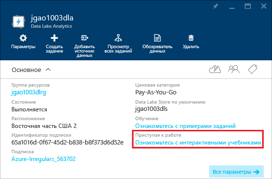

<properties 
   pageTitle="Узнайте об аналитике озера данных и U-SQL с помощью интерактивных учебников на портале Azure | Azure" 
   description="Краткое руководство для изучения аналитики озера данных и U-SQL. " 
   services="data-lake-analytics" 
   documentationCenter="" 
   authors="edmacauley" 
   manager="jhubbard" 
   editor="cgronlun"/>
 
<tags
   ms.service="data-lake-analytics"
   ms.devlang="na"
   ms.topic="get-started-article"
   ms.tgt_pltfrm="na"
   ms.workload="big-data" 
   ms.date="05/16/2016"
   ms.author="edmaca"/>

# Использование интерактивных учебников по аналитике озера данных Azure

Портал Azure содержит интерактивный учебник, который поможет приступить к работе с аналитикой озера данных. В этой статье показано, как работать с учебником для анализа журналов веб-сайтов.

>[AZURE.NOTE] Если вы хотите работать с учебником с помощью Visual Studio, см. статью [Анализ журналов веб-сайтов с помощью аналитики озера данных](data-lake-analytics-analyze-weblogs.md). В будущем на портал будут добавлены другие интерактивные учебники.

Другие учебники:

- [Начало работы с аналитикой озера данных с помощью портала Azure](data-lake-analytics-get-started-portal.md)
- [Начало работы с аналитикой озера данных с помощью Azure PowerShell](data-lake-analytics-get-started-powershell.md)
- [Начало работы с аналитикой озера данных с помощью пакета SDK .NET](data-lake-analytics-get-started-net-sdk.md)
- [Разработка скриптов U-SQL с помощью средств озера данных для Visual Studio](data-lake-analytics-data-lake-tools-get-started.md)

**Предварительные требования**

Перед началом работы с этим учебником необходимо иметь следующее:

- **Учетная запись аналитики озера данных**. См. раздел [Начало работы с аналитическим модулем озера данных Azure при помощи портала Azure](data-lake-analytics-get-started-portal.md).

##Создание учетной записи аналитики озера данных 

Для выполнения любых заданий требуется учетная запись аналитики озера данных.

Каждая учетная запись аналитики озера данных имеет зависимую учетную запись [хранения озера данных Azure](../data-lake-store/data-lake-store-overview.md). Эта учетная запись называется учетной записью хранения озера данных по умолчанию. Учетную запись хранения озера данных можно создать заранее или при создании учетной записи аналитики озера данных. В этом учебнике вы создадите учетную запись хранения озера данных вместе с учетной записью аналитики.

**Создание учетной записи аналитики озера данных**

1. Выполните вход на [портал Azure](https://portal.azure.com/signin/index/?Microsoft_Azure_Kona=true&Microsoft_Azure_DataLake=true&hubsExtension_ItemHideKey=AzureDataLake_BigStorage%2cAzureKona_BigCompute).
2. Щелкните **Microsoft Azure** в левом верхнем углу, чтобы открыть начальную панель.
3. Щелкните элемент **Marketplace**.
3. Введите **аналитика озера данных Azure** в поле поиска на колонке **Все** и нажмите клавишу **ВВОД**. В списке появится **Аналитика озера данных Azure**.
4. Щелкните **Аналитика озера данных Azure** в списке.
5. Щелкните **Создать** в нижней части колонки.
6. Введите или выберите следующие значения:

    

	- **Имя**: имя учетной записи аналитики.
	- **Хранилище озера данных**: каждая учетная запись аналитики озера данных имеет зависимую учетную запись хранения озера данных. Учетная запись аналитики озера данных и зависимая учетная запись хранения озера данных должны находиться в одном центре обработки данных Azure. Следуйте инструкциям для создания новой учетной записи хранения озера данных или выберите существующую.
	- **Подписка**: выберите подписку Azure, которая используется для учетной записи аналитики.
	- **Группа ресурсов**: выберите существующую группу ресурсов Azure или создайте новую группу. Обычно приложения состоят из множества компонентов, например веб-приложения, базы данных, сервера базы данных, хранилища и служб сторонних поставщиков. Диспетчер ресурсов Azure (ARM) позволяет работать с ресурсами в приложении в виде группы, которая называется группой ресурсов Azure. Вы можете развертывать, обновлять, отслеживать или удалять все ресурсы для приложения в рамках одной скоординированной операции. Для развертывания вы используете шаблон, который можно использовать для разных сред, в том числе для тестовой, промежуточной и рабочей. Вы можете уточнить счета для своей организации, просмотрев сведенные затраты для всей группы. Дополнительные сведения см. в статье [Обзор диспетчера ресурсов Azure](resource-group-overview.md).
	- **Расположение**: выберите центр обработки данных Azure для учетной записи аналитики озера данных.
7. Выберите **Закрепить на начальной панели**. Это требуется для выполнения инструкций из этого учебника.
8. Щелкните **Создать**. Откроется начальная панель портала. На домашнюю страницу добавляется новый элемент с меткой «Развертывание аналитики озера данных Azure». Для создания учетной записи аналитики озера данных может потребоваться некоторое время. После создания учетной записи она открывается в новой колонке.

	

##Интерактивный учебник по проведению анализа журналов веб-сайта

**Открытие интерактивного учебника по анализу журналов веб-сайта**

1. На портале щелкните **Microsoft Azure** в левом меню, чтобы открыть начальную панель.
2. Щелкните элемент, связанный с вашей учетной записью аналитики озера данных.
3. Щелкните **Обзор интерактивных учебников** на панели **Основные компоненты**.

	

4. При появлении оранжевого предупреждения «Образцы не заданы, щелкните...», нажмите кнопку **Копировать образец данных** для копирования образца данных в учетную запись хранения озера данных по умолчанию. Для запуска интерактивного учебника требуются данные.
5. В колонке **Интерактивные учебники** щелкните **Анализ журналов веб-сайта**. Учебник откроется в новой колонке портала.
5. Щелкните **1 Введение**, а затем следуйте инструкциям.

##Дополнительные материалы

- [Обзор аналитики озера данных Microsoft Azure](data-lake-analytics-overview.md)
- [Начало работы с аналитикой озера данных с помощью портала Azure](data-lake-analytics-get-started-portal.md)
- [Начало работы с аналитикой озера данных с помощью Azure PowerShell](data-lake-analytics-get-started-powershell.md)
- [Разработка скриптов U-SQL с помощью средств озера данных для Visual Studio](data-lake-analytics-data-lake-tools-get-started.md)
- [Анализ журналов веб-сайта с помощью аналитики озера данных Azure](data-lake-analytics-analyze-weblogs.md)

<!---HONumber=AcomDC_0914_2016--->