# Контроль доступа в Azure Data Lake Store

В хранилище Azure Data Lake Store реализована модель контроля доступа на базе HDFS, которая в свою очередь основана на модели контроля доступа POSIX. В этой статье приведены общие сведения о модели контроля доступа в Data Lake Store. Подробная информация о модели контроля доступа на базе HDFS представлена в [руководстве по разрешениям в HDFS](https://hadoop.apache.org/docs/current/hadoop-project-dist/hadoop-hdfs/HdfsPermissionsGuide.html).

## Списки управления доступом для файлов и папок

Существует два типа списков управления доступом (ACL): **ACL для доступа** и **ACL по умолчанию**.

* **ACL для доступа.** Эти списки позволяют управлять доступом к объекту. Списки ACL для доступа позволяют управлять доступом как к файлам, так и к папкам.

* **ACL по умолчанию.** "Шаблон" списков управления доступом, связанных с папкой, определяющей списки ACL для доступа любого дочернего элемента, созданного в этой папке. Файлы не имеют ACL по умолчанию.

Списки ACL для доступа и ACL по умолчанию имеют одинаковую структуру.

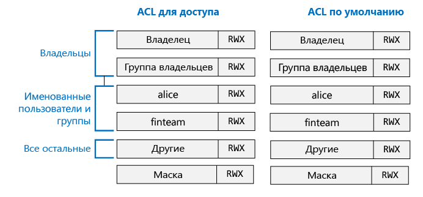

> [!NOTE]
> Изменение ACL по умолчанию в родительском объекте не оказывает влияния на ACL для доступа или ACL по умолчанию для уже существующих дочерних элементов.
>
>

## Пользователи и удостоверения

Каждый файл или папка имеет отдельные разрешения для следующих удостоверений:

* владелец файла;
* группа владельцев;
* именованные пользователи;
* именованные группы;
* все остальные пользователи.

Удостоверения пользователей и групп являются удостоверениями Azure Active Directory (AAD). Если не указано иное, "пользователь" в контексте Data Lake Store может означать либо пользователя AAD, либо группу безопасности AAD.

## Разрешения

Разрешения для объекта файловой системы делятся на **разрешения на чтение**, **разрешения на запись** и **разрешения на выполнение**. Разрешения применяются к файлам и папкам, как показано в таблице ниже:

|            |    Файл     |   Папка |
|------------|-------------|----------|
| **Разрешение на чтение (R)** | Чтение содержимого файла | Для просмотра содержимого папки требуются **разрешения на чтение** и **выполнение**.|
| **Разрешение на запись (W)** | Запись или добавление данных в файл | Для создания дочерних элементов в папке требуются **разрешения на запись** и **выполнение**. |
| **Разрешение на выполнение (X)** | Не имеет значения в контексте Data Lake Store | Требуется для просмотра дочерних элементов папки. |

### Сокращения для разрешений

**RWX** означает разрешения на **чтение, запись и выполнение**. Существует еще более краткая форма — цифровая, согласно которой **чтение = 4**, **запись = 2**, **выполнение = 1**, а их сумма выражает предоставленные разрешения. Ниже приводятся некоторые примеры.

| Цифровая форма | Краткая форма |      Значение     |
|--------------|------------|------------------------|
| 7            | RWX        | чтение, запись и выполнение |
| 5            | R-X        | Чтение + выполнение         |
| 4.            | R--        | чтение                   |
| 0            | ---        | Нет разрешений         |

### Разрешения не наследуются

В модели на основе POSIX, используемой в Data Lake Store, разрешения для элемента хранятся в самом элементе. Другими словами, разрешения на доступ к элементу не могут быть унаследованы от родительских элементов.

## Типовые сценарии в зависимости от разрешений

Ниже показано несколько типовых сценариев для наглядного представления того, какие разрешения требуются для выполнения отдельных операций в учетной записи Data Lake Store.

### Разрешения, необходимые для чтения файла

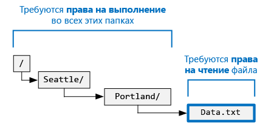

* Для чтения файла вызывающей стороне требуются разрешения на **чтение**.
* Для доступа ко всем подпапкам в папке, содержащей файл, вызывающей стороне требуются разрешения на **выполнение**.

### Разрешения, необходимые для добавления данных в файл

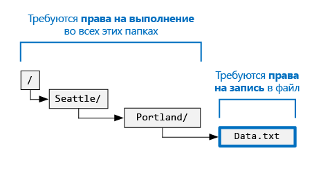

* Для добавления данных в файл вызывающей стороне требуются разрешения на **запись**.
* Для доступа ко всем папкам, содержащим файл, вызывающей стороне требуются разрешения на **выполнение**.

### Разрешения, необходимые для удаления файла

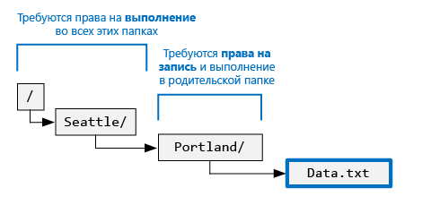

* Для доступа к родительской папке вызывающей стороне требуются разрешения на **запись и выполнение**.
* Для доступа ко всем папкам, указанным в пути к файлу, вызывающей стороне требуются разрешения на **выполнение**.

> [!NOTE]
> Для удаления файла разрешения на запись не требуются, если выполняются два предыдущих условия.
>
>

### Разрешения, необходимые для перечисления папки

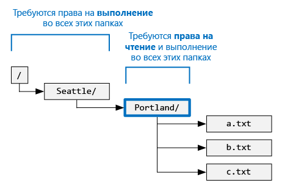

* Для перечисления папки вызывающей стороне требуются разрешения на **чтение и выполнение**.
* Для доступа ко всем предыдущим папкам вызывающей стороне требуются разрешения на **выполнение**.

## Просмотр разрешений на портале Azure

В колонке **Обозреватель данных** учетной записи Data Lake Store щелкните **Доступ**, чтобы просмотреть списки ACL для файла или папки, просматриваемых в обозревателе данных. При выборе команды **Доступ** вы получите списки ACL для папки **catalog** из учетной записи **mydatastore**.

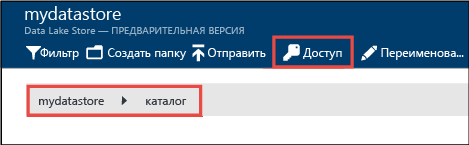

В верхней части этой колонки указаны разрешения владельца. (На снимке экрана в качестве владельца указан Боб.) Ниже показаны назначенные списки ACL для доступа. 

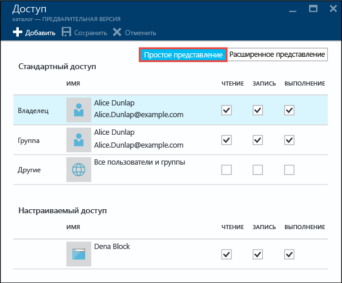

Щелкните **Расширенное представление**, чтобы просмотреть дополнительное представление, в котором содержатся списки ACL по умолчанию, маска и описание прав суперпользователя.  В этой колонке также можно рекурсивно задать списки ACL для доступа и списки ACL по умолчанию для дочерних файлов и папок на основе разрешений текущей папки.

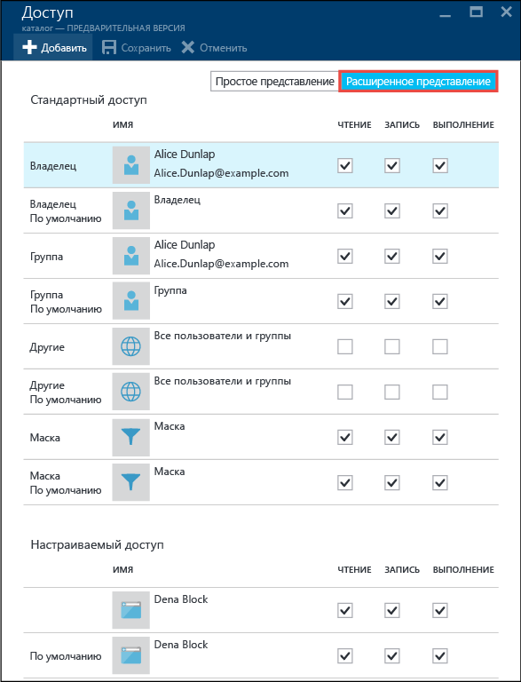

## Суперпользователь

Суперпользователь обладает самыми широкими правами среди всех пользователей хранилища Data Lake Store. Суперпользователь:

* обладает разрешениями RWX для **всех** файлов и папок;
* может изменять разрешения для любых файлов или папок;
* может изменять владельца или группу владельцев любого файла или папки.

В учетной записи Azure Data Lake Store предусмотрено несколько ролей Azure, в том числе:

* владельцы;
* участники;
* читатели;

Каждому пользователю с ролью **Владелец** учетной записи Data Lake Store автоматически присваивается статус суперпользователя этой учетной записи. Дополнительные сведения см. в статье об [управлении доступом на основе ролей](../active-directory/role-based-access-control-configure.md).
Если требуется создать пользовательскую роль RBAC с разрешениями суперпользователя, назначьте ей следующие разрешения:
- Microsoft.DataLakeStore/accounts/Superuser/action;
- Microsoft.Authorization/roleAssignments/write.

## Владелец

Пользователь, создавший элемент, автоматически становится владельцем элемента. Владелец может:

* изменять разрешения файла, владельцем которого он является;
* изменять группу владельцев файла, владельцем которого он является, если владелец файла одновременно является участником целевой группы.

> [!NOTE]
> Владелец *не может* изменить владельца другого файла или папки. Изменить владельца файла или папки может только суперпользователь.
>
>

## группа владельцев;

В списках управления доступом POSIX каждый пользователь связан с "основной группой". Например, пользователь Алиса принадлежит к группе finance. Пользователь Aлиса может принадлежать к нескольким группам, но одна из них всегда назначается как основная. В интерфейсе POSIX, когда пользователь Aлиса создает файл, группа владельцев этого файла задается для основной группы этого пользователя, которой в данном случае является группа finance.

При создании нового элемента файловой системы служба Data Lake Store присваивает значение группе владельцев.

* **Вариант 1.** Корневая папка "/". Эта папка создается при создании учетной записи Data Lake Store. В данном случае группа владельцев закрепляется за пользователем, создавшим эту учетную запись.
* **Вариант 2** (во всех остальных случаях). При создании элемента группа владельцев копируется из родительской папки.

В противном случае разрешения группы владельцев будут аналогичны разрешениям, назначенным другим пользователям или группам.

Группа владельцев может быть изменена:
* одним из суперпользователей;
* владельцем, если он является участником целевой группы.

> [!NOTE]
> Группа владельцев *не может* изменить списки ACL для файла или папки.

## Алгоритм проверки доступа

На рисунке ниже показан алгоритм проверки доступа к учетным записям Data Lake Store.

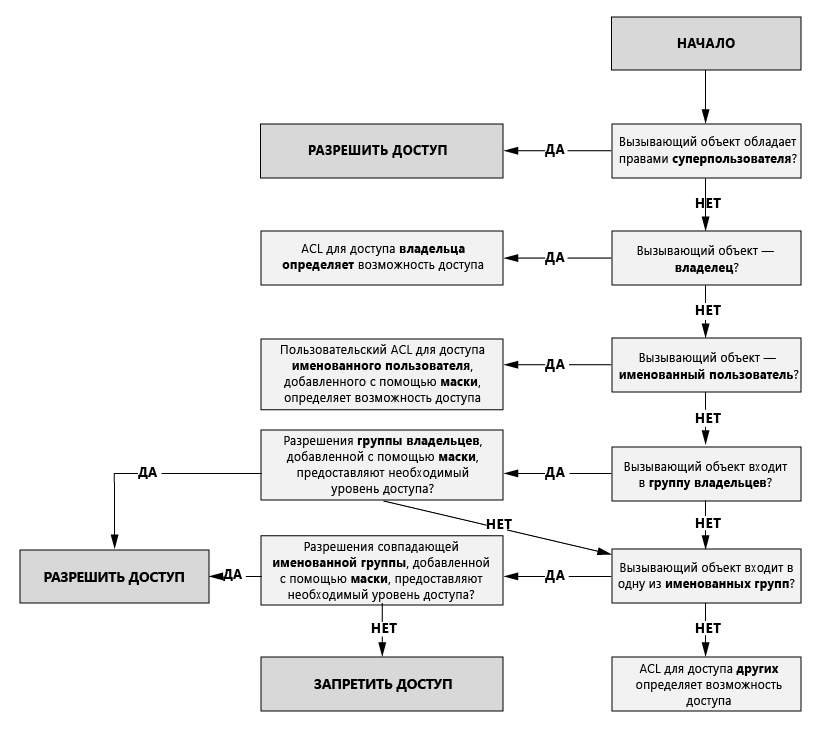

## Маска и "действующие разрешения"

**Маска** — это значение RWX, используемое с целью ограничения доступа для **именованных пользователей**, **группы владельцев** и **именованных групп** при выполнении алгоритма проверки доступа. Ниже представлены основные понятия о масках.

* Маска создает "действующие разрешения", то есть изменяет разрешения при проверке доступа.
* Маску может изменять непосредственно владелец файла или суперпользователи.
* Маска может удалять разрешения для создания действующих разрешений. Маска *не может* добавлять разрешения к действующим разрешениям.

Рассмотрим несколько примеров. В следующем примере маска имеет значение **RWX**. Это означает, что она не может удалять какие-либо разрешения. Действующие разрешения для именованного пользователя, группы владельцев или именованной группы не меняются в процессе проверки доступа.

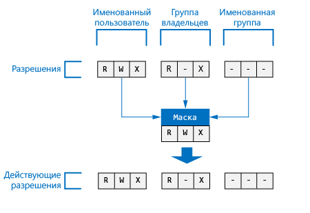

В следующем примере для маски задано значение **R-X**. Следовательно, маска **отключает разрешение на запись** для **именованного пользователя**, **группы владельцев** и **именованной группы** при проверке доступа.

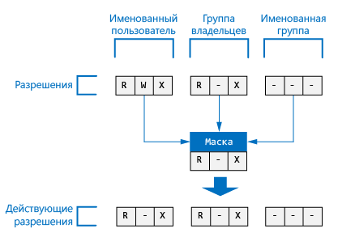

Вот как представлена маска файла или папки на портале Azure:

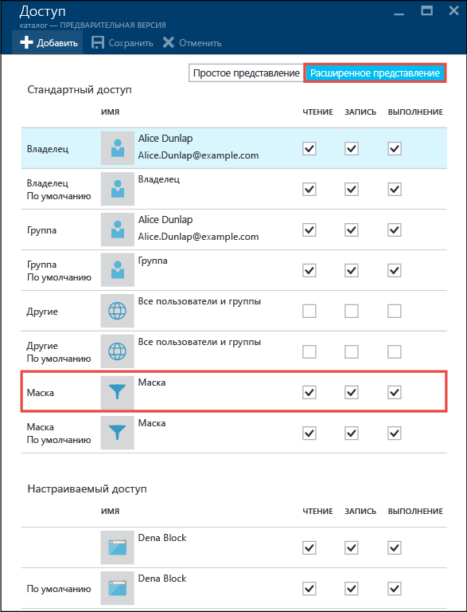

> [!NOTE]
> В новой учетной записи Data Lake Store маске для списка ACL для доступа для корневой папки (/) по умолчанию присваивается значение RWX.
>
>

## Разрешения для новых файлов и папок

При создании нового файла или подпапки в существующей папке список ACL по умолчанию для родительской папки определяет:

- список ACL для доступа и список ACL по умолчанию для дочерней папки;
- список ACL для доступа для дочернего файла (файлы не имеют списка ACL по умолчанию).

### Список ACL для доступа для дочернего файла или папки

При создании дочернего файла или папки список ACL по умолчанию для родительской папки копируется в виде списка ACL для доступа для дочернего файла или папки. Кроме того, если **другому** пользователю предоставлены разрешения RWX в списке ACL по умолчанию для родительской папки, он полностью удаляется из списка ACL для доступа для дочернего элемента.

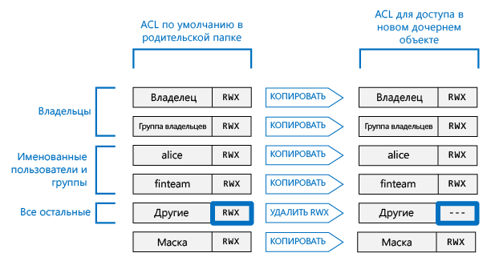

В большинстве ситуаций предоставленной выше информации о том, как определяется список ACL для доступа для дочернего элемента, вполне достаточно. Однако если вы знакомы с системами на базе POSIX и хотите узнать больше о том, как происходит эта трансформация, см. раздел [Роль umask в создании ACL для доступа к новым файлам и папкам](#umasks-role-in-creating-the-access-acl-for-new-files-and-folders) далее в этой статье.

### ACL по умолчанию для дочерней папки

При создании дочерней папки в родительской папке список ACL по умолчанию для родительской папки копируется без изменений в список ACL по умолчанию для дочерней папки.

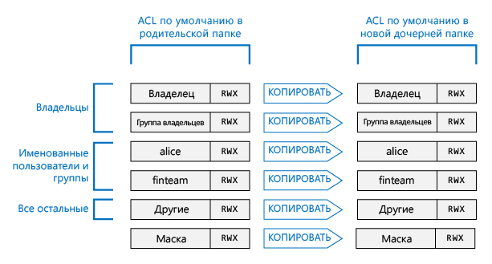

## Темы для углубленного изучения принципов работы со списками ACL в Data Lake Store

Ниже представлено несколько дополнительных разделов, в которых подробно описано, как определяются списки ACL для файлов или папок в хранилище Data Lake Store.

### Роль umask в создании ACL для доступа для новых файлов и папок

В POSIX-совместимой системе umask представляет собой 9-битное значение родительской папки, которое используется, чтобы преобразовать разрешения для **владельца**, **группы владельцев** и **остальных пользователей** в ACL для доступа для нового дочернего файла или папки. Биты umask определяют, какие биты ACL для доступа к дочернему элементу нужно отключить. Таким образом, эта маска используется, чтобы выборочно предотвращать распространение разрешений для **владельца**, **группы владельцев** или **остальных пользователей**.

В системе HDFS umask, как правило, является параметром конфигурации уровня сайта, управляемым администраторами. Data Lake Store использует маску **umask уровня учетной записи** , которую нельзя изменить. В следующей таблице показана работа umask в Data Lake Store.

| Группа пользователя  | Параметр | Влияние на ACL для доступа для нового дочернего элемента |
|------------ |---------|---------------------------------------|
| владельца | ---     | Не влияет                             |
| группы владельцев| ---     | Не влияет                             |
| другой       | RWX     | Удаление разрешения на чтение, запись и выполнение         |

На следующем рисунке показано, как работает umask. Конечным результатом является удаление разрешений на **чтение, запись и выполнение** для **остальных** пользователей. Свойство umask не указывает биты для **владельца** и **группы владельцев**, поэтому эти разрешения не трансформируются.

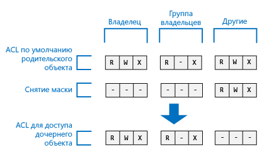

### Бит фиксации

Бит фиксации является расширенной функцией файловой системы POSIX. В контексте Data Lake Store потребность в использовании бита фиксации маловероятна.

В приведенной ниже таблице показано, как работает бит фиксации в Data Lake Store.

| Группа пользователя         | Файл    | Папка |
|--------------------|---------|-------------------------|
| Бит фиксации **выключен** | Не влияет   | Не влияет           |
| Бит фиксации **включен**  | Не влияет   | Предотвращает возможность удаления или переименования дочернего элемента кем-либо, кроме **суперпользователей** или **владельца** этого дочернего элемента.               |

Бит фиксации не отображается на портале Azure.

## Общие вопросы о списках ACL в хранилище Data Lake Store

Ниже приведены ответы на часто задаваемые вопросы, возникающие при работе со списками ACL в Data Lake Store.

### Нужно ли мне активировать поддержку ACL?

Нет. Контроль доступа к учетной записи Data Lake Store с помощью ACL всегда включен.

### Какие разрешения требуются для рекурсивного удаления папки и ее содержимого?

* Для доступа к родительской папке требуются разрешения на **запись и выполнение**.
* Чтобы удалить папку и все ее подпапки, требуются разрешения на **чтение, запись и выполнение**.

> [!NOTE]
> Для удаления файлов в папках не требуются разрешения на запись. Обратите внимание, что корневую папку "/" удалить **невозможно**.
>
>

### Кто назначается владельцем файла или папки?

Создатель файла или папки становится их владельцем.

### Как назначается группа владельцев файла или папки при их создании?

Группа владельцев копируется из родительской папки, в которой создан файл или папка.

### Я являюсь владельцем файла, но у меня нет необходимых разрешений RWX. Что делать?

Владелец может изменить разрешения на доступ к файлу на любое из требуемых RWX-разрешений.

### При просмотре списков ACL на портале Azure я вижу имена пользователей, а при просмотре в интерфейсе API — идентификаторы GUID. Почему так происходит?

Записи в списках ACL хранятся в качестве идентификаторов GUID, соответствующих пользователям в AAD. Интерфейсы API возвращают идентификаторы GUID без изменений. Портал Azure пытается упростить использование списков ACL, по возможности преобразовывая идентификаторы GUID в понятные имена.

### Почему при просмотре на портале Azure для списков ACL иногда отображаются идентификаторы GUID?

GUID отображается, если пользователь не существует в AAD. Как правило, это происходит, если пользователь уволился или его учетная запись удалена из AAD.

### Поддерживает ли Data Lake Store наследование списков ACL?

Нет, но с помощью списков ACL по умолчанию можно задать соответствующие списки для дочерних файлов и папок, создаваемых в родительской папке.  

### В чем разница между маской и umask?

| маска | umask|
|------|------|
| Свойство **маски** доступно в любом файле или папке. | **Umask** является свойством учетной записи Data Lake Store. Таким образом, в Data Lake Store возможно только одно свойство umask.    |
| Свойство маски файла или папки может быть изменено владельцем или группой владельцев файла либо суперпользователем. | Свойство umask не может изменить ни какой-либо пользователь, ни даже суперпользователь. Это неизменяемая постоянная величина.|
| Свойство маски используется во время выполнения алгоритма проверки доступа, чтобы определить, имеет ли пользователь право выполнять операцию с файлом или папкой. Роль маски заключается в создании "действующих разрешений" в ходе проверки доступа. | Свойство umask не используется при проверке доступа. Umask используется для определения списков ACL для доступа для новых дочерних элементов папки. |
| Маска представляет собой 3-битное значение RWX, применимое к именованным пользователям, именованным группам и группам владельцев в процессе проверки доступа.| Свойство umask — это 9-битное значение, применимое к владельцам, группам владельцев и **остальным пользователям** нового дочернего элемента.|

### Где можно получить дополнительную информацию о модели контроля доступа POSIX?

* [POSIX Access Control Lists on Linux](http://www.vanemery.com/Linux/ACL/POSIX_ACL_on_Linux.html) (Списки управления доступом POSIX для Linux)

* [HDFS Permission Guide](http://hadoop.apache.org/docs/current/hadoop-project-dist/hadoop-hdfs/HdfsPermissionsGuide.html) (Руководство по разрешениям в HDFS)

* [POSIX FAQ (POSIX: вопросы и ответы)](http://www.opengroup.org/austin/papers/posix_faq.html)

* [POSIX 1003.1 2008](http://standards.ieee.org/findstds/standard/1003.1-2008.html)

* [POSIX 1003.1 2013](http://pubs.opengroup.org/onlinepubs/9699919799.2013edition/)

* [POSIX 1003.1 2016](http://pubs.opengroup.org/onlinepubs/9699919799.2016edition/)

* [POSIX ACL on Ubuntu](https://help.ubuntu.com/community/FilePermissionsACLs) (POSIX ACL для Ubuntu)

* [ACL: Using Access Control Lists on Linux](http://bencane.com/2012/05/27/acl-using-access-control-lists-on-linux/) (ACL: использование списков управления доступом в Linux)

## См. также

* [Обзор хранилища озера данных Azure](data-lake-store-overview.md)
