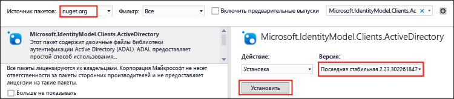

<properties
   pageTitle="Использование пакета SDK .NET хранилища озера данных для разработки приложений | Azure"
   description="Использование пакета SDK .NET хранилища озера данных для разработки приложений"
   services="data-lake-store"
   documentationCenter=""
   authors="nitinme"
   manager="paulettm"
   editor="cgronlun"/>

<tags
   ms.service="data-lake-store"
   ms.devlang="na"
   ms.topic="hero-article"
   ms.tgt_pltfrm="na"
   ms.workload="big-data"
   ms.date="04/20/2016"
   ms.author="nitinme"/>

# Начало работы с хранилищем озера данных Azure с помощью пакета SDK .NET

> [AZURE.SELECTOR]
- [Портал](data-lake-store-get-started-portal.md)
- [PowerShell](data-lake-store-get-started-powershell.md)
- [Пакет SDK для .NET](data-lake-store-get-started-net-sdk.md)
- [Пакет SDK для Java](data-lake-store-get-started-java-sdk.md)
- [ИНТЕРФЕЙС REST API](data-lake-store-get-started-rest-api.md)
- [Интерфейс командной строки Azure](data-lake-store-get-started-cli.md)
- [Node.js](data-lake-store-manage-use-nodejs.md)

Узнайте, как с помощью пакета SDK .NET хранилища озера данных Azure создать учетную запись озера данных Azure и выполнить базовые операции, такие как создание папок, передача и загрузка файлов данных, удаление учетной записи и т. д. Дополнительные сведения об озере данных см. в разделе [Хранилище озера данных Azure](data-lake-store-overview.md).

## Предварительные требования

* Visual Studio 2013 или 2015 Для выполнения инструкций ниже использовалась Visual Studio 2015.
* **Подписка Azure.**. См. [Бесплатная пробная версия Azure](https://azure.microsoft.com/pricing/free-trial/).
* **Включите свою подписку Azure** для общедоступной предварительной версии хранилища озера данных. См. [инструкции](data-lake-store-get-started-portal.md#signup).
* **Создайте приложение Azure Active Directory**. См. статью [Создание приложения Active Directory и субъекта-службы с помощью портала](../resource-group-create-service-principal-portal.md). Чтобы создать консольное приложение .NET, как описано в этой статье, необходимо создать **собственное клиентское приложение** (а не веб-приложение, как показано по ссылке). После создания приложения необходимо получить следующие связанные с ним значения.
	- Получите **идентификатор клиента** и **URI перенаправления** для приложения.
	- Настройка делегированных разрешений

	Инструкции о получении этих значений и настройке разрешений доступны по указанной выше ссылке.

## Создание приложения .NET

1. Откройте Visual Studio и создайте консольное приложение.

2. В меню **Файл** выберите команду **Создать**, а затем — **Проект**.

3. В окне **Новый проект** введите или выберите следующие значения.

	| Свойство | Значение |
	|----------|-----------------------------|
	| Категория | Templates/Visual C#/Windows |
	| Шаблон | Консольное приложение |
	| Имя | CreateADLApplication |

4. Нажмите кнопку **ОК**, чтобы создать проект.

5. Добавьте пакеты Nuget в проект.

	1. В обозревателе решений щелкните правой кнопкой мыши имя проекта и выберите пункт **Управление пакетами NuGet**.
	2. На вкладке **Диспетчер пакетов NuGet** в поле **Источник пакета** укажите значение **nuget.org** и установите флажок **Включить предварительные выпуски**.
	3. Найдите и установите следующие пакеты хранилища озера данных:

		* `Microsoft.Azure.Management.DataLake.Store`
		* `Microsoft.Azure.Management.DataLake.StoreUploader`

		

	4. Также установите пакет `Microsoft.IdentityModel.Clients.ActiveDirectory` для проверки подлинности Azure Active Directory. Не забудьте *снять* флажок **Включить предварительные выпуски**, чтобы установить стабильную версию этого пакета.

		

	5. Закройте **Диспетчер пакетов Nuget**.

7. Откройте файл **Program.cs**, удалите существующий код и включите указанные ниже инструкции, чтобы добавить ссылки на пространства имен.

		using System;
        using System.IO;
        using System.Security;
        using System.Text;
        using System.Collections.Generic;
        using System.Linq;

        using Microsoft.Azure.Management.DataLake.Store;
        using Microsoft.Azure.Management.DataLake.Store.Models;
        using Microsoft.Azure.Management.DataLake.StoreUploader;
        using Microsoft.IdentityModel.Clients.ActiveDirectory;
        using Microsoft.Rest;

8. Объявите переменные, как показано ниже, и укажите имена хранилища озера данных и группы ресурсов. Имя хранилища озера данных, которое следует указать, будет создано приложением. Группа ресурсов, имя которой следует указать, должна уже существовать. Кроме того, убедитесь, что локальный путь и имя файла, которые вы указываете, существуют на компьютере. После объявлений пространств имен добавьте приведенный ниже фрагмент кода.

		namespace SdkSample
        {
            class Program
            {
                private static DataLakeStoreAccountManagementClient _adlsClient;
                private static DataLakeStoreFileSystemManagementClient _adlsFileSystemClient;

                private static string _adlsAccountName;
                private static string _resourceGroupName;
                private static string _location;

                private static void Main(string[] args)
                {
                    _adlsAccountName = "<DATA-LAKE-STORE-NAME>"; // TODO: Replace this value with the name for a NEW Store account.
                    _resourceGroupName = "<RESOURCE-GROUP-NAME>"; // TODO: Replace this value. This resource group should already exist.
                    _location = "East US 2";

                    string localFolderPath = @"C:\local_path"; // TODO: Make sure this exists and can be overwritten.
                    string localFilePath = @"C:\local_path\file.txt"; // TODO: Make sure this exists and can be overwritten.
                    string remoteFolderPath = "/data_lake_path/";
                    string remoteFilePath = remoteFolderPath + "file.txt";
				}
			}
		}

В остальных разделах статьи рассматривается использование доступных методов .NET при выполнении таких операций, как проверка подлинности пользователей, создание учетной записи хранилища озера данных, отправка файлов и т. д. Если вам нужен полный пример работы с хранилищем озера данных, см. [приложение](#appendix-sample-code) в конце этой статьи.

## Проверка подлинности пользователя

Существует два способа проверки подлинности с помощью Azure Active Directory.

* **Интерактивный** — пользователь выполняет вход с помощью приложения. Это реализовано в методе `AuthenticateUser` в следующем фрагменте кода.

* **Неинтерактивный** — приложение указывает собственные учетные данные. Это реализовано в методе `AuthenticateAppliaction` в следующем фрагменте кода.

### Интерактивная проверка подлинности

В следующем фрагменте представлен метод `AuthenticateUser`, который можно использовать для интерактивного входа в систему.

 	// Authenticate the user with AAD through an interactive popup.
    // You need to have an application registered with AAD in order to authenticate.
    //   For more information and instructions on how to register your application with AAD, see:
    //   https://azure.microsoft.com/documentation/articles/resource-group-create-service-principal-portal/
	public static TokenCredentials AuthenticateUser(string tenantId, string resource, string appClientId, Uri appRedirectUri, string userId = "")
	{
	    var authContext = new AuthenticationContext("https://login.microsoftonline.com/" + tenantId);
	
	    var tokenAuthResult = authContext.AcquireToken(resource, appClientId, appRedirectUri,
	        PromptBehavior.Auto, UserIdentifier.AnyUser);
	
	    return new TokenCredentials(tokenAuthResult.AccessToken);
	}

### Неинтерактивная проверка подлинности

В следующем фрагменте представлен метод `AuthenticateApplication`, который можно использовать для неинтерактивного входа в систему.

	// Authenticate the application with AAD through the application's secret key.
	// You need to have an application registered with AAD in order to authenticate.
	//   For more information and instructions on how to register your application with AAD, see:
	//   https://azure.microsoft.com/documentation/articles/resource-group-create-service-principal-portal/
	public static TokenCredentials AuthenticateApplication(string tenantId, string resource, string appClientId, Uri appRedirectUri, SecureString clientSecret)
	{
	    var authContext = new AuthenticationContext("https://login.microsoftonline.com/" + tenantId);
	    var credential = new ClientCredential(appClientId, clientSecret);
	
	    var tokenAuthResult = authContext.AcquireToken(resource, credential);
	
	    return new TokenCredentials(tokenAuthResult.AccessToken);
	}
	
## Создание учетной записи хранения озера данных

В следующем фрагменте представлен метод `CreateAccount`, с помощью которого можно создать учетную запись хранилища озера данных.

	// Create Data Lake Store account
    public static void CreateAccount()
    {
        var adlsParameters = new DataLakeStoreAccount(location: _location);
        _adlsClient.Account.Create(_resourceGroupName, _adlsAccountName, adlsParameters);
    } 

## Получение списка всех учетных записей хранилища озера данных в рамках подписки

В следующем фрагменте представлен метод `ListAdlStoreAccounts`, с помощью которого можно получить список всех учетных записей хранилища озера данных в рамках определенной подписки Azure.

	// List all ADLS accounts within the subscription
	public static List<DataLakeStoreAccount> ListAdlStoreAccounts()
	{
	    var response = _adlsClient.Account.List(_adlsAccountName);
	    var accounts = new List<DataLakeStoreAccount>(response);
	
	    while (response.NextPageLink != null)
	    {
	        response = _adlsClient.Account.ListNext(response.NextPageLink);
	        accounts.AddRange(response);
	    }
	
	    return accounts;
	}

## Создайте каталог

В следующем фрагменте представлен метод `CreateDirectory`, с помощью которого можно создать каталог в рамках учетной записи хранилища озера данных.

	// Create a directory
    public static void CreateDirectory(string path)
    {
        _adlsFileSystemClient.FileSystem.Mkdirs(path, _adlsAccountName);
    }

## Передача файла в хранилище озера данных

В следующем фрагменте представлен метод `UploadFile`, с помощью которого можно передавать файлы в учетную запись хранилища озера данных.

	// Upload a file
    public static void UploadFile(string srcFilePath, string destFilePath, bool force = true)
    {
        var parameters = new UploadParameters(srcFilePath, destFilePath, _adlsAccountName, isOverwrite: force);
        var frontend = new DataLakeStoreFrontEndAdapter(_adlsAccountName, _adlsFileSystemClient);
        var uploader = new DataLakeStoreUploader(parameters, frontend);
        uploader.Execute();
    }

## Получение сведений о файле или каталоге

В следующем фрагменте представлен метод `GetItemInfo`, с помощью которого можно получить сведения о файле или каталоге в хранилище озера данных.

	// Get file or directory info
    public static FileStatusProperties GetItemInfo(string path)
    {
        return _adlsFileSystemClient.FileSystem.GetFileStatus(path, _adlsAccountName).FileStatus;
    }

## Получение списка файлов или каталогов

В следующем фрагменте представлен метод `ListItem`, с помощью которого можно получить список файлов и каталогов в учетной записи хранилища озера данных.
	
	// List files and directories
    public static List<FileStatusProperties> ListItems(string directoryPath)
    {
        return _adlsFileSystemClient.FileSystem.ListFileStatus(directoryPath, _adlsAccountName).FileStatuses.FileStatus.ToList();
    }

## Сцепление файлов

В следующем фрагменте представлен метод `ConcatenateFiles`, используемый для сцепления файлов.

	// Concatenate files
    public static void ConcatenateFiles(string[] srcFilePaths, string destFilePath)
    {
        _adlsFileSystemClient.FileSystem.Concat(destFilePath, srcFilePaths, _adlsAccountName);
    }

## Добавление данных в файл

В следующем фрагменте представлен метод `AppendToFile`, с помощью которого можно добавить данные в файл, уже хранящийся в учетной записи хранилища озера данных.

	// Append to file
    public static void AppendToFile(string path, string content)
    {
        var stream = new MemoryStream(Encoding.UTF8.GetBytes(content));

        _adlsFileSystemClient.FileSystem.Append(path, stream, _adlsAccountName);
    }

## Скачивание файла

В следующем фрагменте представлен метод `DownloadFile`, с помощью которого можно скачать файл из учетной записи хранилища озера данных.

	// Download file
    public static void DownloadFile(string srcPath, string destPath)
    {
        var stream = _adlsFileSystemClient.FileSystem.Open(srcPath, _adlsAccountName);
        var fileStream = new FileStream(destPath, FileMode.Create);

        stream.CopyTo(fileStream);
        fileStream.Close();
        stream.Close();
    }

## Удаление учетной записи хранения озера данных

В следующем фрагменте представлен метод `DeleteAccount`, с помощью которого можно удалить учетную запись хранилища озера данных.

	// Delete account
    public static void DeleteAccount()
    {
        _adlsClient.Account.Delete(_resourceGroupName, _adlsAccountName);
    }

## Приложение. Пример кода

Во фрагменте ниже приведен полный пример кода, который можно скопировать и вставить в приложение для просмотра операции в хранилище озера данных от начала до конца. Перед выполнением этого фрагмента кода убедитесь, что указаны необходимые значения, такие как имя хранилища озера данных, имя группы ресурсов и т. д. Кроме того, необходимо указать значения, требующиеся для проверки подлинности Azure Active Directory, такие как **<APPLICATION-CLIENT-ID>**, **<APPLICATION-REPLY-URI>** и **<SUBSCRIPTION-ID>**.

В этом фрагменте кода представлены методы для обоих подходов — как интерактивного, так и неинтерактивного, — однако неинтерактивный блок кода закомментирован. Для интерактивного метода необходимо указать идентификатор клиентского приложения AAD и универсальный код ресурса (URI) перенаправления. По ссылке в разделе предварительных требований можно просмотреть инструкции о том, как получить их.

>[AZURE.NOTE] Если вы хотите изменить фрагмент кода и использовать неинтерактивный метод (`AuthenticateApplication`), то в качестве входных данных метода, помимо идентификатора клиента и URI ответа клиента, нужно указать ключ проверки подлинности клиента. Статья [Создание приложения Active Directory и субъекта-службы с помощью портала](../resource-group-create-service-principal-portal.md) также содержит сведения о том, как создать и получить ключ проверки подлинности клиента.
	
Наконец убедитесь, что локальный путь и имя файла, которые вы указываете, существуют на компьютере. Если у вас нет под рукой подходящих для этих целей данных, передайте папку **Ambulance Data** из [репозитория Git для озера данных Azure](https://github.com/MicrosoftBigData/usql/tree/master/Examples/Samples/Data/AmbulanceData).

    using System;
    using System.IO;
    using System.Security;
    using System.Text;
    using System.Collections.Generic;
    using System.Linq;

    using Microsoft.Azure.Management.DataLake.Store;
    using Microsoft.Azure.Management.DataLake.Store.Models;
    using Microsoft.Azure.Management.DataLake.StoreUploader;
    using Microsoft.IdentityModel.Clients.ActiveDirectory;
    using Microsoft.Rest;

    namespace SdkSample
    {
        class Program
        {
            private static DataLakeStoreAccountManagementClient _adlsClient;
            private static DataLakeStoreFileSystemManagementClient _adlsFileSystemClient;

            private static string _adlsAccountName;
            private static string _resourceGroupName;
            private static string _location;

            private static void Main(string[] args)
            {
                _adlsAccountName = "<DATA-LAKE-STORE-NAME>"; // TODO: Replace this value with the name for a NEW Store account.
                _resourceGroupName = "<RESOURCE-GROUP-NAME>"; // TODO: Replace this value. This resource group should already exist.
                _location = "East US 2";

                string localFolderPath = @"C:\local_path"; // TODO: Make sure this exists and can be overwritten.
                string localFilePath = @"C:\local_path\file.txt"; // TODO: Make sure this exists and can be overwritten.
                string remoteFolderPath = "/data_lake_path/";
                string remoteFilePath = remoteFolderPath + "file.txt";

                // Authenticate the user
                var tokenCreds = AuthenticateUser("common", "https://management.core.windows.net/",
                    "<APPLICATION-CLIENT-ID>", new Uri("<APPLICATION-REPLY-URI>")); // TODO: Replace bracketed values.

                SetupClients(tokenCreds, "<SUBSCRIPTION-ID>"); // TODO: Replace bracketed value.

                // Run sample scenarios
                WaitForNewline("Authenticated.", "Creating NEW account.");
                CreateAccount();
                WaitForNewline("Account created.", "Creating a directory.");

                // Create a directory in the Data Lake Store
                CreateDirectory(remoteFolderPath);
                WaitForNewline("Directory created.", "Showing directory info.");

                // Get info about the directory in the Data Lake Store
                var itemInfo = GetItemInfo(remoteFolderPath);
                Console.WriteLine("Type: " + itemInfo.Type);
                Console.WriteLine("Last modified (UTC): " +
                                  new DateTime(1970, 1, 1, 0, 0, 0, 0, DateTimeKind.Utc).AddMilliseconds(
                                      itemInfo.ModificationTime.Value));
                WaitForNewline("Directory info shown.", "Uploading a file.");

                // Upload a file to the Data Lake Store
                UploadFile(localFilePath, remoteFilePath);
                WaitForNewline("File uploaded.", "Listing files and directories.");

                // List the files in the Data Lake Store
                var itemList = ListItems(remoteFolderPath);
                var fileMenuItems = itemList.Select(a => String.Format("{0,15} {1}", a.Type, a.PathSuffix));
                Console.WriteLine(String.Join("\r\n", fileMenuItems));
                WaitForNewline("Files and directories listed.", "Appending content to a file.");

                // Append to a file in the Data Lake Store
                AppendToFile(remoteFilePath, "123");
                WaitForNewline("Content appended.", "Downloading a file.");

                // Download a file from the Data Lake Store
                DownloadFile(remoteFilePath, localFilePath);
                WaitForNewline("File downloaded.", "Deleting account.");

                // Delete account
                DeleteAccount();
                WaitForNewline("Account deleted. You can now exit.");
            }

            // Helper function to show status and wait for user input
            public static void WaitForNewline(string reason, string nextAction = "")
            {
                if (!String.IsNullOrWhiteSpace(nextAction))
                {
                    Console.WriteLine(reason + "\r\nPress ENTER to continue...");
                    Console.ReadLine();
                    Console.WriteLine(nextAction);
                }
                else
                {
                    Console.WriteLine(reason + "\r\nPress ENTER to continue...");
                    Console.ReadLine();
                }
            }

            // Authenticate the user with AAD through an interactive popup.
            // You need to have an application registered with AAD in order to authenticate.
            //   For more information and instructions on how to register your application with AAD, see:
            //   https://azure.microsoft.com/documentation/articles/resource-group-create-service-principal-portal/
            public static TokenCredentials AuthenticateUser(string tenantId, string resource, string appClientId, Uri appRedirectUri, string userId = "")
            {
                var authContext = new AuthenticationContext("https://login.microsoftonline.com/" + tenantId);

                var tokenAuthResult = authContext.AcquireToken(resource, appClientId, appRedirectUri,
                    PromptBehavior.Auto, UserIdentifier.AnyUser);

                return new TokenCredentials(tokenAuthResult.AccessToken);
            }
			
			/*
            // Authenticate the application with AAD through the application's secret key.
            // You need to have an application registered with AAD in order to authenticate.
            //   For more information and instructions on how to register your application with AAD, see:
            //   https://azure.microsoft.com/documentation/articles/resource-group-create-service-principal-portal/
            public static TokenCredentials AuthenticateApplication(string tenantId, string resource, string appClientId, Uri appRedirectUri, SecureString clientSecret)
            {
                var authContext = new AuthenticationContext("https://login.microsoftonline.com/" + tenantId);
                var credential = new ClientCredential(appClientId, clientSecret);

                var tokenAuthResult = authContext.AcquireToken(resource, credential);

                return new TokenCredentials(tokenAuthResult.AccessToken);
            }
			*/

            //Set up clients
            public static void SetupClients(TokenCredentials tokenCreds, string subscriptionId)
            {
                _adlsClient = new DataLakeStoreAccountManagementClient(tokenCreds);
                _adlsClient.SubscriptionId = subscriptionId;

                _adlsFileSystemClient = new DataLakeStoreFileSystemManagementClient(tokenCreds);
                _adlsFileSystemClient.SubscriptionId = subscriptionId;
            }

            // Create account
            public static void CreateAccount()
            {
                // Create ADLS account
                var adlsParameters = new DataLakeStoreAccount(location: _location);
                _adlsClient.Account.Create(_resourceGroupName, _adlsAccountName, adlsParameters);
            }

            // Delete account
            public static void DeleteAccount()
            {
                _adlsClient.Account.Delete(_resourceGroupName, _adlsAccountName);
            }

            // List all ADLS accounts within the subscription
            public static List<DataLakeStoreAccount> ListAdlStoreAccounts()
            {
                var response = _adlsClient.Account.List(_adlsAccountName);
                var accounts = new List<DataLakeStoreAccount>(response);

                while (response.NextPageLink != null)
                {
                    response = _adlsClient.Account.ListNext(response.NextPageLink);
                    accounts.AddRange(response);
                }

                return accounts;
            }

            // Upload a file
            public static void UploadFile(string srcFilePath, string destFilePath, bool force = true)
            {
                var parameters = new UploadParameters(srcFilePath, destFilePath, _adlsAccountName, isOverwrite: force);
                var frontend = new DataLakeStoreFrontEndAdapter(_adlsAccountName, _adlsFileSystemClient);
                var uploader = new DataLakeStoreUploader(parameters, frontend);
                uploader.Execute();
            }

            // Concatenate files
            public static void ConcatenateFiles(string[] srcFilePaths, string destFilePath)
            {
                _adlsFileSystemClient.FileSystem.Concat(destFilePath, srcFilePaths, _adlsAccountName);
            }

            // Get file or directory info
            public static FileStatusProperties GetItemInfo(string path)
            {
                return _adlsFileSystemClient.FileSystem.GetFileStatus(path, _adlsAccountName).FileStatus;
            }

            // List files and directories
            public static List<FileStatusProperties> ListItems(string directoryPath)
            {
                return _adlsFileSystemClient.FileSystem.ListFileStatus(directoryPath, _adlsAccountName).FileStatuses.FileStatus.ToList();
            }

            // Download file
            public static void DownloadFile(string srcPath, string destPath)
            {
                var stream = _adlsFileSystemClient.FileSystem.Open(srcPath, _adlsAccountName);
                var fileStream = new FileStream(destPath, FileMode.Create);

                stream.CopyTo(fileStream);
                fileStream.Close();
                stream.Close();
            }

            // Append to file
            public static void AppendToFile(string path, string content)
            {
                var stream = new MemoryStream(Encoding.UTF8.GetBytes(content));

                _adlsFileSystemClient.FileSystem.Append(path, stream, _adlsAccountName);
            }

            // Create a directory
            public static void CreateDirectory(string path)
            {
                _adlsFileSystemClient.FileSystem.Mkdirs(path, _adlsAccountName);
            }
        }
    }

## Дальнейшие действия

- [Защита данных в хранилище озера данных](data-lake-store-secure-data.md)
- [Использование аналитики озера данных Azure с хранилищем озера данных](../data-lake-analytics/data-lake-analytics-get-started-portal.md)
- [Использование Azure HDInsight с хранилищем озера данных](data-lake-store-hdinsight-hadoop-use-portal.md)

<!---HONumber=AcomDC_0420_2016-->