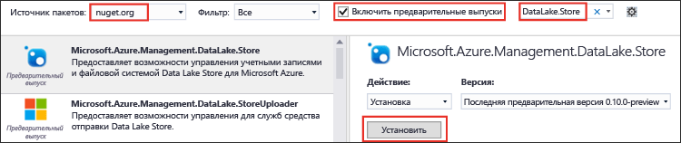

# Начало работы с хранилищем озера данных Azure с помощью пакета SDK .NET
> [!div class="op_single_selector"]
> * [Портал](data-lake-store-get-started-portal.md)
> * [PowerShell](data-lake-store-get-started-powershell.md)
> * [Пакет SDK для .NET](data-lake-store-get-started-net-sdk.md)
> * [Пакет SDK для Java](data-lake-store-get-started-java-sdk.md)
> * [ИНТЕРФЕЙС REST API](data-lake-store-get-started-rest-api.md)
> * [Интерфейс командной строки Azure](data-lake-store-get-started-cli.md)
> * [Node.js](data-lake-store-manage-use-nodejs.md)
> 
> 

Узнайте, как с помощью [пакета SDK .NET для Azure Data Lake Store](https://msdn.microsoft.com/library/mt581387.aspx) выполнять базовые операции, такие как создание папок, отправка и скачивание файлов данных и т. д. Дополнительные сведения об Azure Data Lake Store см. в [этой статье](data-lake-store-overview.md).

## Предварительные требования
* **Visual Studio 2013 или 2015**. Для выполнения инструкций ниже использовалась Visual Studio 2015.
* **Подписка Azure**. Ознакомьтесь с [бесплатной пробной версией Azure](https://azure.microsoft.com/pricing/free-trial/).
* **Учетная запись хранилища озера данных Azure**. Инструкции по созданию учетной записи см. в статье [Начало работы с Azure Data Lake Store с помощью портала Azure](data-lake-store-get-started-portal.md).
* **Создание приложения Azure Active Directory**. Это приложение будет использоваться для проверки подлинности приложения Data Lake Store в Azure AD. Есть разные способы проверки подлинности приложения с помощью Azure AD: **проверка подлинности пользователя** и **проверка подлинности со взаимодействием между службами**. Инструкции и дополнительные сведения о проверке подлинности см. в статье, посвященной [проверке подлинности приложений Data Lake Store с помощью Azure Active Directory](data-lake-store-authenticate-using-active-directory.md).

## Создание приложения .NET
1. Откройте Visual Studio и создайте консольное приложение.
2. В меню **Файл** выберите команду **Создать**, а затем — **Проект**.
3. В окне **Новый проект**введите или выберите следующие значения.
   
   | Свойство | Значение |
   | --- | --- |
   | Категория |Templates/Visual C#/Windows |
   | Шаблон |Консольное приложение |
   | Имя |CreateADLApplication |
4. Нажмите кнопку **ОК** , чтобы создать проект.
5. Добавьте пакеты Nuget в проект.
   
   1. В обозревателе решений щелкните правой кнопкой мыши имя проекта и выберите пункт **Управление пакетами NuGet**.
   2. На вкладке **Диспетчер пакетов NuGet** в поле **Источник пакета** выберите **nuget.org** и установите флажок **Включить предварительные выпуски**.
   3. Найдите и установите следующие пакеты NuGet:
      
      * `Microsoft.Azure.Management.DataLake.Store` — в этом руководстве используется предварительная версия 0.12.5.
      * `Microsoft.Azure.Management.DataLake.StoreUploader` — в этом руководстве используется предварительная версия 0.10.6.
      * `Microsoft.Rest.ClientRuntime.Azure.Authentication` — в этом руководстве используется предварительная версия 2.2.8.
        
        
   4. Закройте **Диспетчер пакетов Nuget**.
6. Откройте файл **Program.cs**, удалите существующий код и включите следующие инструкции, чтобы добавить ссылки на пространства имен.
   
        using System;
        using System.Threading;
   
        using Microsoft.Rest.Azure.Authentication;
        using Microsoft.Azure.Management.DataLake.Store;
        using Microsoft.Azure.Management.DataLake.StoreUploader;
7. Объявите переменные, как показано ниже, и укажите уже имеющиеся имена Data Lake Store и группы ресурсов. Кроме того, убедитесь, что локальный путь и имя файла, которые вы указываете, существуют на компьютере. После объявлений пространств имен добавьте приведенный ниже фрагмент кода.
   
        namespace SdkSample
        {
            class Program
            {
                private static DataLakeStoreAccountManagementClient _adlsClient;
                private static DataLakeStoreFileSystemManagementClient _adlsFileSystemClient;
   
                private static string _adlsAccountName;
                private static string _resourceGroupName;
                private static string _location;
                private static string _subId;

                private static void Main(string[] args)
                {
                    _adlsAccountName = "<DATA-LAKE-STORE-NAME>"; // TODO: Replace this value with the name of your existing Data Lake Store account.
                    _resourceGroupName = "<RESOURCE-GROUP-NAME>"; // TODO: Replace this value with the name of the resource group containing your Data Lake Store account.
                    _location = "East US 2";
                    _subId = "<SUBSCRIPTION-ID>";

                    string localFolderPath = @"C:\local_path\"; // TODO: Make sure this exists and can be overwritten.
                    string localFilePath = localFolderPath + "file.txt"; // TODO: Make sure this exists and can be overwritten.
                    string remoteFolderPath = "/data_lake_path/";
                    string remoteFilePath = remoteFolderPath + "file.txt";
                }
            }
        }

В остальных разделах статьи рассматривается использование доступных методов .NET при выполнении таких операций, как проверка подлинности, отправка файла и т. д.

## Аутентификация
### При использовании проверки подлинности пользователя (рекомендуется для этого руководства)
Используйте приведенный ниже фрагмент кода для существующего собственного клиентского приложения Azure AD. Мы советуем вам использовать этот подход для быстрого завершения работы с этим руководством.

    // User login via interactive popup
    // Use the client ID of an existing AAD "Native Client" application.
    SynchronizationContext.SetSynchronizationContext(new SynchronizationContext());
    var domain = "common"; // Replace this string with the user's Azure Active Directory tenant ID or domain name, if needed.
    var nativeClientApp_clientId = "1950a258-227b-4e31-a9cf-717495945fc2";
    var activeDirectoryClientSettings = ActiveDirectoryClientSettings.UsePromptOnly(nativeClientApp_clientId, new Uri("urn:ietf:wg:oauth:2.0:oob"));
    var creds = UserTokenProvider.LoginWithPromptAsync(domain, activeDirectoryClientSettings).Result;

Некоторые важные моменты касательно этого фрагмента.

* Для быстрого завершения работы с руководством в этом фрагменте кода используется домен Azure AD и идентификатор клиента, доступный по умолчанию для всех подписок Azure. Таким образом, вы можете **использовать в приложении этот фрагмент в исходном виде**.
* Если вы не хотите использовать свой домен Azure AD и идентификатор клиента приложения, необходимо создать собственное приложение Azure AD и использовать домен Azure AD, идентификатор клиента и URI перенаправления этого приложения. Подробные инструкции см. в разделе [Создание приложения Active Directory](../resource-group-create-service-principal-portal.md#create-an-active-directory-application).

> [!NOTE]
> Инструкции, доступные по указанным ниже ссылкам, относятся к веб-приложению Azure AD. Однако если вы решите создать собственное клиентское приложение, ваши действия будут такими же. 
> 
> 

### При использовании проверки подлинности через секрет клиента со взаимодействием между службами
Следующий фрагмент можно использовать для проверки подлинности приложения в неинтерактивном режиме с помощью секрета клиента, ключа приложения или субъекта-службы. Примените этот фрагмент кода к существующему [веб-приложению Azure AD](../resource-group-create-service-principal-portal.md).

    // Service principal / appplication authentication with client secret / key
    // Use the client ID and certificate of an existing AAD "Web App" application.
    SynchronizationContext.SetSynchronizationContext(new SynchronizationContext());
    var domain = "<AAD-directory-domain>";
    var webApp_clientId = "<AAD-application-clientid>";
    var clientSecret = "<AAD-application-client-secret>";
    var clientCredential = new ClientCredential(webApp_clientId, clientSecret);
    var creds = ApplicationTokenProvider.LoginSilentAsync(domain, clientCredential).Result;

### При использовании проверки подлинности с помощью сертификата со взаимодействием между службами
Приведенный ниже фрагмент можно использовать для проверки подлинности приложения в неинтерактивном режиме с помощью сертификата приложения или субъекта-службы. Примените этот фрагмент кода к существующему [веб-приложению Azure AD](../resource-group-create-service-principal-portal.md).

    // Service principal / application authentication with certificate
    // Use the client ID and certificate of an existing AAD "Web App" application.
    SynchronizationContext.SetSynchronizationContext(new SynchronizationContext());
    var domain = "<AAD-directory-domain>";
    var webApp_clientId = "<AAD-application-clientid>";
    System.Security.Cryptography.X509Certificates.X509Certificate2 clientCert = <AAD-application-client-certificate>
    var clientAssertionCertificate = new ClientAssertionCertificate(webApp_clientId, clientCert);
    var creds = ApplicationTokenProvider.LoginSilentWithCertificateAsync(domain, clientAssertionCertificate).Result;

## Создание клиентских объектов
С помощью следующего фрагмента можно создать учетную запись Data Lake Store и клиентские объекты файловой системы, которые используются для передачи запросов к службе.

    // Create client objects and set the subscription ID
    _adlsClient = new DataLakeStoreAccountManagementClient(creds);
    _adlsFileSystemClient = new DataLakeStoreFileSystemManagementClient(creds);

    _adlsClient.SubscriptionId = _subId;

## Получение списка всех учетных записей Data Lake Store в рамках подписки
С помощью следующего фрагмента можно получить список всех учетных записей Data Lake Store в рамках определенной подписки Azure.

    // List all ADLS accounts within the subscription
    public static List<DataLakeStoreAccount> ListAdlStoreAccounts()
    {
        var response = _adlsClient.Account.List();
        var accounts = new List<DataLakeStoreAccount>(response);

        while (response.NextPageLink != null)
        {
            response = _adlsClient.Account.ListNext(response.NextPageLink);
            accounts.AddRange(response);
        }

        return accounts;
    }

## Создайте каталог
В следующем фрагменте представлен метод `CreateDirectory` , с помощью которого можно создать каталог в рамках учетной записи Data Lake Store.

    // Create a directory
    public static void CreateDirectory(string path)
    {
        _adlsFileSystemClient.FileSystem.Mkdirs(_adlsAccountName, path);
    }

## Отправить файл.
В следующем фрагменте представлен метод `UploadFile` , с помощью которого можно отправить файлы в учетную запись Data Lake Store.

    // Upload a file
    public static void UploadFile(string srcFilePath, string destFilePath, bool force = true)
    {
        var parameters = new UploadParameters(srcFilePath, destFilePath, _adlsAccountName, isOverwrite: force);
        var frontend = new DataLakeStoreFrontEndAdapter(_adlsAccountName, _adlsFileSystemClient);
        var uploader = new DataLakeStoreUploader(parameters, frontend);
        uploader.Execute();
    }

`DataLakeStoreUploader` поддерживает рекурсивную отправку и загрузку между расположением локального файла и расположением файла Data Lake Store.    

## Получение сведений о файле или каталоге
В следующем фрагменте представлен метод `GetItemInfo` , с помощью которого можно получить сведения о файле или каталоге в Data Lake Store. 

    // Get file or directory info
    public static FileStatusProperties GetItemInfo(string path)
    {
        return _adlsFileSystemClient.FileSystem.GetFileStatus(_adlsAccountName, path).FileStatus;
    }

## Получение списка файлов или каталогов
В следующем фрагменте представлен метод `ListItem` , с помощью которого можно получить список файлов и каталогов в рамках учетной записи Data Lake Store.

    // List files and directories
    public static List<FileStatusProperties> ListItems(string directoryPath)
    {
        return _adlsFileSystemClient.FileSystem.ListFileStatus(_adlsAccountName, directoryPath).FileStatuses.FileStatus.ToList();
    }

## Сцепление файлов
В следующем фрагменте представлен метод `ConcatenateFiles` , используемый для сцепления файлов. 

    // Concatenate files
    public static void ConcatenateFiles(string[] srcFilePaths, string destFilePath)
    {
        _adlsFileSystemClient.FileSystem.Concat(_adlsAccountName, destFilePath, srcFilePaths);
    }

## Добавление данных в файл
В следующем фрагменте представлен метод `AppendToFile` , с помощью которого можно добавить данные в файл, уже хранящийся в учетной записи Data Lake Store.

    // Append to file
    public static void AppendToFile(string path, string content)
    {
        var stream = new MemoryStream(Encoding.UTF8.GetBytes(content));

        _adlsFileSystemClient.FileSystem.Append(_adlsAccountName, path, stream);
    }

## Скачивание файла
В следующем фрагменте представлен метод `DownloadFile` , с помощью которого можно скачать файл из учетной записи Data Lake Store.

    // Download file
    public static void DownloadFile(string srcPath, string destPath)
    {
        var stream = _adlsFileSystemClient.FileSystem.Open(_adlsAccountName, srcPath);
        var fileStream = new FileStream(destPath, FileMode.Create);

        stream.CopyTo(fileStream);
        fileStream.Close();
        stream.Close();
    }

## Дальнейшие действия
* [Защита данных в хранилище озера данных](data-lake-store-secure-data.md)
* [Использование аналитики озера данных Azure с хранилищем озера данных](../data-lake-analytics/data-lake-analytics-get-started-portal.md)
* [Использование Azure HDInsight с хранилищем озера данных](data-lake-store-hdinsight-hadoop-use-portal.md)
* [Data Lake Store .NET Reference (Справочник по пакету SDK .NET для Data Lake Store)](https://msdn.microsoft.com/library/mt581387.aspx)
* [Data Lake Store REST Reference (Справочник по REST для Data Lake Store)](https://msdn.microsoft.com/library/mt693424.aspx)

<!--HONumber=Nov16_HO2-->

