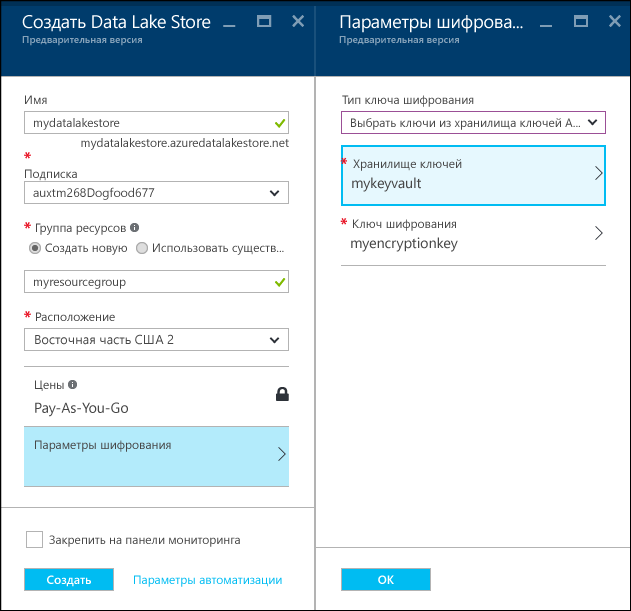
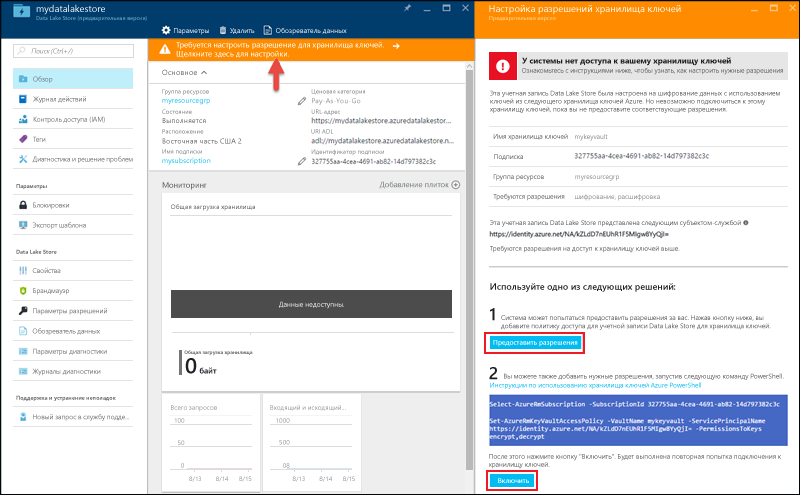

# Начало работы с Azure Data Lake Store с помощью портала Azure
> [!div class="op_single_selector"]
> * [Портал](data-lake-store-get-started-portal.md)
> * [PowerShell](data-lake-store-get-started-powershell.md)
> * [Azure CLI 2.0](data-lake-store-get-started-cli-2.0.md)
>
> 

Узнайте, как с помощью портала Azure создать учетную запись Azure Data Lake Store и выполнять базовые операции, такие как создание папок, передача и загрузка файлов данных, удаление учетной записи и т. д. Дополнительные сведения см. в [обзоре Azure Data Lake Store](data-lake-store-overview.md).

## предварительным требованиям
Перед началом работы с этим руководством необходимо иметь следующее:

* **Подписка Azure**. См. страницу [бесплатной пробной версии Azure](https://azure.microsoft.com/pricing/free-trial/).

## Создание учетной записи хранения озера данных Azure

1. Войдите на новый [портал Azure](https://portal.azure.com).
2. Последовательно выберите **Создать ресурс > Хранилище > Data Lake Store**.
3. В колонке **Создать Data Lake Store** задайте значения, как показано на следующем снимке экрана:
   
    
   
   * **Имя**. Введите уникальное имя учетной записи Data Lake Store.
   * **Подписка**. выберите подписку, в которой нужно создать учетную запись Data Lake Store.
   * **Группа ресурсов**: выберите существующую группу ресурсов Azure или создайте новую группу. Выберите существующую группу ресурсов или щелкните **Создать**, чтобы создать новую. Группа ресурсов представляет собой контейнер, содержащий связанные ресурсы для приложения. Дополнительные сведения см. в разделе [Группы ресурсов](../azure-resource-manager/resource-group-overview.md#resource-groups).
   * **Расположение**: выберите расположение, в котором нужно создать учетную запись хранения озера данных.
   * **Параметры шифрования**. Доступны три параметра:
     
     * **Не включать шифрование**.
     * **Использовать ключи, управляемые Data Lake Store**.  (если вы хотите, чтобы хранилище Azure Data Lake Store управляло ключами шифрования).
     * **Использовать ключи из собственного хранилища ключей**. Вы можете выбрать существующее хранилище Azure Key Vault или создать новое. Чтобы использовать ключи из хранилища Key Vault, учетной записи Azure Data Lake Store необходимо назначить разрешения на доступ к хранилищу Azure Key Vault. Инструкции см. в разделе, посвященном [назначению разрешений для Azure Key Vault](#assign-permissions-to-azure-key-vault).
       
        
       
        Нажмите кнопку **ОК** в колонке **Параметры шифрования**.

        Дополнительные сведения см. в статье [Шифрование данных в Azure Data Lake Store](./data-lake-store-encryption.md).

4. Нажмите кнопку **Создать**. Если вы закрепили учетную запись на панели мониторинга, вы вернетесь на панель мониторинга, где сможете следить за ходом подготовки учетной записи Data Lake Store. После подготовки учетной хранения озера данных появится колонка учетной записи.

##  Назначение разрешений для Azure Key Vault
Если для настройки шифрования в учетной записи Data Lake Store использовались ключи из хранилища ключей Azure, учетной записи Data Lake Store необходимо назначить разрешения на доступ к хранилищу ключей Azure. Для этого выполните следующие действия.

1. Если вы использовали ключи из хранилища ключей Azure, вверху колонки учетной записи Data Lake Store отображается предупреждение. Щелкните предупреждение, чтобы открыть колонку **Шифрование**.
   
    
2. В колонке доступно два варианта настройки доступа.

    
   
   * В первом случае, чтобы настроить доступ, щелкните **Предоставить разрешения**. Этот вариант возможен, только если пользователь, который создал учетную запись Data Lake Store, также является администратором хранилища ключей Azure.
   * Другой вариант — выполнить командлет PowerShell, отображаемый в колонке. В этом случае нужно быть владельцем хранилища ключей Azure или иметь возможность предоставлять разрешения на него. Выполнив командлет, вернитесь в колонку и нажмите кнопку **Включить** для настройки доступа.

> [!NOTE]
> Вы можете также создать учетную запись Data Lake Store, используя шаблоны Azure Resource Manager. Эти шаблоны доступны на сайте [шаблонов быстрого запуска Azure](https://azure.microsoft.com/resources/templates/?term=data+lake+store).
    - Шаблон без шифрования: [Deploy Azure Data Lake Store account with no data encryption](https://azure.microsoft.com/resources/templates/101-data-lake-store-no-encryption/) (Развертывание учетной записи Azure Data Lake Store без шифрования данных).
    - С шифрованием данных с помощью Data Lake Store: [Deploy Data Lake Store account with encryption (Data Lake)](https://azure.microsoft.com/resources/templates/101-data-lake-store-encryption-adls/) (Развертывание учетной записи Data Lake Store с шифрованием данных (Data Lake)).
    - С шифрованием данных с помощью Azure Key Vault: [Deploy Data Lake Store account with encryption (Key Vault)](https://azure.microsoft.com/resources/templates/101-data-lake-store-encryption-key-vault/) (Развертывание учетной записи Data Lake Store с шифрованием данных (Key Vault)).
> 
> 

## Создание папок в учетной записи хранения озера данных Azure
Чтобы хранить данные и управлять ими, вы можете создать папки в своей учетной записи хранения озера данных.

1. Откройте созданную учетную запись Data Lake Store. На панели слева щелкните **Все ресурсы** и в колонке "Все ресурсы" выберите имя учетной записи, в которой нужно создать папки. Если учетная запись была закреплена на начальной панели, щелкните элемент этой учетной записи.
2. В колонке учетной записи «Хранилище озера данных» щелкните **Обозреватель данных**.
   
    
3. В колонке обозревателя данных щелкните **Создать папку**, введите имя новой папки и нажмите кнопку **ОК**.
   
    
   
    Созданная папка появится в колонке **Обозреватель данных**. Вы можете создавать вложенные папки любого уровня.
   
    

## Передача данных в учетную запись хранилища озера данных Azure
Данные можно передавать в учетную запись хранения озера данных Azure непосредственно на корневой уровень или в папку, созданную в учетной записи. 

1. В колонке **Обозреватель данных** щелкните **Отправить**. 
2. В колонке **Отправить файлы** перейдите к файлам, которые необходимо отправить, а затем выберите **Добавить выбранные файлы**. Можно также выбрать несколько файлов для отправки.

    

Если у вас нет под рукой подходящих для этих целей данных, передайте папку **Ambulance Data** из [репозитория Git для озера данных Azure](https://github.com/MicrosoftBigData/usql/tree/master/Examples/Samples/Data/AmbulanceData).

## Доступные действия с сохраненными данными
Щелкните значок с многоточием рядом с файлом, а также из всплывающего меню выберите действие, которое требуется выполнить с данными.

 

## Защита данных
Защитить данные, хранящиеся в вашей учетной записи хранения озера данных Azure, можно с помощью Azure Active Directory и контроля доступа (ACL). Соответствующие инструкции см. в статье, посвященной [защите данных в Azure Data Lake Store](data-lake-store-secure-data.md).

## Удаление учетной записи хранения озера данных Azure
Чтобы удалить учетную запись хранения озера данных Azure, в колонке хранилища озера данных щелкните **Удалить**. Чтобы подтвердить действие, вам будет предложено ввести имя учетной записи, которую вы хотите удалить. Введите имя учетной записи и нажмите кнопку **Удалить**.

## Дополнительная информация
* [Использование Azure Data Lake Store для потребностей больших данных](data-lake-store-data-scenarios.md) 
* [Защита данных в хранилище озера данных](data-lake-store-secure-data.md)
* [Использование аналитики озера данных Azure с хранилищем озера данных](../data-lake-analytics/data-lake-analytics-get-started-portal.md)
* [Использование Azure HDInsight с хранилищем озера данных](data-lake-store-hdinsight-hadoop-use-portal.md)

