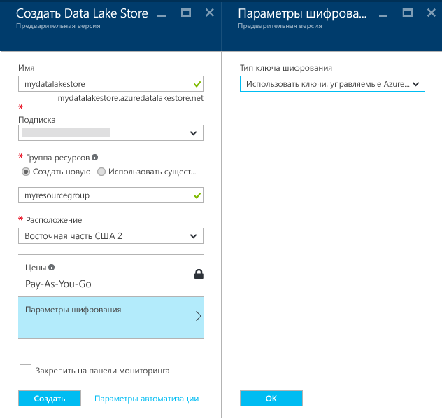

# Начало работы с хранилищем озера данных Azure с помощью портала Azure
> [!div class="op_single_selector"]
> * [Портал](data-lake-store-get-started-portal.md)
> * [PowerShell](data-lake-store-get-started-powershell.md)
> * [Пакет SDK для .NET](data-lake-store-get-started-net-sdk.md)
> * [Пакет SDK для Java](data-lake-store-get-started-java-sdk.md)
> * [REST API](data-lake-store-get-started-rest-api.md)
> * [Azure CLI 2.0](data-lake-store-get-started-cli-2.0.md)
> * [Node.js](data-lake-store-manage-use-nodejs.md)
> * [Python](data-lake-store-get-started-python.md)
>
> 

Узнайте, как с помощью портала Azure создать учетную запись хранения для озера данных Azure и выполнять базовые операции, такие как создание папок, передача и загрузка файлов данных, удаление учетной записи и т. д. Дополнительные сведения о Data Lake Store см. в [обзоре Azure Data Lake Store](data-lake-store-overview.md).

## Предварительные требования
Перед началом работы с этим учебником необходимо иметь следующее:

* **Подписка Azure**. Ознакомьтесь с [бесплатной пробной версией Azure](https://azure.microsoft.com/pricing/free-trial/).

## Учитесь быстрее с помощью видео?
Следующие видеоматериалы помогут вам быстро приступить к работе с хранилищем озера данных.

* [Создание учетной записи хранения озера данных](https://mix.office.com/watch/1k1cycy4l4gen)
* [Управление данными в хранилище озера данных с помощью обозревателя данных](https://mix.office.com/watch/icletrxrh6pc)

## Создание учетной записи хранения озера данных Azure
1. Перейдите на новый [портал Azure](https://portal.azure.com).
2. Щелкните **СОЗДАТЬ**, щелкните **Данные + хранилище**, а затем — **Azure Data Lake Store**. Ознакомьтесь со сведениями в колонке **Azure Data Lake Store** и нажмите кнопку **Создать** в левом нижнем углу колонки.
3. В колонке **Новое хранилище озера данных** задайте значения, как показано на снимке экрана ниже.
   
    
   
   * **Имя**. Введите уникальное имя учетной записи Data Lake Store.
   * **Подписка**. выберите подписку, в которой нужно создать учетную запись Data Lake Store.
   * **Группа ресурсов**: выберите существующую группу ресурсов Azure или создайте новую группу. Выберите существующую группу ресурсов или щелкните **Создать**, чтобы создать новую. Группа ресурсов представляет собой контейнер, содержащий связанные ресурсы для приложения. Дополнительные сведения см. в разделе [Группы ресурсов](../azure-resource-manager/resource-group-overview.md#resource-groups).
   * **Расположение**: выберите расположение, в котором нужно создать учетную запись хранения озера данных.
   * **Параметры шифрования**. Можно выбрать, следует ли шифровать учетную запись Data Lake Store. Выбрав шифрование, также можно указать способ управления главным ключом шифрования, который будет использоваться для шифрования данных в учетной записи.
     
     * (Необязательно.) Если вам не требуется использовать шифрование, в раскрывающемся списке выберите пункт **Не включать шифрование**.
     * (По умолчанию.) Для управления ключами шифрования с помощью Azure Data Lake выберите пункт **Использовать ключи, управляемые Azure Data Lake**.
       
         
     * (Необязательно.) Если вы хотите использовать собственные ключи, имеющиеся в хранилище ключей Azure, выберите **Выбрать ключи из хранилища ключей Azure**. С помощью этого параметра можно также создать учетную запись хранилища ключей и ключи, если у вас их нет.
       
         
       
       Нажмите кнопку **ОК** в колонке **Параметры шифрования**.
       
       > [!NOTE]
       > Если для настройки шифрования в учетной записи Data Lake Store используются ключи из хранилища ключей Azure, учетной записи Azure Data Lake Store необходимо назначить разрешения на получение доступа к хранилищу ключей Azure. Инструкции о том, как это сделать, см. в разделе [Назначение разрешений на хранилище ключей Azure](#assign-permissions-to-the-azure-key-vault).
       > 
       > 
4. Щелкните **Создать**. Если вы закрепили учетную запись на панели мониторинга, вы вернетесь на панель мониторинга, где сможете следить за ходом подготовки учетной записи Data Lake Store. После подготовки учетной хранения озера данных появится колонка учетной записи.

## Назначение разрешений на хранилище ключей Azure
Если для настройки шифрования в учетной записи Data Lake Store использовались ключи из хранилища ключей Azure, учетной записи Data Lake Store необходимо назначить разрешения на доступ к хранилищу ключей Azure. Для этого выполните следующие действия.

1. Если вы использовали ключи из хранилища ключей Azure, вверху колонки учетной записи Data Lake Store отображается предупреждение. Щелкните его, чтобы открыть колонку **Настройка разрешений хранилища ключей**.
   
    
2. В колонке доступно два варианта настройки доступа.
   
   * В первом случае, чтобы настроить доступ, щелкните **Предоставить разрешение**. Этот вариант возможен, только если пользователь, который создал учетную запись Data Lake Store, также является администратором хранилища ключей Azure.
   * Другой вариант — выполнить командлет PowerShell, отображаемый в колонке. В этом случае нужно быть владельцем хранилища ключей Azure или иметь возможность предоставлять разрешения на него. Выполнив командлет, вернитесь в колонку и нажмите кнопку **Включить** для настройки доступа.

## Создание папок в учетной записи хранения озера данных Azure
Чтобы хранить данные и управлять ими, вы можете создать папки в своей учетной записи хранения озера данных.

1. Откройте только что созданную учетную запись хранения озера данных. В левой панели щелкните **Обзор**, щелкните **Data Lake Store** и затем в колонке Data Lake Store щелкните имя учетной записи, в которой нужно создать папки. Если учетная запись была закреплена на начальной панели, щелкните элемент этой учетной записи.
2. В колонке учетной записи «Хранилище озера данных» щелкните **Обозреватель данных**.
   
    
3. В колонке своей учетной записи Data Lake Store щелкните **Создать папку**, введите имя новой папки и нажмите кнопку **ОК**.
   
    
   
    Созданная папка появится в списке в колонке **Обозреватель данных** . Вы можете создавать вложенные папки любого уровня.
   
    

## Передача данных в учетную запись хранилища озера данных Azure
Данные можно передавать в учетную запись хранения озера данных Azure непосредственно на корневой уровень или в папку, созданную в учетной записи. На снимке экрана ниже выполните необходимые действия, чтобы передать файл во вложенную папку из колонки **Обозреватель данных** . На этом снимке экрана файл передается во вложенную папку, показанную в адресной строке (выделена красным прямоугольником).

Если у вас нет под рукой подходящих для этих целей данных, передайте папку **Ambulance Data** из [репозитория Git для озера данных Azure](https://github.com/MicrosoftBigData/usql/tree/master/Examples/Samples/Data/AmbulanceData).

## Свойства и действия, доступные на сохраненных данных
Щелкните добавленный файл, чтобы открыть колонку **Свойства** . В этой колонке показываются свойства, связанные с этим файлом, и действия, которые можно с ним выполнять. Также можно скопировать полный путь к файлу в вашей учетной записи хранения озера данных Azure, выделенный красным прямоугольником на снимке экрана ниже.

* Щелкните **Просмотр**, чтобы просмотреть файл непосредственно в браузере. Вы также можете указать формат просмотра. Щелкните **Просмотр**, в колонке **Просмотр файла** щелкните **Формат** и в колонке **Формат просмотра файла** укажите нужные параметры, такие как количество отображаемых строк, используемая кодировка, разделитель и т. д.
  
  
* Щелкните **Загрузить** , чтобы загрузить файл на компьютер.
* Щелкните **Переименовать файл** , чтобы переименовать файл.
* Щелкните **Удалить файл** , чтобы удалить файл.

## Защита данных
Защитить данные, хранящиеся в вашей учетной записи хранения озера данных Azure, можно с помощью Azure Active Directory и контроля доступа (ACL). Соответствующие инструкции см. в статье, посвященной [защите данных в Azure Data Lake Store](data-lake-store-secure-data.md).

## Удаление учетной записи хранения озера данных Azure
Чтобы удалить учетную запись хранения озера данных Azure, в колонке хранилища озера данных щелкните **Удалить**. Чтобы подтвердить действие, вам будет предложено ввести имя учетной записи, которую вы хотите удалить. Введите имя учетной записи и нажмите кнопку **Удалить**.

## Дальнейшие действия
* [Защита данных в хранилище озера данных](data-lake-store-secure-data.md)
* [Использование аналитики озера данных Azure с хранилищем озера данных](../data-lake-analytics/data-lake-analytics-get-started-portal.md)
* [Использование Azure HDInsight с хранилищем озера данных](data-lake-store-hdinsight-hadoop-use-portal.md)
* [Доступ к журналам диагностики Azure Data Lake Store](data-lake-store-diagnostic-logs.md)

