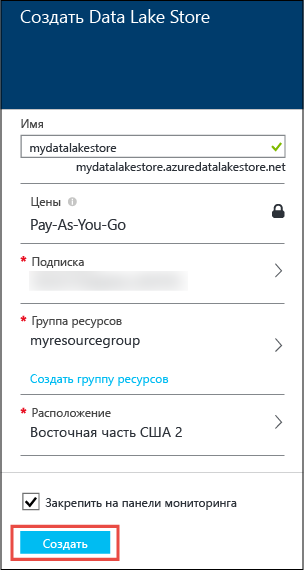
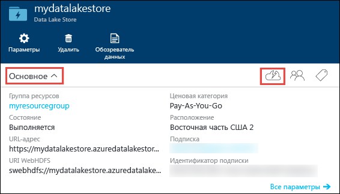
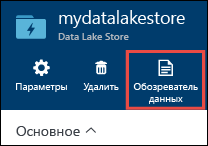
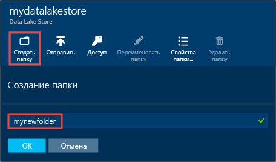
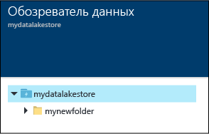
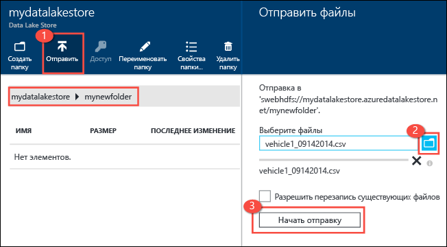
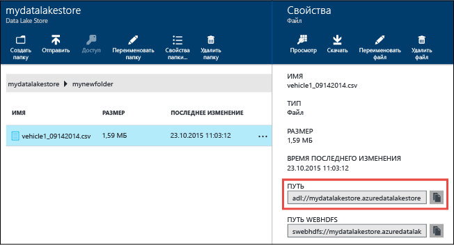
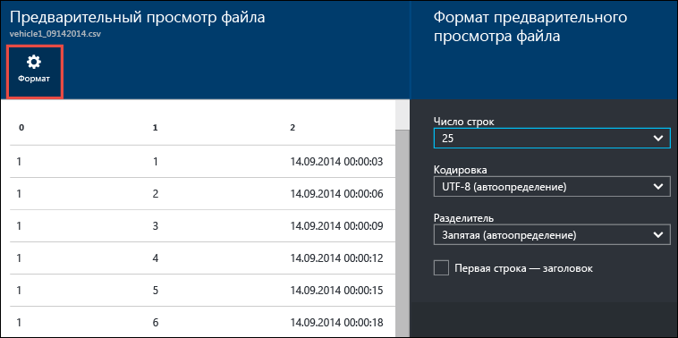
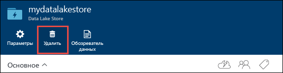

<properties 
   pageTitle="Начало работы с хранилищем озера данных | Azure" 
   description="Использование портала для создания учетной записи хранения озера данных и выполнение базовых операций в хранилище озера данных" 
   services="data-lake-store" 
   documentationCenter="" 
   authors="nitinme" 
   manager="jhubbard" 
   editor="cgronlun"/>
 
<tags
   ms.service="data-lake-store"
   ms.devlang="na"
   ms.topic="hero-article"
   ms.tgt_pltfrm="na"
   ms.workload="big-data" 
   ms.date="09/13/2016"
   ms.author="nitinme"/>

# Начало работы с хранилищем озера данных Azure с помощью портала Azure

> [AZURE.SELECTOR]
- [Портал](data-lake-store-get-started-portal.md)
- [PowerShell](data-lake-store-get-started-powershell.md)
- [Пакет SDK для .NET](data-lake-store-get-started-net-sdk.md)
- [Пакет SDK для Java](data-lake-store-get-started-java-sdk.md)
- [ИНТЕРФЕЙС REST API](data-lake-store-get-started-rest-api.md)
- [Интерфейс командной строки Azure](data-lake-store-get-started-cli.md)
- [Node.js](data-lake-store-manage-use-nodejs.md)

Узнайте, как с помощью портала Azure создать учетную запись хранения для озера данных Azure и выполнять базовые операции, такие как создание папок, передача и загрузка файлов данных, удаление учетной записи и т. д. Дополнительные сведения о хранилище озера данных см. в статье [Обзор хранилища озера данных Azure](data-lake-store-overview.md).

## Предварительные требования

Перед началом работы с этим учебником необходимо иметь следующее:

- **Подписка Azure.**. См. [Бесплатная пробная версия Azure](https://azure.microsoft.com/pricing/free-trial/).

## Учитесь быстрее с помощью видео?

Следующие видеоматериалы помогут вам быстро приступить к работе с хранилищем озера данных.

* [Создание учетной записи хранения озера данных](https://mix.office.com/watch/1k1cycy4l4gen)
* [Управление данными в хранилище озера данных с помощью обозревателя данных](https://mix.office.com/watch/icletrxrh6pc)

## Создание учетной записи хранения озера данных Azure

1. Перейдите на новый [портал Azure](https://portal.azure.com).

2. Щелкните **СОЗДАТЬ**, щелкните **Данные + хранилище**, а затем — **Хранилище озера данных Azure**. Ознакомьтесь со сведениями в колонке **Хранилище озера данных Azure** и щелкните **Создать** в левом нижнем углу колонки.

3. В колонке **Новое хранилище озера данных** задайте значения, как показано на снимке экрана ниже.

	

	- **Подписка**: выберите подписку, в которой нужно создать учетную запись Data Lake Store.
	- **Группа ресурсов**: выберите существующую группу ресурсов или щелкните **Создать группу ресурсов**, чтобы создать новую. Группа ресурсов представляет собой контейнер, содержащий связанные ресурсы для приложения. Дополнительные сведения см. в статье [Группы ресурсов в Azure](resource-group-overview.md#resource-groups).
	- **Расположение**: выберите расположение, в котором нужно создать учетную запись хранения озера данных.

4. Выберите **Закрепить на начальной панели**, если нужно, чтобы учетная запись хранения озера данных была доступна на начальной панели.

5. Щелкните **Создать**. Если вы закрепили учетную запись на начальной панели, вы вернетесь на начальную панель и сможете следить за ходом подготовки учетной записи хранения озера данных. После подготовки учетной хранения озера данных появится колонка учетной записи.

6. Разверните раскрывающийся список **Основные компоненты**, чтобы просмотреть сведения о вашей учетной записи хранения озера данных, такие как группа ресурсов, частью которой она является, расположение и т. д. Щелкните значок **Быстрый запуск**, чтобы просмотреть ссылки на другие ресурсы, связанные с хранилищем озера данных.

	

## Создание папок в учетной записи хранения озера данных Azure

Чтобы хранить данные и управлять ими, вы можете создать папки в своей учетной записи хранения озера данных.

1. Откройте только что созданную учетную запись хранения озера данных. В левой панели щелкните **Обзор**, щелкните **Хранилище озера данных** и затем в колонке «Хранилище озера данных» щелкните имя учетной записи, в которой нужно создать папки. Если учетная запись была закреплена на начальной панели, щелкните элемент этой учетной записи.

2. В колонке учетной записи «Хранилище озера данных» щелкните **Обозреватель данных**.

	

3. В колонке своей учетной записи «Хранилище озера данных» щелкните **Создать папку**, введите имя новой папки и нажмите кнопку **ОК**.
	
	
	
	Созданная папка появится в списке в колонке **Обозреватель данных**. Вы можете создавать вложенные папки любого уровня.

	

## Передача данных в учетную запись хранилища озера данных Azure

Данные можно передавать в учетную запись хранения озера данных Azure непосредственно на корневой уровень или в папку, созданную в учетной записи. На снимке экрана ниже выполните необходимые действия, чтобы передать файл во вложенную папку из колонки **Обозреватель данных**. На этом снимке экрана файл передается во вложенную папку, показанную в адресной строке (выделена красным прямоугольником).

Если у вас нет под рукой подходящих для этих целей данных, передайте папку **Ambulance Data** из [репозитория Git для озера данных Azure](https://github.com/MicrosoftBigData/usql/tree/master/Examples/Samples/Data/AmbulanceData).

## Свойства и действия, доступные на сохраненных данных

Щелкните добавленный файл, чтобы открыть колонку **Свойства**. В этой колонке показываются свойства, связанные с этим файлом, и действия, которые можно с ним выполнять. Также можно скопировать полный путь к файлу в вашей учетной записи хранения озера данных Azure, выделенный красным прямоугольником на снимке экрана ниже.

* Щелкните **Просмотр**, чтобы просмотреть файл непосредственно в браузере. Вы также можете указать формат просмотра. Щелкните **Просмотр**, в колонке **Просмотр файла** щелкните **Формат** и в колонке **Формат просмотра файла** укажите нужные параметры, такие как количество отображаемых строк, используемая кодировка, разделитель и т. д.

  

* Щелкните **Загрузить**, чтобы загрузить файл на компьютер.

* Щелкните **Переименовать файл**, чтобы переименовать файл.

* Щелкните **Удалить файл**, чтобы удалить файл.

## Защита данных

Защитить данные, хранящиеся в вашей учетной записи хранения озера данных Azure, можно с помощью Azure Active Directory и контроля доступа (ACL). Соответствующие инструкции см. в статье [Защита данных в хранилище озера данных Azure](data-lake-store-secure-data.md).

## Удаление учетной записи хранения озера данных Azure

Чтобы удалить учетную запись хранения озера данных Azure, в колонке хранилища озера данных щелкните **Удалить**. Чтобы подтвердить действие, вам будет предложено ввести имя учетной записи, которую вы хотите удалить. Введите имя учетной записи и нажмите кнопку **Удалить**.

## Дальнейшие действия

- [Защита данных в хранилище озера данных](data-lake-store-secure-data.md)
- [Использование аналитики озера данных Azure с хранилищем озера данных](../data-lake-analytics/data-lake-analytics-get-started-portal.md)
- [Использование Azure HDInsight с хранилищем озера данных](data-lake-store-hdinsight-hadoop-use-portal.md)
- [Доступ к журналам диагностики Azure Data Lake Store](data-lake-store-diagnostic-logs.md)

<!---HONumber=AcomDC_0914_2016--->