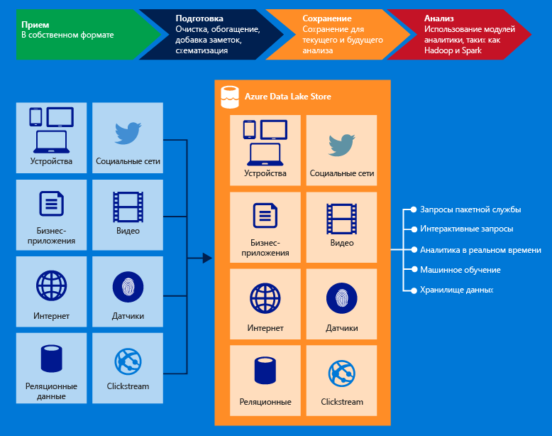

<properties
   pageTitle="Обзор хранилища озера данных Azure | Azure"
   description="Узнайте, что такое хранилище озера данных Azure и каковы его преимущества по сравнению с другими хранилищами данных."
   services="data-lake-store"
   documentationCenter=""
   authors="nitinme"
   manager="jhubbard"
   editor="cgronlun"/>

<tags
   ms.service="data-lake-store"
   ms.devlang="na"
   ms.topic="get-started-article"
   ms.tgt_pltfrm="na"
   ms.workload="big-data"
   ms.date="08/02/2016"
   ms.author="nitinme"/>

# Обзор хранилища озера данных Azure

Хранилище озера данных Azure — это крупномасштабный репозиторий корпоративного уровня для рабочих нагрузок анализа больших данных. Озеро данных Azure позволяет сохранять данные с любым размером, типом и скоростью приема в одном месте для эксплуатационной и исследовательской аналитики.

> [AZURE.TIP] Начните знакомство со службой хранилища озера данных Azure со [схемы обучения для хранилища озера данных](https://azure.microsoft.com/documentation/learning-paths/data-lake-store-self-guided-training/).

Хранилище озера данных Azure доступно из Hadoop (имеется в кластере HDInsight) с помощью API-интерфейсов REST, совместимых с WebHDFS. Оно специально разработано для анализа сохраненных данных и адаптировано к различным сценариям анализа данных. По умолчанию оно включает все возможности корпоративного уровня — безопасность, управляемость, масштабируемость, надежность и доступность — необходимые для реальных задач предприятия.

Ниже перечислены некоторые основные возможности озера данных Azure.

### Поддержка Hadoop

Хранилище озера данных Azure имеет файловую систему Apache Hadoop, которая совместима с распределенной файловой системой Hadoop и поддерживает экосистему Hadoop. Существующие приложения и службы HDInsight, использующие API-интерфейс WebHDFS, могут легко интегрироваться с хранилищем озера данных. Хранилище озера данных также предоставляет интерфейс REST, совместимый с WebHDFS, для приложений.

Данные, хранящиеся в хранилище озера данных, можно легко анализировать с помощью аналитических платформ Hadoop, таких как MapReduce или Hive. Для прямого доступа к данным, хранящимся в хранилище озера данных, можно подготовить и настроить кластеры Microsoft Azure HDInsight.

### Неограниченное пространство хранения, файлы петабайтного размера

Хранилище озера данных Azure предоставляет неограниченное пространство и подходит для хранения разнообразных данных для анализа. В нем нет никаких ограничений на размер учетной записи, размер файла или объем данных, которые могут храниться в озере данных. Отдельные файлы могут иметь размер от килобайта до петабайтов, благодаря чему хранилище подходит для хранения данных любого типа. Надежность хранения данных обеспечивается созданием нескольких копий, кроме того, нет никаких ограничений на продолжительность хранения данных в озере данных.

### Настройки производительности для анализа больших данных

Хранилище озера данных Azure предназначено для работы в крупномасштабных аналитических системах, где требуется высокая пропускная способность для запроса и анализа больших объемов данных. В озере данных фрагменты файлов распределяются по нескольким отдельным серверам хранилища. Это повышает пропускную способность при параллельном чтении файла для проведения анализа данных.

### Решение корпоративного класса: высокая доступность и безопасность

Хранилище озера данных Azure обладает доступностью и надежностью, соответствующими отраслевым стандартам. Надежность хранения данных обеспечивается созданием избыточных копий для защиты от любых непредвиденных сбоев. Предприятия могут использовать озеро данных Azure в своих решениях как важную часть своей существующей платформы данных.

Хранилище озера данных также обеспечивает безопасность корпоративного уровня для сохраненных данных. Дополнительные сведения см. в статье [Защита данных в хранилище озера данных Azure](#DataLakeStoreSecurity).

### Любые данные

Хранилище озера данных Azure может хранить любые данные в собственном формате, как есть, без необходимости предварительного преобразования. Хранилище озера данных не требует определять схему перед загрузкой данных. Интерпретацию данных и определение схемы осуществляет конкретная аналитическая платформа во время анализа. Возможность хранения файлов произвольных форматов и размера позволяет обрабатывать в хранилище озера данных структурированные, полуструктурированные и неструктурированные данные.

В озере данных Azure хранятся контейнеры для данных — папки и файлы. Операции с хранимыми данными осуществляются через пакеты SDK, портал Azure и Azure PowerShell. Используя эти интерфейсы и соответствующие контейнеры, вы можете сохранять любые типы данных. Хранилище озера данных обрабатывает сохраняемые данные без учета их типа.

## Защита данных в хранилище озера данных Azure

В хранилище озера данных Azure используются Azure Active Directory для проверки подлинности и списки контроля доступа (ACL) для управления доступом к данным.

| Функция | Описание |
|-----------------------------------------|------------------------------------------|
| Аутентификация | Хранилище озера данных Azure интегрируется с Azure Active Directory (AAD) для управления удостоверениями и доступом для всех данных, размещенных в хранилище озера данных Azure. В результате этой интеграции озеро данных Azure получает доступ ко всем функциям AAD, включая многофакторную проверку подлинности, условный доступ, контроль доступа на основе ролей, отслеживание использования приложений, мониторинг безопасности и предупреждения и т. д. Хранилище озера данных Azure поддерживает протокол OAuth 2.0 для проверки подлинности в интерфейсе REST. |
| управление доступом; | Хранилище озера данных Azure обеспечивает контроль доступа за счет поддержки разрешений POSIX, предоставляемых протоколом WebHDFS. В текущем выпуске можно включить списки управления доступом в корневой папке, вложенных папках, а также отдельных файлах. Списки управления доступом, примененные к корневой папке, также применяются ко всем дочерним папкам и файлам в этой папке.|

Ссылки на дополнительные сведения о защите данных в хранилище озера данных приведены ниже.

* Инструкции по защите данных в хранилище озера данных см. в статье [Защита данных в хранилище озера данных Azure](data-lake-store-secure-data.md).
* Предпочитаете видео? [В этом видео](https://mix.office.com/watch/1q2mgzh9nn5lx) показано, как защитить данные, хранящиеся в хранилище озера данных.

## Приложения, совместимые с хранилищем озера данных Azure

Хранилище озера данных Azure совместимо с большинством компонентов с открытым исходным кодом в экосистеме Hadoop. Также оно легко интегрируется с прочими службами Azure. Это делает хранилище озера данных идеальным вариантом для хранения данных. Перейдите по ссылкам ниже для получения дополнительных сведений об использовании хранилища озера данных как с компонентами с открытым исходным кодом, так и с другими службами Azure.

* Список приложений с открытым исходным кодом, совместимых с хранилищем озера данных Azure, см. в статье [Приложения больших данных с открытым исходным кодом, которые работают с хранилищем озера данных Azure](data-lake-store-compatible-oss-other-applications.md).
* См. статью [Интеграция с другими службами Azure](data-lake-store-integrate-with-other-services.md), чтобы узнать, как можно использовать хранилище озера данных с другими службами Azure для реализации более широкого диапазона сценариев.
* См. статью [Сценарии работы с данными с использованием хранилища озера данных](data-lake-store-data-scenarios.md), чтобы узнать, как использовать хранилище озера данных в таких сценариях, как прием, обработка, загрузка и визуализация данных.

## Что такое файловая система Azure Data Lake Store (adl://)?

Доступ к Data Lake Store может осуществляться через новую файловую систему AzureDataLakeFilesystem (adl://) в средах Hadoop (имеется в кластере HDInsight). Приложения и службы, использующие adl://, могут использовать дополнительные возможности оптимизации производительности, которые в настоящее время недоступны в WebHDFS. В результате хранилище озера данных предоставляет возможность либо воспользоваться максимальной производительностью с помощью adl:// (это рекомендуемый вариант), либо сохранить существующий код, продолжая использовать API-интерфейс WebHDFS напрямую. Azure HDInsight использует все возможности AzureDataLakeFilesystem для обеспечения максимальной производительности в хранилище озера данных.

Для доступа к данным в хранилище озера данных можно использовать `adl://<data_lake_store_name>.azuredatalakestore.net`. Дополнительные сведения о доступе к данным в хранилище озера данных см. в статье [Просмотр свойств хранимых данных](data-lake-store-get-started-portal.md#properties).

## Как начать использовать хранилище озера данных Azure

Описание подготовки к работе хранилища озера данных с помощью портала Azure см. в статье [Начало работы с хранилищем озера данных с помощью портала Azure](data-lake-store-get-started-portal.md). После подготовки озера данных Azure можно научиться использовать средства работы с большими данными, такие как аналитика озера данных Azure и Azure HDInsight, вместе с хранилищем озера данных. Вы также можете создать приложение .NET для создания учетной записи хранилища озера данных Azure и выполнения таких операций, как передача данных, загрузка данных и т. д.

- [Начало работы с аналитикой озера данных Azure](../data-lake-analytics/data-lake-analytics-get-started-portal.md)
- [Использование Azure HDInsight с хранилищем озера данных](data-lake-store-hdinsight-hadoop-use-portal.md)
- [Начало работы с хранилищем озера данных Azure с помощью пакета SDK .NET](data-lake-store-get-started-net-sdk.md)

## Видео о хранилище озера данных

Если вы предпочитаете обучаться по видео, вот ролики о различных возможностях хранилища озера данных.

* [Create an Azure Data Lake Store Account (Создание учетной записи хранения озера данных Azure)](https://mix.office.com/watch/1k1cycy4l4gen)
* [Use the Data Explorer to Manage Data in Azure Data Lake Store (Управление данными в хранилище озера данных Azure с помощью обозревателя данных)](https://mix.office.com/watch/icletrxrh6pc)
* [Connect Azure Data Lake Analytics to Azure Data Lake Store (Подключение Аналитики озера данных Azure с хранилищем озера данных)](https://mix.office.com/watch/qwji0dc9rx9k)
* [Access Azure Data Lake Store via Data Lake Analytics (Доступ к хранилищу озера данных Azure с помощью Аналитики озера данных)](https://mix.office.com/watch/1n0s45up381a8)
* [Connect Azure HDInsight to Azure Data Lake Store (Подключение Azure HDInsight к хранилищу озера данных Azure)](https://mix.office.com/watch/l93xri2yhtp2)
* [Access Azure Data Lake Store via Data Lake Analytics (Доступ к хранилищу озера данных Azure с помощью Hive и Pig)](https://mix.office.com/watch/1n9g5w0fiqv1q)
* [Use DistCp (Hadoop Distributed Copy) to copy data to and from Azure Data Lake Store (Использование средства DistCp (Hadoop Distributed Copy) для копирования данных из хранилища озера данных Azure и обратно)](https://mix.office.com/watch/1liuojvdx6sie)
* [Use Apache Sqoop to move data between relational sources and Azure Data Lake Store (Использование Apache Sqoop для перемещения данных между реляционными источниками и хранилищем озера данных Azure)](https://mix.office.com/watch/1butcdjxmu114)
* [Data Orchestration using Azure Data Factory for Azure Data Lake Store (Оркестрация данных с помощью фабрики данных Azure для хранилища озера данных Azure)](https://mix.office.com/watch/1oa7le7t2u4ka)
* [Securing Data in the Azure Data Lake Store (Защита данных в хранилище озера данных Azure)](https://mix.office.com/watch/1q2mgzh9nn5lx)

<!---HONumber=AcomDC_0914_2016--->