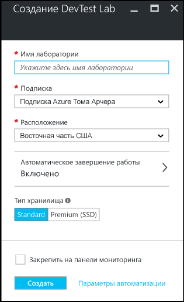

.<properties
	pageTitle="Создание лабораторий для разработки и тестирования | Microsoft Azure"
	description="Создание лаборатории для разработки и тестирования для виртуальных машин"
	services="devtest-lab,virtual-machines"
	documentationCenter="na"
	authors="tomarcher"
	manager="douge"
	editor=""/>

<tags
	ms.service="devtest-lab"
	ms.workload="na"
	ms.tgt_pltfrm="na"
	ms.devlang="na"
	ms.topic="get-started-article"
	ms.date="08/25/2016"
	ms.author="tarcher"/>

# Создание лаборатории в лаборатории для разработки и тестирования Azure

## Предварительные требования

Чтобы создать лабораторию, вам потребуются:

- Подписка Azure. Дополнительные сведения о вариантах приобретения Azure см. на странице [Как приобрести Azure](https://azure.microsoft.com/pricing/purchase-options/) или [Бесплатный ознакомительный период в один месяц](https://azure.microsoft.com/pricing/free-trial/). Для создания лаборатории необходимо быть владельцем подписки.
- Группа ресурсов Azure для лаборатории. См. статьи [Общие сведения о диспетчере ресурсов Azure](../resource-group-overview.md) и [Контроль доступа на основе ролей Azure Active Directory](../active-directory/role-based-access-control-configure.md).

## Создание лаборатории

1. Войдите на [портал Azure](http://go.microsoft.com/fwlink/p/?LinkID=525040).

1. Щелкните **Обзор**.

1. В списке выберите пункт **DevTest Labs**.

1. В колонке **DevTest Labs** нажмите кнопку **Добавить**.

    

1. В колонке **Создание лаборатории для разработки и тестирования** сделайте следующее:

    1. Введите **имя лаборатории**.
    1. Выберите **подписку**, которую необходимо связать с лабораторией.
    1. Выберите **расположение**, в котором будет храниться лаборатория.
    1. Нажмите кнопку **Создать**.

    

[AZURE.INCLUDE [devtest-lab-try-it-out](../../includes/devtest-lab-try-it-out.md)]

## Дальнейшие действия

Создав лабораторию, можно выполнить дальнейшие действия, приведенные ниже.

- [Безопасный доступ к лаборатории](devtest-lab-add-devtest-user.md).

- [Определение политик лаборатории](devtest-lab-set-lab-policy.md).

- [Создание шаблона лаборатории](devtest-lab-create-template.md).

- [Создание пользовательских артефактов для виртуальных машин](devtest-lab-artifact-author.md).

- [Добавление виртуальной машины с артефактами в лабораторию](devtest-lab-add-vm-with-artifacts.md).

<!---HONumber=AcomDC_0831_2016-->