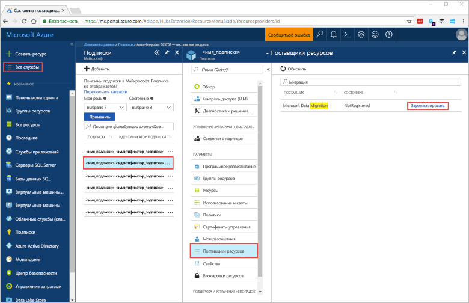
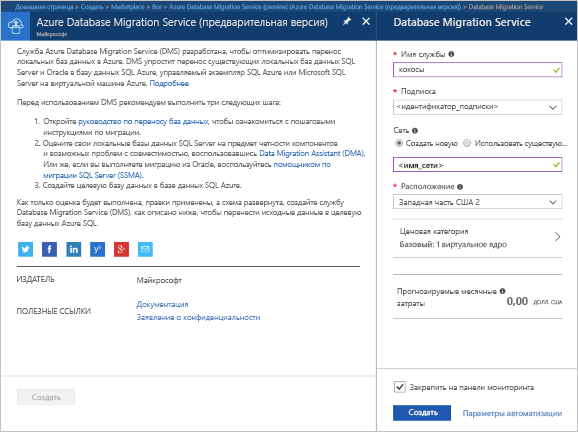
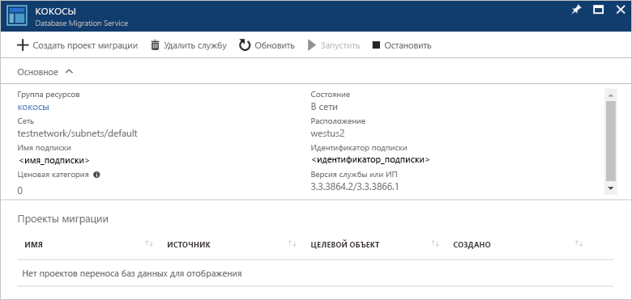

# Создание экземпляра службы Azure Database Migration Service с помощью портала Azure
В этом кратком руководстве вы создадите экземпляр службы Azure Database Migration Service с помощью портала Azure.  После создания службы вы сможете использовать ее для переноса данных с локального сервера SQL Server в базу данных SQL Azure.

Если у вас еще нет подписки Azure, создайте [бесплатную](https://azure.microsoft.com/free/) учетную запись Azure, прежде чем начинать работу.

## Войдите на портал Azure.
Откройте веб-браузер, перейдите к [порталу Microsoft Azure](https://portal.azure.com/) и введите учетные данные для входа на портал.

Панель мониторинга службы является представлением по умолчанию.

## Регистрация поставщика ресурсов
Прежде чем создать свой первый экземпляр Database Migration Service, зарегистрируйте поставщик ресурсов Microsoft.DataMigration.

1. На портале Azure щелкните **Все службы** и выберите **Подписки**.

2. Выберите подписку, в которой нужно создать экземпляр Azure Database Migration Service, а затем щелкните **Поставщики ресурсов**.

3. В поле поиска введите migration, а затем справа от Microsoft.DataMigration щелкните **Зарегистрировать**.

## Создание экземпляра службы
1. Щелкните **+ Create a resource** (+ Создать ресурс), чтобы создать экземпляр службы Azure Database Migration Service.

2. Выполните в Marketplace поиск по слову migration, выберите службу **Azure Database Migration Service**, а затем на экране **Azure Database Migration Service** (Azure Database Migration Service) нажмите кнопку **Create** (Create).

3. На экране **Database Migration Service** сделайте следующее. 

    - Выберите **имя службы**, которое хорошо запоминается и будет уникальным для идентификации экземпляра службы Azure Database Migration Service.
    - Выберите **подписку** Azure, в которой нужно создать экземпляр.
    - Создайте новую **сеть** с уникальным именем.
    - Выберите **расположение**, наиболее близкое к исходному или целевому серверу.
    - Дл параметра **Ценовая категория** выберите значение Basic: 1 vCore (Базовый: 1 виртуальное ядро).

    
4. Нажмите кнопку **Создать**.

Через несколько секунд экземпляр службы Azure Database Migration Service будет создан и готов к использованию. Экземпляр Database Migration Service отобразится, как показано на рисунке:

## Очистка ресурсов
Чтобы очистить ресурсы, созданные при работе с этим кратким руководством, удалите [группу ресурсов Azure](../azure-resource-manager/resource-group-overview.md).  Чтобы удалить группу ресурсов, перейдите к созданному экземпляру Azure Database Migration Service. Выберите имя **группы ресурсов** и щелкните **Удалить группу ресурсов**.  Это действие удаляет все ресурсы в группе ресурсов, а также саму группу.

## Дополнительная информация
> [!div class="nextstepaction"]
> [Миграция с SQL Server в базу данных SQL Azure](tutorial-sql-server-to-azure-sql.md)