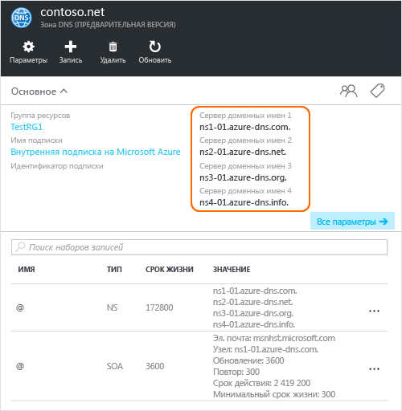

# <a name="delegate-a-domain-to-azure-dns"></a>Делегирование домена в Azure DNS

Azure DNS позволяет размещать зону DNS и управлять записями DNS для домена в Azure. Чтобы запросы DNS для домена достигали Azure DNS, домен должен быть делегирован в Azure DNS из родительского домена. Помните, что Azure DNS — это не регистратор доменных имен. В этой статье описывается делегирование домена в Azure DNS.

Для доменов, приобретенных у регистратора доменных имен, эти записи может настроить сам регистратор. Для создания зоны DNS с доменным именем в Azure DNS необязательно быть его владельцем. Однако вам необходимо быть владельцем домена, чтобы настроить делегирование в Azure DNS у регистратора доменных имен.

Предположим, например, что вы приобрели домен contoso.net и создали зону с именем contoso.net в Azure DNS. Регистратор предоставляет вам как владельцу домена возможность настройки адресов серверов имен (то есть записи NS) для домена. Регистратор будет хранить эти записи NS в родительском домене, в данном случае это .net. Клиенты по всему миру будут направляться в ваш домен в зоне Azure DNS при попытке разрешить записи DNS в contoso.net.

## <a name="create-a-dns-zone"></a>Создание зоны DNS

1. Выполните вход на портал Azure.
1. В главном меню щелкните **Создать > Сети**, а затем щелкните **Зона DNS**, чтобы открыть колонку "Создать зону DNS".

    

1. В колонке **Создание зоны DNS** введите следующие значения, а затем щелкните **Создать**.

   | **Параметр** | **Значение** | **Дополнительные сведения** |
   |---|---|---|
   |**Имя**|contoso.net|Имя зоны DNS.|
   |**Подписка**|[Ваша подписка]|Выберите подписку для создания шлюза приложений.|
   |**Группа ресурсов**|**Создать:** contosoRG|Создайте группу ресурсов. Имя группы ресурсов должно быть уникальным в пределах выбранной подписки. Дополнительные сведения о группах ресурсов см. в разделе [Группы ресурсов](../azure-resource-manager/resource-group-overview.md?toc=%2fazure%2fdns%2ftoc.json#resource-groups) статьи "Общие сведения об Azure Resource Manager".|
   |**Расположение**|Запад США||

> [!NOTE]
> Этот параметр относится к расположению группы ресурсов и никак не влияет на расположение зоны DNS. Расположение зоны DNS всегда является "глобальным" и не отображается.

## <a name="retrieve-name-servers"></a>Получение серверов имен

Прежде чем делегировать зоны DNS в службу DNS Azure, сначала необходимо знать имена серверов имен зоны. Когда создается зона, служба DNS Azure выделяет серверы имен из пула.

1. Создав зону DNS, на портале Azure в области **Избранное** щелкните **Все ресурсы**. Щелкните зону DNS **contoso.net** в колонке **Все ресурсы**. Если выбранная подписка имеет несколько ресурсов, в поле "Фильтровать по имени..." введите **contoso.net**, чтобы быстро получить доступ к необходимому шлюзу приложений. 

1. Получите серверы имен в колонке "Зона DNS". В этом примере зоне contoso.net назначены серверы доменных имен ns1-01.azure-dns.com, ns2-01.azure-dns.net, ns3-01.azure-dns.org и ns4-01.azure-dns.info.

 

Служба DNS Azure автоматически создает в вашей зоне заслуживающие доверия NS-записи, в которых указаны выделенные серверы имен.  Чтобы увидеть серверы имен через Azure PowerShell или интерфейс командной строки Azure, необходимо просто получить эти записи.

Ниже приведены примеры получения серверов имен для зоны в Azure DNS с помощью PowerShell и Azure CLI.

### <a name="powershell"></a>PowerShell

```powershell
# The record name "@" is used to refer to records at the top of the zone.
$zone = Get-AzureRmDnsZone -Name contoso.net -ResourceGroupName contosoRG
Get-AzureRmDnsRecordSet -Name "@" -RecordType NS -Zone $zone
```

Ниже приведен пример ответа.

```
Name              : @
ZoneName          : contoso.net
ResourceGroupName : contosorg
Ttl               : 172800
Etag              : 03bff8f1-9c60-4a9b-ad9d-ac97366ee4d5
RecordType        : NS
Records           : {ns1-07.azure-dns.com., ns2-07.azure-dns.net., ns3-07.azure-dns.org.,
                    ns4-07.azure-dns.info.}
Metadata          :
```

### <a name="azure-cli"></a>Инфраструктура CLI Azure

```azurecli
az network dns record-set show --resource-group contosoRG --zone-name contoso.net --type NS --name @
```

Ниже приведен пример ответа.

```json
{
  "etag": "03bff8f1-9c60-4a9b-ad9d-ac97366ee4d5",
  "id": "/subscriptions/00000000-0000-0000-0000-000000000000/resourceGroups/contosoRG/providers/Microsoft.Network/dnszones/contoso.net/NS/@",
  "metadata": null,
  "name": "@",
  "nsRecords": [
    {
      "nsdname": "ns1-07.azure-dns.com."
    },
    {
      "nsdname": "ns2-07.azure-dns.net."
    },
    {
      "nsdname": "ns3-07.azure-dns.org."
    },
    {
      "nsdname": "ns4-07.azure-dns.info."
    }
  ],
  "resourceGroup": "contosoRG",
  "ttl": 172800,
  "type": "Microsoft.Network/dnszones/NS"
}
```

## <a name="delegate-the-domain"></a>Делегирование домена

Теперь, когда зона DNS создана и у вас есть серверы имен, необходимо обновить родительский домен с серверами имен Azure DNS. У каждого регистратора есть собственные средства управления DNS для изменения записей серверов имен домена. На странице управления DNS регистратора замените записи NS на созданные службой Azure DNS.

При делегировании домена службе Azure DNS вам необходимо использовать имена серверов доменных имен, предоставленные службой Azure DNS. Рекомендуется всегда использовать все четыре имени серверов доменных имен независимо от имени домена. Для делегирования домена не требуется, чтобы в имени сервера доменных имен и вашем домене содержался один и тот же домен верхнего уровня.

Не используйте "связующие записи" для указания IP-адресов сервера доменных имен Azure DNS, поскольку эти IP-адреса в будущем могут измениться. Делегирование с использованием имен серверов доменных имен в собственной зоне (также известны как серверы личных имен) в настоящее время не поддерживается в Azure DNS.

## <a name="verify-name-resolution-is-working"></a>Проверка работы разрешения имен

По завершении делегирования можно проверить, работает ли разрешение имен. Это можно сделать с помощью такого средства, как nslookup, запросив запись типа SOA для своей зоны (также автоматически создается при создании зоны).

Вам не требуется указывать серверы имен Azure DNS, так как стандартный процесс разрешения DNS находит их автоматически, если делегирование настроено правильно.

```
nslookup -type=SOA contoso.com
```

Ниже приведен пример ответа из предыдущей команды.

```
Server: ns1-04.azure-dns.com
Address: 208.76.47.4

contoso.com
primary name server = ns1-04.azure-dns.com
responsible mail addr = msnhst.microsoft.com
serial = 1
refresh = 900 (15 mins)
retry = 300 (5 mins)
expire = 604800 (7 days)
default TTL = 300 (5 mins)
```

## <a name="delegate-sub-domains-in-azure-dns"></a>Делегирование поддоменов в Azure DNS

Если нужно настроить отдельную дочернюю зону, можно делегировать поддомен в Azure DNS. Предположим, что после настройки и делегирования contoso.net в Azure DNS требуется настроить отдельную дочернюю зону partners.contoso.net.

1. Создайте в Azure DNS дочернюю зону partners.contoso.net.
2. Поищите заслуживающие доверия записи сервера имен в дочерней зоне, чтобы получить список серверов имен, в которых в Azure DNS размещена дочерняя зона.
3. Выполните делегирование дочерней зоны. Для этого настройте записи сервера имен в родительской зоне, указывающей на дочернюю.

### <a name="create-a-dns-zone"></a>Создание зоны DNS

1. Выполните вход на портал Azure.
1. В главном меню щелкните **Создать > Сети**, а затем щелкните **Зона DNS**, чтобы открыть колонку "Создать зону DNS".

    

1. В колонке **Создание зоны DNS** введите следующие значения, а затем щелкните **Создать**.

   | **Параметр** | **Значение** | **Дополнительные сведения** |
   |---|---|---|
   |**Имя**|partners.contoso.net|Имя зоны DNS.|
   |**Подписка**|[Ваша подписка]|Выберите подписку для создания шлюза приложений.|
   |**Группа ресурсов**|**Использовать существующий:** contosoRG|Создайте группу ресурсов. Имя группы ресурсов должно быть уникальным в пределах выбранной подписки. Дополнительные сведения о группах ресурсов см. в разделе [Группы ресурсов](../azure-resource-manager/resource-group-overview.md?toc=%2fazure%2fdns%2ftoc.json#resource-groups) статьи "Общие сведения об Azure Resource Manager".|
   |**Расположение**|Запад США||

> [!NOTE]
> Этот параметр относится к расположению группы ресурсов и никак не влияет на расположение зоны DNS. Расположение зоны DNS всегда является "глобальным" и не отображается.

### <a name="retrieve-name-servers"></a>Получение серверов имен

1. Создав зону DNS, на портале Azure в области **Избранное** щелкните **Все ресурсы**. Щелкните зону DNS **partners.contoso.net** в колонке **Все ресурсы**. Если выбранная подписка имеет несколько ресурсов, в поле "Фильтровать по имени..." введите **partners.contoso.net**, чтобы быстро получить доступ к необходимой зоне DNS.

1. Получите серверы имен в колонке "Зона DNS". В этом примере зоне contoso.net назначены серверы доменных имен ns1-01.azure-dns.com, ns2-01.azure-dns.net, ns3-01.azure-dns.org и ns4-01.azure-dns.info.

 

Служба DNS Azure автоматически создает в вашей зоне заслуживающие доверия NS-записи, в которых указаны выделенные серверы имен.  Чтобы увидеть серверы имен через Azure PowerShell или интерфейс командной строки Azure, необходимо просто получить эти записи.

### <a name="create-name-server-record-in-parent-zone"></a>Создание записи сервера имен в родительской зоне

1. На портале Azure перейдите к зоне DNS **contoso.net**.
1. Щелкните **+ Record set** (+ Набор записей).
1. В колонке **Добавление набора записей** введите приведенные ниже значения и нажмите кнопку **ОК**.

   | **Параметр** | **Значение** | **Дополнительные сведения** |
   |---|---|---|
   |**Имя**|partners|Имя дочерней зоны DNS.|
   |**Тип**|NS|Используйте NS для записей серверов имен.|
   |**Срок жизни**|1|Срок жизни.|
   |**Единица срока жизни**|Часы|Указывает срок жизни в часах.|
   |**Сервер доменных имен**|{серверы доменных имен из зоны partners.contoso.net}|Введите все 4 сервера доменных имен из зоны partners.contoso.net. |

   


### <a name="delegating-sub-domains-in-azure-dns-with-other-tools"></a>Делегирование поддоменов в Azure DNS с помощью других средств

Ниже приведены примеры делегирования поддоменов в Azure DNS с помощью PowerShell и CLI:

#### <a name="powershell"></a>PowerShell

Этот процесс продемонстрирован в приведенном ниже примере PowerShell. Эти же действия можно выполнить с помощью портала Azure или кроссплатформенного интерфейса командной строки Azure.

```powershell
# Create the parent and child zones. These can be in same resource group or different resource groups as Azure DNS is a global service.
$parent = New-AzureRmDnsZone -Name contoso.net -ResourceGroupName contosoRG
$child = New-AzureRmDnsZone -Name partners.contoso.net -ResourceGroupName contosoRG

# Retrieve the authoritative NS records from the child zone as shown in the next example. This contains the name servers assigned to the child zone.
$child_ns_recordset = Get-AzureRmDnsRecordSet -Zone $child -Name "@" -RecordType NS

# Create the corresponding NS record set in the parent zone to complete the delegation. The record set name in the parent zone matches the child zone name, in this case "partners".
$parent_ns_recordset = New-AzureRmDnsRecordSet -Zone $parent -Name "partners" -RecordType NS -Ttl 3600
$parent_ns_recordset.Records = $child_ns_recordset.Records
Set-AzureRmDnsRecordSet -RecordSet $parent_ns_recordset
```

Используйте `nslookup`, чтобы убедиться в правильности настройки зоны, просмотрев запись типа SOA дочерней зоны.

```
nslookup -type=SOA partners.contoso.com
```

```
Server: ns1-08.azure-dns.com
Address: 208.76.47.8

partners.contoso.com
    primary name server = ns1-08.azure-dns.com
    responsible mail addr = msnhst.microsoft.com
    serial = 1
    refresh = 900 (15 mins)
    retry = 300 (5 mins)
    expire = 604800 (7 days)
    default TTL = 300 (5 mins)
```

#### <a name="azure-cli"></a>Инфраструктура CLI Azure

```azurecli
#!/bin/bash

# Create the parent and child zones. These can be in same resource group or different resource groups as Azure DNS is a global service.
az network dns zone create -g contosoRG -n contoso.net
az network dns zone create -g contosoRG -n partners.contoso.net
```

Получите серверы доменных имен для зоны `partners.contoso.net` из выходных данных.

```
{
  "etag": "00000003-0000-0000-418f-250de2b2d201",
  "id": "/subscriptions/00000000-0000-0000-0000-000000000000/resourceGroups/contosorg/providers/Microsoft.Network/dnszones/partners.contoso.net",
  "location": "global",
  "maxNumberOfRecordSets": 5000,
  "name": "partners.contoso.net",
  "nameServers": [
    "ns1-09.azure-dns.com.",
    "ns2-09.azure-dns.net.",
    "ns3-09.azure-dns.org.",
    "ns4-09.azure-dns.info."
  ],
  "numberOfRecordSets": 2,
  "resourceGroup": "contosorg",
  "tags": {},
  "type": "Microsoft.Network/dnszones"
}
```

Создайте набор записей и записи NS для каждого сервера доменных имен.

```azurecli
#!/bin/bash

# Create the record set
az network dns record-set ns create --resource-group contosorg --zone-name contoso.net --name partners

# Create a ns record for each name server.
az network dns record-set ns add-record --resource-group contosorg --zone-name contoso.net --record-set-name partners --nsdname ns1-09.azure-dns.com.
az network dns record-set ns add-record --resource-group contosorg --zone-name contoso.net --record-set-name partners --nsdname ns2-09.azure-dns.net.
az network dns record-set ns add-record --resource-group contosorg --zone-name contoso.net --record-set-name partners --nsdname ns3-09.azure-dns.org.
az network dns record-set ns add-record --resource-group contosorg --zone-name contoso.net --record-set-name partners --nsdname ns4-09.azure-dns.info.
```

## <a name="delete-all-resources"></a>Удаление всех ресурсов

Чтобы удалить все ресурсы, созданные в этой статье, выполните следующие действия:

1. На портале Azure в области **Избранное** щелкните **Все ресурсы**. Щелкните группу ресурсов **contosorg** в колонке "Все ресурсы". Если выбранная подписка имеет несколько ресурсов, в поле **Фильтровать по имени...** введите **contosorg**, чтобы быстро получить доступ к необходимой группе ресурсов.
1. В колонке **contosorg** нажмите кнопку **Удалить**.
1. На портале появится запрос на ввод имени группы ресурсов для подтверждения удаления. Введите *contosorg* для имени группы ресурсов, а затем щелкните **Удалить**. При удалении группы ресурсов удаляются все расположенные в ней ресурсы. Поэтому перед удалением группы ресурсов всегда проверяйте ее содержимое. Сначала портал удаляет все ресурсы, содержащиеся в группе ресурсов, а затем удаляет и саму группу. Этот процесс занимает несколько минут.

## <a name="next-steps"></a>Дальнейшие действия

[Управление зонами DNS](dns-operations-dnszones.md)

[Управление зонами DNS](dns-operations-recordsets.md)

