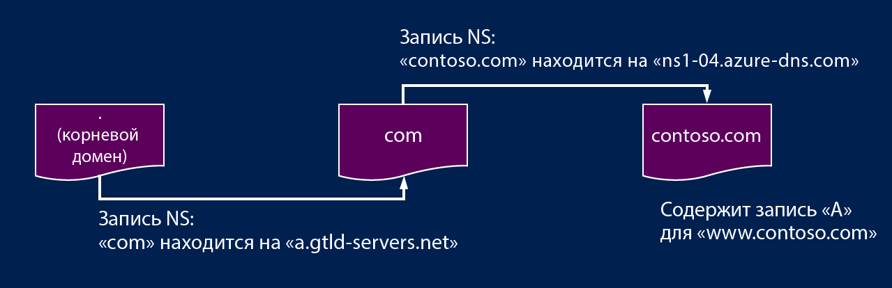

# Делегирование зон DNS с помощью Azure DNS

Azure DNS позволяет размещать зону DNS и управлять записями DNS для домена в Azure. Чтобы запросы DNS для домена достигали Azure DNS, домен должен быть делегирован в Azure DNS из родительского домена. Помните, что Azure DNS — это не регистратор доменных имен. В этой статье объясняется принцип работы делегирования домена и показано, как делегировать домены в Azure DNS.

## Принципы делегирования DNS

### Домены и зоны

Система доменных имен — это иерархия доменов. Иерархия начинается с корневого домена с именем '**.**'.  Ниже находятся домены верхнего уровня, такие как com, net, org, uk и jp.  Под этими доменами верхнего уровня расположены домены второго уровня, например org.uk и co.jp.  И т. д. Домены в иерархии DNS размещаются с помощью отдельных зон DNS. Эти зоны глобально распределены на DNS-серверах по всему миру.

**Зона DNS.** Домен — это уникальное имя в службе доменных имен, например contoso.com. Зона DNS используется для размещения DNS-записей определенного домена. Например, домен contoso.com может содержать несколько записей DNS, включая mail.contoso.com (для почтового сервера) и www.contoso.com (для веб-сайта).

**Регистратор доменных имен.** Регистратор доменных имен — это организация, которая может предоставлять доменные имена в Интернете. Она проверяет, доступен ли интернет-домен, который вы хотите использовать, и позволяет приобрести его. После регистрации имени домена вы станете законным владельцем доменного имени. Если у вас уже есть интернет-домен, вы будете использовать текущего регистратора доменных имен для делегирования в Azure DNS.

Подробные сведения об определении владельца доменного имени и о том, как приобрести домен, см. в статье [Добавление имени личного домена в Azure Active Directory](https://msdn.microsoft.com/library/azure/hh969248.aspx).

### Разрешение и делегирование

Существует два следующих типа DNS-серверов.

* *Полномочный* DNS-сервер содержит зоны DNS. Он отвечает на запросы DNS для записей только в этих зонах.
* *Рекурсивный* DNS-сервер не содержит зоны DNS. Он отвечает на все запросы DNS, вызывая полномочные DNS-серверы для сбора необходимых данных.

Служба DNS Azure дает возможность пользоваться полномочной службой DNS,  а не рекурсивной. Облачные службы и виртуальные машины в Azure по умолчанию используют рекурсивные службы DNS, которые предоставляются отдельно в качестве части инфраструктуры Azure. Сведения о том, как изменить эти параметры DNS, см. в разделе [Разрешение имен с помощью собственного DNS-сервера](../virtual-network/virtual-networks-name-resolution-for-vms-and-role-instances.md#name-resolution-that-uses-your-own-dns-server).

DNS-клиенты на ПК или мобильных устройствах обычно вызывают рекурсивный DNS-сервер для выполнения любых запросов DNS, необходимых клиентским приложениям.

Когда рекурсивный DNS-сервер получает запрос на запись DNS, такую как www.contoso.com, сначала ему необходимо найти сервер доменных имен, на котором находится зона для домена contoso.com. Для этого он начинает поиск с корневых серверов доменных имен и находит серверы, на которых размещена зона com. Затем он запрашивает серверы доменных имен com, чтобы найти серверы с зоной contoso.com.  Наконец, он может запросить у этих серверов доменных имен www.contoso.com.

Это называется разрешением DNS-имени. Строго говоря, разрешение DNS-имен предполагает дополнительные шаги, такие как отслеживание записей CNAME, но это неважно для понимания того, как работает делегирование DNS.

Как указываются серверы доменных имен для дочерней зоны в родительской зоне? Для этого используются записи DNS специального типа, называемые записями NS (NS значит "сервер имен"). Например, корневая зона содержит записи NS для com и предоставляет сервера доменных имен для зоны com. Зона com, в свою очередь, содержит записи NS для contoso.com, предоставляя серверы доменных имен для зоны contoso.com. Настройку записей NS для дочерней зоны в родительской зоне называется делегирование домена.

Пример DNS-запроса приведен на следующем рисунке. Contoso.net и partners.contoso.net — это зоны Azure DNS.

1. Клиент запрашивает `www.partners.contoso.net` из локального DNS-сервера.
1. Локальный DNS-сервер не содержит запись, поэтому он отправляет запрос на корневой сервер доменных имен.
1. Корневой сервер доменных имен также не содержит запись, но ему известен адрес сервера доменных имен `.net`. Он предоставляет этот адрес DNS-серверу.
1. DNS отправляет запрос на сервер доменных имен `.net`. Он не содержит запись, но знает адрес сервера доменных имен contoso.net. В данном случае это зона DNS, размещенная в Azure DNS.
1. В зоне `contoso.net` отсутствует запись, но ей известен сервер доменных имен `partners.contoso.net`, которому она отправляет ответ. В данном случае это зона DNS, размещенная в Azure DNS.
1. DNS-сервер запрашивает IP-адрес `partners.contoso.net` из зоны `partners.contoso.net`. Он содержит запись A и отправляет ответ в виде IP-адреса.
1. DNS-сервер предоставляет IP-адрес клиенту.
1. Клиент подключается к веб-сайту `www.partners.contoso.net`.

У каждого делегирования на самом деле две копии записи NS: одна в родительской зоне, указывающая на дочернюю зону, а другая в самой дочерней зоне. Зона contoso.net содержит записи NS для contoso.net (в дополнение к записям NS в зоне net). Они называются полномочными записями NS и располагаются на вершине дочерней зоны.

## Дополнительная информация

Узнайте, как [делегировать свой домен в Azure DNS](dns-delegate-domain-azure-dns.md).

