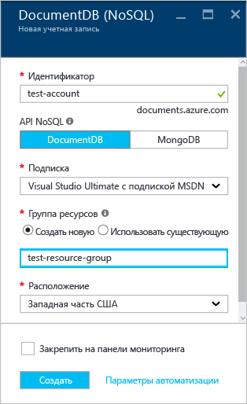
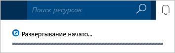
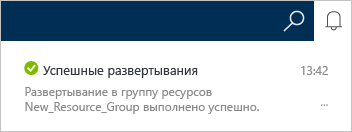

# Как создать учетную запись DocumentDB в базе данных NoSQL с помощью портала Azure
> [!div class="op_single_selector"]
> * [Портал Azure](documentdb-create-account.md)
> * [Azure CLI 1.0](documentdb-automation-resource-manager-cli-nodejs.md)
> * [Azure CLI 2.0](documentdb-automation-resource-manager-cli.md)
> * [Azure PowerShell](documentdb-manage-account-with-powershell.md)

Чтобы создать базу данных в Microsoft Azure DocumentDB, вам потребуются:

* Учетная запись Azure. Если у вас ее нет, ее можно [создать бесплатно](https://azure.microsoft.com/free) .
* Учетная запись DocumentDB.  

Учетную запись DocumentDB можно создать с помощью портала Azure, шаблонов Azure Resource Manager или интерфейса командной строки Azure (Azure CLI). Из этой статьи вы узнаете, как создать учетную запись DocumentDB с помощью портала Azure. Сведения о том, как создать учетную запись с помощью Azure Resource Manager или интерфейса командной строки Azure, см. в статье [Автоматизация создания учетной записи DocumentDB с помощью шаблонов диспетчера ресурсов Azure и интерфейса командной строки Azure](documentdb-automation-resource-manager-cli.md).

Не знакомы с DocumentDB? Просмотрите это четырехминутное [видео](https://azure.microsoft.com/documentation/videos/create-documentdb-on-azure/) , в котором Скотт Хансельман (Scott Hanselman) рассказывает, как выполнять наиболее распространенные задачи на веб-портале.

1. Войдите на [портал Azure](https://portal.azure.com/).
2. На левой навигационной панели щелкните **Создать**, выберите **Базы данных**, а затем щелкните **NoSQL (DocumentDB)**.

     
3. В колонке **Создание учетной записи** укажите желаемую конфигурацию учетной записи DocumentDB.

    

   * В поле **Идентификатор** введите имя для идентификации учетной записи DocumentDB.  После успешной проверки **идентификатора** в поле **Идентификатор** отображается зеленая галочка. Значение **идентификатора** становится именем узла в универсальном коде ресурса (URI). В **идентификаторе** могут использоваться только строчные буквы, цифры и знак "-". Его длина должна быть от 3 до 50 знаков. Обратите внимание, что к выбранному имени конечной точки добавляется *documents.azure.com*. Итоговое полное имя будет использоваться в качестве имени конечной точки вашей учетной записи DocumentDB.
   * В разделе **API NoSQL** выберите нужную модель программирования.

     * **DocumentDB**. Этот API доступен в пакетах [SDK](documentdb-sdk-dotnet.md) для .NET, Java, Node.js, Python, JavaScript, а также через HTTP [REST](https://msdn.microsoft.com/library/azure/dn781481.aspx). Этот API для DocumentDB предоставляет программный доступ ко всем функциональным возможностям DocumentDB.
     * **MongoDB**. В DocumentDB также предлагается поддержка интерфейсов API для **MongoDB** [на уровне протокола](documentdb-protocol-mongodb.md). Выбрав API для MongoDB, вы сможете организовать взаимодействие с DocumentDB с помощью существующих пакетов SDK и [средств](documentdb-mongodb-mongochef.md) для MongoDB. Вы сможете [переместить](documentdb-import-data.md) существующие приложения MongoDB в базу данных DocumentDB, [не внося изменения в код](documentdb-connect-mongodb-account.md). В этом случае вы получите полностью управляемую базу данных как службу, неограниченные возможности масштабирования, глобальную репликацию и другие преимущества.
   * В поле **Подписка**выберите подписку Azure, которую требуется использовать для учетной записи DocumentDB. Если ваша учетная запись включает только одну подписку, эта учетная запись будет выбрана по умолчанию.
   * В разделе **Группа ресурсов** выберите или создайте группу ресурсов для вашей учетной записи DocumentDB.  По умолчанию будет создана новая группа ресурсов. Дополнительные сведения см. в статье [Управление ресурсами Azure с помощью портала Azure](../azure-portal/resource-group-portal.md).
   * В поле **Расположение** укажите географическое расположение, где будет размещена учетная запись DocumentDB.
4. После настройки параметров DocumentDB нажмите кнопку **Создать**. Чтобы узнать о состоянии развертывания, просмотрите информацию в центре уведомлений.  

     

   
5. После создания учетной записи DocumentDB она готова для использования с параметрами по умолчанию. Согласованность учетной записи DocumentDB по умолчанию настроена на уровне **сеанса**.  Для настройки уровня согласованности по умолчанию выберите пункт **Согласованность по умолчанию** в меню ресурсов. Дополнительные сведения об уровнях согласованности в DocumentDB см. в статье [Уровни согласованности в DocumentDB](documentdb-consistency-levels.md).

     

     

[How to: Create a DocumentDB account]: #Howto
[Next steps]: #NextSteps

## Дальнейшие действия
Следующий шаг после создания учетной записи DocumentDB — создание коллекции и базы данных DocumentDB.

Коллекцию или базу данных можно создать одним из перечисленных ниже способов.

* С помощью портала Azure, как описано в статье [Создание коллекции DocumentDB на портале Azure](documentdb-create-collection.md).
* С помощью подробных руководств с примерами данных для [.NET](documentdb-get-started.md), [.NET MVC](documentdb-dotnet-application.md), [Java](documentdb-java-application.md), [Node.js](documentdb-nodejs-application.md) или [Python](documentdb-python-application.md).
* С помощью примера кода для [.NET](documentdb-dotnet-samples.md#database-examples), [Node.js](documentdb-nodejs-samples.md#database-examples) или [Python](documentdb-python-samples.md#database-examples) с сайта GitHub.
* С помощью пакетов SDK для [.NET](documentdb-sdk-dotnet.md), [.NET Core](documentdb-sdk-dotnet-core.md), [Node.js](documentdb-sdk-node.md), [Java](documentdb-sdk-java.md), [Python](documentdb-sdk-python.md) и [REST](https://msdn.microsoft.com/library/azure/mt489072.aspx).

Создав базу данных и коллекцию, нужно в коллекцию [добавить документы](documentdb-view-json-document-explorer.md).

Когда в коллекции появятся документы, к ним можно [отправлять запросы](documentdb-sql-query.md#ExecutingSqlQueries), созданные с помощью [DocumentDB SQL](documentdb-sql-query.md). Запросы можно отправлять через [обозреватель запросов](documentdb-query-collections-query-explorer.md) на портале, с помощью [REST API](https://msdn.microsoft.com/library/azure/dn781481.aspx) или одного из пакетов [SDK](documentdb-sdk-dotnet.md).

### Подробнее
Дополнительные сведения о DocumentDB можно получить из следующих ресурсов:

* [Схема обучения для DocumentDB.](https://azure.microsoft.com/documentation/learning-paths/documentdb/)
* [Иерархическая модель ресурсов и понятия DocumentDB.](documentdb-resources.md)

