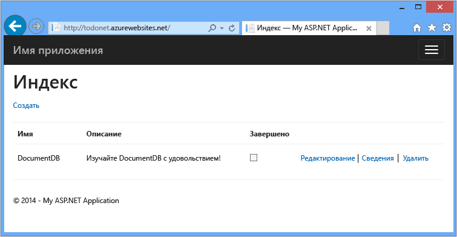
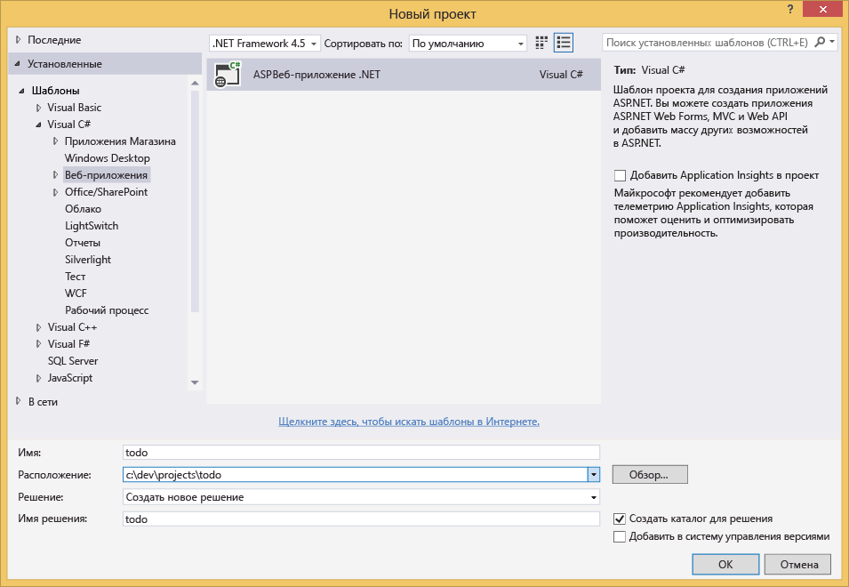
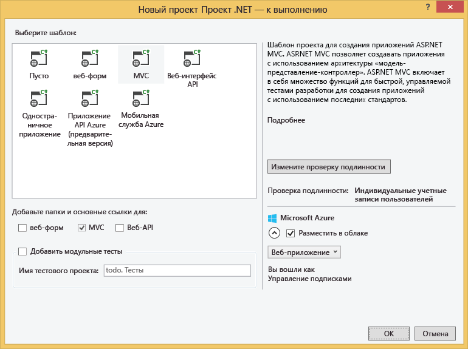

<properties 
	pageTitle="Создание веб-приложения ASP.NET MVC с использованием DocumentDB | Azure" 
	description="Узнайте, как использовать DocumentDB с .NET для создания веб-приложения «Список дел». Вы будете хранить данные в веб-приложении ASP.NET MVC, размещенном в Azure, в этом же приложении вы будет их использовать." 
	services="documentdb" 
	documentationCenter=".net" 
	authors="ryancrawcour" 
	manager="jhubbard" 
	editor="cgronlun"/>

<tags 
	ms.service="documentdb" 
	ms.workload="data-services" 
	ms.tgt_pltfrm="na" 
	ms.devlang="dotnet" 
	ms.topic="hero-article" 
	ms.date="04/29/2015" 
	ms.author="ryancraw"/>

#Создание веб-приложения ASP.NET MVC с использованием DocumentDB

Чтобы показать, как можно эффективно использовать Azure DocumentDB для хранения и запросов документов JSON, в этой статье приведена пошаговая инструкция от начала до конца для построения веб-приложения «список дел» с помощью Azure DocumentDB. Задачи будут храниться в виде документов JSON в Azure DocumentDB.

В этом пошаговом руководстве показан пример использования службы DocumentDB, предоставляемой Azure, для хранения и доступа к данным из веб-приложения ASP.NET MVC, размещенного на платформе Azure.

> [AZURE.TIP]Предполагается, что у вас есть опыт использования ASP.NET MVC и веб-сайтов Azure. Если вы никогда не работали с ASP.NET или [необходимыми инструментами](#_Toc395637760), рекомендуется загрузить полный учебный проект [список дел](https://github.com/Azure/azure-documentdb-net/tree/master/tutorials/todo) с портала [GitHub](https://github.com/Azure/azure-documentdb-net) и создать его, следуя [инструкциям в конце этой статьи](#GetProject). После создания ознакомьтесь со статьей, чтобы разобраться в коде этого проекта.

## Предварительные требования

Перед выполнением инструкций, приведенных в этой статье, следует убедиться, что установлены следующие компоненты:

- Активная учетная запись Azure. Если ее нет, можно создать бесплатную пробную учетную запись всего за несколько минут. Дополнительные сведения см. в разделе [Бесплатная пробная версия Azure](../../pricing/free-trial/).
- [Visual Studio 2013](http://www.visualstudio.com/) с обновлением 4 или выше.
- Пакет Azure SDK для .NET версии 2.5.1 или выше, доступный в [установщике веб-платформы Майкрософт][].

Все снимки экранов в этой статье сделаны с помощью Visual Studio 2013 с обновлением 4 и пакетом Azure SDK для .NET версии 2.5.1. Если ваша система сконфигурирована с различными версиями программ, то вполне вероятно, что ваши экраны и опции не будет соответствовать полностью, но если Вы выполните все вышеуказанные требования, то это решение должно работать.

## Шаг 1. Создание учетной записи базы данных DocumentDB

Начнем с создания учетной записи DocumentDB. Если у вас уже есть учетная запись, можно перейти к шагу [Создание нового приложения ASP.NET MVC](#_Toc395637762).

[AZURE.INCLUDE [documentdb-create-dbaccount](../../includes/documentdb-create-dbaccount.md)]

[AZURE.INCLUDE [documentdb-keys](../../includes/documentdb-keys.md)]

  Теперь рассмотрим создание нового приложения ASP.NET MVC с нуля.

## Шаг 2. Создание нового приложения ASP.NET MVC

Теперь, когда у вас есть учетная запись, создадим наш новый проект ASP.NET.

1. В меню Visual Studio **Файл** выберите **Создать**, затем щелкните **Проект**.

   	Откроется диалоговое окно **Новый проект**.
2. На панели **Типы проектов** разверните **Шаблоны**, **Visual C#**, **Интернет**, затем выберите **Веб-приложение ASP.NET**.

  

3. В поле **Имя** введите имя проекта. В этом учебнике используется имя todo. Если вы решили использовать другое имя, в ситуациях, когда будет идти речь о пространстве имен todo, вы должны будете откорректировать представленные образцы кода, используя имя своего приложения. 

4. Щелкните **Обзор**, чтобы перейти к папке, в которой вы хотите создать проект, и нажмите кнопку **ОК**.

  Откроется диалоговое окно **Новый проект ASP.NET**.

  

5. На панели «Шаблоны» выберите **MVC**.

6. Если вы планируете разместить свое приложение в Azure, установите флажок **Разместить в облаке** в правом нижнем углу. Мы выбрали размещение в облаке и запуск приложения, размещенного на веб-сайтах Azure. При выборе этой опции будет осуществлена предварительная подготовка веб-сайта Azure, что упростит развертывание готового рабочего приложения. Если вы не хотите заранее настраивать Azure или предпочитаете разместить приложение в другом месте, снимите флажок возле параметра **Разместить в облаке**.

7. Нажмите кнопку **OK**, и Visual Studio создаст пустой шаблон ASP.NET MVC.

8. Если вы выбрали размещение в облаке, вы увидите по крайней мере еще один экран, на котором будет предложено войти в учетную запись Azure и ввести некоторые значения для нового веб-сайта. Укажите дополнительные значения и продолжите.

  Я не выбрала «Сервер базы данных» в этом случае, так как здесь мы не используем сервер базы данных SQL Azure. Позже мы создадим новую учетную запись Azure DocumentDB на портале Microsoft Azure.

	Дополнительную информацию о выборе **Плана службы приложений** и **Группы ресурсов** см. в разделе [Подробный обзор планов службы приложений Azure](azure-web-sites-web-hosting-plans-in-depth-overview.md).

  

9. После того как Visual Studio закончит создание шаблонного приложения MVC, у вас будет пустое приложение ASP.NET, которое можно запустить локально.

	Мы не станем запускать этот проект локально, потому что я уверена, что мы все видели приложение ASP.NET «Hello World». Пойдем непосредственно к добавлению DocumentDB в этом проекте и созданию приложения.

## Шаг 3. Добавление DocumentDB в проект

Теперь, когда мы установили большую часть коммуникаций ASP.NET MVC, необходимых для этого решения, перейдем к основной цели этого учебника, т. е. к добавлению базы данных Azure DocumentDB в наше веб-приложение.

1. DocumentDB .NET SDK комплектуется и распространяется как пакет NuGet. Чтобы получить пакет NuGet в Visual Studio, используйте диспетчер пакетов NuGet в Visual Studio: щелкните правой кнопкой мыши проект в **Обозревателе решений** и выберите **Управление пакетами NuGet**.

  

    Появится диалоговое окно **Управление пакетами NuGet**.

2. В поле **Поиск в Интернете** введите ***Azure DocumentDB***. 
    
    В результатах поиска найдите **клиентскую библиотеку Microsoft Azure DocumentDB** и установите ее. При этом будет загружен и установлен пакет DocumentDB, а также все зависимости, такие как Newtonsoft.Json.

  

  Для установки пакета можно также воспользоваться консолью диспетчера пакетов. Для этого в меню **Средства** щелкните **Диспетчер пакетов NuGet**,затем выберите **Консоль диспетчера пакетов**. Когда появится запрос, введите следующую команду.

    	Install-Package Microsoft.Azure.DocumentDB

3. После установки пакета в решение Visual Studio будут добавлены две ссылки, Microsoft.Azure.Documents.Client и Newtonsoft.Json, и оно будет выглядеть следующим образом.

  

##Шаг 4. Настройка приложения ASP.NET MVC
 
Теперь добавим модели, представления и контроллеры в это приложение MVC.

- [Добавление модели](#_Toc395637764).
- [Добавление контроллера](#_Toc395637765).
- [Добавление представлений](#_Toc395637766).

### Добавление модели

Давайте начнем с буквы **M** из аббревиатуры MVC, с модели (Model).

1. В **Обозревателе решений** щелкните правой кнопкой мыши папку **Модели**, нажмите **Добавить**, затем щелкните **Класс**.

  Откроется диалоговое окно **Добавление нового элемента**.

2. Назовите новый класс **Item.cs** и нажмите кнопку **Добавить**. 

3. В этом новом файле **Item.cs** добавьте следующий код после последнего *оператора using*.
		
		using Newtonsoft.Json;
	
4. Теперь замените этот код
		
		public class Item
		{
		}

	следующим кодом:
		
        public class Item
        {
        	[JsonProperty(PropertyName="id")]
        	public string Id { get; set; }
		
        	[JsonProperty(PropertyName="name")]
        	public string Name { get; set; }
		
        	[JsonProperty(PropertyName = "desc")]
        	public string Description { get; set; }
		
       		[JsonProperty(PropertyName="isComplete")]
        	public bool Completed { get; set; }    
		}

	Все данные в DocumentDB передаются по сети и хранятся в формате JSON. Для управления сериализацией и десериализацией объектов с помощью JSON.NET можно использовать атрибут **JsonProperty**, как показано на примере только что созданного класса **Item**. Вам **не обязательно** это делать, но, присваивая имена свойствам, я придерживаюсь правил наименования camelCase JSON.
	
	Можно не только контролировать формат имени свойства при его поступлении в JSON, но и полностью переименовывать свойства .NET. Здесь, например, я переименовала свойство **Description**.
	

### Добавление контроллера

С буквой **M** (моделями) разобрались, теперь займемся **C**, т. е. классом контроллера (Controller).

1. В **Обозревателе решений** щелкните правой кнопкой мыши папку **Контроллеры**, нажмите **Добавить**, затем щелкните **Контроллер**.

    Откроется диалоговое окно**Добавление элемента формирования шаблонов**.

2. Выберите **Контроллер MVC 5 — Пустой** и нажмите кнопку **Добавить**.

	

3. Назовите новый контроллер **ItemController.**

	

	После создания файла решение Visual Studio с новым файлом ItemController.cs в **Обозревателе решений** должно выглядеть следующим образом. Новый файл Item.cs, созданный ранее, также отображается.

	

	Можно закрыть файл ItemController.cs, мы вернемся к нему позже.

### Добавление представлений

И наконец, займемся буквой **V** из аббревиатуры MVC, т. .е представлениями (Views).

- [Добавление представления «Индекс элементов»](#AddItemIndexView).
- [Добавление представления «Создание элементов»](#AddNewIndexView).
- [Добавление представления «Редактирование элементов»](#_Toc395888515).

#### Добавление представления «Индекс элементов»

1. В **Обозревателе решений** разверните папку **Представления**, щелкните правой кнопкой мыши пустую папку **Элемент**, созданную Visual Studio при добавлении **ItemController** ранее, нажмите **Добавить**, затем выберите **Представление**.

	

2. В диалоговом окне **Добавление представления** выполните следующие действия.
	- В поле **Имя представления** введите ***Index***.
	- В поле **Шаблон** выберите ***Список***.
	- В поле **Класс модели** выберите ***Элемент (todo.Models)***.
	- Оставьте пустым поле **Класс контекста данных**. 
	- В поле страницы макета введите ***~/Views/Shared/_Layout.cshtml***.
	
	

3. После установки этих значений нажмите **Добавить**, и Visual Studio создаст представление. После этого откроется созданный файл cshtml. Можно закрыть этот файл в Visual Studio, мы вернемся к нему позже.

#### Добавление представления «Создание элементов»

Точно также, как мы создали представление **Индекс элементов**, теперь мы создадим новое представление для создания новых **элементов**.

1. В **обозревателе решений** щелкните правой кнопкой мыши папку **Элемент**, нажмите **Добавить**, затем щелкните **Представление**.

2. В диалоговом окне **Добавление представления** выполните следующие действия.
    - В поле **Имя представления** введите ***Create***.
    - В поле **Шаблон** выберите ***Создание***.
    - В поле **Класс модели** выберите ***Элемент (todo.Models)***.
    - Оставьте пустым поле **Класс контекста данных**.
    - В поле страницы макета введите ***~/Views/Shared/_Layout.cshtml***.
    - Щелкните **Добавить**.

#### Добавление представления «Редактирование элементов»

И, наконец, добавим последнее представление для редактирования **элементов**, как мы делали это ранее.

1. В **обозревателе решений** щелкните правой кнопкой мыши папку **Элемент**, нажмите **Добавить**, затем щелкните **Представление**.

2. В диалоговом окне **Добавление представления** выполните следующие действия.
    - В поле **Имя представления** введите ***Edit***.
    - В поле **Шаблон** выберите ***Редактирование***.
    - В поле **Класс модели** выберите ***Элемент (todo.Models)***.
    - Оставьте пустым поле **Класс контекста данных**. 
    - В поле страницы макета введите ***~/Views/Shared/_Layout.cshtml***.
    - Щелкните **Добавить**.

Как только все будет готово, закройте документы cshtml в Visual Studio, мы вернемся к этим представлениям позже.

## Шаг 5. Подключение DocumentDB

Теперь, когда мы позаботились об основных ресурсах MVC, пришло время рассмотреть добавление кода для DocumentDB.

В этом разделе мы добавим код для обработки следующих команд

- [Вывод списка незавершенных элементов](#_Toc395637770).
- [Добавление элементов](#_Toc395637771).
- [Редактирование элементов](#_Toc395637772).

### Вывод списка незавершенных элементов

Прежде всего следует добавить класс, который содержит всю необходимую логику для подключения к базе данных DocumentDB и ее использования. В этом учебнике мы оформим всю эту логику в класс репозитория с именем DocumentDBRepository.

1. В **Обозревателе решений** щелкните правой кнопкой проект, нажмите **Добавить**, затем щелкните **Класс**. Назовите новый класс **DocumentDBRepository** и нажмите кнопку **Добавить**.
 
2. В конце только что созданного класса **DocumentDBRepository** добавьте следующие *операторы using* над декларацией *namespace*.
		
		using Microsoft.Azure.Documents; 
	    using Microsoft.Azure.Documents.Client; 
	    using Microsoft.Azure.Documents.Linq; 
		using System.Configuration;
		using System.Linq.Expressions;
		using System.Threading.Tasks;

	Теперь замените этот код

		public class DocumentDBRepository
		{
    	}

	следующим кодом:

    	
		public static class DocumentDBRepository<T>
    	{
			//Use the Database if it exists, if not create a new Database
	    	private static Database ReadOrCreateDatabase()
	    	{
	        	var db = Client.CreateDatabaseQuery()
	        	                .Where(d => d.Id == DatabaseId)
	        	                .AsEnumerable()
	        	                .FirstOrDefault();
				
	        	if (db == null)
	        	{
	        	    db = Client.CreateDatabaseAsync(new Database { Id = DatabaseId }).Result;
	        	}
				
	        	return db;
	    	}
			
			//Use the DocumentCollection if it exists, if not create a new Collection
	    	private static DocumentCollection ReadOrCreateCollection(string databaseLink)
	   		{
	    	    var col = Client.CreateDocumentCollectionQuery(databaseLink)
	        	                  .Where(c => c.Id == CollectionId)
	        	                  .AsEnumerable()
	        	                  .FirstOrDefault();
		
	        	if (col == null)
	        	{
					var collectionSpec = new DocumentCollection { Id = CollectionId };
					var requestOptions = new RequestOptions {OfferType = "S1" };
					
	        	    col = Client.CreateDocumentCollectionAsync(databaseLink, collectionSpec, requestOptions).Result;
	        	}
				
	        	return col;
	    	}
			
			//Expose the "database" value from configuration as a property for internal use
     	   	private static string databaseId;
     	   	private static String DatabaseId
     	   	{
				get
				{
					if (string.IsNullOrEmpty(databaseId))
					{
						databaseId = ConfigurationManager.AppSettings["database"];
					}
				
					return databaseId;
				}
       	 	}
			
			//Expose the "collection" value from configuration as a property for internal use
    	    private static string collectionId;
    	    private static String CollectionId
    	    {
				get
				{
					if (string.IsNullOrEmpty(collectionId))
					{
						collectionId = ConfigurationManager.AppSettings["collection"];
					}
				
					return collectionId;
				}
    	    }
			
			//Use the ReadOrCreateDatabase function to get a reference to the database.
    	    private static Database database;
    	    private static Database Database
    	    {
				get
				{
					if (database == null)
					{
						database = ReadOrCreateDatabase();
					}
					
					return database;
				}
    	    }
			
			//Use the ReadOrCreateCollection function to get a reference to the collection.
    	    private static DocumentCollection collection;
    	    private static DocumentCollection Collection
    	    {
				get
				{
					if (collection == null)
					{
						collection = ReadOrCreateCollection(Database.SelfLink);
					}
					
					return collection;
				}
    	    }
			
			//This property establishes a new connection to DocumentDB the first time it is used, 
			//and then reuses this instance for the duration of the application avoiding the
			//overhead of instantiating a new instance of DocumentClient with each request
    	    private static DocumentClient client;
    	    private static DocumentClient Client
    	    {
    	        get
    	        {
    	            if (client == null)
    	            {
						string endpoint = ConfigurationManager.AppSettings["endpoint"];
						string authKey = ConfigurationManager.AppSettings["authKey"];
						Uri endpointUri = new Uri(endpoint);
						client = new DocumentClient(endpointUri, authKey);
    	            }
    	            
    	            return client;
    	        }
    	    }
    	}

	> [AZURE.TIP]При создании новой коллекции DocumentCollection можно указать необязательный параметр OfferType RequestOptions, который позволяет указать уровень производительности новой коллекции. Если этот параметр не передан, будет использоваться тип предложения по умолчанию. Информацию об использовании типов предложения DocumentDB см. в статье [Уровни производительности DocumentDB](documentdb-performance-levels.md)

3. Некоторые значения будут считываться из конфигурации, поэтому нужно открыть файл **Web.config** и добавить следующие строки в разделе `<AppSettings>`.
	
    	<add key="endpoint" value="enter the URI from the Keys blade of the Azure portal"/>
    	<add key="authKey" value="enter the PRIMARY KEY, or the SECONDARY KEY, from the Keys blade of the Azure portal"/>
    	<add key="database" value="ToDoList"/>
    	<add key="collection" value="Items"/>
	
4. Теперь обновите значения для параметров *endpoint* и *authKey*, используя колонку «Ключи» на портале Azure. Используйте **URI** из колонки «Ключи» в качестве значения параметра endpoint. В качестве значения параметра authKey используйте значение **ПЕРВИЧНОГО КЛЮЧА** или **ВТОРИЧНОГО КЛЮЧА** из колонки «Ключи».

    Оно позволяет связываться с репозиторием DocumentDB. А теперь давайте добавим логику приложения.

5. Прежде всего нам нужно отобразить незавершенные элементы в приложении «список дел». Скопируйте и вставьте следующий фрагмент кода в любом месте в класса **DocumentDBRepository**.

	    public static IEnumerable<T> GetItems(Expression<Func<T, bool>> predicate) 
	    {
			return Client.CreateDocumentQuery<T>(Collection.DocumentsLink) 
				.Where(predicate) 
				.AsEnumerable(); 
		} 

6. Откройте **ItemController**, который мы добавили ранее, и добавьте следующие *операторы using* перед декларацией namespace.

		using System.Net;
		using System.Threading.Tasks;
		using todo.Models;

	Если проект не называется todo, необходимо выполнить обновление с помощью todo.Models в соответствии с именем проекта.

	Теперь замените этот код

		//GET: Item
		public ActionResult Index()
		{
			return View();
		}

	следующим кодом:

    	public ActionResult Index()
    	{
			var items = DocumentDBRepository<Item>.GetItems(d => !d.Completed);
			return View(items);
    	}
	
На данном этапе ваше решение должно компилироваться без каких-либо ошибок.

Чтобы запустить приложение сейчас, нужно перейти к **Главному контроллеру** и представлению **Индекс** в этом контроллере. Это поведение по умолчанию для шаблона проекта MVC мы выбрали вначале, но нам нужно кое-что другое! Давайте изменим маршрутизацию в данном приложении MVC, чтобы изменить это поведение.

Откройте файл ***App_Start\\RouteConfig.cs***, найдите строку, начинающуюся с defaults: и измените ее следующим образом:

    	defaults: new { controller = "Item", action = "Index", id = UrlParameter.Optional }

Теперь приложение ASP.NET MVC будет знать, что, если вы не указали значение в поле URL-адреса для управления поведением маршрутизации, вместо **Главный** нужно использовать **Элемент** в качестве контроллера, а пользовательский **индекс** — в качестве представления.

Теперь при запуске приложения оно будет вызывать **ItemController**, который вызывает класс репозитория и метод GetItems, чтобы вывести все незавершенные элементы в представлении **Представления****Элемент****Индекс**.

Если создать и запустить этот проект сейчас, отобразится примерно следующие данные.

### Добавление элементов

Добавим несколько элементов в нашу базу данных, чтобы не смотреть на пустую сетку.

Добавим код в репозиторий DocumentDBRepository и ItemController, чтобы сохранить запись в DocumentDB.

1.  Добавьте следующий метод в класс **DocumentDBRepository**.

    	public static async Task<Document> CreateItemAsync(T item)
   	 	{
   	   		return await Client.CreateDocumentAsync(Collection.SelfLink, item);
   		}

	Этот метод просто принимает любой объект, переданный ему, и сохраняет его в DocumentDB.

2. Откройте файл ItemController.cs и добавьте следующий фрагмент кода в класс. Теперь приложение ASP.NET MVC будет знать, что делать с действием **Создать**. В этом случае просто отобразите связанное представление Create.cshtml, созданное ранее.

    	public ActionResult Create()
    	{ 
			return View(); 
		}

	Теперь нам нужно добавить еще немного кода в этом контроллере, который будет принимать данные из **Создание**.

2. Добавьте следующий блок кода в класс ItemController.cs, который указывает приложению ASP.NET MVC, что нужно делать с формой POST для этого контроллера.
	
    	[HttpPost]
    	[ValidateAntiForgeryToken]
   	 	public async Task<ActionResult> Create([Bind(Include = 	"Id,Name,Description,Completed")] Item item)  
  	  	{
			if (ModelState.IsValid)  
			{  
			    await DocumentDBRepository<Item>.CreateItemAsync(item);
			    return RedirectToAction("Index");  
			}   
			return View(item);   
		}
	Этот код вызывает репозиторий DocumentDBRepository и использует метод CreateItemAsync для сохранения нового элемента списка дел в базе данных.
 
	**Примечание о безопасности.**: Атрибут **ValidateAntiForgeryToken** используется для защиты этого приложения от атак с подделкой запроса между сайтами. Кроме добавления этого атрибута представления также должны работать с данным маркером защиты от подделки запросов. Дополнительные сведения об этом и примеры правильной реализации данной технологии см. в разделе [Предотвращение атак с подделкой межсайтовых запросов][]. Исходный код, предоставленный на  [GitHub][] имеет полную реализацию.

	**Примечание о безопасности.**: Кроме того, мы используем атрибут **привязки** для параметра метода, чтобы обеспечить защиту от оверпостинга. Подробнее см. стать. [Основные операции CRUD в приложении ASP.NET MVC][].

На этом мы завершаем написание кода, необходимого для добавления новых элементов в нашу базу данных.

### Редактирование элементов

И последнее. Необходимо обеспечить возможность редактировать **Элементы** в базе данных и отмечать их как завершенные. Представление редактирования уже добавлено в проект, поэтому просто нужно еще раз добавить дополнительный код в контроллер и класс **DocumentDBRepository** 

1. Добавьте следующие методы в класс **DocumentDBRepository**.

    	public static T GetItem(Expression<Func<T, bool>> predicate)
    	{
        	return Client.CreateDocumentQuery<T>(Collection.DocumentsLink)
                    	.Where(predicate)
                    	.AsEnumerable()
                    	.FirstOrDefault();
    	}		

    	public static async Task<Document> UpdateItemAsync(string id, T item)
    	{
        	Document doc = GetDocument(id);	
        	return await Client.ReplaceDocumentAsync(doc.SelfLink, item);
    	}

		private static Document GetDocument(string id) 
		{ 
			return Client.CreateDocumentQuery(Collection.DocumentsLink) 
				.Where(d => d.Id == id) 
				.AsEnumerable() 
				.FirstOrDefault(); 
		} 
	
	Первый из этих двух методов, **GetItem**, извлекает элемент из DocumentDB, который передается обратно в **ItemController**, а затем — в представление **Редактирование**.
	
	Второй метод, который мы только что добавили, заменяет **Документ** в DocumentDB версией **Документа**, переданного из **ItemController**.

2. Добавьте следующие методы в класс **ItemController**.

    	[HttpPost]
   		[ValidateAntiForgeryToken]
    	public async Task<ActionResult> Edit([Bind(Include = "Id,Name,Description,Completed")] Item item)
    	{
     	   if (ModelState.IsValid)
    	    {
    	        await DocumentDBRepository<Item>.UpdateItemAsync(item.Id, item);
    	        return RedirectToAction("Index");
    	    }

  	      return View(item);
 	   	}
		
		public ActionResult Edit(string id)
		{
		    if (string.IsNullOrEmpty(id))
		    {
		        return new HttpStatusCodeResult(HttpStatusCode.BadRequest);
		    }
					 
		    Item item = (Item)DocumentDBRepository<Item>.GetItem(d => d.Id == id);
		 	
		    if (item == null)
		    {
		        return HttpNotFound();
		    }
		 	
		    return View(item);
		}
		
	
	Первый метод обрабатывает команду GET HTTP, которая формируется, когда пользователь щелкает ссылку "Изменить" в представлении индекса. Этот метод извлекает документ из DocumentDB и передает его в представление редактирования. [**Document**](http://msdn.microsoft.com/library/azure/microsoft.azure.documents.document.aspx).

	Затем представление **редактирования** передает команду POST HTTP в **IndexController**. 
	
	Второй метод, который мы добавили, обрабатывает передачу обновленного объекта для DocumentDB, чтобы сохранить его в базе данных.

Вот и все, что необходимо для запуска приложения, отображения списка незавершенных **Элементов**, добавления новых **Элементов** и редактирования **Элементов**.

## Шаг 6. Локальный запуск приложения

Для проверки приложения на локальном компьютере выполните следующие действия.

1. Чтобы создать приложение в режиме отладки, откройте Visual Studio и нажмите клавишу F5. После этого будет создано приложение и откроется окно браузера с пустой сеткой, которую мы уже видели:

	

	Если на этом этапе возникнет ошибка, сравните код с кодом в учебнике по созданию списка задач на портале [GitHub][].

2. Щелкните ссылку **Создать** введите значения в поля **Имя** и **Описание**. Не устанавливайте флажок **Завершено**, иначе новый **Элемент** будет добавлен ​​в завершенном состоянии и не будет отображаться в начальном списке.

	

3. Щелкните **Создать**, вы будете перенаправлены в представление **Индекс**, а в списке появится ваш **Элемент**.

	

	Вы можете добавить еще несколько **Элементов** в список задач.

3. Нажмите кнопку **Изменить** рядом с **Элементом**. Вы будете перенаправлены в представление **Редактирование**, где сможете изменить любое свойство объекта, в том числе флажок **Завершено**. Если установить флажок **Завершено** и нажать кнопку **Сохранить**, **Элемент** будет удален из списка незавершенных задач.

	

4. После проверки приложения нажмите клавиши CONTROL+F5, чтобы остановить отладку приложения. Теперь все готово к развертыванию.

##Шаг 7. Развертывание приложения на веб-сайтах Azure

Теперь, когда у вас есть готовое приложение, которое корректно работает в DocumentDB, мы собираемся развернуть его на веб-сайтах Azure. Если вы выбрали вариант **Разместить в облаке**, после создания пустого проекта ASP.NETMVC Visual Studio упростит процедуру и сделает большую часть работы за нас.

1. Чтобы опубликовать этот приложение, щелкните правой кнопкой мыши проект в **Обозревателе решений** и нажмите кнопку **Опубликовать**.

    

2. Все уже должно быть настроено в соответствии с вашими учетными данными. На самом деле сайт уже создан в Azure и находится по **Конечному URL-адресу**, вам просто нужно нажать кнопку **Опубликовать**.

    

Через несколько секунд Visual Studio завершит публикацию вашего веб-приложения и запустит браузер, где вы увидите свое творение, запущенное в Azure!

##Дальнейшие действия

Поздравляем! Вы только что создали свое первое приложение ASP.NET MVC с использованием Azure DocumentDB и опубликовали его на веб-сайтах Azure. Исходный код полного приложения, включая функциональность детализации и удаления, не описанные в этом учебнике, можно загрузить или клонировать с портала [GitHub][]. Поэтому, если вы хотите добавить эти функции в приложение, скопируйте код и добавьте его в это приложение.

Чтобы добавить дополнительные функции в приложение, ознакомьтесь с интерфейсами API, доступными в [библиотеке DocumentDB .NET](http://msdn.microsoft.com/library/azure/dn783362.aspx). Вы также можете быть соавтором библиотеки DocumentDB .NET на портале[GitHub][].

##Получение решения с портала GitHub

Если вы хотите сэкономить время и создать готовое решение списка дел, вместо того чтобы добавлять код самостоятельно, вам повезло. Готовое решение доступно на портале GitHub. Вы можете создать и развернуть его в течение нескольких минут, следуя приведенным ниже инструкциям.

1. Установите [необходимое программное обеспечение](#_Toc395637760), в том числе Visual Studio и пакет Azure SDK для .NET 2.3 или более поздней версии.

2. Клонируйте репозиторий azure-documentdb-net с помощью Git для Windows ([http://www.git-scm.com/](http://www.git-scm.com/)) или загрузите ZIP-файл с портала [GitHub](https://github.com/Azure/azure-documentdb-net/).

2. В Visual Studio откройте файл todo.sln в каталоге azure-documentdb-net/tutorials/todo.

3. Чтобы восстановить ссылки на пакет SDK DocumentDB .NET в Visual Studio 2013, щелкните правой кнопкой мыши решение todo в **Обозревателе решений**, а затем нажмите **Включить восстановление пакета NuGet**, который восстановит ссылки.

4. Получите значения **URI** и **ПЕРВИЧНЫЙ КЛЮЧ** или **ВТОРИЧНЫЙ КЛЮЧ** из колонки **Ключи** в своей учетной записи DocumentDB на [портале Azure](https://portal.azure.com/).

	
	Если у вас нет учетной записи, см. статью [Создание учетной записи базы данных](documentdb-create-account.md).

	

5. В файле Web.config обновите значения по умолчанию для значений **endpoint** и **authKey**.

    	<add key="endpoint" value="~enter URI for your DocumentDB Account, from Azure classic portal~" /> 
		<add key="authKey" value="~enter either Primary or Secondary key for your DocumentDB Account, from Azure classic portal~" /> 

	- Скопируйте значение **URI** из колонки «Ключи» и вставьте его в значение свойства **endpoint**. 
	- Скопируйте значение **ПЕРВИЧНЫЙ КЛЮЧ** или **ВТОРИЧНЫЙ КЛЮЧ** из колонки **Ключи** и вставьте его в значение свойства **authKey**.
	

7. Теперь можно [запустить приложение локально](#_Toc395637773) и [развернуть его на веб-сайтах Azure](#_Toc395637774).

[*]: https://microsoft.sharepoint.com/teams/DocDB/Shared%20Documents/Documentation/Docs.LatestVersions/PicExportError
[Visual Studio Express]: http://www.visualstudio.com/products/visual-studio-express-vs.aspx
[установщике веб-платформы Майкрософт]: http://www.microsoft.com/web/downloads/platform.aspx
[GitHub]: http://go.microsoft.com/fwlink/?LinkID=509838&clcid=0x409
[Предотвращение атак с подделкой межсайтовых запросов]: http://go.microsoft.com/fwlink/?LinkID=517254
[Основные операции CRUD в приложении ASP.NET MVC]: http://go.microsoft.com/fwlink/?LinkId=317598

<!--HONumber=52-->
 