<properties 
	pageTitle="Руководство по ASP.NET MVC для DocumentDB: разработка веб-приложения | Microsoft Azure" 
	description="Это руководство по ASP.NET MVC поможет вам создать веб-приложение MVC с использованием DocumentDB. С помощью этого руководства по ASP NET MVC вы сможете сохранить файл JSON и получить доступ к данным из приложения ";Список дел";, размещенного на веб-сайтах Azure." 
	keywords="руководство по asp.net mvc, разработка веб-приложений, веб-приложение mvc, пошаговое руководство asp net mvc"
	services="documentdb" 
	documentationCenter=".net" 
	authors="ryancrawcour" 
	manager="jhubbard" 
	editor="cgronlun"/>

<tags 
	ms.service="documentdb" 
	ms.workload="data-services" 
	ms.tgt_pltfrm="na" 
	ms.devlang="dotnet" 
	ms.topic="hero-article" 
	ms.date="03/30/2016" 
	ms.author="ryancraw"/>

#Руководство по ASP.NET MVC. Разработка веб-приложения с использованием DocumentDB

> [AZURE.SELECTOR]
- [.NET](documentdb-dotnet-application.md)
- [Node.js](documentdb-nodejs-application.md)
- [Java](documentdb-java-application.md)
- [Python](documentdb-python-application.md) 

Чтобы показать, как эффективно использовать Azure DocumentDB для хранения и запрашивания документов JSON, в этой статье приведена пошаговая инструкция по построению приложения "Список дел" с помощью Azure DocumentDB. Задачи будут храниться в виде документов JSON в Azure DocumentDB.

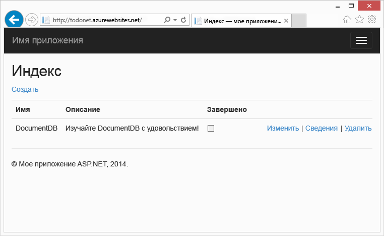

В этом пошаговом руководстве показан пример использования службы DocumentDB, предоставляемой Azure, для хранения и доступа к данным из веб-приложения ASP.NET MVC, размещенного на платформе Azure.

> [AZURE.TIP] Предполагается, что у вас есть опыт использования ASP.NET MVC и веб-сайтов Azure. Если вы никогда не работали с ASP.NET или [необходимыми инструментами](#_Toc395637760), рекомендуется загрузить полный пример проекта с портала [GitHub][] и следовать инструкциям в этом примере. После выполнения сборки вы можете просмотреть эту статью, чтобы разобраться в коде этого проекта.

## Предварительные требования для изучения этого учебника по базам данных

Перед выполнением инструкций, приведенных в этой статье, следует убедиться, что установлены следующие компоненты:

- Активная учетная запись Azure. Если ее нет, можно создать бесплатную пробную учетную запись всего за несколько минут. Дополнительные сведения см. в разделе [Бесплатная пробная версия Azure](https://azure.microsoft.com/pricing/free-trial/).
- [Visual Studio 2013](http://www.visualstudio.com/) с обновлением 4 или выше.
- Пакет Azure SDK для .NET версии 2.5.1 или выше, доступный в [установщике веб-платформы Майкрософт][].

Все снимки экранов в этой статье сделаны с помощью Visual Studio 2013 с обновлением 4 и пакетом Azure SDK для .NET версии 2.5.1. Если ваша система сконфигурирована с различными версиями программ, то вполне вероятно, что ваши экраны и опции не будет соответствовать полностью, но если Вы выполните все вышеуказанные требования, то это решение должно работать.

## Шаг 1. Создание учетной записи базы данных DocumentDB

Начнем с создания учетной записи DocumentDB. Если у вас уже есть учетная запись, можно перейти к шагу [Создание нового приложения ASP.NET MVC](#_Toc395637762).

[AZURE.INCLUDE [documentdb-create-dbaccount](../../includes/documentdb-create-dbaccount.md)]

[AZURE.INCLUDE [documentdb-keys](../../includes/documentdb-keys.md)]

  Теперь рассмотрим создание нового приложения ASP.NET MVC с нуля.

## Шаг 2. Создание нового приложения ASP.NET MVC

Теперь, когда у вас есть учетная запись, создадим наш новый проект ASP.NET.

1. В меню Visual Studio **Файл** выберите **Создать**, затем щелкните **Проект**.

   	Откроется диалоговое окно **Новый проект**.
2. На панели **Типы проектов** разверните **Шаблоны**, **Visual C#**, **Интернет**, затем выберите **Веб-приложение ASP.NET**.

  	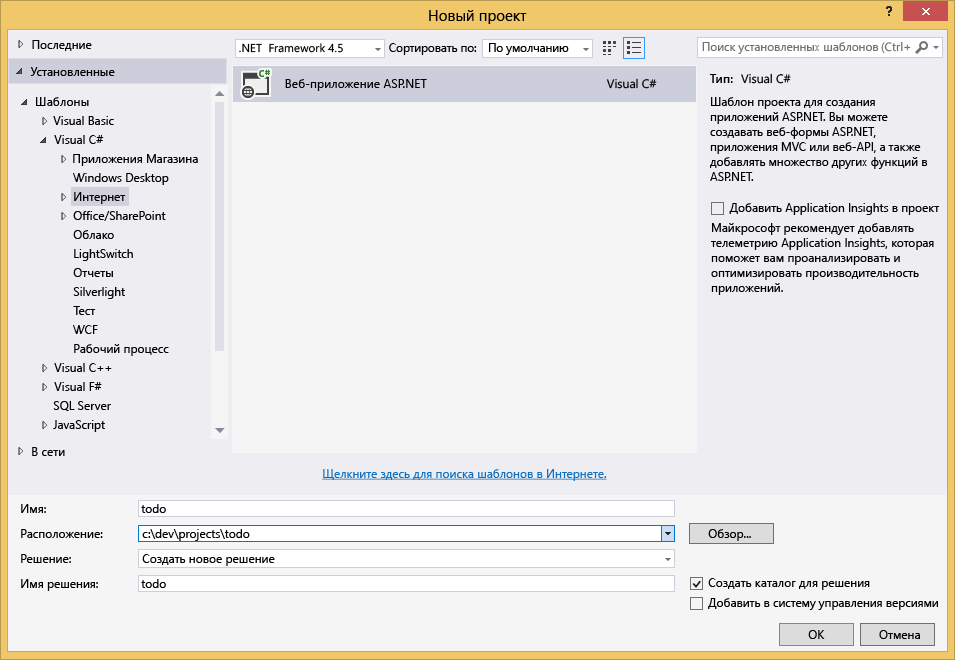

3. В поле **Имя** введите имя проекта. В этом учебнике используется имя todo. Если вы решили использовать другое имя, в ситуациях, когда будет идти речь о пространстве имен todo, вы должны будете откорректировать представленные образцы кода, используя имя своего приложения.

4. Щелкните **Обзор**, чтобы перейти к папке, в которой вы хотите создать проект, и нажмите кнопку **ОК**.

  	Откроется диалоговое окно **Новый проект ASP.NET**.

  	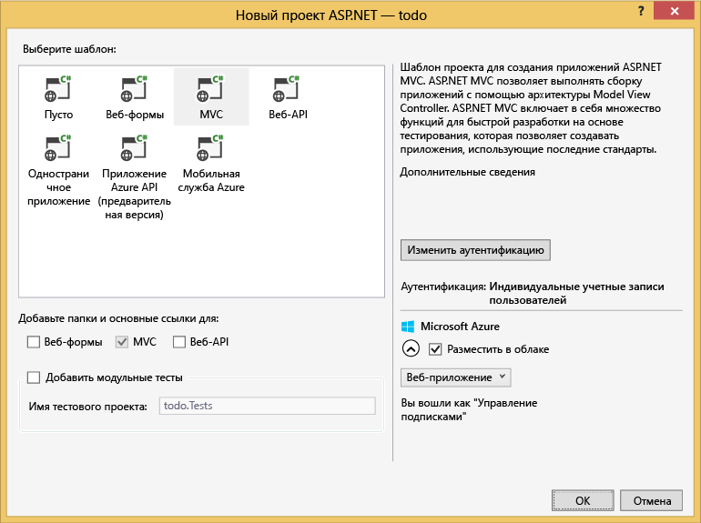

5. На панели «Шаблоны» выберите **MVC**.

6. Если вы планируете разместить свое приложение в Azure, установите флажок **Разместить в облаке** в правом нижнем углу. Мы выбрали размещение в облаке и запуск приложения, размещенного на веб-сайтах Azure. При выборе этой опции будет осуществлена предварительная подготовка веб-сайта Azure, что упростит развертывание готового рабочего приложения. Если вы не хотите заранее настраивать Azure или предпочитаете разместить приложение в другом месте, снимите флажок возле параметра **Разместить в облаке**.

7. Нажмите кнопку **OK**, и Visual Studio создаст пустой шаблон ASP.NET MVC.

8. Если вы выбрали размещение в облаке, вы увидите по крайней мере еще один экран, на котором будет предложено войти в учетную запись Azure и ввести некоторые значения для нового веб-сайта. Укажите все дополнительные значения и продолжите.

  	Мы не выбираем "Сервер базы данных", так как не будем использовать сервер базы данных SQL Azure, а собираемся позднее создать новую учетную запись Azure DocumentDB на портале Azure.

	Дополнительные сведения о выборе **плана службы приложений** и **группы ресурсов** см. в [подробном обзоре планов службы приложений Azure](../app-service/azure-web-sites-web-hosting-plans-in-depth-overview.md).

  	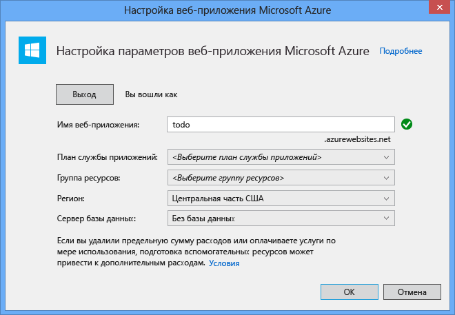

9. После того как Visual Studio закончит создание шаблонного приложения MVC, у вас будет пустое приложение ASP.NET, которое можно запустить локально.

	Мы не станем запускать этот проект локально, потому что я уверена, что мы все видели приложение ASP.NET "Hello World". Пойдем непосредственно к добавлению DocumentDB в этом проекте и созданию приложения.

## Шаг 3. Добавление DocumentDB в проект веб-приложения MVC

Теперь, когда мы установили большую часть коммуникаций ASP.NET MVC, необходимых для этого решения, перейдем к основной цели этого руководства, т. е. к добавлению базы данных Azure DocumentDB в наше веб-приложение MVC.

1. DocumentDB .NET SDK комплектуется и распространяется как пакет NuGet. Чтобы получить пакет NuGet в Visual Studio, используйте диспетчер пакетов NuGet в Visual Studio: щелкните правой кнопкой мыши проект в **Обозревателе решений** и выберите **Управление пакетами NuGet**.

  	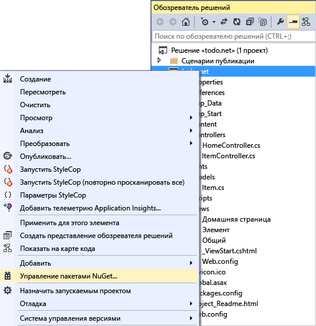

	Откроется диалоговое окно **Управление пакетами NuGet**.

2. В поле **Поиск в Интернете** введите ***Azure DocumentDB***.
	
	В результатах поиска найдите **клиентскую библиотеку Microsoft Azure DocumentDB** и установите ее. При этом будет загружен и установлен пакет DocumentDB, а также все зависимости, такие как Newtonsoft.Json.

  	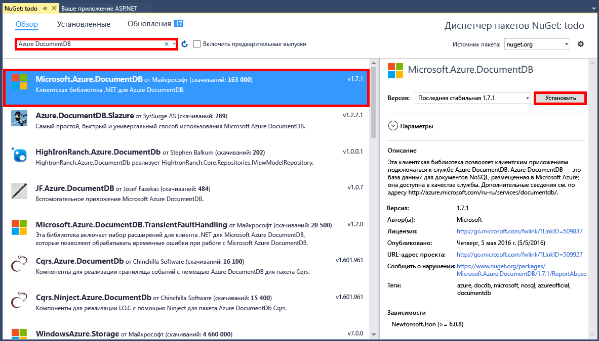

  	Для установки пакета можно также воспользоваться консолью диспетчера пакетов. Для этого в меню **Средства** щелкните **Диспетчер пакетов NuGet**,затем выберите **Консоль диспетчера пакетов**. Когда появится запрос, введите следующую команду.

		Install-Package Microsoft.Azure.DocumentDB

3. После установки пакета в решение Visual Studio будут добавлены две ссылки, Microsoft.Azure.Documents.Client и Newtonsoft.Json, и оно будет выглядеть следующим образом.

  	

##Шаг 4. Настройка приложения ASP.NET MVC
 
Теперь добавим модели, представления и контроллеры в это приложение MVC.

- [Добавление модели](#_Toc395637764).
- [Добавление контроллера](#_Toc395637765).
- [Добавление представлений](#_Toc395637766).

### Добавление модели данных JSON

Давайте начнем с буквы **M** из аббревиатуры MVC, с модели (Model).

1. В **Обозревателе решений** щелкните правой кнопкой мыши папку **Модели**, нажмите **Добавить**, затем щелкните **Класс**.

  	Откроется диалоговое окно **Добавление нового элемента**.

2. Назовите новый класс **Item.cs** и нажмите кнопку **Добавить**.

3. В этом новом файле **Item.cs** добавьте следующий код после последнего *оператора using*.
		
		using Newtonsoft.Json;
	
4. Теперь замените этот код
		
		public class Item
		{
		}

	следующим кодом:

		public class Item
		{
			[JsonProperty(PropertyName = "id")]
			public string Id { get; set; }
			 
			[JsonProperty(PropertyName = "name")]
			public string Name { get; set; }

			[JsonProperty(PropertyName = "description")]
			public string Description { get; set; }

			[JsonProperty(PropertyName = "isComplete")]
			public bool Completed { get; set; }
		}

	Все данные в DocumentDB передаются по сети и хранятся в виде JSON. Для управления сериализацией и десериализацией объектов с помощью JSON.NET можно использовать атрибут **JsonProperty**, как показано на примере только что созданного класса **Item**. Вам **не обязательно** это делать, но, присваивая имена свойствам, я придерживаюсь правил наименования camelCase JSON.
	
	Можно не только контролировать формат имени свойства при его поступлении в JSON, но и полностью переименовывать свойства .NET. Здесь, например, я переименовала свойство **Description**.
	

### Добавление контроллера

С буквой **M** (моделями) разобрались, теперь займемся **C**, т. е. классом контроллера (Controller).

1. В **Обозревателе решений** щелкните правой кнопкой мыши папку **Контроллеры**, нажмите **Добавить**, затем щелкните **Контроллер**.

	Откроется диалоговое окно**Добавление элемента формирования шаблонов**.

2. Выберите **Контроллер MVC 5 — Пустой** и нажмите кнопку **Добавить**.

	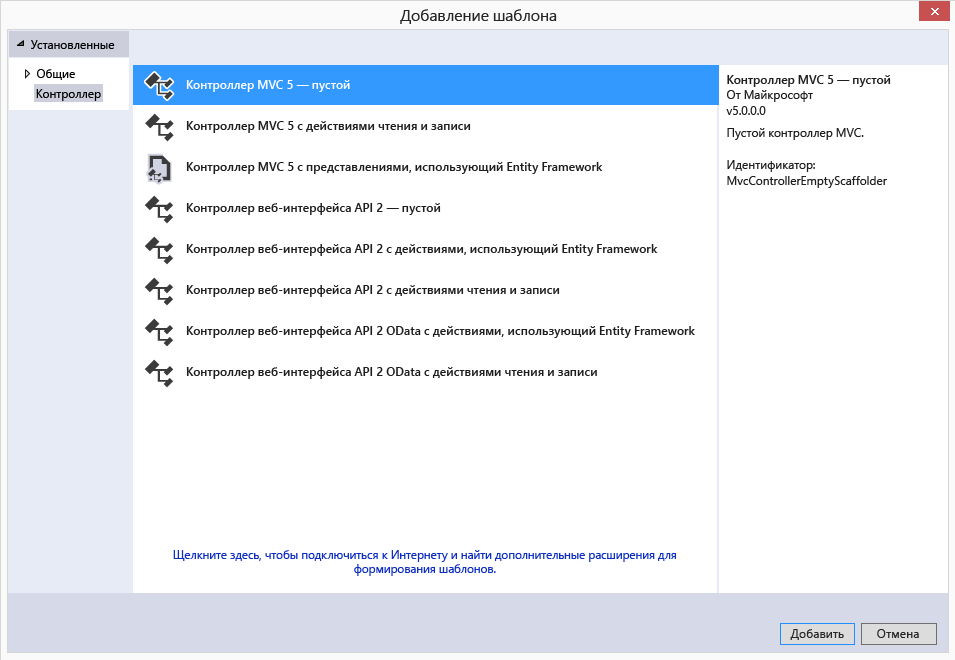

3. Назовите новый контроллер **ItemController.**

	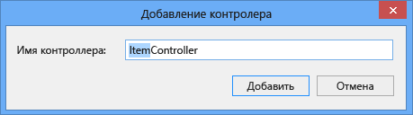

	После создания файла решение Visual Studio с новым файлом ItemController.cs в **Обозревателе решений** должно выглядеть следующим образом. Новый файл Item.cs, созданный ранее, также отображается.

	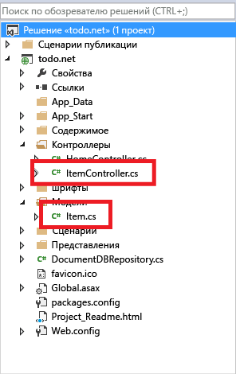

	Можно закрыть файл ItemController.cs, мы вернемся к нему позже.

### Добавление представлений

И наконец, займемся буквой **V** из аббревиатуры MVC, т. .е представлениями (Views).

- [Добавление представления «Индекс элементов»](#AddItemIndexView).
- [Добавление представления «Создание элементов»](#AddNewIndexView).
- [Добавление представления «Редактирование элементов»](#_Toc395888515).

#### Добавление представления «Индекс элементов»

1. В **Обозревателе решений** разверните папку **Представления**, щелкните правой кнопкой мыши пустую папку **Элемент**, созданную Visual Studio при добавлении **ItemController** ранее, нажмите **Добавить**, затем выберите **Представление**.

	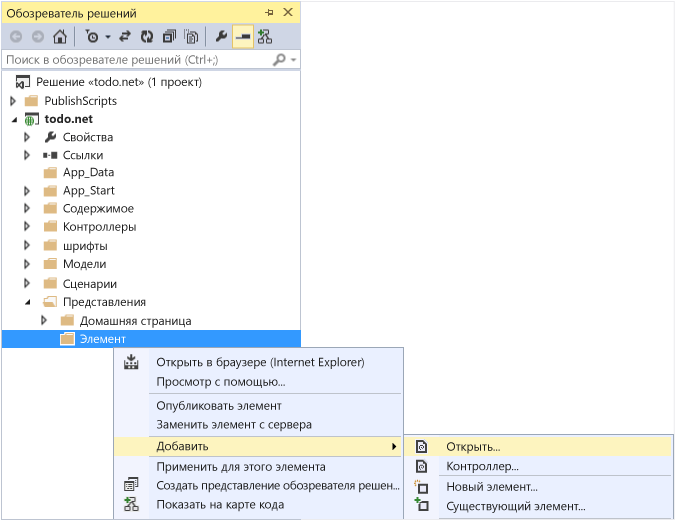

2. В диалоговом окне **Добавление представления** выполните следующие действия.
	- В поле **Имя представления** введите ***Index***.
	- В поле **Шаблон** выберите ***Список***.
	- В поле **Класс модели** выберите ***Элемент (todo.Models)***.
	- Оставьте пустым поле **Класс контекста данных**. 
	- В поле страницы макета введите ***~/Views/Shared/\_Layout.cshtml***.
	
	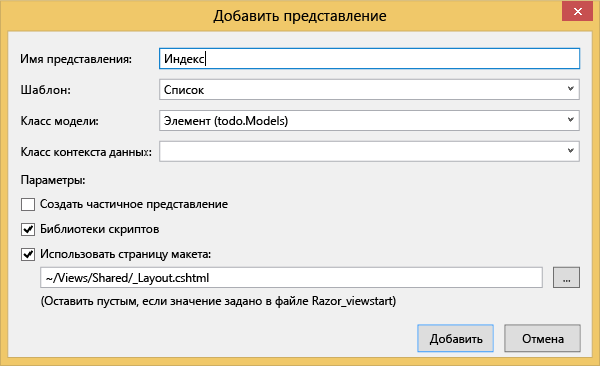

3. После установки этих значений нажмите **Добавить**, и Visual Studio создаст представление. После этого откроется созданный файл cshtml. Можно закрыть этот файл в Visual Studio, мы вернемся к нему позже.

#### Добавление представления «Создание элементов»

Точно также, как мы создали представление **Индекс элементов**, теперь мы создадим новое представление для создания новых **элементов**.

1. В **обозревателе решений** щелкните правой кнопкой мыши папку **Элемент**, нажмите **Добавить**, затем щелкните **Представление**.

2. В диалоговом окне **Добавление представления** выполните следующие действия.
	- В поле **Имя представления** введите ***Create***.
	- В поле **Шаблон** выберите ***Создание***.
	- В поле **Класс модели** выберите ***Элемент (todo.Models)***.
	- Оставьте пустым поле **Класс контекста данных**.
	- В поле страницы макета введите ***~/Views/Shared/\_Layout.cshtml***.
	- Щелкните **Добавить**.

#### Добавление представления «Редактирование элементов»

И, наконец, добавим последнее представление для редактирования **элементов**, как мы делали это ранее.

1. В **обозревателе решений** щелкните правой кнопкой мыши папку **Элемент**, нажмите **Добавить**, затем щелкните **Представление**.

2. В диалоговом окне **Добавление представления** выполните следующие действия.
	- В поле **Имя представления** введите ***Edit***.
	- В поле **Шаблон** выберите ***Редактирование***.
	- В поле **Класс модели** выберите ***Элемент (todo.Models)***.
	- Оставьте пустым поле **Класс контекста данных**. 
	- В поле страницы макета введите ***~/Views/Shared/\_Layout.cshtml***.
	- Щелкните **Добавить**.

Как только все будет готово, закройте документы cshtml в Visual Studio, мы вернемся к этим представлениям позже.

## Шаг 5. Подключение DocumentDB

Теперь, когда мы позаботились об основных ресурсах MVC, пришло время рассмотреть добавление кода для DocumentDB.

В этом разделе мы добавим код для обработки следующих команд

- [Вывод списка незавершенных элементов](#_Toc395637770).
- [Добавление элементов](#_Toc395637771).
- [Редактирование элементов](#_Toc395637772).

### Отображение незавершенных элементов в веб-приложении MVC

Прежде всего следует добавить класс, который содержит всю необходимую логику для подключения к базе данных DocumentDB и ее использования. В этом учебнике мы оформим всю эту логику в класс репозитория с именем DocumentDBRepository.

1. В **Обозревателе решений** щелкните правой кнопкой проект, нажмите **Добавить**, затем щелкните **Класс**. Назовите новый класс **DocumentDBRepository** и нажмите кнопку **Добавить**.
 
2. В конце только что созданного класса **DocumentDBRepository** добавьте следующие *операторы using* над декларацией *namespace*.
		
		using Microsoft.Azure.Documents; 
		using Microsoft.Azure.Documents.Client; 
		using Microsoft.Azure.Documents.Linq; 
		using System.Configuration;
		using System.Linq.Expressions;
		using System.Threading.Tasks;

	Теперь замените этот код

		public class DocumentDBRepository
		{
		}

	следующим кодом:

		public static class DocumentDBRepository<T> where T : class
		{
			private static readonly string DatabaseId = ConfigurationManager.AppSettings["database"];
			private static readonly string CollectionId = ConfigurationManager.AppSettings["collection"];
			private static DocumentClient client;
	
			public static void Initialize()
			{
				client = new DocumentClient(new Uri(ConfigurationManager.AppSettings["endpoint"]), ConfigurationManager.AppSettings["authKey"]);
				CreateDatabaseIfNotExistsAsync().Wait();
				CreateCollectionIfNotExistsAsync().Wait();
			}
	
			private static async Task CreateDatabaseIfNotExistsAsync()
			{
				try
				{
					await client.ReadDatabaseAsync(UriFactory.CreateDatabaseUri(DatabaseId));
				}
				catch (DocumentClientException e)
				{
					if (e.StatusCode == System.Net.HttpStatusCode.NotFound)
					{
						await client.CreateDatabaseAsync(new Database { Id = DatabaseId });
					}
					else
					{
						throw;
					}
				}
			}
	
			private static async Task CreateCollectionIfNotExistsAsync()
			{
				try
				{
					await client.ReadDocumentCollectionAsync(UriFactory.CreateDocumentCollectionUri(DatabaseId, CollectionId));
				}
				catch (DocumentClientException e)
				{
					if (e.StatusCode == System.Net.HttpStatusCode.NotFound)
					{
						await client.CreateDocumentCollectionAsync(
							UriFactory.CreateDatabaseUri(DatabaseId),
							new DocumentCollection { Id = CollectionId },
							new RequestOptions { OfferThroughput = 1000 });
					}
					else
					{
						throw;
					}
				}
			}
		}

	>	 [AZURE.TIP] При создании новой коллекции DocumentCollection можно указать необязательный параметр OfferType RequestOptions, который позволяет указать уровень производительности новой коллекции. Если этот параметр не передан, будет использоваться тип предложения по умолчанию. Информацию об использовании типов предложения DocumentDB см. в статье [Уровни производительности DocumentDB](documentdb-performance-levels.md)

3. Некоторые значения будут считываться из конфигурации, поэтому нужно открыть файл **Web.config** и добавить следующие строки в разделе `<AppSettings>`.
	
		<add key="endpoint" value="enter the URI from the Keys blade of the Azure Portal"/>
		<add key="authKey" value="enter the PRIMARY KEY, or the SECONDARY KEY, from the Keys blade of the Azure  Portal"/>
		<add key="database" value="ToDoList"/>
		<add key="collection" value="Items"/>
	
4. Теперь обновите значения для параметров *endpoint* и *authKey*, используя колонку «Ключи» на портале Azure. Используйте **URI** из колонки «Ключи» в качестве значения параметра endpoint. В качестве значения параметра authKey используйте значение **ПЕРВИЧНОГО КЛЮЧА** или **ВТОРИЧНОГО КЛЮЧА** из колонки «Ключи».

	Это касается подключения репозитория DocumentDB. Теперь можно добавить логику приложения.

5. Первое, что мы хотим сделать с приложением списка заданий, — отображение незавершенных элементов. Скопируйте и вставьте следующий фрагмент кода в любом месте в класса **DocumentDBRepository**.

		public static async Task<IEnumerable<T>> GetItemsAsync(Expression<Func<T, bool>> predicate)
		{
			IDocumentQuery<T> query = client.CreateDocumentQuery<T>(
				UriFactory.CreateDocumentCollectionUri(DatabaseId, CollectionId))
				.Where(predicate)
				.AsDocumentQuery();

			List<T> results = new List<T>();
			while (query.HasMoreResults)
			{
				results.AddRange(await query.ExecuteNextAsync<T>());
			}

			return results;
		}

6. Откройте **ItemController**, который мы добавили ранее, и добавьте следующие *операторы using* перед декларацией namespace.

		using System.Net;
		using System.Threading.Tasks;
		using todo.Models;

	Если проект не называется todo, необходимо выполнить обновление с помощью todo.Models в соответствии с именем проекта.

	Теперь замените этот код

		//GET: Item
		public ActionResult Index()
		{
			return View();
		}

	следующим кодом:

		[ActionName("Index")]
		public async Task<ActionResult> IndexAsync()
		{
			var items = await DocumentDBRepository<Item>.GetItemsAsync(d => !d.Completed);
			return View(items);
		}
	
На данном этапе ваше решение должно компилироваться без каких-либо ошибок.

Чтобы запустить приложение сейчас, нужно перейти к **Главному контроллеру** и представлению **Индекс** в этом контроллере. Это поведение по умолчанию для шаблона проекта MVC мы выбрали вначале, но нам нужно кое-что другое! Давайте изменим маршрутизацию в данном приложении MVC, чтобы изменить это поведение.

Откройте файл ***App\\_Start\\RouteConfig.cs***, найдите строку, начинающуюся с defaults: и измените ее следующим образом:

		defaults: new { controller = "Item", action = "Index", id = UrlParameter.Optional }

Теперь приложение ASP.NET MVC будет знать, что, если вы не указали значение в поле URL-адреса для управления поведением маршрутизации, вместо **Главный** нужно использовать **Элемент** в качестве контроллера, а пользовательский **индекс** — в качестве представления.

Теперь при запуске приложения оно будет вызывать **ItemController**, который вызывает класс репозитория и использует метод GetItems, чтобы возвратить все незавершенные элементы в представлении **Представления**\**Элемент**\**Индекс**.

Если создать и запустить этот проект сейчас, отобразится примерно следующие данные.

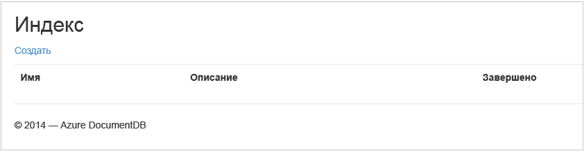

### Добавление элементов

Добавим несколько элементов в нашу базу данных, чтобы не смотреть на пустую сетку.

Добавим код в репозиторий DocumentDBRepository и ItemController, чтобы сохранить запись в DocumentDB.

1.  Добавьте следующий метод в класс **DocumentDBRepository**.

		public static async Task<Document> CreateItemAsync(T item)
		{
			return await client.CreateDocumentAsync(UriFactory.CreateDocumentCollectionUri(DatabaseId, CollectionId), item);
		}

	Этот метод просто принимает любой объект, переданный ему, и сохраняет его в DocumentDB.

2. Откройте файл ItemController.cs и добавьте следующий фрагмент кода в класс. Теперь приложение ASP.NET MVC будет знать, что делать с действием **Создать**. В этом случае просто выводится связанное представление Create.cshtml, которое было создано ранее.

		[ActionName("Create")]
		public async Task<ActionResult> CreateAsync()
		{
			return View();
		}

	Теперь нам нужно добавить еще немного кода в этом контроллере, который будет принимать данные из представления **Создание**.

2. Добавьте следующий блок кода в класс ItemController.cs, который указывает приложению ASP.NET MVC, что нужно делать с формой POST для этого контроллера.
	
		[HttpPost]
		[ActionName("Create")]
		[ValidateAntiForgeryToken]
		public async Task<ActionResult> CreateAsync([Bind(Include = "Id,Name,Description,Completed")] Item item)
		{
			if (ModelState.IsValid)
			{
				await DocumentDBRepository<Item>.CreateItemAsync(item);
				return RedirectToAction("Index");
			}

			return View(item);
		}

	Этот код вызывает DocumentDBRepository и использует метод CreateItemAsync для сохранения нового элемента списка дел в базе данных.
 
	**Примечание о безопасности**: атрибут **ValidateAntiForgeryToken** используется здесь для защиты этого приложения от атак с подделкой межсайтовых запросов. Кроме добавления этого атрибута представления также должны работать с данным маркером защиты от подделки запросов. Дополнительные сведения об этом и примеры правильной реализации данной технологии см. в разделе [Предотвращение атак с подделкой межсайтовых запросов][]. Исходный код, предоставленный на [GitHub][], имеет полную реализацию.

	**Примечание о безопасности**: для защиты от атак overposting также используется атрибут **Bind** в параметре метода. Дополнительные сведения см. в разделе [Основные операции CRUD в ASP.NET MVC][].

На этом мы завершаем написание кода, необходимого для добавления новых элементов в нашу базу данных.

### Редактирование элементов

И последнее. Необходимо обеспечить возможность редактировать **Элементы** в базе данных и отмечать их как завершенные. Представление редактирования уже добавлено в проект, поэтому просто нужно еще раз добавить дополнительный код в контроллер и класс **DocumentDBRepository**

1. Добавьте следующие методы в класс **DocumentDBRepository**.

		public static async Task<Document> UpdateItemAsync(string id, T item)
		{
			return await client.ReplaceDocumentAsync(UriFactory.CreateDocumentUri(DatabaseId, CollectionId, id), item);
		}

		public static async Task<T> GetItemAsync(string id)
		{
			try
			{
				Document document = await client.ReadDocumentAsync(UriFactory.CreateDocumentUri(DatabaseId, CollectionId, id));
				return (T)(dynamic)document;
			}
			catch (DocumentClientException e)
			{
				if (e.StatusCode == HttpStatusCode.NotFound)
				{
					return null;
				}
				else
				{
					throw;
				}
			}
		}
	
	Первый из этих двух методов, **GetItem**, извлекает элемент из DocumentDB, который передается обратно в **ItemController**, а затем — в представление **Редактирование**.
	
	Второй метод, который мы только что добавили, заменяет **Документ** в DocumentDB версией **Документа**, переданного из **ItemController**.

2. Добавьте следующие методы в класс **ItemController**.

		[HttpPost]
		[ActionName("Edit")]
		[ValidateAntiForgeryToken]
		public async Task<ActionResult> EditAsync([Bind(Include = "Id,Name,Description,Completed")] Item item)
		{
			if (ModelState.IsValid)
			{
				await DocumentDBRepository<Item>.UpdateItemAsync(item.Id, item);
				return RedirectToAction("Index");
			}

			return View(item);
		}

		[ActionName("Edit")]
		public async Task<ActionResult> EditAsync(string id)
		{
			if (id == null)
			{
				return new HttpStatusCodeResult(HttpStatusCode.BadRequest);
			}

			Item item = await DocumentDBRepository<Item>.GetItemAsync(id);
			if (item == null)
			{
				return HttpNotFound();
			}

			return View(item);
		}
	
	Первый метод обрабатывает команду HTTP GET, которая формируется, когда пользователь нажимает ссылку **Изменить** в представлении **Индекс**. Этот метод извлекает [**документ**](http://msdn.microsoft.com/library/azure/microsoft.azure.documents.document.aspx) из DocumentDB и передает его в представление **Изменить**.

	Представление **Изменить** отправляет команду HTTP POST в **IndexController**.
	
	Второй метод, который мы добавили, обрабатывает передачу обновленного объекта для DocumentDB, чтобы сохранить его в базе данных.

Вот и все, что необходимо для запуска приложения, отображения списка незавершенных **Элементов**, добавления новых **Элементов** и редактирования **Элементов**.

## Шаг 6. Локальный запуск приложения

Для проверки приложения на локальном компьютере выполните следующие действия.

1. Чтобы создать приложение в режиме отладки, откройте Visual Studio и нажмите клавишу F5. После этого будет создано приложение и откроется окно браузера с пустой сеткой, которую мы уже видели:

	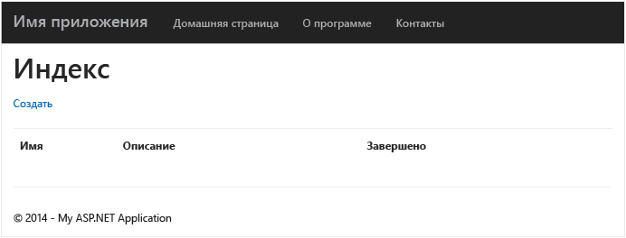

	Если на этом этапе возникнет ошибка, вы можете сравнить свой код с кодом из примера проекта на портале [GitHub][].

2. Щелкните ссылку **Создать** введите значения в поля **Имя** и **Описание**. Не устанавливайте флажок **Завершено**, иначе новый **Элемент** будет добавлен ​​в завершенном состоянии и не будет отображаться в начальном списке.

	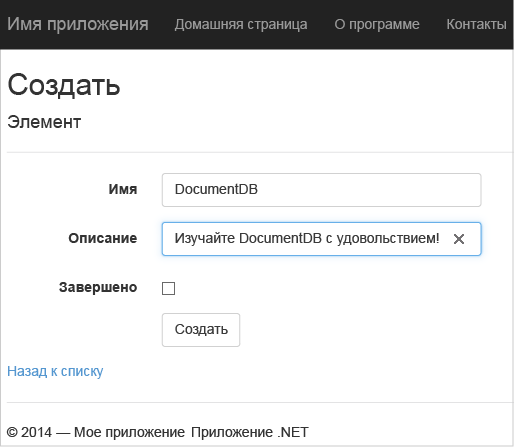

3. Щелкните **Создать**, вы будете перенаправлены в представление **Индекс**, а в списке появится ваш **Элемент**.

	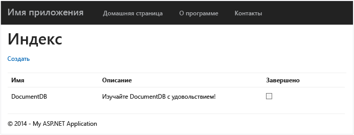

	Вы можете добавить еще несколько **Элементов** в список задач.

3. Нажмите кнопку **Изменить** рядом с **Элементом**. Вы будете перенаправлены в представление **Редактирование**, где сможете изменить любое свойство объекта, в том числе флажок **Завершено**. Если установить флажок **Завершено** и нажать кнопку **Сохранить**, **Элемент** будет удален из списка незавершенных задач.

	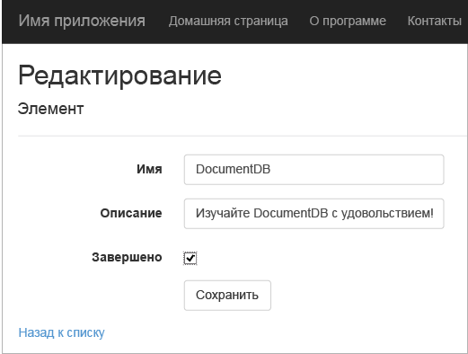

4. После проверки приложения нажмите клавиши CONTROL+F5, чтобы остановить отладку приложения. Теперь все готово к развертыванию.

##Шаг 7. Развертывание приложения на веб-сайтах Azure

Теперь, когда у вас есть готовое приложение, которое корректно работает в DocumentDB, мы собираемся развернуть его на веб-сайтах Azure. Если вы выбрали вариант **Разместить в облаке**, после создания пустого проекта ASP.NETMVC Visual Studio упростит процедуру и сделает большую часть работы за нас.

1. Чтобы опубликовать этот приложение, щелкните правой кнопкой мыши проект в **Обозревателе решений** и нажмите кнопку **Опубликовать**.

	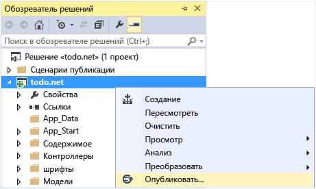

2. Все уже должно быть настроено в соответствии с вашими учетными данными. На самом деле сайт уже создан в Azure и находится по **Конечному URL-адресу**, вам просто нужно нажать кнопку **Опубликовать**.

	

Через несколько секунд Visual Studio завершит публикацию вашего веб-приложения и запустит браузер, где вы увидите свое творение, запущенное в Azure!

##Дальнейшие действия

Поздравляем! Вы только что создали свое первое веб-приложение ASP.NET MVC с использованием Azure DocumentDB и опубликовали его на веб-сайтах Azure. Исходный код полного приложения, включая функциональность детализации и удаления, не описанные в этом учебнике, можно загрузить или клонировать с портала [GitHub][]. Поэтому, если вы хотите добавить эти функции в приложение, скопируйте код и добавьте его в это приложение.

Чтобы добавить дополнительные функции в приложение, ознакомьтесь с интерфейсами API, доступными в [библиотеке DocumentDB .NET](https://msdn.microsoft.com/library/azure/dn948556.aspx). Вы также можете быть соавтором библиотеки DocumentDB .NET на портале[GitHub][].

[*]: https://microsoft.sharepoint.com/teams/DocDB/Shared%20Documents/Documentation/Docs.LatestVersions/PicExportError
[Visual Studio Express]: http://www.visualstudio.com/products/visual-studio-express-vs.aspx
[установщике веб-платформы Майкрософт]: http://www.microsoft.com/web/downloads/platform.aspx
[Предотвращение атак с подделкой межсайтовых запросов]: http://go.microsoft.com/fwlink/?LinkID=517254
[Основные операции CRUD в ASP.NET MVC]: http://go.microsoft.com/fwlink/?LinkId=317598
[GitHub]: https://github.com/Azure-Samples/documentdb-net-todo-app

<!---HONumber=AcomDC_0330_2016-->