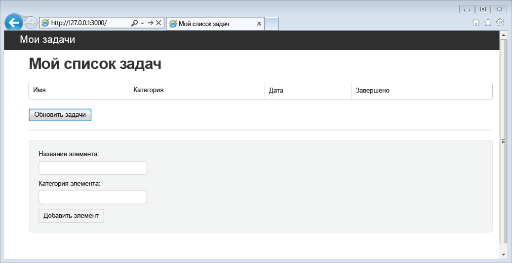
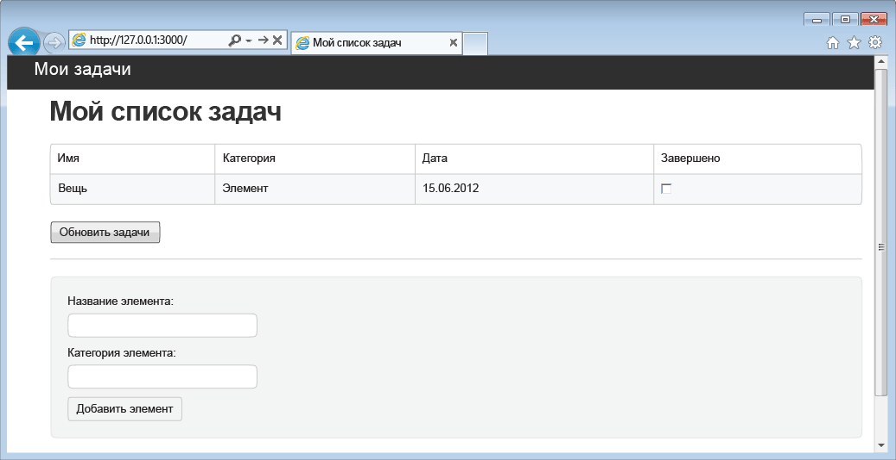

<properties 
	pageTitle="Изучение Node.js — учебник по использованию DocumentDB с Node.js | Microsoft Azure" 
	description="Учите Node.js! В этом учебнике описывается использование Microsoft Azure DocumentDB для хранения данных и доступа к ним из веб-приложения Node.js Express, размещенного на веб-сайтах Azure." 
	keywords="Разработка приложений, учебник по базе данных, изучение node.js, учебник по node.js, documentdb, azure, Microsoft azure"
	services="documentdb" 
	documentationCenter="nodejs" 
	authors="ryancrawcour" 
	manager="jhubbard" 
	editor="cgronlun"/>

<tags 
	ms.service="documentdb" 
	ms.workload="data-services" 
	ms.tgt_pltfrm="na" 
	ms.devlang="nodejs" 
	ms.topic="hero-article" 
	ms.date="02/03/2016" 
	ms.author="ryancraw"/>

# Создание веб-приложения Node.js с использованием DocumentDB

> [AZURE.SELECTOR]
- [.NET](documentdb-dotnet-application.md)
- [Node.js](documentdb-nodejs-application.md)
- [Java](documentdb-java-application.md)
- [Python](documentdb-python-application.md)

В этом учебнике по Node.js показано, как использовать службу Azure DocumentDB для хранения данных и обеспечения доступа к ним из приложения Node.js Express, размещенного на веб-сайтах Azure.

Рекомендуется начать с просмотра следующего видеоматериала, где показано, как подготовить учетную запись базы данных Azure DocumentDB и сохранить документы JSON в приложении Node.js.

> [AZURE.VIDEO azure-demo-getting-started-with-azure-documentdb-on-nodejs-in-linux]

Затем вернитесь к этому учебнику по Node.js, где вы узнаете ответы на следующие вопросы:

- Как работать со службой DocumentDB, используя модуль documentdb из npm
- Как развернуть веб-приложение на веб-сайтах Azure

В ходе учебного курса вы создадите простое веб-приложение для управления задачами, позволяющее создавать, извлекать и выполнять задачи. Задачи будут храниться в виде документов JSON в Azure DocumentDB.

Нет времени на изучение учебника, и вы просто хотите получить готовое решение? Хорошо, вы можете получить полный пример решения на сайте [GitHub][].

## Предварительные требования

> [AZURE.TIP] Этот учебник по Node.js разработан для читателей, обладающих определенным опытом использования Node.js и веб-сайтов Azure.

Перед выполнением инструкций, приведенных в этой статье, следует убедиться, что установлены следующие компоненты:

- Активная учетная запись Azure. Если ее нет, можно создать бесплатную пробную учетную запись всего за несколько минут. Дополнительные сведения см. в разделе [Бесплатная пробная версия Azure](https://azure.microsoft.com/pricing/free-trial/).
- [Node.js][] версии v0.10.29 или выше.
- [Генератор Express](http://www.expressjs.com/starter/generator.html) (его можно установить через `npm install express-generator -g`)
- [Git][].

## Шаг 1. Создание учетной записи базы данных DocumentDB

Начнем с создания учетной записи DocumentDB. Если у вас уже есть учетная запись, можно перейти сразу на [Шаг 2. Создание нового приложения Node.js](#_Toc395783178).

[AZURE.INCLUDE [documentdb-create-dbaccount](../../includes/documentdb-create-dbaccount.md)]

[AZURE.INCLUDE [documentdb-keys](../../includes/documentdb-keys.md)]

## Шаг 2. Создание нового приложения Node.js

Теперь создадим базовый проект Node.js «Привет, мир!» с помощью платформы [Express](http://expressjs.com/).

1. Откройте удобный для вас терминал.

2. С помощью генератора Express создайте новое приложение с именем **todo**.

		express todo

3. Откройте новый каталог **todo** и установите зависимости.

		cd todo
		npm install

4. Запустите новое приложение.

		npm start

5. Новое приложение можно просмотреть, перейдя в браузере по адресу [http://localhost: 3000](http://localhost:3000).

	

## Шаг 3. Установка дополнительных модулей

Файл **package.json** является одним из файлов, создаваемых в корневой папке проекта. Этот файл содержит список дополнительных модулей, необходимых для приложения Node.js. Позднее, при развертывании этого приложения на веб-сайтах Azure, этот файл будет использоваться для определения модулей, которые должны быть установлены в Azure для поддержки вашего приложения. Для этого учебного примера нам нужно установить еще два пакета.

1. Вернувшись в терминал, установите модуль **async** с помощью npm.

		npm install async --save

1. Установите модуль **documentdb** с помощью npm. В этом модуле заключена вся «магия» DocumentDB.

		npm install documentdb --save

3. Быстрая проверка файла **package.json** приложения должна показать дополнительные модули. Этот файл сообщит Azure, какие пакеты следует загрузить и установить при запуске приложения. Он должен выглядеть подобно приведенному ниже примеру.

	

       Это сообщает Node (и позже Azure), что ваше приложение зависит от указанных дополнительных модулей.

## Шаг 4. Использование службы DocumentDB в приложении Node

После завершения начальной установки и настройки, давайте перейдем к, собственно, написанию кода приложения, использующего Azure DocumentDB.

### Создание модели

1. В каталоге проекта создайте новый каталог с именем **models**.
2. В каталоге **models** создайте новый файл с именем **taskDao.js**. Этот файл будет содержать модель для задач, создаваемых нашим приложением.
3. В том же каталоге **models** создайте еще один новый файл с именем **docdbUtils.js**. Этот файл будет содержать некоторый полезный многократно используемый код, который будет задействован на протяжении нашего приложения. 
4. Скопируйте следующий код в **docdbUtils.js**

		var DocumentDBClient = require('documentdb').DocumentClient;
			
		var DocDBUtils = {
		    getOrCreateDatabase: function (client, databaseId, callback) {
		        var querySpec = {
		            query: 'SELECT * FROM root r WHERE r.id= @id',
		            parameters: [{
		                name: '@id',
		                value: databaseId
		            }]
		        };
		
		        client.queryDatabases(querySpec).toArray(function (err, results) {
		            if (err) {
		                callback(err);
		
		            } else {
		                if (results.length === 0) {
		                    var databaseSpec = {
		                        id: databaseId
		                    };
		
		                    client.createDatabase(databaseSpec, function (err, created) {
		                        callback(null, created);
		                    });
		
		                } else {
		                    callback(null, results[0]);
		                }
		            }
		        });
		    },
		
		    getOrCreateCollection: function (client, databaseLink, collectionId, callback) {
		        var querySpec = {
		            query: 'SELECT * FROM root r WHERE r.id=@id',
		            parameters: [{
		                name: '@id',
		                value: collectionId
		            }]
		        };		       
				
		        client.queryCollections(databaseLink, querySpec).toArray(function (err, results) {
		            if (err) {
		                callback(err);
		
		            } else {		
		                if (results.length === 0) {
		                    var collectionSpec = {
		                        id: collectionId
		                    };
							
				 			var requestOptions = {
								offerType: 'S1'
							};
							
		                    client.createCollection(databaseLink, collectionSpec, requestOptions, function (err, created) {
		                        callback(null, created);
		                    });
		
		                } else {
		                    callback(null, results[0]);
		                }
		            }
		        });
		    }
		};
				
		module.exports = DocDBUtils;

> [AZURE.TIP] createCollection принимает необязательный параметр requestOptions, который может использоваться для указания типа предложения для коллекции. Если значение requestOptions.offerType не указано, коллекция будет создана с использованием типа предложения по умолчанию. Дополнительные сведения о типах предложений DocumentDB см. в статье [Уровни производительности DocumentDB](documentdb-performance-levels.md)
		
3. Сохраните и закройте файл **docdbUtils.js**.

4. В начале файла **taskDao.js** добавьте следующий код для обращения к созданным выше файлам **DocumentDBClient** и **docdbUtils.js**:

        var DocumentDBClient = require('documentdb').DocumentClient;
		var docdbUtils = require('./docdbUtils');

4. Далее будет добавлен код для определения и экспорта объекта Task. Этот код отвечает за инициализацию нашего объекта Task и настройку используемых базы данных и коллекции документов.

		function TaskDao(documentDBClient, databaseId, collectionId) {
		  this.client = documentDBClient;
		  this.databaseId = databaseId;
		  this.collectionId = collectionId;
		
		  this.database = null;
		  this.collection = null;
		}
		
		module.exports = TaskDao;

5. Затем добавьте следующий код, чтобы определить дополнительные методы в объекте Task, обеспечивающие взаимодействие с данными, хранящимися в DocumentDB.

		TaskDao.prototype = {
		    init: function (callback) {
		        var self = this;
		
		        docdbUtils.getOrCreateDatabase(self.client, self.databaseId, function (err, db) {
		            if (err) {
		                callback(err);
		            } else {
		                self.database = db;
		                docdbUtils.getOrCreateCollection(self.client, self.database._self, self.collectionId, function (err, coll) {
		                    if (err) {
		                        callback(err);
		
		                    } else {
		                        self.collection = coll;
		                    }
		                });
		            }
		        });
		    },
		
		    find: function (querySpec, callback) {
		        var self = this;
		
		        self.client.queryDocuments(self.collection._self, querySpec).toArray(function (err, results) {
		            if (err) {
		                callback(err);
		
		            } else {
		                callback(null, results);
		            }
		        });
		    },
		
		    addItem: function (item, callback) {
		        var self = this;
		
		        item.date = Date.now();
		        item.completed = false;
		
		        self.client.createDocument(self.collection._self, item, function (err, doc) {
		            if (err) {
		                callback(err);
		
		            } else {
		                callback(null, doc);
		            }
		        });
		    },
		
		    updateItem: function (itemId, callback) {
		        var self = this;
		
		        self.getItem(itemId, function (err, doc) {
		            if (err) {
		                callback(err);
		
		            } else {
		                doc.completed = true;
		
		                self.client.replaceDocument(doc._self, doc, function (err, replaced) {
		                    if (err) {
		                        callback(err);
		
		                    } else {
		                        callback(null, replaced);
		                    }
		                });
		            }
		        });
		    },
		
		    getItem: function (itemId, callback) {
		        var self = this;
		
		        var querySpec = {
		            query: 'SELECT * FROM root r WHERE r.id = @id',
		            parameters: [{
		                name: '@id',
		                value: itemId
		            }]
		        };
		
		        self.client.queryDocuments(self.collection._self, querySpec).toArray(function (err, results) {
		            if (err) {
		                callback(err);
		
		            } else {
		                callback(null, results[0]);
		            }
		        });
		    }
		};

6. Сохраните и закройте файл **taskDao.js**.

### Создание контроллера

1. В каталоге **routes** проекта создайте новый файл с именем **tasklist.js**. 
2. Добавьте в **tasklist.js** следующий код. Он загружает модули DocumentDBClient и async, используемые файлом **tasklist.js**. Также он определяет функцию **TaskList**, передающую экземпляр объекта **Task**, определенного ранее:

		var DocumentDBClient = require('documentdb').DocumentClient;
		var async = require('async');
		
		function TaskList(taskDao) {
		  this.taskDao = taskDao;
		}
		
		module.exports = TaskList;

3. Продолжайте добавление в файл **tasklist.js** методов **showTasks, addTask** и **completeTasks**:
		
		TaskList.prototype = {
		    showTasks: function (req, res) {
		        var self = this;
		
		        var querySpec = {
		            query: 'SELECT * FROM root r WHERE r.completed=@completed',
		            parameters: [{
		                name: '@completed',
		                value: false
		            }]
		        };
		
		        self.taskDao.find(querySpec, function (err, items) {
		            if (err) {
		                throw (err);
		            }
		
		            res.render('index', {
		                title: 'My ToDo List ',
		                tasks: items
		            });
		        });
		    },
		
		    addTask: function (req, res) {
		        var self = this;
		        var item = req.body;
		
		        self.taskDao.addItem(item, function (err) {
		            if (err) {
		                throw (err);
		            }
		
		            res.redirect('/');
		        });
		    },
		
		    completeTask: function (req, res) {
		        var self = this;
		        var completedTasks = Object.keys(req.body);
		
		        async.forEach(completedTasks, function taskIterator(completedTask, callback) {
		            self.taskDao.updateItem(completedTask, function (err) {
		                if (err) {
		                    callback(err);
		                } else {
		                    callback(null);
		                }
		            });
		        }, function goHome(err) {
		            if (err) {
		                throw err;
		            } else {
		                res.redirect('/');
		            }
		        });
		    }
		};

4. Сохраните и закройте файл **tasklist.js**.
 
### Добавление config.js

1. В каталоге проекта создайте новый файл с именем **config.js**.
2. Добавьте в файл **config.js** следующий код. Он определяет значения и параметры конфигурации, необходимые нашему приложению.

		var config = {}
		
		config.host = process.env.HOST || "[the URI value from the DocumentDB Keys blade on http://portal.azure.com]";
		config.authKey = process.env.AUTH_KEY || "[the PRIMARY KEY value from the DocumentDB Keys blade on http://portal.azure.com]";
		config.databaseId = "ToDoList";
		config.collectionId = "Items";
		
		module.exports = config;

3. В файле **config.js** обновите значения HOST и AUTH\_KEY значениями, найденными в выноске Keys учетной записи DocumentDB на [портале Microsoft Azure](https://portal.azure.com):

4. Сохраните и закройте файл **config.js**.
 
### Изменение app.js

1. В каталоге проекта откройте файл **app.js**. Этот файл был создан ранее, при создании веб-приложения Express.
2. Добавьте следующий код в начало файла **app.js**
	
		var DocumentDBClient = require('documentdb').DocumentClient;
		var config = require('./config');
		var TaskList = require('./routes/tasklist');
		var TaskDao = require('./models/taskDao');

3. Этот код определяет используемый файл конфигурации и продолжает считывать значения из этого файла в ряд переменных, которыми мы вскоре воспользуемся.
4. Замените следующие две строки в файле **app.js**:

		app.use('/', routes);
		app.use('/users', users); 

      следующим фрагментом:

		var docDbClient = new DocumentDBClient(config.host, {
		    masterKey: config.authKey
		});
		var taskDao = new TaskDao(docDbClient, config.databaseId, config.collectionId);
		var taskList = new TaskList(taskDao);
		taskDao.init();
		
		app.get('/', taskList.showTasks.bind(taskList));
		app.post('/addtask', taskList.addTask.bind(taskList));
		app.post('/completetask', taskList.completeTask.bind(taskList));
		app.set('view engine', 'jade');

6. Эти строки определяют новый экземпляр нашего объекта **TaskDao** с новым подключением к DocumentDB (с использованием значений, считанных из файла **config.js**), инициализируют объект задачи, а затем привязывают действия формы к методам в нашем контроллере **TaskList**.

7. Наконец, сохраните и закройте файл **app.js**. Мы почти закончили.
 
## Шаг 5. Построение пользовательского интерфейса

Теперь давайте обратим наше внимание на создание пользовательского интерфейса, чтобы пользователь смог взаимодействовать с нашим приложением. Созданное нами приложение Express использует в качестве обработчика представлений **Jade**. Дополнительные сведения о Jade см. на сайте [http://jade-lang.com/](http://jade-lang.com/).

1. Файл **layout.jade** в каталоге **views** используется как глобальный шаблон для других файлов **.jade**. На этом шаге он будет изменен для использования [Twitter Bootstrap](https://github.com/twbs/bootstrap) — набора средств, упрощающих разработку привлекательного веб-сайта. 
2. Откройте файл **layout.jade **, расположенный в папке **views**, и замените его содержимое следующим:
	
		doctype html
		html
		  head
		    title= title
		    link(rel='stylesheet', href='//ajax.aspnetcdn.com/ajax/bootstrap/3.3.2/css/bootstrap.min.css')
		    link(rel='stylesheet', href='/stylesheets/style.css')
		  body
		    nav.navbar.navbar-inverse.navbar-fixed-top
		      div.navbar-header
		        a.navbar-brand(href='#') My Tasks
		    block content
		    script(src='//ajax.aspnetcdn.com/ajax/jQuery/jquery-1.11.2.min.js')
		    script(src='//ajax.aspnetcdn.com/ajax/bootstrap/3.3.2/bootstrap.min.js')

	Он позволяет эффективно сообщить подсистеме **Jade** о том, что необходимо выполнить прорисовку HTML-кода для нашего приложения, и создает **block** с именем **content**, где можно указать разметку для страниц содержимого. Сохраните и закройте файл **layout.jade**.

4. Теперь откройте файл **index.jade** — представление, которое будет использоваться нашим приложением, — и замените содержимое файла следующим:

		extends layout
		
		block content
		  h1 #{title}
		  br
		
		  form(action="/completetask", method="post")
		    table.table.table-striped.table-bordered
		      tr
		        td Name
		        td Category
		        td Date
		        td Complete
		      if (typeof tasks === "undefined")
		        tr
		          td
		      else
		        each task in tasks
		          tr
		            td #{task.name}
		            td #{task.category}
		            - var date  = new Date(task.date);
		            - var day   = date.getDate();
		            - var month = date.getMonth() + 1;
		            - var year  = date.getFullYear();
		            td #{month + "/" + day + "/" + year}
		            td
		              input(type="checkbox", name="#{task.id}", value="#{!task.completed}", checked=task.completed)
		    button.btn(type="submit") Update tasks
		  hr
		  form.well(action="/addtask", method="post")
		    label Item Name:
		    input(name="name", type="textbox")
		    label Item Category:
		    input(name="category", type="textbox")
		    br
		    button.btn(type="submit") Add item

	Этот код дополняет макет и предоставляет содержимое для заполнителя **content**, который мы ранее видели в файле **layout.jade**.
	
	В макете мы создали две формы HTML. Первая форма содержит таблицу для наших данных и кнопку, позволяющую обновлять элементы путем POST-запроса к методу **/completetask** нашего контроллера. Вторая форма содержит два поля ввода и кнопку, позволяющую создать новый элемент путем POST-запроса к методу **/addtask** нашего контроллера.
	
	Этого должно быть достаточно для работы нашего приложения.

5. Откройте файл **style.css** в каталоге **public\\stylesheets** и замените код следующим:

		body {
		  padding: 50px;
		  font: 14px "Lucida Grande", Helvetica, Arial, sans-serif;
		}
		a {
		  color: #00B7FF;
		}
		.well label {
		  display: block;
		}
		.well input {
		  margin-bottom: 5px;
		}
		.btn {
		  margin-top: 5px;
		  border: outset 1px #C8C8C8;
		}

	Сохраните и закройте файл **style.css**.

## Шаг 6. Локальный запуск приложения

1. Чтобы протестировать приложение на локальном компьютере, выполните в терминале команду `npm start` для запуска приложения и откройте браузер со страницей, которая выглядит, как на следующем рисунке:

	

2. Используйте предоставленные поля «Элемент», «Имя элемента» и «Категория» для ввода данных, а затем нажмите кнопку **Добавить элемент**.

3. Страница должна обновиться, чтобы отобразить только что созданный элемент в списке ToDo.

	

4. Чтобы завершить задачу, просто установите флажок в столбце "Завершено" и нажмите кнопку **Обновить задачи**.

## Шаг 7. Развертывание проекта приложения на веб-сайтах Azure

1. Если это еще не сделано, включите репозиторий git для веб-сайта Azure. Соответствующие инструкции см. в статье [Непрерывное развертывание с использованием GIT в службе приложений Azure](../app-service-web/web-sites-publish-source-control.md).

2. Добавьте веб-сайт Azure в качестве удаленного репозитория git.

		git remote add azure https://username@your-azure-website.scm.azurewebsites.net:443/your-azure-website.git

3. Выполните развертывание методом Push на удаленный репозиторий.

		git push azure master

4. Через несколько секунд Visual Studio завершит публикацию вашего веб-приложения и запустит браузер, где вы увидите свое творение, запущенное в Azure!

## Дальнейшие действия

Поздравляем! Вы только что создали свое первое веб-приложение Node.js Express с использованием Azure DocumentDB и опубликовали его на веб-сайтах Azure.

Исходный код полного справочного приложения можно загрузить на сайте [GitHub][].

Дополнительную информацию см. в [Центре разработчика Node.js](https://azure.microsoft.com/develop/nodejs/).

[Node.js]: http://nodejs.org/
[Git]: http://git-scm.com/
[Github]: https://github.com/Azure-Samples/documentdb-node-todo-app
 

<!---HONumber=AcomDC_0330_2016-->