# Разработка веб-приложений Python Flask с использованием DocumentDB
> [!div class="op_single_selector"]
> * [.NET](documentdb-dotnet-application.md)
> * [Node.js](documentdb-nodejs-application.md)
> * [Java](documentdb-java-application.md)
> * [Python](documentdb-python-application.md)
> 
> 

В этом руководстве показан пример использования службы DocumentDB Azure для хранения данных и доступа к ним из веб-приложения Python, размещенного в Azure. Чтобы эффективно пользоваться этим руководством, нужен некоторый опыт использования Python и веб-сайтов Azure.

В этом учебнике по базам данных рассматриваются следующие процедуры.

1. Создание и подготовка учетной записи DocumentDB.
2. Создание приложения Python MVC.
3. Подключение и использование Azure DocumentDB из веб-приложения.
4. Развертывание веб-приложения на веб-сайтах Azure.

В ходе учебника вы создадите простое веб-приложение для голосования, позволяющее проводить голосование на выборах.

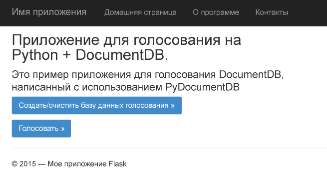

## Предварительные требования для учебника по базам данных
Перед выполнением инструкций, приведенных в этой статье, следует убедиться, что установлены следующие компоненты:

* Активная учетная запись Azure. Если ее нет, можно создать бесплатную пробную учетную запись всего за несколько минут. Дополнительные сведения см. в разделе [Бесплатная пробная версия Azure](https://azure.microsoft.com/pricing/free-trial/).
* [Visual Studio 2013](http://www.visualstudio.com/) или более поздней версии либо [Visual Studio Express]() (бесплатная версия Visual Studio). Инструкции в этом руководстве предназначены для работы с Visual Studio 2015.
* Средства Python для Visual Studio с сайта [GitHub](http://microsoft.github.io/PTVS/). В этом руководстве используются средства Python для VS 2015.
* Пакет Azure SDK Python для Visual Studio версии 2.4 или выше с сайта [azure.com](https://azure.microsoft.com/downloads/). Мы использовали пакет Microsoft Azure SDK для Python 2.7.
* Python 2.7 с сайта [python.org][2]. Мы использовали версию Python 2.7.11.

> [!IMPORTANT]
> Если вы устанавливаете Python 2.7 впервые, убедитесь, что на экране Customize Python 2.7.11 (Настройка Python 2.7.11) вы выбрали **Add python.exe to Path** (Добавить файл python.exe к пути).
> 
> 
> 
> 

* Компилятор Microsoft Visual C++ для Python 2.7 из [Центра загрузки Майкрософт][3].

## Шаг 1. Создание учетной записи базы данных DocumentDB
Начнем с создания учетной записи DocumentDB. Если у вас уже есть учетная запись, можно сразу перейти к разделу [Шаг 2. Создание веб-приложения Python Flask](#step-2:-create-a-new-python-flask-web-application).

[!INCLUDE [documentdb-create-dbaccount](../../includes/documentdb-create-dbaccount.md)]

<br/> Теперь мы рассмотрим создание веб-приложения Python Flask с нуля.

## Шаг 2. Создание нового веб-приложения Python Flask
1. В меню Visual Studio **Файл** выберите **Создать**, затем щелкните **Проект**.
   
    Откроется диалоговое окно **Новый проект**.
2. На панели слева последовательно разверните пункты **Шаблоны** и **Python**, а затем выберите пункт **Веб**.
3. На центральной панели выберите **Веб-проект Flask**, в поле **Имя** введите **tutorial**, а затем нажмите кнопку **ОК**. Помните, что в именах пакетов Python используется только нижний регистр, как описано в [руководстве по стилю для кода Python](https://www.python.org/dev/peps/pep-0008/#package-and-module-names).
   
    Для тех, кто не знаком с Python Flask: это платформа, ускоряющая создание веб-приложений в Python.
   
    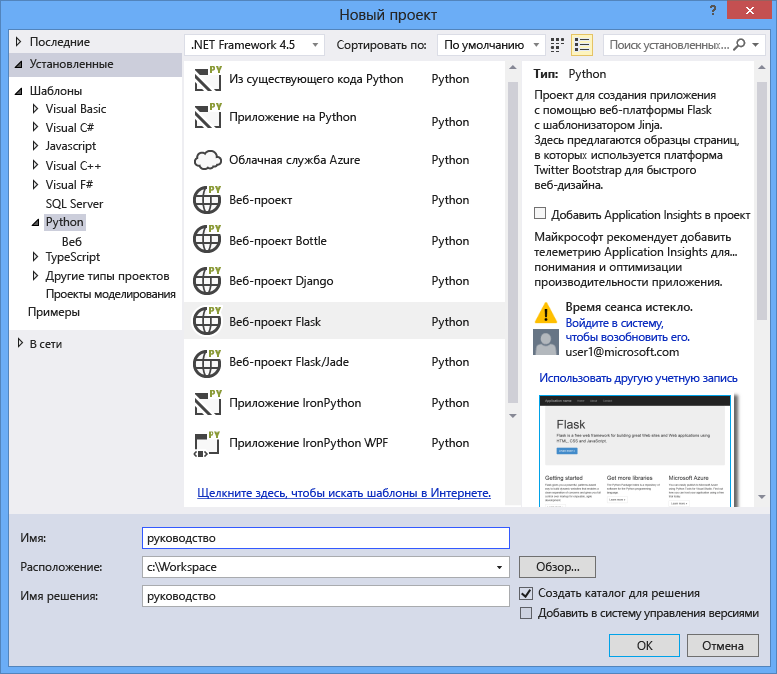
4. В окне **Инструменты Python для Visual Studio** щелкните **Установить в виртуальной среде**.
   
    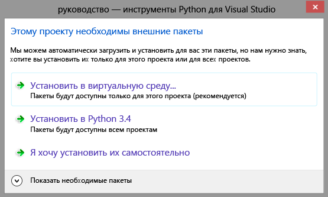
5. В окне **Добавление виртуальной среды** вы можете принять значения по умолчанию и использовать Python 2.7 в качестве базовой среды (так как PyDocumentDB сейчас не поддерживает версию Python 3.x), а затем нажать кнопку **Создать**. Для вашего проекта будет настроена требуемая виртуальная среда Python.
   
    
   
    Когда среда будет успешно установлена, в окне вывода отобразится сообщение `Successfully installed Flask-0.10.1 Jinja2-2.8 MarkupSafe-0.23 Werkzeug-0.11.5 itsdangerous-0.24 'requirements.txt' was installed successfully.`

## Шаг 3. Изменение веб-приложения Python Flask
### Добавление пакетов Python Flask в проект
После настройки параметров проекта нужно добавить к нему ряд необходимых пакетов Flask, включая pydocumentdb — пакет Python для DocumentDB.

1. В обозревателе решений откройте файл **requirements.txt** и замените его содержимое приведенным ниже кодом.
   
        flask==0.9
        flask-mail==0.7.6
        sqlalchemy==0.7.9
        flask-sqlalchemy==0.16
        sqlalchemy-migrate==0.7.2
        flask-whooshalchemy==0.55a
        flask-wtf==0.8.4
        pytz==2013b
        flask-babel==0.8
        flup
        pydocumentdb>=1.0.0
2. Сохраните файл **requirements.txt**.
3. В обозревателе решений щелкните элемент **env** правой кнопкой мыши и выберите пункт **Установить из файла requirements.txt**.
   
    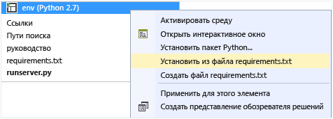
   
    После успешной установки в окне вывода отобразятся следующие сведения:
   
        Successfully installed Babel-2.3.2 Tempita-0.5.2 WTForms-2.1 Whoosh-2.7.4 blinker-1.4 decorator-4.0.9 flask-0.9 flask-babel-0.8 flask-mail-0.7.6 flask-sqlalchemy-0.16 flask-whooshalchemy-0.55a0 flask-wtf-0.8.4 flup-1.0.2 pydocumentdb-1.6.1 pytz-2013b0 speaklater-1.3 sqlalchemy-0.7.9 sqlalchemy-migrate-0.7.2
   
   > [!NOTE]
   > В редких случаях в окне вывода появляется ошибка. В этом случае проверьте, связана ли ошибка с очисткой. Иногда происходит сбой очистки, но установка все равно завершается успешно (прокрутите окно вывода вверх, чтобы убедиться в этом). Чтобы определить успешность установки, воспользуйтесь [проверкой виртуальной среды](#verify-the-virtual-environment). Если установка завершилась ошибкой, но проверка прошла успешно, можно продолжать работу.
   > 
   > 

### Проверка виртуальной среды
Убедимся, что все установлено правильно.

1. Выполните сборку решения, нажав клавиши **CTRL**+**SHIFT**+**B**.
2. После успешной сборки запустите веб-сайт, нажав клавишу **F5**. Будут запущены сервер разработки Flask и веб-браузер. Вы должны увидеть следующую страницу:
   
    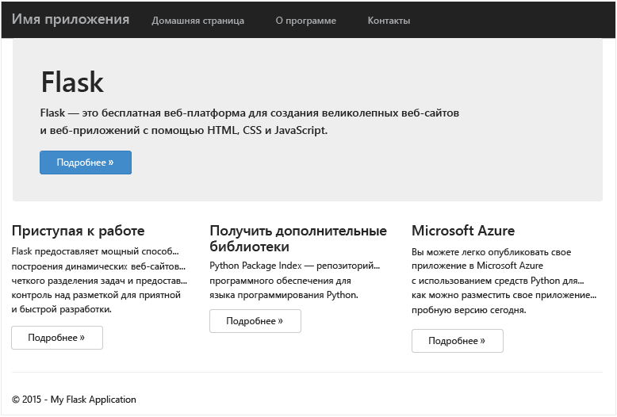
3. Остановите отладку веб-сайта в Visual Studio. Для этого нажмите клавиши **SHIFT**+**F5**.

### Создание определений базы данных, коллекции и документа
Теперь давайте создадим приложение для голосования, добавив новые файлы и обновив остальные.

1. В обозревателе решений щелкните правой кнопкой мыши проект **tutorial**, выберите пункт **Добавить**, а затем щелкните **Новый элемент**. Выберите элемент **Пустой файл Python** и присвойте файлу имя **forms.py**.
2. Добавьте следующий код в файл forms.py и сохраните файл.

```python
from flask.ext.wtf import Form
from wtforms import RadioField

class VoteForm(Form):
    deploy_preference  = RadioField('Deployment Preference', choices=[
        ('Web Site', 'Web Site'),
        ('Cloud Service', 'Cloud Service'),
        ('Virtual Machine', 'Virtual Machine')], default='Web Site')
```


### Добавьте необходимые файлы импорта в views.py.
1. В обозревателе решений разверните папку **tutorial** и откройте файл **views.py**.
2. Добавьте в начало файла **views.py** приведенные ниже инструкции import и сохраните файл. Они выполнят импорт пакета SDK для Python и пакетов Flask DocumentDB.
   
    ```python
    from forms import VoteForm
    import config
    import pydocumentdb.document_client as document_client
    ```

### Создание базы данных, коллекции и документа
* Добавьте в конец файла **views.py** следующий код: Он отвечает за создание базы данных, используемой формой. Не удаляйте код в файле **views.py**. Просто переместите его в конец.

```python
@app.route('/create')
def create():
    """Renders the contact page."""
    client = document_client.DocumentClient(config.DOCUMENTDB_HOST, {'masterKey': config.DOCUMENTDB_KEY})

    # Attempt to delete the database.  This allows this to be used to recreate as well as create
    try:
        db = next((data for data in client.ReadDatabases() if data['id'] == config.DOCUMENTDB_DATABASE))
        client.DeleteDatabase(db['_self'])
    except:
        pass

    # Create database
    db = client.CreateDatabase({ 'id': config.DOCUMENTDB_DATABASE })

    # Create collection
    collection = client.CreateCollection(db['_self'],{ 'id': config.DOCUMENTDB_COLLECTION })

    # Create document
    document = client.CreateDocument(collection['_self'],
        { 'id': config.DOCUMENTDB_DOCUMENT,
          'Web Site': 0,
          'Cloud Service': 0,
          'Virtual Machine': 0,
          'name': config.DOCUMENTDB_DOCUMENT 
        })

    return render_template(
       'create.html',
        title='Create Page',
        year=datetime.now().year,
        message='You just created a new database, collection, and document.  Your old votes have been deleted')
```

> [!TIP]
> Метод **CreateCollection** имеет третий необязательный параметр **RequestOptions**. Его можно использовать для указания типа предложения коллекции. Если значение типа предложения не указано, будет создана коллекция с использованием типа предложения по умолчанию. Дополнительные сведения о типах предложений DocumentDB см. в статье [Уровни производительности в DocumentDB](documentdb-performance-levels.md).
> 
> 

### Чтение базы данных, коллекции и документа и отправка формы
* Добавьте в конец файла **views.py** следующий код: Он служит для настройки формы, чтения базы данных, коллекции и документа. Не удаляйте существующий код в файле **views.py**. Просто переместите его в конец.

```python
@app.route('/vote', methods=['GET', 'POST'])
def vote(): 
    form = VoteForm()
    replaced_document ={}
    if form.validate_on_submit(): # is user submitted vote  
        client = document_client.DocumentClient(config.DOCUMENTDB_HOST, {'masterKey': config.DOCUMENTDB_KEY})

        # Read databases and take first since id should not be duplicated.
        db = next((data for data in client.ReadDatabases() if data['id'] == config.DOCUMENTDB_DATABASE))

        # Read collections and take first since id should not be duplicated.
        coll = next((coll for coll in client.ReadCollections(db['_self']) if coll['id'] == config.DOCUMENTDB_COLLECTION))

        # Read documents and take first since id should not be duplicated.
        doc = next((doc for doc in client.ReadDocuments(coll['_self']) if doc['id'] == config.DOCUMENTDB_DOCUMENT))

        # Take the data from the deploy_preference and increment our database
        doc[form.deploy_preference.data] = doc[form.deploy_preference.data] + 1
        replaced_document = client.ReplaceDocument(doc['_self'], doc)

        # Create a model to pass to results.html
        class VoteObject:
            choices = dict()
            total_votes = 0

        vote_object = VoteObject()
        vote_object.choices = {
            "Web Site" : doc['Web Site'],
            "Cloud Service" : doc['Cloud Service'],
            "Virtual Machine" : doc['Virtual Machine']
        }
        vote_object.total_votes = sum(vote_object.choices.values())

        return render_template(
            'results.html', 
            year=datetime.now().year, 
            vote_object = vote_object)

    else :
        return render_template(
            'vote.html', 
            title = 'Vote',
            year=datetime.now().year,
            form = form)
```


### Создание HTML-файлов
1. В обозревателе решений в папке **tutorial** щелкните правой кнопкой мыши папку **templates**, выберите пункт **Добавить**, а затем **Новый элемент**.
2. Выберите **HTML-страница**, а затем в поле «Имя» введите **create.html**.
3. Повторите шаги 1 и 2, чтобы создать два дополнительных HTML-файла: results.html и vote.html.
4. Добавьте следующий код в файл **create.html** в элементе `<body>`. В нем будет отображаться сообщение о создании новой базы данных, коллекции и документа.
   
    ```html
    
    
    <h2>{{ title }}.</h2>
    <h3>{{ message }}</h3>
    <p><a href="{{ url_for('vote') }}" class="btn btn-primary btn-large">Vote &raquo;</a></p>
    
    ```
5. Добавьте следующий код в элемент `<body`>. файла **results.html**. В нем будут отображаться результаты опроса.
   
    ```html
    
    
    <h2>Results of the vote</h2>
        <br />
   
    
    <div class="row">
        <div class="col-sm-5">{{choice}}</div>
            <div class="col-sm-5">
                <div class="progress">
                    <div class="progress-bar" role="progressbar" aria-valuenow="{{vote_object.choices[choice]}}" aria-valuemin="0" aria-valuemax="{{vote_object.total_votes}}" style="width: {{(vote_object.choices[choice]/vote_object.total_votes)*100}}%;">
                                {{vote_object.choices[choice]}}
                </div>
            </div>
            </div>
    </div>
    
   
    <br />
    <a class="btn btn-primary" href="{{ url_for('vote') }}">Vote again?</a>
    
    ```
6. Добавьте следующий код в элемент `<body`> файла **vote.html**. В нем будет отображаться опрос и приниматься голоса. При регистрации голосов управление передается файлу views.py, в котором голоса будут учитываться и, соответственно, добавляться в документ.
   
    ```html
    
    
    <h2>What is your favorite way to host an application on Azure?</h2>
    <form action="" method="post" name="vote">
        {{form.hidden_tag()}}
            {{form.deploy_preference}}
            <button class="btn btn-primary" type="submit">Vote</button>
    </form>
    
    ```
7. В папке **templates** замените содержимое файла **index.html** приведенным ниже кодом. Он будет служить главной страницей приложения.
   
    ```html
    
    
    <h2>Python + DocumentDB Voting Application.</h2>
    <h3>This is a sample DocumentDB voting application using PyDocumentDB</h3>
    <p><a href="{{ url_for('create') }}" class="btn btn-primary btn-large">Create/Clear the Voting Database &raquo;</a></p>
    <p><a href="{{ url_for('vote') }}" class="btn btn-primary btn-large">Vote &raquo;</a></p>
    
    ```

### Добавьте файл конфигурации и измените файл \_\_init\_\_.py
1. В обозревателе решений щелкните правой кнопкой мыши проект **tutorial**, последовательно выберите пункты **Добавить**, **Новый элемент** и **Пустой файл Python**, а затем введите имя файла **config.py**. Этот файл необходим для работы форм в Flask. Кроме того, его можно использовать для предоставления секретного ключа. В этом учебнике секретный ключ не требуется.
2. Добавьте приведенный ниже код в файл config.py. На следующем этапе вам потребуется изменить значения свойств **DOCUMENTDB\_HOST** и **DOCUMENTDB\_KEY**.
   
    ```python
    CSRF_ENABLED = True
    SECRET_KEY = 'you-will-never-guess'
   
    DOCUMENTDB_HOST = 'https://YOUR_DOCUMENTDB_NAME.documents.azure.com:443/'
    DOCUMENTDB_KEY = 'YOUR_SECRET_KEY_ENDING_IN_=='
   
    DOCUMENTDB_DATABASE = 'voting database'
    DOCUMENTDB_COLLECTION = 'voting collection'
    DOCUMENTDB_DOCUMENT = 'voting document'
    ```
3. На [портале Azure](https://portal.azure.com/) перейдите в колонку **Ключи**, щелкните **Обзор**, **Учетные записи DocumentDB**, дважды щелкните имя учетной записи и нажмите кнопку **Ключи** в области **Основные компоненты**. В колонке **Ключи** скопируйте значение **URI** и вставьте его в файл **config.py** как значение для свойства **DOCUMENTDB\_HOST**.
4. Вернитесь на портал Azure, перейдите в колонку **Ключи**, скопируйте значение **первичного** или **вторичного ключа** и вставьте его в файл **config.py** как значение для свойства **DOCUMENTDB\_KEY**.
5. В файл **\_\_init\_\_.py** добавьте следующую строку:
   
        app.config.from_object('config')
   
    В результате содержимое файла будет выглядеть так:
   
    ```python
    from flask import Flask
    app = Flask(__name__)
    app.config.from_object('config')
    import tutorial.views
    ```
6. После добавления всех файлов обозреватель решений должен выглядеть следующим образом:
   
    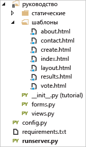

## Шаг 4. Локальный запуск веб-приложения
1. Выполните сборку решения, нажав клавиши **CTRL**+**SHIFT**+**B**.
2. После успешной сборки запустите веб-сайт, нажав клавишу **F5**. На экране должно отображаться следующее:
   
    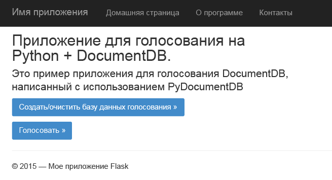
3. Щелкните **Создать или очистить базу данных голосования**, чтобы создать базу данных.
   
    
4. Затем нажмите кнопку **Голосовать** и сделайте свой выбор.
   
    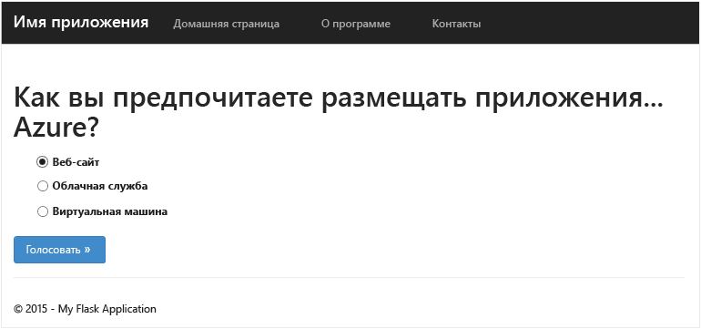
5. Для каждого учтенного голоса будет увеличиваться соответствующий счетчик.
   
    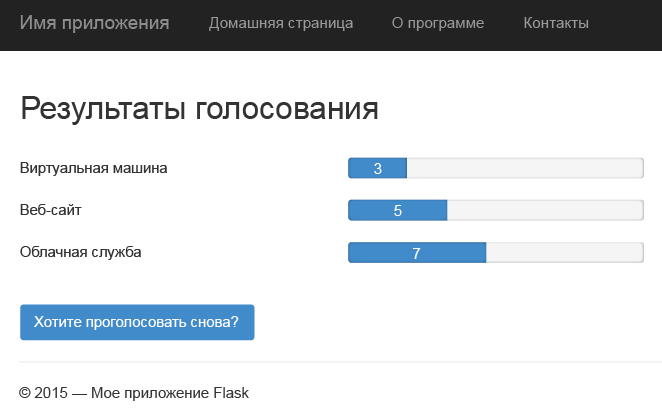
6. Остановите отладку проекта, нажав клавиши SHIFT+F5.

## Шаг 5. Развертывание веб-приложения на веб-сайтах Azure
Теперь, когда у вас есть готовое приложение и оно корректно работает в DocumentDB, мы развернем его на веб-сайтах Azure.

1. Правой кнопкой мыши щелкните проект в обозревателе решений (перед этим убедитесь, что он не запущен локально) и выберите пункт **Опубликовать**.
   
     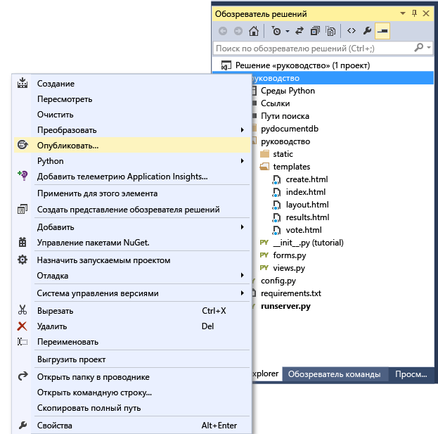
2. В окне **Публикация веб-сайта** выберите **Веб-сайты Microsoft Azure** и нажмите кнопку **Далее**.
   
    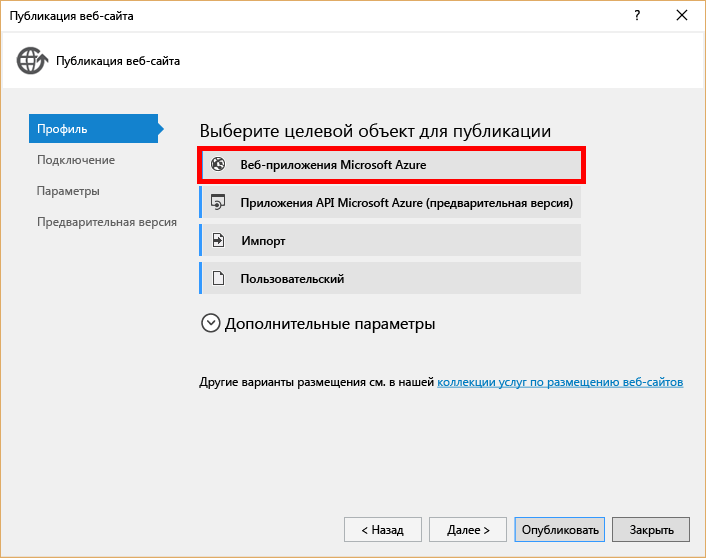
3. В окне **Веб-приложения Microsoft Azure** нажмите кнопку **Создать**.
   
    
4. В окне **Создание сайта в Microsoft Azure** введите **Имя веб-приложения**, **План обслуживания приложения**, **Группу ресурсов** и **Регион**, затем нажмите кнопку **Создать**.
   
    
5. В окне **Публикация веб-сайта** нажмите кнопку **Опубликовать**.
   
    
6. Через несколько секунд Visual Studio завершит публикацию вашего веб-приложения и запустит браузер, где вы увидите свое творение, запущенное в Azure!

## Устранение неполадок
Если это первое приложение Python, которое вы запускаете на компьютере, убедитесь, что следующие папки (или эквивалентные расположения установки) включены в переменную PATH:

    C:\Python27\site-packages;C:\Python27\;C:\Python27\Scripts;

Если на странице голосования появляется сообщение об ошибке, а имя проекта отличается от **tutorial**, убедитесь, что файл **\_\_init\_\_.py** ссылается на имя нужного проекта в строке `import tutorial.view`.

## Дальнейшие действия
Поздравляем! Вы только что закончили свое первое веб-приложение на Python с помощью Azure DocumentDB и опубликовали его в службе веб-сайтов Azure.

Мы регулярно обновляем и улучшаем эту статью на основе ваших отзывов. После завершения учебника воспользуйтесь кнопками голосования в верхней и нижней части страницы, а также оставьте отзыв о том, что следует улучшить по вашему мнению. Если вы хотите, чтобы мы связались с вами, укажите ваш электронный адрес в комментариях.

Чтобы узнать, как добавить дополнительные функции в веб-приложение, ознакомьтесь с доступными API-интерфейсами в [пакете SDK для Python в DocumentDB](documentdb-sdk-python.md).

Дополнительные сведения об Azure, Visual Studio и Python см. в [центре разработчиков Python](https://azure.microsoft.com/develop/python/).

Дополнительные руководства по Python Flask: [Мегаруководство по Flask, часть I. Привет, мир!](http://blog.miguelgrinberg.com/post/the-flask-mega-tutorial-part-i-hello-world)

[Visual Studio Express]: http://www.visualstudio.com/products/visual-studio-express-vs.aspx
[2]: https://www.python.org/downloads/windows/
[3]: https://www.microsoft.com/download/details.aspx?id=44266
[Microsoft Web Platform Installer]: http://www.microsoft.com/web/downloads/platform.aspx
[Azure portal]: http://portal.azure.com

<!---HONumber=AcomDC_0831_2016-->