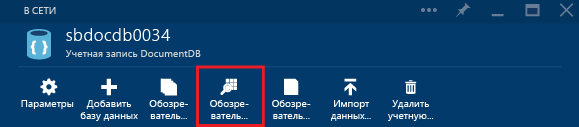
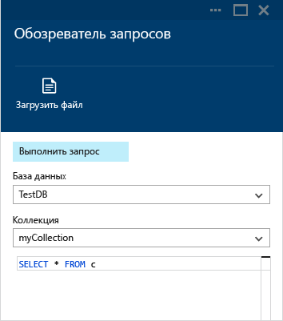
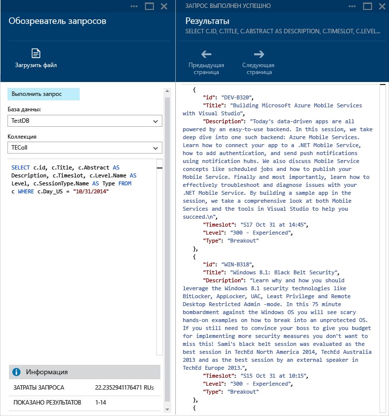
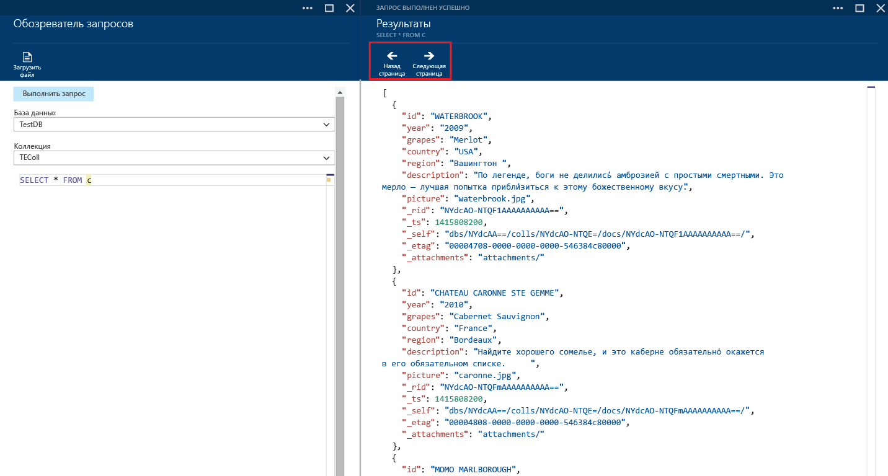
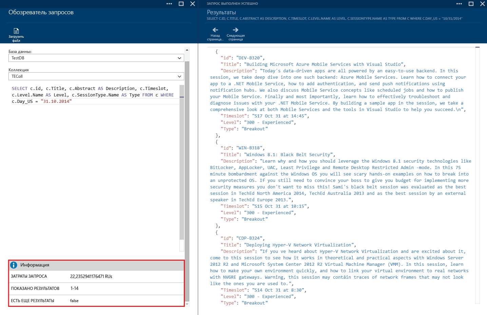
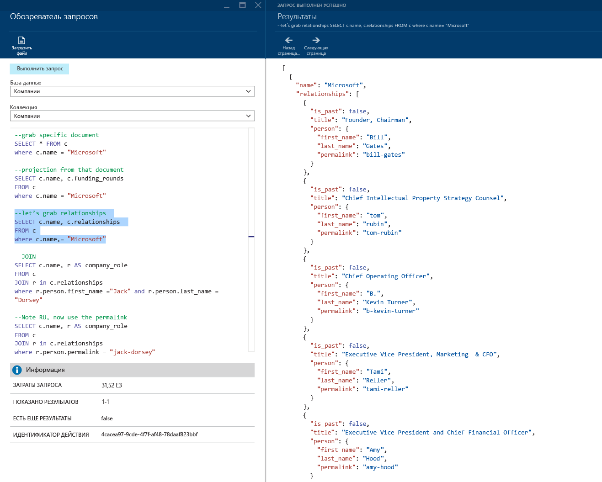
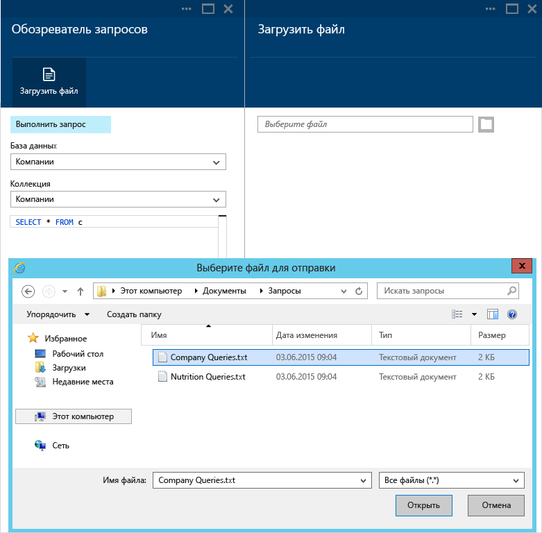
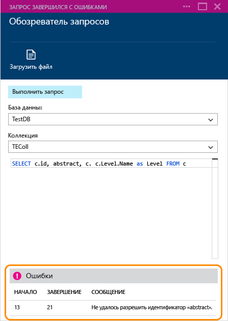

# Создание, изменение и выполнение SQL-запросов для Azure Cosmos DB с помощью обозревателя запросов на портале Azure
В этой статье приведены общие сведения об обозревателе запросов [Microsoft Azure Cosmos DB](https://azure.microsoft.com/services/documentdb/), который представляет собой инструмент портала Azure, предназначенный для создания, изменения и выполнения SQL-запросов к [коллекции DocumentDB](documentdb-create-collection.md).

1. На [портале Azure](https://portal.azure.com) в области навигации слева щелкните  **Azure Cosmos DB**. 

    Если служба **Azure Cosmos DB** не отображается, то выберите внизу пункт **Больше служб** и щелкните  **Azure Cosmos DB**.
2. В меню ресурсов выберите **Обозреватель запросов**. 
   
    
3. В колонке **Обозреватель запросов** выберите раскрывающиеся списки **Базы данных** и **Коллекции**, чтобы выполнить запрос из них, и введите запрос для выполнения. 
   
    Раскрывающиеся списки **Базы данных** и **Коллекции** предварительно заполняются в зависимости от контекста, в котором запускается обозреватель запросов. 
   
    По умолчанию указан запрос `SELECT TOP 100 * FROM c` .  Вы можете принять запрос по умолчанию или создать собственный запрос с помощью языка SQL-запросов, описанного в [памятке по DocumentDB SQL](documentdb-sql-query-cheat-sheet.md) или в статье [SQL-запросы и синтаксис SQL в DocumentDB](documentdb-sql-query.md).
   
    Нажмите кнопку **Выполнить запрос** , чтобы просмотреть результаты.
   
    
4. В колонке **Результаты** отобразятся результаты запроса. 
   
    

## Работа с результатами
По умолчанию обозреватель запросов возвращает результаты наборами по 100.  Если запрос выдает больше 100 результатов, то воспользуйтесь командами **Следующая страница** и **Предыдущая страница** для перемещения по списку результатов.

В области **Сведения** отображаются метрики успешно выполненных запросов, например плата за запрос, количество выполненных круговых путей запроса, текущие отображаемые результаты и наличие дополнительных результатов, к которым можно перейти с помощью команды **Следующая страница**, как описано выше.

## Использование нескольких запросов
Если вы используете несколько запросов и хотите быстро переключаться между ними, то все запросы можно ввести в текстовое поле запроса в колонке **Обозреватель запросов**, а затем выделить запрос для выполнения и нажать кнопку **Выполнить запрос**, чтобы просмотреть результаты.

## Добавление запросов из файла в редактор SQL-запросов
Загрузить содержимое существующего файла можно с помощью команды **Загрузить файл** .

## Устранение неполадок
Если запрос завершается ошибками, обозреватель запросов выводит список ошибок, который может быть полезен при устранении неполадок.

## Выполнение SQL-запросов к API DocumentDB за пределами портала
Использование обозревателя запросов на портале Azure — это один из способов выполнения SQL-запросов к Cosmos DB. Вы можете также выполнять SQL-запросы с помощью [REST API](https://msdn.microsoft.com/library/azure/dn781481.aspx) или [клиентских пакетов SDK](documentdb-sdk-dotnet.md). Дополнительные сведения об использовании других способов см. в разделе [Выполнение SQL-запросов](documentdb-sql-query.md#ExecutingSqlQueries).

## Дальнейшие действия
Дополнительные сведения о грамматике SQL в API DocumentDB, которую поддерживает обозреватель запросов, см. в статье [SQL-запросы и синтаксис SQL в Azure Cosmos DB](documentdb-sql-query.md). Вы также можете распечатать [памятку по запросу SQL](documentdb-sql-query-cheat-sheet.md).
Вы также можете поэкспериментировать на [площадке для запросов](https://www.documentdb.com/sql/demo) , где запросы можно тестировать через Интернет с помощью примера набора данных.

