# Просмотр, изменение, создание и отправка документов JSON 

Эта статья содержит обзор двух способов для создания, изменения и запроса документов на портале — [обозревателя документов](#launch-document-explorer) и [обозревателя данных (предварительная версия)](#data-explorer).

> [!NOTE]
> В учетных записях Azure Cosmos DB с поддержкой протокола для MongoDB проводник документов не включен. Страница будет обновлена после включения этого компонента.

## Запуск проводника документов на портале Azure
1. На [портале Azure](https://portal.azure.com) в области навигации слева щелкните  **Azure Cosmos DB**. 

    Если служба **Azure Cosmos DB** не отображается, то выберите внизу пункт **Больше служб** и щелкните  **Azure Cosmos DB**.
2. Выберите имя учетной записи. 
3. В меню ресурсов выберите **Обозреватель документов**. 
   
    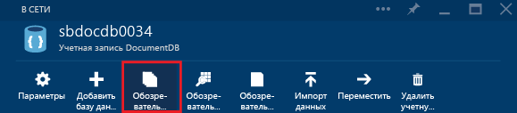
   
    В колонке **Обозреватель документов** раскрывающиеся списки **Базы данных** и **Коллекции** заполняются заранее в зависимости от контекста, в котором запускается проводник документов. 

## Создание документа JSON
1. [Запустите проводник документов](#launch-document-explorer).
2. В колонке **Обозреватель документов** щелкните **Создать документ**. 
   
    В колонке **Документ** представлен минимальный фрагмент кода JSON.
   
    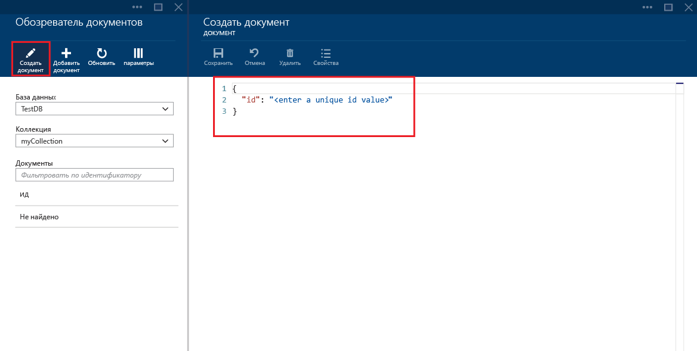
3. В колонке **Документ** введите или вставьте содержимое документа JSON, который нужно создать. Затем нажмите кнопку **Сохранить**, чтобы зафиксировать документ в базе данных и коллекции, которые указаны в колонке **Обозреватель документов**.
   
    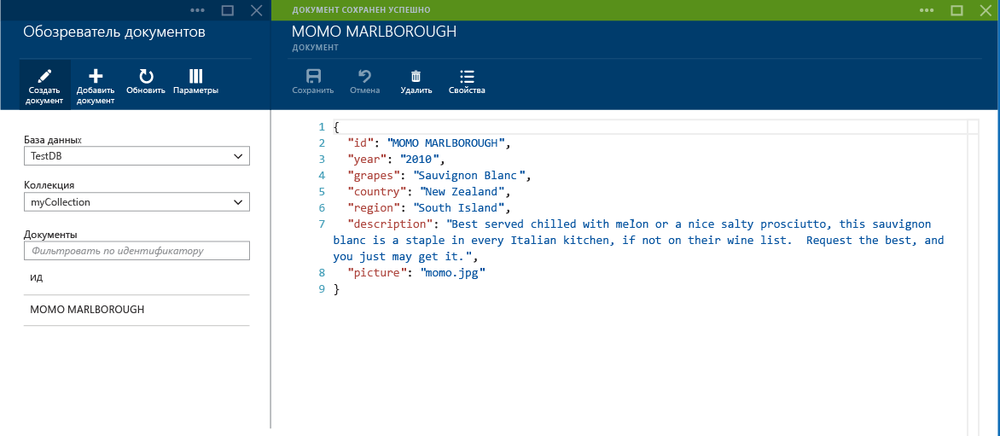
   
   > [!NOTE]
   > Если не указано свойство id (идентификатор), обозреватель документов автоматически добавляет свойство id и создает GUID как значение идентификатора.
   > 
   > 
   
    Если у вас уже есть данные из JSON-файлов, баз MongoDB и SQL Server, CSV-файлов, хранилища таблиц Azure, Amazon DynamoDB, HBase или других коллекций API DocumentDB, вы можете быстро импортировать их с помощью [средства API DocumentDB для переноса данных](documentdb-import-data.md).

## Изменение документа JSON
1. [Запустите проводник документов](#launch-document-explorer).
2. Чтобы изменить существующий документ, выберите его в колонке **Обозреватель документов**, измените документ в колонке **Документ**, а затем нажмите кнопку **Сохранить**.
   
    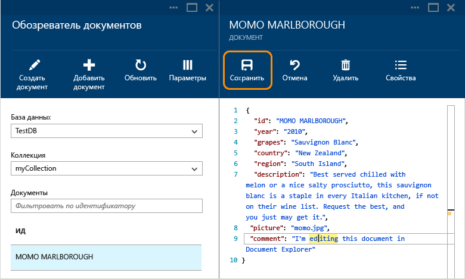
   
    Если во время изменения документа вам понадобится отменить текущие изменения, нажмите кнопку **Отменить** в колонке **Документ** и подтвердите действие отмены. Будет повторно загружено предыдущее состояние документа.
   
    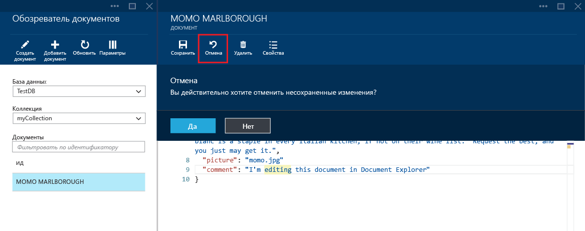

## Удаление документа из Cosmos DB
1. [Запустите проводник документов](#launch-document-explorer).
2. Выберите документ в колонке **Обозреватель документов**, нажмите кнопку **Удалить** и подтвердите удаление. После подтверждения документ будет немедленно удален из списка проводника документов.
   
    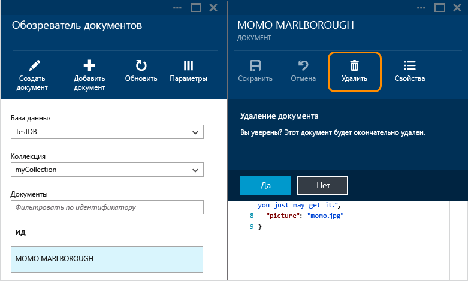

## Работа с документами JSON
Проводник документов выполняет проверку нового или измененного документа на содержание допустимых данных JSON.  Вы можете даже просмотреть ошибки JSON. Для этого наведите указатель мыши на неправильный раздел, чтобы получить сведения об ошибке проверки.

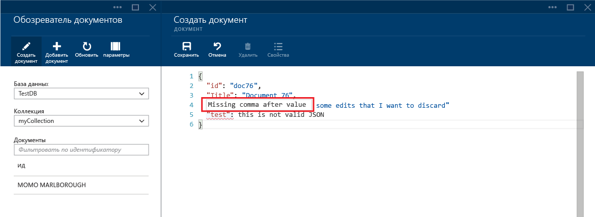

Кроме этого, обозреватель документов предотвращает сохранение документа с недопустимым содержимым JSON.

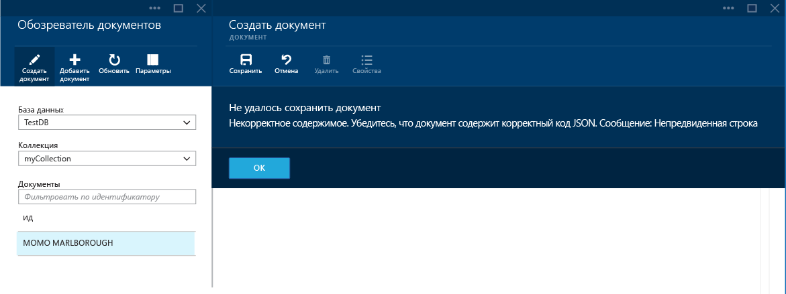

Наконец, обозреватель документов позволяет легко просмотреть системные свойства текущего загруженного документа с помощью команды **Свойства** .

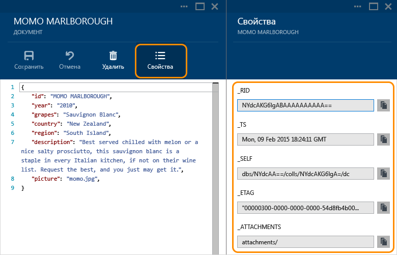

> [!NOTE]
> Свойство метки времени (_ts) внутренне представлено как время эпохи, но обозреватель документов отображает значение в читаемом формате GMT.
> 
> 

## Фильтрация документов
Обозреватель документов поддерживает ряд параметров навигации и дополнительных параметров.

По умолчанию обозреватель документов загружает первые 100 документов в выбранной коллекции (по дате создания от самой ранней к самой поздней).  Чтобы загрузить дополнительные документы (в пакетах по 100), выберите параметр **Дополнительная загрузка** в нижней части колонки обозревателя документов. Вы можете выбрать документы для загрузки с помощью команды **Фильтр** .

1. [Запустите проводник документов](#launch-document-explorer).
2. В верхней части колонки **Обозреватель документов** нажмите кнопку **Фильтр**.  
   
    
3. Под панелью команд отобразятся параметры фильтра. В параметрах фильтра укажите предложение WHERE и (или) предложение ORDER BY, а затем нажмите кнопку **Фильтр**.
   
   
   
   Проводник документов автоматически выведет обновленные результаты с документами, соответствующими запросу фильтра. Дополнительные сведения о грамматике SQL в API DocumentDB см. в статье [SQL-запросы и синтаксис SQL в DocumentDB](documentdb-sql-query.md). Вы также можете распечатать копию [памятки по DocumentDB SQL](documentdb-sql-query-cheat-sheet.md).
   
   Поля раскрывающихся списков **База данных** и **Коллекция** можно использовать для простого изменения коллекции, документы которой просматриваются в настоящее время, без необходимости закрывать и повторно запускать проводник документов.  
   
   Обозреватель документов также поддерживает фильтрацию загруженного в настоящий момент времени набора документов по их свойству идентификатора.  Просто введите идентификатор для фильтрации в поле "Документы".
   
   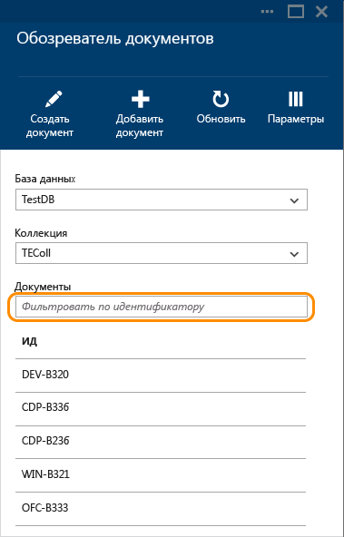
   
   Результаты в списке проводника документов будут отфильтрованы на основе указанных условий.
   
   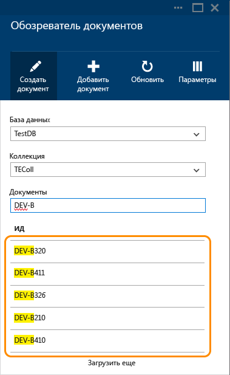
   
   > [!IMPORTANT]
   > Функциональные возможности фильтрации проводника документов обеспечивают только фильтрацию загруженного ***в настоящее время*** набора документов и не выполняют запросы к выбранной в данный момент коллекции.
   > 
   > 
4. Чтобы обновить список документов, загруженных в проводнике документов, нажмите кнопку **Обновить** в верхней части колонки.
   
    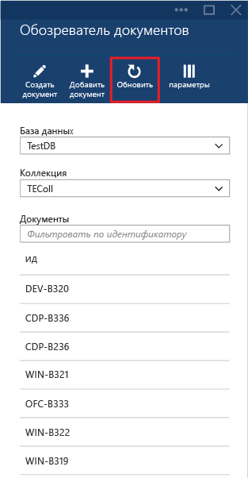

## Массовое добавление документов
Проводник документов поддерживает массовый прием одного или нескольких существующих документов JSON (до 100 JSON-файлов на операцию передачи).  

1. [Запустите проводник документов](#launch-document-explorer).
2. Чтобы начать процесс передачи, нажмите кнопку **Передача документа**.
   
    
   
    Откроется колонка **Передача документа** . 
3. Нажмите кнопку "Обзор", чтобы открыть окно проводника, выберите один или несколько документов JSON для передачи и нажмите кнопку **Открыть**.
   
    
   
   > [!NOTE]
   > Обозреватель документов в настоящее время поддерживает передачу до 100 документов JSON в одной операции передачи.
   > 
   > 
4. Выбрав элементы, нажмите кнопку **Передать** .  Документы автоматически добавляются в сетку обозревателя документов, а результаты передачи отображаются в ходе выполнения операции. Ошибки импорта выводятся для отдельных файлов.
   
    
5. После завершения операции можно выбрать до 100 других документов для передачи.

## Создание документа с помощью обозревателя данных (предварительная версия)

Другой способ создания, изменения и запроса документов на портале заключается в использовании обозревателя данных. Чтобы открыть обозреватель данных, щелкните элемент **Обозреватель данных (ознакомительная версия)** на панели навигации портала, разверните имя базы данных и имя коллекции, щелкните **Документы**, а затем нажмите кнопку **Создать документ**, как показано на следующем снимке экрана.

## Работа с документами JSON за пределами портала
Использование проводника документов на портале Azure — это один из способов работы с документами в Cosmos DB. Вы также можете работать с документами с помощью [REST API](https://msdn.microsoft.com/library/azure/mt489082.aspx) или [клиентских пакетов SDK](documentdb-sdk-dotnet.md). Просмотреть код можно в статьях [Примеры DocumentDB .NET](documentdb-dotnet-samples.md#document-examples) и [Примеры DocumentDB для Node.js](documentdb-nodejs-samples.md#document-examples).

Если вам нужно импортировать или перенести файлы из другого источника (JSON-файлы, MongoDB, SQL Server, CSV-файлы, хранилище таблиц Azure, Amazon DynamoDB или HBase), используйте для быстрого импорта данных [средство переноса данных](documentdb-import-data.md) Cosmos DB.

## Устранение неполадок
**Симптом**: проводник документов отображает сообщение **Документы не найдены**.

**Решение**: убедитесь, что выбрана правильная подписка, а также база данных и коллекция, в которую были добавлены документы. Также убедитесь, что соблюдается ваша квота пропускной способности. Если вы используете максимальный уровень пропускной способности, при котором выполняется регулирование, то необходимо понизить уровень использования приложений, чтобы соблюдалась квота максимальной пропускной способности для коллекции.

**Объяснение**: портал — это такое же приложение, как и любое другое; он выполняет вызовы к базе данных Cosmos DB и коллекции. Если в данный момент ваши запросы регулируются по той причине, что вызовы совершаются из другого приложения, то портал также может регулироваться, из-за чего ресурсы не отображаются на портале. Чтобы устранить эту проблему, найдите причину повышенного использования пропускной способности, а затем обновите колонку портала. Сведения об измерении и понижении уровня использования пропускной способности см. в разделе [Пропускная способность](documentdb-performance-tips.md#throughput) статьи [Советы по улучшению производительности DocumentDB](documentdb-performance-tips.md).

## Дальнейшие действия
Дополнительные сведения о грамматике SQL в API DocumentDB, которую поддерживает проводник документов, см. в статье [SQL-запросы и синтаксис SQL в DocumentDB](documentdb-sql-query.md). Вы также можете распечатать копию [памятки по DocumentDB SQL](documentdb-sql-query-cheat-sheet.md).

