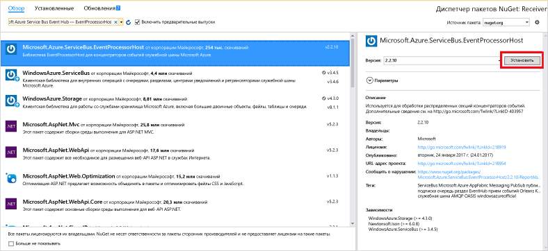

# <a name="receive-events-from-azure-event-hubs-using-the-net-framework"></a>Получение событий от концентраторов событий Azure с помощью платформы .NET Framework

## <a name="introduction"></a>Введение

Концентраторы событий — это служба, которая обрабатывает большие объемы данных телеметрии о событиях, поступающих от подключенных устройств и приложений. После сбора дынных в концентраторах событий их можно сохранить с помощью кластера хранилища или преобразовать с помощью поставщика аналитики в реальном времени. Эта возможность сбора и обработки большого объема данных о событиях является ключевым компонентом в современных архитектурах приложений, включая "Интернет вещей".

В этом руководстве показано, как создать консольное приложение .NET Framework для получения сообщений из концентратора событий с помощью узла **[EventProcessorHost][EventProcessorHost]**. Сведения об отправке событий с помощью платформы .NET Framework см. в статье [Отправка событий в концентраторы событий Azure с помощью платформы .NET Framework](event-hubs-dotnet-framework-getstarted-send.md) или выберите соответствующий язык в содержании статьи слева.

[EventProcessorHost][EventProcessorHost] представляет собой класс .NET, который упрощает прием событий от концентраторов событий путем управления постоянными контрольными точками и одновременно принимает сообщения от этих концентраторов событий в параллельном режиме. С помощью класса [EventProcessorHost][Event Processor Host] можно разделить события между несколькими получателями даже в том случае, если они размещены в разных узлах. В этом примере показано, как использовать [EventProcessorHost][EventProcessorHost] для одного получателя. В примере [развертывания обработки событий][Scale out Event Processing with Event Hubs] показано, как использовать [EventProcessorHost][EventProcessorHost] с несколькими получателями.

## <a name="prerequisites"></a>предварительным требованиям

Для работы с данным руководством вам потребуется:

* [Microsoft Visual Studio 2015 или более поздней версии](http://visualstudio.com). На приведенных в этом руководстве снимках экрана используется Visual Studio 2017.
* Активная учетная запись Azure. Если ее нет, можно создать бесплатную учетную запись всего за несколько минут. Дополнительные сведения см. в разделе [Бесплатная пробная версия Azure](https://azure.microsoft.com/free/).

## <a name="create-an-event-hubs-namespace-and-an-event-hub"></a>Создание пространства имен концентраторов событий и концентратора событий

Первым шагом является использование [портала Azure](https://portal.azure.com) для создания пространства имен типа концентраторов событий и получение учетных данных управления, необходимых приложению для взаимодействия с концентратором событий. Чтобы создать пространство имен и концентратор событий, выполните процедуру, описанную в [этой статье](event-hubs-create.md), а затем перейдите к следующим действиям в данном руководстве.

## <a name="create-an-azure-storage-account"></a>Создание учетной записи хранения Azure

Для использования класса [EventProcessorHost][EventProcessorHost] необходимо настроить [учетную запись хранения Azure][Azure Storage account].

1. Войдите на [портал Azure][Azure portal] и щелкните **Создать ресурс** в левой верхней части экрана.
2. Щелкните **Хранилище**, а затем — **Учетная запись хранения**.
   
    
3. На панели **Создание учетной записи хранения** введите имя учетной записи хранения. Выберите подписку Azure, группу ресурсов и расположение для создания ресурса. Затем щелкните **Создать**.
   
    
4. В списке учетных записей хранения выберите только что созданную учетную запись хранения.
5. На панели учетной записи хранения выберите **Ключи доступа**. Скопируйте значение **key1** , чтобы использовать позже в этом руководстве.
   
    

## <a name="create-a-receiver-console-application"></a>Создание консольного приложения получателя

1. Создайте в Visual Studio новый проект Visual C# для классических приложений с помощью шаблона проекта **Консольное приложение**. Присвойте проекту имя **Получатель**.
   
    
2. В обозревателе решений щелкните правой кнопкой мыши проект **Получатель** и выберите пункт **Управление пакетами NuGet для решения**.
3. Щелкните вкладку **Обзор** и выполните поиск `Microsoft Azure Service Bus Event Hub - EventProcessorHost`. Щелкните **Установить**и примите условия использования.
   
    
   
    Visual Studio скачает, установит и добавит ссылку на [пакет концентратора событий служебной шины Azure EventProcessorHost NuGet](https://www.nuget.org/packages/Microsoft.Azure.ServiceBus.EventProcessorHost)со всеми его зависимостями.
4. Щелкните правой кнопкой мыши проект **Получатель**, а затем выберите пункты **Добавить** и **Класс**. Присвойте новому классу имя **SimpleEventProcessor**, а затем нажмите кнопку **Добавить**, чтобы создать класс.
   
    
5. Добавьте в начало файла SimpleEventProcessor.cs следующие инструкции:
    
  ```csharp
  using Microsoft.ServiceBus.Messaging;
  using System.Diagnostics;
  ```
    
  Затем замените следующий код текстом класса:
    
  ```csharp
  class SimpleEventProcessor : IEventProcessor
  {
    Stopwatch checkpointStopWatch;
    
    async Task IEventProcessor.CloseAsync(PartitionContext context, CloseReason reason)
    {
        Console.WriteLine("Processor Shutting Down. Partition '{0}', Reason: '{1}'.", context.Lease.PartitionId, reason);
        if (reason == CloseReason.Shutdown)
        {
            await context.CheckpointAsync();
        }
    }
    
    Task IEventProcessor.OpenAsync(PartitionContext context)
    {
        Console.WriteLine("SimpleEventProcessor initialized.  Partition: '{0}', Offset: '{1}'", context.Lease.PartitionId, context.Lease.Offset);
        this.checkpointStopWatch = new Stopwatch();
        this.checkpointStopWatch.Start();
        return Task.FromResult<object>(null);
    }
    
    async Task IEventProcessor.ProcessEventsAsync(PartitionContext context, IEnumerable<EventData> messages)
    {
        foreach (EventData eventData in messages)
        {
            string data = Encoding.UTF8.GetString(eventData.GetBytes());
    
            Console.WriteLine(string.Format("Message received.  Partition: '{0}', Data: '{1}'",
                context.Lease.PartitionId, data));
        }
    
        //Call checkpoint every 5 minutes, so that worker can resume processing from 5 minutes back if it restarts.
        if (this.checkpointStopWatch.Elapsed > TimeSpan.FromMinutes(5))
        {
            await context.CheckpointAsync();
            this.checkpointStopWatch.Restart();
        }
    }
  }
  ```
    
  Этот класс вызывается из **EventProcessorHost** для обработки событий, полученных от концентратора событий. В классе `SimpleEventProcessor` используется контрольный таймер для периодического вызова метода контрольных точек в контексте **EventProcessorHost**. Благодаря этому в случае перезагрузки получателя будет потеряно не более пяти минут обработки.
6. Добавьте в класс **Program** в начале файла следующую инструкцию `using`.
    
  ```csharp
  using Microsoft.ServiceBus.Messaging;
  ```
    
  Затем измените метод `Main` в классе `Program` следующим кодом. При этом укажите имя концентратора событий и сохраненную ранее строку подключения уровня пространства имен, а также учетную запись хранения и ключ, которые вы скопировали в предыдущих разделах. 
    
  ```csharp
  static void Main(string[] args)
  {
    string eventHubConnectionString = "{Event Hubs namespace connection string}";
    string eventHubName = "{Event Hub name}";
    string storageAccountName = "{storage account name}";
    string storageAccountKey = "{storage account key}";
    string storageConnectionString = string.Format("DefaultEndpointsProtocol=https;AccountName={0};AccountKey={1}", storageAccountName, storageAccountKey);
    
    string eventProcessorHostName = Guid.NewGuid().ToString();
    EventProcessorHost eventProcessorHost = new EventProcessorHost(eventProcessorHostName, eventHubName, EventHubConsumerGroup.DefaultGroupName, eventHubConnectionString, storageConnectionString);
    Console.WriteLine("Registering EventProcessor...");
    var options = new EventProcessorOptions();
    options.ExceptionReceived += (sender, e) => { Console.WriteLine(e.Exception); };
    eventProcessorHost.RegisterEventProcessorAsync<SimpleEventProcessor>(options).Wait();
    
    Console.WriteLine("Receiving. Press enter key to stop worker.");
    Console.ReadLine();
    eventProcessorHost.UnregisterEventProcessorAsync().Wait();
  }
  ```

7. Запустите программу и убедитесь в отсутствии ошибок.
  
Поздравляем! Теперь вы можете получать сообщения из концентратора событий с помощью узла EventProcessorHost.


> [!NOTE]
> В данном руководстве используется один экземпляр [EventProcessorHost][EventProcessorHost]. Чтобы увеличить пропускную способность, мы советуем запустить несколько экземпляров [EventProcessorHost][EventProcessorHost], как показано в примере [обработки масштабируемого события][обработка масштабируемого события]. В этом случае различные экземпляры автоматически координируются друг с другом для распределения нагрузки полученных событий. Если каждый из нескольких получателей должен обрабатывать *все* события, то необходимо использовать понятие **ConsumerGroup** . При получении события от разных компьютеров может оказаться полезным указать имена экземпляров [EventProcessorHost][EventProcessorHost] в компьютерах (или ролях), где они развернуты. См. дополнительные сведения о [концентраторах событий Azure][Event Hubs overview] и [программировании концентраторов событий][Event Hubs Programming Guide].
> 
> 

## <a name="next-steps"></a>Дополнительная информация

Теперь у вас есть рабочее приложение, которое создает концентратор событий, а также отправляет и получает данные. Дополнительные сведения см. по следующим ссылкам:

* [Узел обработчика событий][Event Processor Host]
* [Обзор концентраторов событий Azure][Event Hubs overview].
* [Часто задаваемые вопросы о концентраторах событий](event-hubs-faq.md)

<!-- Images. -->
[19]: ./media/event-hubs-csharp-ephcs-getstarted/create-eh-proj1.png
[20]: ./media/event-hubs-csharp-ephcs-getstarted/create-eh-proj2.png
[21]: ./media/event-hubs-csharp-ephcs-getstarted/run-csharp-ephcs1.png
[22]: ./media/event-hubs-csharp-ephcs-getstarted/run-csharp-ephcs2.png

<!-- Links -->
[EventProcessorHost]: https://www.nuget.org/packages/Microsoft.Azure.ServiceBus.EventProcessorHost
[Event Hubs overview]: event-hubs-what-is-event-hubs.md
[Scale out Event Processing with Event Hubs]: https://code.msdn.microsoft.com/Service-Bus-Event-Hub-45f43fc3
[Event Hubs Programming Guide]: event-hubs-programming-guide.md
[Azure Storage account]:../storage/common/storage-create-storage-account.md
[Event Processor Host]: /dotnet/api/microsoft.servicebus.messaging.eventprocessorhost
[Azure portal]: https://portal.azure.com
