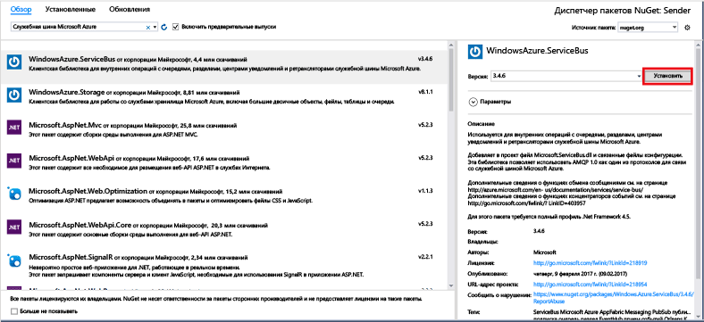

# <a name="send-events-to-azure-event-hubs-using-the-net-framework"></a>Отправка событий в концентраторы событий Azure с помощью платформы .NET Framework

## <a name="introduction"></a>Введение

Концентраторы событий — это служба, которая обрабатывает большие объемы данных телеметрии о событиях, поступающих от подключенных устройств и приложений. После сбора дынных в концентраторах событий их можно сохранить с помощью кластера хранилища или преобразовать с помощью поставщика аналитики в реальном времени. Эта возможность сбора и обработки большого объема данных о событиях является ключевым компонентом в современных архитектурах приложений, включая "Интернет вещей".

В этом руководстве показано, как использовать [портал Azure](https://portal.azure.com) для создания концентратора событий. Здесь также показано, как отправлять события в концентраторы событий Azure с помощью консольного приложения, написанного на языке C#, на платформе .NET Framework. Дополнительные сведения о получении событий с помощью платформы .NET Framework см. в [этой статье](event-hubs-dotnet-framework-getstarted-receive-eph.md) или выберите соответствующий язык в содержании статьи слева.

Для работы с данным руководством вам потребуется:

* [Microsoft Visual Studio 2015 или более поздней версии](http://visualstudio.com). На приведенных в этом руководстве снимках экрана используется Visual Studio 2017.
* Активная учетная запись Azure. Если ее нет, можно создать бесплатную учетную запись всего за несколько минут. Дополнительные сведения см. в разделе [Бесплатная пробная версия Azure](https://azure.microsoft.com/free/).

## <a name="create-an-event-hubs-namespace-and-an-event-hub"></a>Создание пространства имен концентраторов событий и концентратора событий

Первым шагом является использование [портала Azure](https://portal.azure.com) для создания пространства имен типа концентраторов событий и получение учетных данных управления, необходимых приложению для взаимодействия с концентратором событий. Чтобы создать пространство имен и концентратор событий, выполните процедуру, описанную в [этой статье](event-hubs-create.md), а затем перейдите к следующим действиям в данном руководстве.

## <a name="create-a-sender-console-application"></a>Создание консольного приложения отправителя

В этом разделе создается консольное приложение Windows для отправки событий в концентратор событий.

1. Создайте в Visual Studio новый проект Visual C# для классических приложений с помощью шаблона проекта **Консольное приложение** . Назовите проект **Sender**.
   
    
2. В обозревателе решений щелкните правой кнопкой мыши проект **Sender** и выберите пункт **Управление пакетами NuGet для решения**. 
3. Щелкните вкладку **Обзор** и выполните поиск `WindowsAzure.ServiceBus`. Щелкните **Установить**и примите условия использования. 
   
    
   
    Visual Studio скачает, установит и добавит ссылку на [пакет NuGet библиотеки служебной шины Azure](https://www.nuget.org/packages/WindowsAzure.ServiceBus).
4. Добавьте следующие инструкции `using` в начало файла **Program.cs** :
   
  ```csharp
  using System.Threading;
  using Microsoft.ServiceBus.Messaging;
  ```
5. Добавьте в класс **Program** приведенные ниже поля и укажите в качестве значений имя концентратора событий, созданного в предыдущем разделе, и сохраненную ранее строку подключения уровня пространства имен.
   
  ```csharp
  static string eventHubName = "{Event Hub name}";
  static string connectionString = "{send connection string}";
  ```
6. Добавьте следующий метод в класс **Program** .
   
  ```csharp
  static void SendingRandomMessages()
  {
      var eventHubClient = EventHubClient.CreateFromConnectionString(connectionString, eventHubName);
      while (true)
      {
          try
          {
              var message = Guid.NewGuid().ToString();
              Console.WriteLine("{0} > Sending message: {1}", DateTime.Now, message);
              eventHubClient.Send(new EventData(Encoding.UTF8.GetBytes(message)));
          }
          catch (Exception exception)
          {
              Console.ForegroundColor = ConsoleColor.Red;
              Console.WriteLine("{0} > Exception: {1}", DateTime.Now, exception.Message);
              Console.ResetColor();
          }
   
          Thread.Sleep(200);
      }
  }
  ```
   
  Этот метод постоянно отправляет события в концентратор событий с задержкой 200 мс.
7. Наконец, добавьте следующие строки в метод **Main** :
   
  ```csharp
  Console.WriteLine("Press Ctrl-C to stop the sender process");
  Console.WriteLine("Press Enter to start now");
  Console.ReadLine();
  SendingRandomMessages();
  ```
8. Запустите программу и убедитесь в отсутствии ошибок.
  
Поздравляем! Теперь вы можете отправлять сообщения в концентратор событий.

## <a name="next-steps"></a>Дополнительная информация
Теперь, когда вы создали рабочее приложение, которое создает концентратор событий и отправляет данные, можно перейти к следующим сценариям:

* [Создание событий с помощью узла обработчика событий](event-hubs-dotnet-framework-getstarted-receive-eph.md)
* [Справочник по узлу обработчика событий](/dotnet/api/microsoft.servicebus.messaging.eventprocessorhost)
* [Event Hubs overview](event-hubs-what-is-event-hubs.md)

<!-- Images. -->
[19]: ./media/event-hubs-csharp-ephcs-getstarted/create-eh-proj1.png
[20]: ./media/event-hubs-csharp-ephcs-getstarted/create-eh-proj2.png
[21]: ./media/event-hubs-csharp-ephcs-getstarted/run-csharp-ephcs1.png
[22]: ./media/event-hubs-csharp-ephcs-getstarted/run-csharp-ephcs2.png

