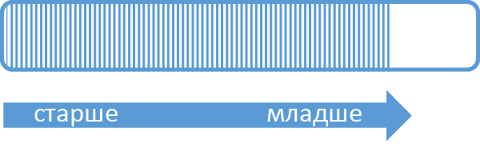
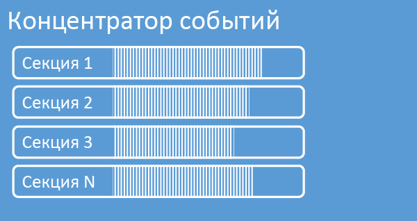
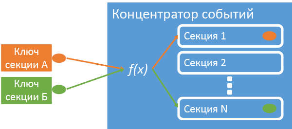
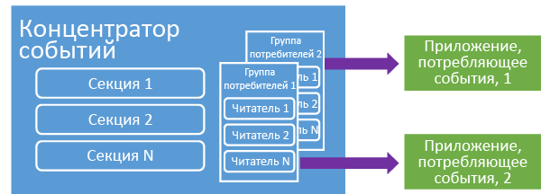

<properties 
   pageTitle="Обзор концентраторов событий Azure | Microsoft Azure"
   description="Введение и обзор концентраторов событий Azure."
   services="event-hubs"
   documentationCenter="na"
   authors="sethmanheim"
   manager="timlt"
   editor="" />
<tags 
   ms.service="event-hubs"
   ms.devlang="na"
   ms.topic="article"
   ms.tgt_pltfrm="na"
   ms.workload="na"
   ms.date="01/26/2016"
   ms.author="sethm" />

# Общие сведения о концентраторах событий Azure

Многие современные решения созданы, чтобы предоставить адаптивное взаимодействие для клиента или улучшить продукты с помощью постоянной обработки отзывов и автоматизированной телеметрии. Такие решения сталкиваются с проблемой безопасной и быстрой обработки больших объемов данных от многих параллельных издателей. Концентраторы событий Microsoft Azure — это служба управляемой платформы, которая обеспечивает основу для получения больших объемов данных в самых разных сценариях. Примерами таких сценариев могут служить отслеживание поведения в мобильных приложениях, сведения о трафике от веб-ферм, регистрация событий в играх для игровых консолей или данные телеметрии, собранные на промышленном оборудовании или подключенных автомобилях. Стандартная роль концентраторов событий в архитектуре решения — роль «двери» для конвейера событий, который часто называют *поглотителем событий*. Приемник событий — это компонент или служба, располагающиеся между источниками событий и адресатами событий и отделяющие создание потока событий от использования этих событий.

Концентраторы событий Microsoft Azure — это служба обработки событий, используемая для крупномасштабной передачи событий и данных телеметрии в облако при низкой задержке и с высокой надежностью. Эта служба при использовании вместе с другими подчиненными службами особенно полезна в сценариях инструментирования приложений, обеспечения удобства работы пользователя или функционирования рабочих процессов, а также Интернета вещей (IoT). Концентраторы событий предоставляют возможность обработки потока сообщений, и хотя концентратор событий очень похож на очереди и разделы, он имеет характеристики, которые сильно отличаются от традиционных корпоративных служб обмена сообщениями. Корпоративные сценарии обмена сообщениями часто требуют большого числа сложных возможностей, таких как определение последовательности, перемещение в «мертвую очередь», поддержка транзакций и гарантии доставки, в то время как главная проблема сбора событий — высокая пропускная способность и гибкость обработки потоков событий. Поэтому возможности концентраторов событий отличаются от разделов служебной шины, так как их акцент смещен в сторону высокой пропускной способности и сценариев обработки событий. Таким образом, концентраторы событий не реализуют некоторые возможности служб обмена сообщениями, которые доступны для разделов. Если такие возможности вам необходимы, разделы остаются оптимальным вариантом.

Концентратор событий создается на уровне пространства имен в служебной шине, аналогично очередям и разделам. Концентраторы событий используют AMQP и HTTP в качестве основных API-интерфейсов. На следующей схеме показана связь между концентраторами событий и служебной шиной.

## Общие сведения

Концентраторы событий предоставляют поток сообщений через шаблон секционированных потребителей. Очереди и разделы используют модель [конкурирующих потребителей](https://msdn.microsoft.com/library/dn568101.aspx), в которой каждый потребитель пытается считывать из одной и той же очереди или ресурса. Конкуренция за ресурсы в конечном итоге приводит к сложности и ограниченности масштабирования приложений для обработки потока. Концентраторы событий используют шаблон секционированных потребителей, в котором каждый потребитель считывает только определенное подмножество, или секцию, потока сообщений. Этот шаблон обеспечивает горизонтальное масштабирование для обработки событий и предоставляет другие функции, ориентированные на поток, которые недоступны для очередей и разделов.

### Разделы

Секция — это упорядоченная последовательность событий, хранящаяся в концентраторе событий. По мере поступления новых событий они добавляются в конец этой последовательности. Секцию можно рассматривать как «журнал фиксации».

Секции сохраняют данные в течение заданного периода удержания, который задается на уровне концентратора событий. Этот параметр применяется ко всем секциям концентратора событий. События удаляются по истечении срока действия; невозможно явно удалить их. Концентратор событий содержит несколько секций. Каждая секция является независимой и содержит собственную последовательность данных. В результате размер секций часто увеличивается с разной скоростью.

Число секций указывается во время создания концентратора событий и должно быть в диапазоне от 2 до 32 (по умолчанию — 4). Секции представляют собой механизм организации данных и более связаны со степенью параллелизма подчиненных элементов, чем с пропускной способностью концентраторов событий. Из-за этого выбор количества секций в концентраторе событий непосредственно связан с предполагаемым количеством параллельных модулей чтения. После создания концентратора событий количество секций изменить нельзя; следует обдумать это число с точки зрения ожидаемого долгосрочного масштабирования. Вы можете превысить ограничение в 32 секции, обратившись в службу поддержки служебной шины.

Хотя секции идентифицируются, и можно напрямую отправлять в них данные, рекомендуется избегать отправки данных в конкретные секции. Вместо этого можно использовать конструкции более высокого уровня, о которых говорится в разделах [Издатель событий](#event-publisher) и [Политики издателя](#capacity-and-security).

В контексте концентраторов событий сообщения называют *данными события*. Данные события содержат текст события, контейнер определяемых пользователем свойств, а также различные метаданные о событии, например его смещение в секции и его номер в последовательности потока. Секции заполняются последовательностями данных событий.

## Издатель событий

Любая сущность, которая отправляет события или данные в концентратор событий, является *издателем событий*. Издатели событий могут публиковать события с помощью HTTPS или AMQP 1.0. Издатели событий используют маркер подписи общего доступа (SAS), чтобы идентифицировать себя в концентраторе событий. Они могут иметь уникальное удостоверение или использовать общий маркер SAS в зависимости от требований сценария.

Дополнительные сведения о работе с SAS см. в статье [Проверка подлинности подписи общего доступа с помощью служебной шины](../service-bus/service-bus-shared-access-signature-authentication.md).

### Стандартные задачи издателя

В этом разделе описаны стандартные задачи издателей событий.

#### Получение маркера SAS

Подпись общего доступа (SAS) — это механизм проверки подлинности для концентраторов событий. Служебная шина предоставляет политики SAS на уровне пространства имен и концентратора событий. Маркер SAS создается на основе ключа SAS и хэша SHA URL-адреса, закодированного в определенном формате. С помощью имени ключа (политики) и маркера служебная шина может повторно создать хэш и таким образом проверить подлинность отправителя. Как правило, маркеры SAS для издателей событий создаются только с правом **отправки** конкретному концентратору событий. Этот механизм URL-адреса маркера SAS является основой для идентификации издателя, представленной в политике издателя. Дополнительные сведения о работе с SAS см. в статье [Проверка подлинности подписи общего доступа с помощью служебной шины](../service-bus/service-bus-shared-access-signature-authentication.md).

#### Публикация события

Вы можете опубликовать событие через протокол AMQP 1.0 или HTTPS. Служебная шина предоставляет класс [EventHubClient](https://msdn.microsoft.com/library/microsoft.servicebus.messaging.eventhubclient.aspx) для публикации событий в концентраторе событий от клиентов .NET. Для других сред выполнения и платформ можно использовать любой клиент AMQP 1.0, например [Apache Qpid](http://qpid.apache.org/). Можно публиковать события по отдельности или в пакетном режиме. Для одной публикации (экземпляра данных события) установлено ограничение в 256 КБ, независимо от того, одиночное это событие или пакет. Публикация событий большего размера приводит к ошибке. Рекомендуется не передавать издателям сведения о секциях в концентраторе событий, а указывать только *ключ секции* (см. следующий раздел) или их удостоверение через маркер SAS.

Решение об использовании AMQP или HTTPS обусловлено сценарием использования. AMQP требует установки постоянного двунаправленного сокета в дополнение к безопасности на уровне транспорта (TLS) или протоколу SSL/TLS. Это может быть дорогостоящей операцией с точки зрения сетевого трафика, но происходит только в начале сеанса AMQP. HTTPS дает меньшую начальную нагрузку, но требует дополнительных затрат SSL для каждого запроса. Для издателей, которые часто публикуют события, AMQP обеспечивает экономию с точки зрения производительности, задержки и пропускной способности.

### Ключ секции

Ключ секции является значением, которое используется для сопоставления входных данных событий конкретным секциям в целях организации данных. Ключ секции — это указываемое отправителем значение, передаваемое в концентратор событий. Оно обрабатывается посредством статических функций хэширования, в результате чего создается назначение секции. Если не указать ключ секции при публикации события, используется назначение путем циклического перебора. При использовании ключей секций издателю событий известен только ключ секции, но не сама секция, в которой публикуются события. Разделение ключа и секции изолирует отправителя от излишних сведений о последующей обработке и хранении событий. Ключи секций важны для организации данных для последующей обработки, но существенно не связаны с самими секциями. Уникальное удостоверение устройства или пользователя является хорошим ключом секции, но другие атрибуты, например географическое положение, можно также использовать для группировки связанных событий в одну секцию. На следующем рисунке показаны отправители событий, использующие ключи секций для прикрепления к секции.

Концентраторы событий обеспечивает доставку всех событий, использующих одинаковое значение ключа секции, в соответствующем порядке и в одну секцию. Важно, что если ключи секций используются с политиками издателя, описанными в следующем разделе, удостоверение издателя и значение ключа секции должны совпадать. В противном случае возникает ошибка.

### Потребитель события

Любая сущность, считывающая данные из концентратора событий, является потребителем событий. Все потребители событий считывают поток событий через секции в группе потребителей. В каждой секции одновременно должен присутствовать только один активный модуль чтения. Все потребители концентраторов событий подключаются через сеанс AMQP 1.0, в котором события доставляются, как только становятся доступными. Клиенту не требуется проводить опрос доступности данных.

#### Группы получателей

Механизм публикации и подписки концентраторов событий работает с помощью групп потребителей. Группа потребителей — это представление всего концентратора событий (состояние, позиция или смещение). Группы потребителей обеспечивают каждому из нескольких потребляющих приложений отдельное представление потока событий, а также возможность считывания потока независимо друг от друга в своем темпе и с собственными смещениями. В архитектуре обработки потока каждое потребляющее приложение соответствует группе потребителей. Если вы хотите записать данные событий в долговременное хранилище, то приложение, записывающее данные в хранилище, является группой потребителей. Сложную обработку событий выполняет еще одна, отдельная, группа потребителей. К секции можно обращаться только через группу потребителей. В концентраторе событий всегда есть группа потребителей по умолчанию, и можно создать до 20 групп потребителей для концентратора событий стандартного уровня.

Ниже приведены примеры соглашения URI группы потребителей.

	//<my namespace>.servicebus.windows.net/<event hub name>/<Consumer Group #1>
	//<my namespace>.servicebus.windows.net/<event hub name>/<Consumer Group #2>

На следующем рисунке показаны потребители событий в рамках групп потребителей.

#### Смещение потока

Смещение — это положение события внутри секции. Смещение можно представить как клиентский курсор. Смещение представляет собой байт-нумерацию события. Благодаря этому потребитель события (модуль чтения) может указать точку в потоке событий, с которой требуется начать чтение событий. Можно указать смещение как отметку времени или как значение смещения. Потребители ответственны за хранение своих собственных значений смещения вне службы концентраторов событий.

В секции каждое событие включает смещение. Это смещение используется потребителями для отображения положения в последовательности событий для данной секции. Смещения можно передавать концентратору событий как число или как значение отметки времени при подключении модуля чтения.

#### Контрольные точки

*Создание контрольных точек* — это процесс, с помощью которого модули чтения помечают или фиксируют свое положение в последовательности событий секции. Создание контрольных точек является ответственностью потребителя и выполняется для каждой секции в пределах группы потребителей. Это означает, что для каждой группы потребителей модуль чтения каждой секции должен хранить свое текущее положение в потоке событий и может сообщать службе, когда он считает поток данных завершенным. Если модуль чтения отключается от секции, при повторном подключении он приступает к чтению данных с контрольной точки, которая ранее была отправлена последним модулем чтения этой секции в этой группе потребителей. При подключении модуль чтения передает это смещение концентратору событий, чтобы указать положение, с которого следует начинать чтение. Таким образом можно использовать контрольные точки как для маркировки событий как «завершенных» подчиненными приложениями, так и для обеспечения устойчивости в случае отработки отказа между модулями чтения, работающими на разных компьютерах. Так как данные событий сохраняются в течение периода удержания, указанного во время создания концентратора событий, можно вернуться к более старым данным, указав более низкое смещение от этого процесса создания контрольных точек. Благодаря этому механизму создание контрольных точек обеспечивает как отказоустойчивость, так и управляемое воспроизведение потока событий.

#### Стандартные задачи потребителя

В этом разделе описаны стандартные задачи потребителей концентраторов событий или модулей чтения. Все потребители концентраторов событий подключаются через протокол AMQP 1.0. AMQP 1.0 — это двунаправленный канал связи с поддержкой сеанса и состояния. Каждая секция имеет сеанс связи AMQP 1.0, что упрощает транспортировку событий, разделенных по секциям.

##### Подключение к секции

Для получения событий из концентратора событий потребитель должен подключиться к секции. Как упоминалось ранее, доступ к секции всегда осуществляется через группу потребителей. В рамках модели секционированных потребителей только один модуль чтения должен быть активен в секции в любой момент времени в пределах группы потребителей. Распространенная практика при подключении непосредственно к секции — использовать механизм аренды для координации подключения к конкретным секциям для чтения. Таким образом, в каждой секции в группе потребителей может быть только один активный модуль чтения. Управление позицией модуля чтения в последовательности событий является важной задачей, которая выполняется с помощью контрольных точек. Эта функциональность упрощается за счет использования класса [EventProcessorHost](https://msdn.microsoft.com/library/microsoft.servicebus.messaging.eventprocessorhost.aspx) для клиентов .NET. [EventProcessorHost](https://msdn.microsoft.com/library/microsoft.servicebus.messaging.eventprocessorhost.aspx) — это интеллектуальный агент потребителя, он описан в следующем разделе.

##### Чтение событий

После открытия сеанса и связи AMQP 1.0 для определенной секции служба концентраторов событий доставляет события в клиент AMQP 1.0. Этот механизм доставки обеспечивает более высокую пропускную способность и меньшую задержку, чем механизмы извлечения по запросу, такие как HTTP GET. Когда события отправляются клиенту, каждый экземпляр данных событий содержит важные метаданные, такие как смещение и порядковый номер, которые используются для упрощения создания контрольных точек в последовательности событий.

Пользователь должен самостоятельно управлять этим смещением таким образом, который лучше всего позволяет управлять обработкой потока.

## Емкость и безопасность

Концентраторы событий — это отлично масштабируемая параллельная архитектура для входящего потока. Таким образом существует несколько ключевых аспектов, которые следует учитывать при выборе размера и масштабировании решения, основанного на концентраторах событий. Первый из элементов управления емкостью — *единицы пропускной способности*, описанные в следующем разделе.

### Единицы пропускной способности

Пропускная способность концентраторов событий контролируется с помощью единиц пропускной способности. Единицы пропускной способности — это предварительно приобретенные единицы емкости. Одна единица пропускной способности включает следующее.

- Входящие данные: до 1 МБ в секунду или 1 000 событий в секунду.

- Исходящие данные: до 2 МБ в секунду.

Входящие данные регулируются в соответствии с объемом, предоставленным количеством приобретенных единиц пропускной способности. Отправка данных свыше этого объема приводит к исключению «превышение квоты». Этот объем включает либо 1 МБ в секунду, либо 1 000 событий в секунду в зависимости от того, какое событие произойдет первым. Исходящие данные не формируют регулирующее исключение, но ограничены объемом передачи данных, предоставленным приобретенными единицами пропускной способности: 2 МБ в секунду на единицу. Если получено исключение скорости публикации, или ожидается повышенный объем исходящих данных, необходимо проверить количество единиц пропускной способности, приобретенных для пространства имен, в котором был создан концентратор событий. Чтобы получить дополнительные единицы пропускной способности, можно настроить соответствующий параметр на странице **Пространства имен** на вкладке **Масштабирование** [классического портала Azure][]. Можно также изменить этот параметр с помощью API Azure.

В то время как секции представляют собой концепции организации данных, единицы пропускной способности являются исключительно концепцией емкости. Единицы пропускной способности тарифицируются почасово и приобретаются заранее. После приобретения единицы пропускной способности тарифицируются минимум за один час. Для пространства имен служебной шины можно приобрести до 20 единиц пропускной способности, также существует лимит учетной записи Azure в размере 20 единиц пропускной способности. Эти единицы пропускной способности являются общими для всех концентраторов событий в заданном пространстве имен.

Единицы пропускной способности предоставляются наилучшим возможным образом и не всегда могут быть доступны для немедленной покупки. Если требуется определенная емкость, рекомендуется приобрести эти единицы пропускной способности заранее. Если требуется более 20 единиц пропускной способности, можно обратиться в службу поддержки служебной шины, чтобы приобрести дополнительные единицы пропускной способности на основе обязательства в блоках от 20 до первых 100 единиц пропускной способности. Кроме того, вы можете приобрести блоки на 100 единиц пропускной способности.

Рекомендуется тщательно сбалансировать количество единиц пропускной способности и секций, чтобы добиться оптимального масштабирования относительно концентраторов событий. Одна секция имеет максимальный масштаб в размере одной единицы пропускной способности. Количество единиц пропускной способности должно быть меньше или равно количеству секций в концентраторе событий.

Подробные сведения о ценах см. в разделе [цен на концентраторы событий](https://azure.microsoft.com/pricing/details/event-hubs/).

### Политика издателя

Концентраторы событий обеспечивают точный контроль над издателями событий через *политики издателя*. Политики издателя — это набор функций среды выполнения, разработанный для упрощения работы с большим количеством независимых издателей событий. Благодаря политикам издателя каждый издатель использует свой собственный уникальный идентификатор при публикации событий в концентраторе событий с помощью следующего механизма:

	//<my namespace>.servicebus.windows.net/<event hub name>/publishers/<my publisher name>

Не требуется создавать имена издателей заранее, но они должны соответствовать маркеру SAS, который используется при публикации события, для обеспечения идентификации независимого издателя. Дополнительные сведения о SAS см. в статье [Проверка подлинности подписи общего доступа с помощью служебной шины](../service-bus/service-bus-shared-access-signature-authentication.md). При использовании политик издателя значение **PartitionKey** присваивается имени издателя. Для правильной работы эти значения должны совпадать.

## Сводка

Концентраторы событий Azure предоставляют службу обработки крупномасштабных событий и данных телеметрии, которую можно использовать для мониторинга стандартных приложений и пользовательских рабочих процессов любого масштаба. Благодаря возможности публикации и подписки с низкой задержкой и с неограниченным масштабированием концентраторы событий становятся «трамплином» для больших объемов данных. Благодаря удостоверениям на базе издателя и спискам отзыва эти возможности используются в распространенных сценариях Интернета вещей. Дополнительные сведения о разработке приложений концентраторов событий см. в разделе [Руководство по программированию концентраторов событий](event-hubs-programming-guide.md).

## Дальнейшие действия

Теперь, когда вы изучили основные понятия, связанные с концентраторами событий, вы можете рассмотреть следующие сценарии.

- Начните работу с [учебника по концентраторам событий].
- Полный [пример приложения, использующего концентраторы событий].
- [Решение для обмена сообщениями в очереди] при помощи очередей служебной шины.

[классического портала Azure]: http://manage.windowsazure.com
[учебника по концентраторам событий]: event-hubs-csharp-ephcs-getstarted.md
[пример приложения, использующего концентраторы событий]: https://code.msdn.microsoft.com/windowsazure/Service-Bus-Event-Hub-286fd097
[Решение для обмена сообщениями в очереди]: ../service-bus/service-bus-dotnet-multi-tier-app-using-service-bus-queues.md
 

<!---HONumber=AcomDC_0128_2016-->