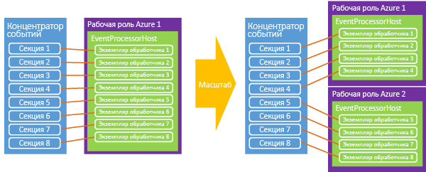

# <a name="event-hubs-programming-guide"></a>Руководство по программированию концентраторов событий

В этой статье обсуждаются некоторые распространенные сценарии написания кода с помощью концентраторов событий Azure и пакетов SDK для Azure .NET. Предполагается, что вы уже имеете представление о концентраторах событий. Общие сведения о концентраторах событий см. в статье [Общие сведения о концентраторах событий Azure](event-hubs-what-is-event-hubs.md).

## <a name="event-publishers"></a>Издатели событий

Отправка событий в концентратор событий осуществляется с использованием HTTP POST или через подключение AMQP 1.0. Выбор способа и времени зависит от определенного сценария, к которому выполняется обращение. Подключения AMQP 1.0 измеряются как подключения через посредника по служебной шине. Они больше всего подходят для сценариев с большими объемами сообщений и менее строгими требованиями к задержке, так как такие подключения обеспечивают постоянный канал обмена сообщениями.

Концентраторы событий создаются и обрабатываются с помощью класса [NamespaceManager][] . При использовании управляемых API .NET основными конструктивными элементами для публикации данных в концентраторах событий являются классы [EventHubClient](/dotnet/api/microsoft.servicebus.messaging.eventhubclient) и [EventData][]. [EventHubClient][] обеспечивает канал связи AMQP, по которому события отправляются в концентратор событий. Класс [EventData][] представляет собой событие и используется для публикации сообщений в концентраторе событий. Этот класс содержит текст, некоторые метаданные и данные заголовка о событии. По мере перемещения объекта [EventData][] через концентратор событий к объекту добавляются другие свойства.

## <a name="get-started"></a>Начало работы

Классы .NET, которые поддерживают концентраторы событий, входят в сборку Microsoft.ServiceBus.dll. Самый простой способ получить API служебной шины и настроить свое приложение с учетом всех зависимостей служебной шины — это скачать [пакет NuGet для служебной шины](https://www.nuget.org/packages/WindowsAzure.ServiceBus). Кроме того, можно воспользоваться [консолью диспетчера пакетов](http://docs.nuget.org/docs/start-here/using-the-package-manager-console) в Visual Studio. Для этого выполните следующую команду в окне [консоли диспетчера пакетов](http://docs.nuget.org/docs/start-here/using-the-package-manager-console) :

```
Install-Package WindowsAzure.ServiceBus
```

## <a name="create-an-event-hub"></a>Создание концентратора событий
Для создания концентраторов событий можно использовать класс [NamespaceManager][] . Например:

```csharp
var manager = new Microsoft.ServiceBus.NamespaceManager("mynamespace.servicebus.windows.net");
var description = manager.CreateEventHub("MyEventHub");
```

В большинстве случаев рекомендуется использовать методы [CreateEventHubIfNotExists][] , чтобы избежать возникновения исключений в случае перезапуска службы. Например:

```csharp
var description = manager.CreateEventHubIfNotExists("MyEventHub");
```

Для выполнения всех операций по созданию концентратора событий, включая [CreateEventHubIfNotExists][], требуется разрешение на **управление** необходимым пространством имен. Если вы хотите ограничить разрешения приложения издателя или потребителя, эти вызовы операций создания можно исключить из рабочего кода при использовании учетных данных с ограниченными разрешениями.

Класс [EventHubDescription](/dotnet/api/microsoft.servicebus.messaging.eventhubdescription) содержит сведения о концентраторе событий, включая правила авторизации, интервал хранения сообщений, идентификаторы секций, состояние и путь. Этот класс можно использовать для обновления метаданных в концентраторе событий.

## <a name="create-an-event-hubs-client"></a>Создание клиента концентратора событий
Основным классом для взаимодействия с концентраторами событий является класс [Microsoft.ServiceBus.Messaging.EventHubClient][EventHubClient]. Этот класс предоставляет возможности отправителя и получателя. Можно создать экземпляр этого класса с помощью метода [Create](/dotnet/api/microsoft.servicebus.messaging.eventhubclient.create) , как показано в следующем примере.

```csharp
var client = EventHubClient.Create(description.Path);
```

Этот метод использует сведения о подключении к служебной шине в файле App.config в разделе `appSettings`. Пример раздела XML `appSettings`, в котором хранятся данные подключения к служебной шине, см. в документации по методу [Microsoft.ServiceBus.Messaging.EventHubClient.Create(System.String)](/dotnet/api/microsoft.servicebus.messaging.eventhubclient#Microsoft_ServiceBus_Messaging_EventHubClient_Create_System_String_).

Кроме того, можно создать клиент из строки подключения. Это удобно в случаях, когда используются рабочие роли Azure, поскольку строку можно хранить в свойствах конфигурации для исполнителя. Например:

```csharp
EventHubClient.CreateFromConnectionString("your_connection_string");
```

Строка подключения будет иметь тот же формат, в котором она представлена в файле App.config для предыдущих методов:

```
Endpoint=sb://[namespace].servicebus.windows.net/;SharedAccessKeyName=RootManageSharedAccessKey;SharedAccessKey=[key]
```

Наконец, можно также создать объект [EventHubClient][] из экземпляра [MessagingFactory](/dotnet/api/microsoft.servicebus.messaging.messagingfactory), как показано в следующем примере.

```csharp
var factory = MessagingFactory.CreateFromConnectionString("your_connection_string");
var client = factory.CreateEventHubClient("MyEventHub");
```

Важно отметить, что дополнительные объекты [EventHubClient][] , созданные из экземпляра фабрики обмена сообщениями, будут повторно использовать одно и то же базовое подключение TCP. Таким образом эти объекты имеют ограничение на пропускную способность на стороне клиента. Метод [Create](/dotnet/api/microsoft.servicebus.messaging.eventhubclient#Microsoft_ServiceBus_Messaging_EventHubClient_Create_System_String_) использует одну фабрику обмена сообщениями. Если требуется достаточно высокая пропускная способность от одного отправителя, то можно создать несколько фабрик обмена сообщениями и один объект [EventHubClient][] из каждой фабрики обмена сообщениями.

## <a name="send-events-to-an-event-hub"></a>Отправка событий в концентратор событий
Для отправки событий в концентратор событий создается экземпляр [EventData][], который отправляется посредством метода [Send](/dotnet/api/microsoft.servicebus.messaging.eventhubclient#Microsoft_ServiceBus_Messaging_EventHubClient_Send_Microsoft_ServiceBus_Messaging_EventData_). Этот метод принимает один параметр экземпляра [EventData][] и синхронно отправляет его в концентратор событий.

## <a name="event-serialization"></a>Сериализация событий
Класс [EventData][] имеет [четыре перегруженных конструктора](/dotnet/api/microsoft.servicebus.messaging.eventdata#constructors_), которые принимают различные параметры, такие как объект и сериализатор, массив байтов или поток. Кроме того, можно создать экземпляр класса [EventData][] и затем задать поток текста. При использовании JSON совместно с [EventData][]можно применить метод **Encoding.UTF8.GetBytes()** для получения массива байтов для строки в кодировке JSON.

## <a name="partition-key"></a>Ключ секции
Класс [EventData][] имеет свойство [PartitionKey][], которое позволяет отправителю указывать значение, хэшируемое для создания назначения секции. Использование ключа секции гарантирует, что все события с одинаковым ключом отправляются в одну и ту же секцию концентратора событий. Общие ключи секции включают идентификаторы сеансов пользователей и уникальные идентификаторы отправителей. Свойство [PartitionKey][] использовать необязательно. Оно может быть указано при использовании метода [Microsoft.ServiceBus.Messaging.EventHubClient.Send(Microsoft.ServiceBus.Messaging.EventData)](/dotnet/api/microsoft.servicebus.messaging.eventhubclient#Microsoft_ServiceBus_Messaging_EventHubClient_Send_Microsoft_ServiceBus_Messaging_EventData_) или [Microsoft.ServiceBus.Messaging.EventHubClient.SendAsync(Microsoft.ServiceBus.Messaging.EventData)](/dotnet/api/microsoft.servicebus.messaging.eventhubclient#Microsoft_ServiceBus_Messaging_EventHubClient_SendAsync_Microsoft_ServiceBus_Messaging_EventData_). Если не указать значение для свойства [PartitionKey][], отправленные события будут распространены в секции по принципу циклического перебора.

### <a name="availability-considerations"></a>Вопросы доступности

Ключ раздела использовать необязательно, поэтому следует внимательно обдумать, стоит ли его использовать. Однако если порядок событий важен, в большинстве случаев следует применять ключ раздела. При использовании ключа раздела, этот раздел требует доступности на одном узле, при этом время от времени могут возникать сбои, например, при перезагрузке узлов и установке исправлений на них. Таким образом, если задан идентификатор раздела и раздел по какой-либо причине становится недоступным, попытка получить доступ к данным в этом разделе завершится ошибкой. Если высокая доступность очень важна, не стоит указывать ключ раздела. В этом случае события будут отправляться в разделы с использованием описанной выше модели циклического перебора. В этом сценарии вы делаете явный выбор между доступностью (без использования идентификатора раздела) и согласованностью (закрепление событий в идентификаторе раздела).

Вам также следует решить, как справиться с задержками в обработке событий. В некоторых случаях рекомендуется удалить и повторно обработать данные, чем продолжить обработку. Это может привести к еще большим задержкам в последующей обработке. Например, с тикером котировок лучше подождать, пока появятся актуальные данные, но в чате реального времени или в сценарии VOIP лучше быстрее получить данные, даже если они не полные.

Учитывая рекомендации по доступности, в этих сценариях можно использовать одну из следующих стратегий устранения ошибок:

- прекращение (прекратите чтение из концентраторов событий, пока не будут исправлены все ошибки);
- удаление (удалите ненужные сообщения);
- повторная попытка (обработайте сообщение повторно по своему усмотрению);
- [недоставленные сообщения](../service-bus-messaging/service-bus-dead-letter-queues.md) (используйте очередь или другой концентратор событий только для недоставленных сообщений, которые не удалось обработать).

Дополнительные сведения и обсуждение компромиссов между доступностью и согласованностью см. в разделе [Доступность и согласованность в концентраторах событий](event-hubs-availability-and-consistency.md). 

## <a name="batch-event-send-operations"></a>Пакетные операции отправки событий
Пакетная отправка событий позволяет значительно повысить пропускную способность. Метод [SendBatch](/dotnet/api/microsoft.servicebus.messaging.eventhubclient#Microsoft_ServiceBus_Messaging_EventHubClient_SendBatch_System_Collections_Generic_IEnumerable_Microsoft_ServiceBus_Messaging_EventData__) принимает параметр **IEnumerable** типа [EventData][] и отправляет весь пакет в концентратор событий посредством атомарной операции.

```csharp
public void SendBatch(IEnumerable<EventData> eventDataList);
```

Обратите внимание на то, что размер одного пакета не должен превышать 256 КБ для события. Кроме того, каждое сообщение в пакете использует один и тот же идентификатор издателя. Отправитель должен убедиться, что размер пакета не превышает максимальный размер события. Если же размер больше, генерируется ошибка **Send** клиента.

## <a name="send-asynchronously-and-send-at-scale"></a>Асинхронная отправка и отправка в нужном масштабе
События можно отправлять в концентратор событий асинхронно. Асинхронная отправка позволяет увеличить скорость, с которой клиент способен отправлять события. В асинхронной версии доступны оба метода, [Send](/dotnet/api/microsoft.servicebus.messaging.eventhubclient#Microsoft_ServiceBus_Messaging_EventHubClient_Send_Microsoft_ServiceBus_Messaging_EventData_) и [SendBatch](/dotnet/api/microsoft.servicebus.messaging.eventhubclient#Microsoft_ServiceBus_Messaging_EventHubClient_SendBatch_System_Collections_Generic_IEnumerable_Microsoft_ServiceBus_Messaging_EventData__), которые возвращают объект [Task](https://msdn.microsoft.com/library/system.threading.tasks.task.aspx). Несмотря на то что этот способ позволяет увеличить пропускную способность, он также может привести к возникновению ситуации, когда клиент продолжает отправлять события, даже когда отправка регулируется службой концентраторов событий. В случае неправильной реализации это может привести к возникновению ошибок на стороне клиента или к потере сообщений. Кроме того, на стороне клиента можно использовать свойство [RetryPolicy](/dotnet/api/microsoft.servicebus.messaging.cliententity#Microsoft_ServiceBus_Messaging_ClientEntity_RetryPolicy) для управления параметрами повторного выполнения попыток клиентом.

## <a name="create-a-partition-sender"></a>Создание отправителя секции
Несмотря на то, что наиболее распространена отправка событий в концентратор событий без ключа секции, в некоторых случаях может потребоваться отправить события напрямую в указанную секцию. Например:

```csharp
var partitionedSender = client.CreatePartitionedSender(description.PartitionIds[0]);
```

Метод [CreatePartitionedSender](/dotnet/api/microsoft.servicebus.messaging.eventhubclient#Microsoft_ServiceBus_Messaging_EventHubClient_CreatePartitionedSender_System_String_) возвращает объект [EventHubSender](/dotnet/api/microsoft.servicebus.messaging.eventhubsender), который можно использовать для публикации событий в определенную секцию концентратора событий.

## <a name="event-consumers"></a>Получатели событий
Концентраторы событий имеют две основных модели потребления событий: прямые получатели и абстракции более высокого уровня, такие как [EventProcessorHost][]. Прямые получатели сами отвечают за собственную координацию доступа к секциям в группе потребителей.

### <a name="direct-consumer"></a>Прямой потребитель
Самый простой способ чтения из секции в группе потребителей — воспользоваться классом [EventHubReceiver](/dotnet/apie/microsoft.servicebus.messaging.eventhubreceiver) . Чтобы создать экземпляр этого класса, необходимо использовать экземпляр класса [EventHubConsumerGroup](/dotnet/api/microsoft.servicebus.messaging.eventhubconsumergroup) . В следующем примере необходимо указать идентификатор секции при создании получателя для группы получателей.

```csharp
EventHubConsumerGroup group = client.GetDefaultConsumerGroup();
var receiver = group.CreateReceiver(client.GetRuntimeInformation().PartitionIds[0]);
```

Метод [CreateReceiver](/dotnet/api/microsoft.servicebus.messaging.eventhubconsumergroup#methods_summary) имеет несколько перегрузок, которые облегчают контроль над созданием модуля чтения. Эти методы включают указание смещения в качестве строки или метки времени, а также возможность указать, следует ли включать это указанное смещение в возвращаемый поток или запустить после него. После создания получателя можно начать прием событий в возвращаемом объекте. Метод [Receive](/dotnet/api/microsoft.servicebus.messaging.eventhubreceiver#methods_summary) имеет четыре перегрузки, которые управляют параметрами операции приема, такими как размер пакета и время ожидания. Для увеличения пропускной способности потребителя можно использовать асинхронные версии этих методов. Например:

```csharp
bool receive = true;
string myOffset;
while(receive)
{
    var message = receiver.Receive();
    myOffset = message.Offset;
    string body = Encoding.UTF8.GetString(message.GetBytes());
    Console.WriteLine(String.Format("Received message offset: {0} \nbody: {1}", myOffset, body));
}
```

В отношении к определенной секции сообщения получаются в том порядке, в котором они были отправлены в концентратор событий. Смещение представляет собой маркер строки, используемый для идентификации сообщения в секции.

Обратите внимание на то, что одновременно к одной секции в группе потребителей можно подключить не более 5 параллельных модулей чтения. При подключении или отключении модулей чтения их сеансы могут оставаться активным на несколько минут, прежде чем служба определит, что они были отключены. В течение этого времени повторное подключение к секции может завершиться сбоем. Завершенный пример написания прямого получателя для концентраторов событий см. в статье [Event Hubs Direct Receivers](https://code.msdn.microsoft.com/Event-Hub-Direct-Receivers-13fa95c6) (Прямые получатели концентраторов событий).

### <a name="event-processor-host"></a>Узел обработчика событий
Класс [EventProcessorHost][] обрабатывает данные из концентраторов событий. Эту реализацию следует использовать при создании модулей чтения событий на платформе .NET. [EventProcessorHost][] предоставляет потокобезопасную многопроцессную среду безопасного выполнения для реализаций обработчиков событий. Эта среда также предоставляет средства управления контрольными точками и аренды секций.

Чтобы воспользоваться классом [EventProcessorHost][], можно реализовать интерфейс [IEventProcessor](/dotnet/api/microsoft.servicebus.messaging.ieventprocessor). Этот интерфейс содержит три метода:

* [OpenAsync](/dotnet/api/microsoft.servicebus.messaging.ieventprocessor#Microsoft_ServiceBus_Messaging_IEventProcessor_OpenAsync_Microsoft_ServiceBus_Messaging_PartitionContext_)
* [CloseAsync](/dotnet/api/microsoft.servicebus.messaging.ieventprocessor#Microsoft_ServiceBus_Messaging_IEventProcessor_CloseAsync_Microsoft_ServiceBus_Messaging_PartitionContext_Microsoft_ServiceBus_Messaging_CloseReason_)
* [ProcessEventsAsync](/dotnet/api/microsoft.servicebus.messaging.ieventprocessor#Microsoft_ServiceBus_Messaging_IEventProcessor_ProcessEventsAsync_Microsoft_ServiceBus_Messaging_PartitionContext_System_Collections_Generic_IEnumerable_Microsoft_ServiceBus_Messaging_EventData__)

Чтобы начать обработку событий, следует создать [EventProcessorHost][], указав соответствующие параметры для концентратора событий. Затем вызовите метод [RegisterEventProcessorAsync](/dotnet/api/microsoft.servicebus.messaging.eventprocessorhost#Microsoft_ServiceBus_Messaging_EventProcessorHost_RegisterEventProcessorAsync__1) для регистрации вашей реализации интерфейса [IEventProcessor](/dotnet/api/microsoft.servicebus.messaging.ieventprocessor) в среде выполнения. На этом этапе узел попытается получить аренду для каждой секции в концентраторе событий, используя "жадный" алгоритм. Эти аренды будут продолжаться в течение заданного промежутка времени, после чего их необходимо продлить. По мере перехода новых узлов (в нашем случае это рабочие экземпляры) в оперативный режим они размещают резервирования аренды и со временем нагрузка смещается между узлами при каждой попытке получения дополнительной аренды.



Со временем устанавливается равновесие. Такая динамическая возможность позволяет применить к потребителям автоматическое масштабирование как вверх, так и вниз на основе использования ресурсов ЦП. Поскольку концентраторы событий не имеют прямой концепции подсчета сообщений, среднее использование ресурсов ЦП зачастую является оптимальным механизмом для измерения масштабирования внутреннего сервера или потребителя. Если издатели начинают публиковать больше событий, чем могут обработать потребители, увеличение использования ресурсов ЦП потребителями можно использовать для автоматического масштабирования на основе числа экземпляров исполнителей.

Класс [EventProcessorHost][] также реализует механизм создания контрольных точек на основе службы хранилища Azure. Этот механизм хранит смещение для каждой секции, чтобы каждый потребитель мог определить последнюю контрольную точку от предыдущего потребителя. По мере перехода секций между узлами перенос нагрузки осуществляется за счет механизма синхронизации.

## <a name="publisher-revocation"></a>Отзыв издателя
Наряду с дополнительными возможностями среды выполнения [EventProcessorHost][], концентраторы событий позволяют отзывать определенные издатели и таким образом блокировать для них возможность отправлять события в концентратор событий. Эти функции особенно полезны, если маркер издателя был взломан или после обновления программного обеспечения эти функции перестали работать должным образом. В этих случаях для идентификатора издателя, который является частью маркера SAS, можно заблокировать возможность публикации событий.

Дополнительные сведения об отзыве издателя и отправке в концентраторы событий в качестве издателя см. в примере, приведенном в статье [Event Hubs Large Scale Secure Publishing](https://code.msdn.microsoft.com/Service-Bus-Event-Hub-99ce67ab) (Крупномасштабная безопасная публикация концентраторов событий).

## <a name="next-steps"></a>Дальнейшие действия
Дополнительные сведения о сценариях концентраторов событий см. в разделах, ссылки на которые указаны ниже.

* [Общие сведения об API концентраторов событий](event-hubs-api-overview.md)
* [Что такое концентраторы событий?](event-hubs-what-is-event-hubs.md)
* [Доступность и согласованность в концентраторах событий](event-hubs-availability-and-consistency.md)
* [Справочник по API узла обработчика событий](/dotnet/api/microsoft.servicebus.messaging.eventprocessorhost)

[NamespaceManager]: /dotnet/api/microsoft.servicebus.namespacemanager
[EventHubClient]: /dotnet/api/microsoft.servicebus.messaging.eventhubclient
[EventData]: /dotnet/api/microsoft.servicebus.messaging.eventdata
[CreateEventHubIfNotExists]: /dotnet/api/microsoft.servicebus.namespacemanager.createeventhubifnotexists
[PartitionKey]: /dotnet/api/microsoft.servicebus.messaging.eventdata#Microsoft_ServiceBus_Messaging_EventData_PartitionKey
[EventProcessorHost]: /dotnet/api/microsoft.servicebus.messaging.eventprocessorhost
