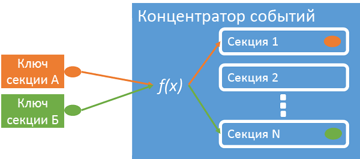
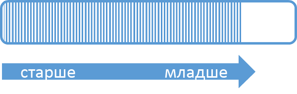
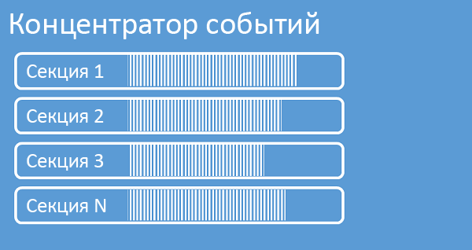
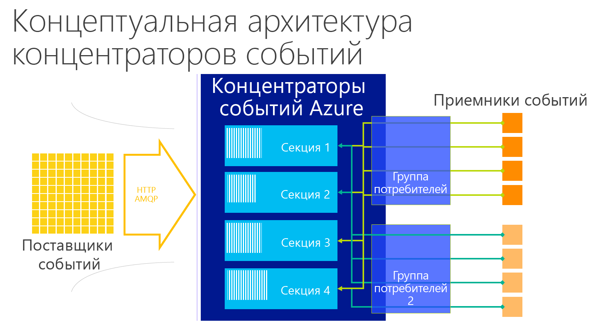
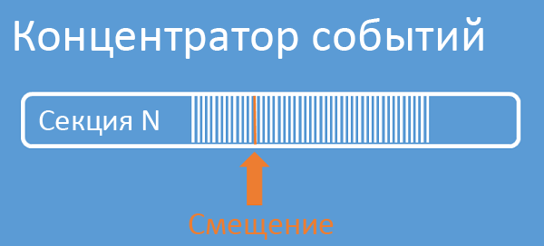

# <a name="what-is-azure-event-hubs"></a>Что такое концентраторы событий Azure?
Концентраторы событий — это высокомасштабируемая платформа потоковой передачи данных, которая позволяет принимать миллионы событий в секунду. Данные, отправляемые в концентратор событий, можно преобразовывать и сохранять с помощью любого поставщика аналитики в реальном времени, а также с помощью адаптеров пакетной обработки или хранения. Благодаря возможности публикации и подписки с низкой задержкой и с неограниченным масштабированием концентраторы событий становятся "трамплином" для больших объемов данных.

## <a name="why-use-event-hubs"></a>Каковы преимущества концентраторов событий?
Концентраторы событий и функции обработки телеметрии используются для решения следующих задач:

* инструментирования приложения;
* взаимодействия с пользователем или обработки рабочих процессов
* использования сценариев "Интернета вещей" (IoT).

Концентраторы событий также позволяют отслеживать поведение в мобильных приложениях, регистрировать события в играх для игровых консолей, а также собирать данные о трафике от веб-ферм или данные телеметрии от промышленного оборудования или подключенных автомобилей.

## <a name="azure-event-hubs-overview"></a>Общие сведения о концентраторах событий Azure
Концентраторы событий в архитектуре решения — это аналог парадного входа для конвейера событий. Иными словами, это — *приемник событий*. Приемник событий — это компонент или служба, располагающиеся между источниками событий и адресатами событий и отделяющие создание потока событий от использования этих событий.


Концентраторы событий Microsoft Azure — это служба обработки событий, используемая для масштабируемого приема событий и данных телеметрии с низкой задержкой и высокой надежностью. Концентраторы событий позволяют обрабатывать потоки сообщений. По своим характеристикам они сильно отличаются от традиционных корпоративных служб обмена сообщениями. Концентраторы событий разработаны с учетом высокой пропускной способности и сценариев обработки событий. Следовательно, концентраторы событий не реализуют некоторые возможности обмена сообщениями, доступные для сущностей обмена сообщениями (например, разделов).

Концентратор событий создается на уровне пространства имен. Он использует AMQP и HTTP в качестве основных API-интерфейсов.

## <a name="event-publishers"></a>Издатели событий
Любая сущность, которая отправляет данные в концентратор событий, является *издателем событий*. Издатели событий могут публиковать события с помощью HTTPS или AMQP 1.0. Издатели событий используют маркер подписанного URL-адреса (SAS), чтобы идентифицировать себя в концентраторе событий. Также они могут использовать уникальное удостоверение или общий подписанный URL-адрес.

### <a name="publishing-an-event"></a>Публикация события
Вы можете опубликовать событие через протокол AMQP 1.0 или HTTPS. Служебная шина предоставляет класс [EventHubClient](https://docs.microsoft.com/dotnet/api/microsoft.servicebus.messaging.eventhubclient) для публикации событий в концентраторе событий от клиентов .NET. Для других сред выполнения и платформ можно использовать любой клиент AMQP 1.0, например [Apache Qpid](http://qpid.apache.org/). Можно публиковать события по отдельности или в пакетном режиме. Для одной публикации (экземпляра данных события) установлено ограничение в 256 КБ, независимо от того, одиночное это событие или пакет. Публикация событий большего размера приводит к ошибке. Мы советуем не передавать издателям сведения о секциях в концентраторе событий, а указывать только *ключ секции* (см. следующий раздел) или их удостоверение через маркер SAS.

Решение об использовании AMQP или HTTPS обусловлено сценарием использования. AMQP требует установки постоянного двунаправленного сокета в дополнение к безопасности на уровне транспорта (TLS) или протоколу SSL/TLS. Использование AMQP связано с повышенными сетевыми затратами при инициализации сеанса, а использование HTTPS — с дополнительной нагрузкой SSL при каждом запросе. AMQP отличается более высокой производительностью при частых публикациях.



Концентраторы событий обеспечивают доставку всех событий, использующих одинаковое значение ключа секции, в соответствующем порядке и в одну секцию. Если ключи секций используются с применением политик издателя, удостоверение издателя и значение ключа секции должны совпадать. В противном случае возникает ошибка.

### <a name="publisher-policy"></a>Политика издателя
Концентраторы событий обеспечивают точный контроль над издателями событий через *политики издателя*. Политики издателя — это функции среды выполнения, которые упрощают обработку большого количества независимых издателей событий. Благодаря политикам издателя каждый издатель использует свой собственный уникальный идентификатор при публикации событий в концентраторе событий с помощью следующего механизма:

```
//[my namespace].servicebus.windows.net/[event hub name]/publishers/[my publisher name]
```

Не требуется создавать имена издателей заранее, но они должны соответствовать маркеру SAS, который используется при публикации события, для обеспечения идентификации независимого издателя. При использовании политик издателя значение **PartitionKey** присваивается имени издателя. Для правильной работы эти значения должны совпадать.

## <a name="partitions"></a>Разделы
Концентраторы событий обеспечивают потоковую передачу сообщений так, чтобы каждый секционированный потребитель считывал только определенное подмножество (секцию) потока сообщений. Этот шаблон обеспечивает горизонтальное масштабирование для обработки событий и предоставляет другие функции, ориентированные на поток, которые недоступны для очередей и разделов.

Секция — это упорядоченная последовательность событий, хранящаяся в концентраторе событий. По мере поступления новых событий они добавляются в конец этой последовательности. Секцию можно рассматривать как «журнал фиксации».



Концентраторы событий сохраняют данные в течение указанного времени хранения, которое определяется для всех секций в концентраторе событий. События удаляются по истечении срока действия; невозможно явно удалить их. Так как секции независимы и содержат собственные последовательности данных, они часто расширяются с разной скоростью.



Количество секций определяется во время создания. Рабочий диапазон — от 2 до 32. Так как число секций неизменно, вам следует продумать масштаб заранее. Секции — это способ организации данных, который соотносится со степенью параллелизма подчиненных элементов, требуемой для работы потребляющих приложений. Поэтому количество секций в концентраторе событий непосредственно связано с предполагаемым числом параллельных модулей чтения. Но вы можете увеличить число секций, превысив максимальное ограничение (32 секции). Для этого обратитесь к группе разработчиков концентраторов событий.

Хотя секции можно идентифицировать и отправлять напрямую, это не рекомендуется делать. Вместо этого можно использовать конструкции более высокого уровня, описанные в разделах [Издатель событий](#event-publishers) и [Емкость](#capacity).

Секции заполнены последовательностями данных событий, которые содержат текст события, контейнер определяемых пользователем свойств, а также метаданные события, включая сведения о смещении в секции и ее номер в последовательности потока.

### <a name="partition-key"></a>Ключ секции
Вы можете использовать ключ секции, чтобы сопоставлять входные данные событий с определенными секциями для организации данных. Ключ секции — это указываемое отправителем значение, передаваемое в концентратор событий. Оно обрабатывается с помощью статической функции хэширования, в результате чего создается назначение секции. Если при публикации события не указать ключ секции, назначение создается с помощью циклического перебора.

Издателю событий известен только ключ секции, но не сама секция, в которой публикуются события. Благодаря разделению ключа и секции отправителю не нужно располагать избыточными сведениями о последующей обработке и хранении событий. Уникальное удостоверение устройства или пользователя является хорошим ключом секции, но другие атрибуты, например географическое положение, можно также использовать для группировки связанных событий в одну секцию.

## <a name="sas-tokens"></a>Маркеры SAS
Концентраторы событий используют *подписанные URL-адреса*, доступные на уровне пространства имен и концентратора событий. Маркер SAS создается на основе ключа SAS и хэша SHA URL-адреса, закодированного в определенном формате. С помощью имени ключа (политики) и маркера концентраторы событий могут повторно создать хэш, чтобы аутентифицировать отправителя. Как правило, маркеры SAS для издателей событий создаются только с правом **отправки** конкретному концентратору событий. Этот механизм URL-адреса маркера SAS является основой для идентификации издателя, представленной в политике издателя. Дополнительные сведения о работе с SAS см. в статье [Проверка подлинности подписи при общем доступе с помощью служебной шины](../service-bus-messaging/service-bus-shared-access-signature-authentication.md).

## <a name="event-consumers"></a>Получатели событий
Любая сущность, считывающая данные из концентратора событий, является *потребителем событий*. Все потребители концентраторов событий подключаются через сеанс AMQP 1.0, в рамках которого события доставляются, как только становятся доступными. Клиенту не требуется проводить опрос доступности данных.

### <a name="consumer-groups"></a>Группы получателей
Механизм публикации и подписки концентраторов событий реализован в виде *групп потребителей*. Группа потребителей — это представление всего концентратора событий (состояние, позиция или смещение). Группы потребителей обеспечивают каждому из нескольких потребляющих приложений отдельное представление потока событий, а также возможность считывания потока независимо друг от друга в своем темпе и с собственными смещениями.

В архитектуре обработки потока каждое потребляющее приложение соответствует группе потребителей. Если вы хотите записать данные событий в долговременное хранилище, то приложение, записывающее данные в хранилище, является группой потребителей. Сложную обработку событий затем может выполнить еще одна (отдельная) группа потребителей. К секции можно обращаться только через группу потребителей. Каждая секция может содержать не больше одного активного модуля чтения **из определенной группы потребителей**. В концентраторе событий всегда есть группа потребителей по умолчанию, и можно создать до 20 групп потребителей для концентратора событий стандартного уровня.

Ниже приведены примеры соглашения URI группы потребителей.

```
//[my namespace].servicebus.windows.net/[event hub name]/[Consumer Group #1]
//[my namespace].servicebus.windows.net/[event hub name]/[Consumer Group #2]
```



### <a name="stream-offsets"></a>Смещение потока
*Смещение* — это положение события внутри секции. Смещение можно представить как клиентский курсор. Смещение представляет собой байт-нумерацию события. Благодаря этому потребитель события (модуль чтения) может указать точку в потоке событий, с которой требуется начать чтение событий. Можно указать смещение как отметку времени или как значение смещения. Потребители ответственны за хранение своих собственных значений смещения вне службы концентраторов событий. В секции каждое событие включает смещение.



### <a name="checkpointing"></a>Контрольные точки
*Создание контрольных точек* — это процесс, с помощью которого модули чтения помечают или фиксируют свое положение в последовательности событий секции. Создание контрольных точек является ответственностью потребителя и выполняется для каждой секции в пределах группы потребителей. Это означает, что для каждой группы потребителей модуль чтения каждой секции должен хранить свое текущее положение в потоке событий и может сообщать службе, когда он считает поток данных завершенным.

Если модуль чтения отключается от секции, при повторном подключении он приступает к чтению данных с контрольной точки, которая ранее была отправлена последним модулем чтения этой секции в этой группе потребителей. При подключении модуль чтения передает это смещение концентратору событий, чтобы указать положение, с которого следует начинать чтение. Таким образом можно использовать контрольные точки как для маркировки событий как «завершенных» подчиненными приложениями, так и для обеспечения устойчивости в случае отработки отказа между модулями чтения, работающими на разных компьютерах. Вы можете вернуться к предыдущим данным, указав более низкое значение смещения по отношению к этому процессу создания контрольных точек. В рамках такого подхода при создании контрольных точек вы обеспечиваете отказоустойчивость и воспроизведение потока событий.

### <a name="common-consumer-tasks"></a>Стандартные задачи потребителя
Все потребители концентраторов событий подключаются через двунаправленный канал связи с поддержкой состояния и сеанса AMQP 1.0. Каждая секция связана с сеансом связи AMQP 1.0, что упрощает транспортировку событий, разделенных по секциям.

#### <a name="connect-to-a-partition"></a>Подключение к секции
При подключении к секциям часто используется механизм аренды для координации подключения к конкретным секциям для чтения. Таким образом, в каждой секции в группе потребителей может быть только один активный модуль чтения. Создание контрольных точек, аренда и администрирование модулей чтения упрощается за счет использования класса [EventProcessorHost](https://docs.microsoft.com/dotnet/api/microsoft.servicebus.messaging.eventprocessorhost) для клиентов .NET. [EventProcessorHost](https://docs.microsoft.com/dotnet/api/microsoft.servicebus.messaging.eventprocessorhost) — интеллектуальный агент потребителя.

#### <a name="read-events"></a>Чтение событий
После открытия сеанса и связи AMQP 1.0 для определенной секции служба концентраторов событий доставляет события в клиент AMQP 1.0. Этот механизм доставки обеспечивает более высокую пропускную способность и меньшую задержку, чем механизмы извлечения по запросу, такие как HTTP GET. Когда события отправляются клиенту, каждый экземпляр данных событий содержит важные метаданные, такие как смещение и порядковый номер, которые используются для упрощения создания контрольных точек в последовательности событий.

Данные событий
* Offset
* Порядковый номер
* Текст
* Свойства пользователя
* Свойства системы

Пользователь управляет смещением самостоятельно.

## <a name="capacity"></a>Емкость
Концентраторы событий имеют высокомасштабируемую параллельную архитектуру. Но есть несколько моментов, которые следует учитывать при выборе размера и масштаба.

### <a name="throughput-units"></a>Единицы пропускной способности
Пропускная способность концентраторов событий выражается в *единицах пропускной способности*. Единицы пропускной способности — это предварительно приобретенные единицы емкости. Одна единица пропускной способности включает следующее.

* Входящий трафик: до 1 МБ в секунду либо 1000 событий в секунду (первое произошедшее событие).
* Исходящий трафик: до 2 МБ в секунду.

Превышение входящей емкости, выраженной в приобретенных единицах пропускной способности, подлежит регулированию с вызовом исключения [ServerBusyException](https://docs.microsoft.com/dotnet/api/microsoft.azure.eventhubs.serverbusyexception). Хотя исходящий трафик не связан с возвратом исключения регулирования, он все равно ограничен емкостью, выраженной в приобретенных пропускных единицах. Если возвращаются исключения скорости публикации или ожидается повышенный объем исходящих данных, проверьте количество единиц пропускной способности, приобретенных для пространства имен. Вы можете управлять единицами пропускной способности из колонки **Масштабирование** пространства имен на [портале Azure][Azure portal]. Это также можно реализовать программным способом с помощью API-интерфейсов Azure.

Единицы пропускной способности тарифицируются почасово и приобретаются заранее. После приобретения единицы пропускной способности тарифицируются минимум за один час. Для пространства имен концентраторов событий можно приобрести до 20 единиц пропускной способности (этот объем можно распределить между всеми концентраторами событий в пространстве имен).

Дополнительные единицы пропускной способности можно приобрести блоками от 20 до 100 единиц. Для этого обратитесь в службу поддержки Azure. Кроме того, вы можете приобрести блоки на 100 единиц пропускной способности.

Рекомендуется сбалансировать количество единиц пропускной способности и секций, чтобы добиться оптимального масштабирования. Одна секция имеет максимальный масштаб в размере одной единицы пропускной способности. Количество единиц пропускной способности должно быть меньше или равно количеству секций в концентраторе событий.

Подробные сведения о ценах см. на странице [цен на концентраторы событий](https://azure.microsoft.com/pricing/details/event-hubs/).

## <a name="next-steps"></a>Дальнейшие действия

* Начните работу с [руководства по концентраторам событий][Event Hubs tutorial]
* Полный [пример приложения, использующего концентраторы событий].
* [Руководство по программированию концентраторов событий](event-hubs-programming-guide.md)
* [Часто задаваемые вопросы о концентраторах событий](event-hubs-faq.md)

[Event Hubs tutorial]: event-hubs-csharp-ephcs-getstarted.md
[пример приложения, использующего концентраторы событий]: https://code.msdn.microsoft.com/Service-Bus-Event-Hub-286fd097
[Azure portal]: https://portal.azure.com


<!--HONumber=Feb17_HO1-->


