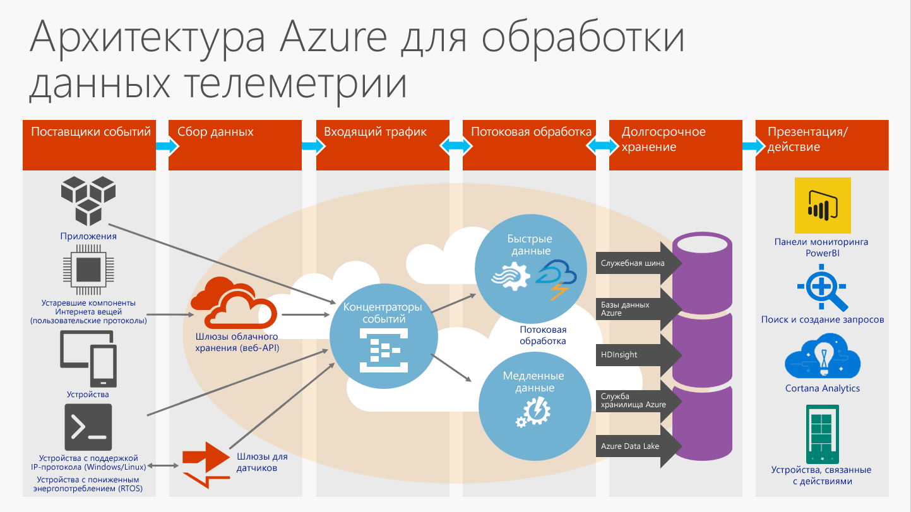

# Что такое концентраторы событий?

Концентраторы событий Azure — это высокомасштабируемая платформа потоковой передачи данных и служба потребления событий, принимающая и обрабатывающая миллионы событий в секунду. Концентраторы событий могут обрабатывать и сохранять события, данные и телеметрию, созданные распределенным программным обеспечением и устройствами. Данные, отправляемые в концентратор событий, можно преобразовывать и сохранять с помощью любого поставщика аналитики в реальном времени, а также с помощью адаптеров пакетной обработки или хранения. Благодаря [возможности публикации и подписки](https://msdn.microsoft.com/library/aa560414.aspx) с низкой задержкой и с неограниченным масштабированием концентраторы событий становятся "трамплином" для больших объемов данных.

## Каковы преимущества концентраторов событий?

Концентраторы событий и функции обработки телеметрии используются для решения следующих задач:

* инструментирования приложения;
* взаимодействия с пользователем или обработки рабочих процессов
* использования сценариев "Интернета вещей" (IoT).

Например, концентраторы событий также позволяют отслеживать поведение в мобильных приложениях, регистрировать события в играх для игровых консолей, а также собирать данные о трафике от веб-ферм или данные телеметрии от промышленного оборудования, подключенных автомобилей или других устройств.

## Общие сведения о концентраторах событий Azure

Концентраторы событий в архитектуре решения — это аналог парадного входа для конвейера событий. Иными словами, это — *приемник событий*. Приемник событий — это компонент или служба, располагающиеся между источниками событий и адресатами событий и отделяющие создание потока событий от использования этих событий. Эта архитектура показана на следующем рисунке.

Концентраторы событий позволяют обрабатывать потоки сообщений. По своим характеристикам они отличаются от традиционных корпоративных служб обмена сообщениями. Концентраторы событий разработаны с учетом высокой пропускной способности и сценариев обработки событий. Следовательно, концентраторы событий отличаются от обмена сообщениями [служебной шины Azure](https://azure.microsoft.com/services/service-bus/) и не реализуют некоторые возможности, доступные для сущностей [обмена сообщениями служебной шины](/azure/service-bus-messaging/) (например, разделов).

## Особенности концентраторов событий

Концентраторы событий содержат следующие основные элементы.

- [**Производители и издатели событий**](event-hubs-features.md#event-publishers) — это сущность, которая отправляет данные в концентратор событий. Событие публикуется по протоколу AMQP 1.0 или HTTPS.
- [**Запись**](event-hubs-features.md#capture) позволяет записывать данные потоковой передачи концентраторов событий и хранить их в учетной записи хранения больших двоичных объектов Azure.
- [**Разделы**](event-hubs-features.md#partitions) позволяют каждому получателю считывать только определенное подмножество или раздел потока событий.
- [**Токены SAS**](event-hubs-features.md#sas-tokens) используются для идентификации и аутентификации издателя событий.
- [**Потребители событий**](event-hubs-features.md#event-consumers) — сущности, считывающие данные из концентратора событий. Потребители событий подключаются по протоколу AMQP 1.0. 
- [**Группы потребителей**](event-hubs-features.md#consumer-groups) обеспечивают каждому из нескольких потребляющих приложений отдельное представление потока событий, а также возможность действовать независимо друг от друга.
- [**Единицы пропускной способности**](event-hubs-features.md#capacity) — это предварительно приобретенные единицы емкости. Максимальный масштаб одной секции составляет одну единицу пропускной способности.

Технические сведения об этих и других возможностях концентраторов событий см. в статье [Event Hubs features overview](event-hubs-features.md) (Обзор функций концентраторов событий). 

## Дальнейшие действия

Подробные сведения о ценах см. на странице [цен на концентраторы событий](https://azure.microsoft.com/pricing/details/event-hubs/).

Дополнительные сведения о концентраторах событий см. по следующим ссылкам:

* Начните работу с [руководства по концентраторам событий](event-hubs-dotnet-standard-getstarted-send.md)
* [Часто задаваемые вопросы о концентраторах событий](event-hubs-faq.md)
* [Примеры приложений, использующих концентраторы событий](https://github.com/Azure/azure-event-hubs/tree/master/samples)
 
 

