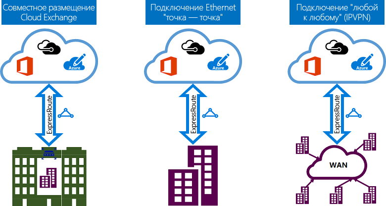

# Модели подключения ExpressRoute
Вы можете создать между локальной сетью и облаком Майкрософт подключение трех разных типов: [совместное размещение в Cloud Exchange](#CloudExchange), [Ethernet-подключение типа "точка — точка"](#Ethernet) и [подключение типа "любой к любому" (IPVPN)](#IPVPN). Поставщики услуг подключения могут предлагать одну или несколько моделей подключения. Обратитесь к поставщику услуг подключения и подберите наиболее подходящую вам модель.
  

## Совместное размещение в Cloud Exchange
При размещении на одном сервере с Cloud Exchange можно заказать виртуальное кросс-подключение к облаку Майкрософт через Ethernet Exchange поставщика совместного размещения. Поставщики услуг совместного размещения могут предлагать либо кросс-подключения второго уровня, либо управляемые кросс-подключения третьего уровня между вашей инфраструктурой на сервере совместного размещения и облаком Майкрософт.

## Подключения Ethernet типа "точка — точка"
Локальные центры обработки данных и офисы можно подключить к облаку Майкрософт через связи Ethernet типа "точка-точка". Поставщики подключений Ethernet типа "точка-точка" могут предлагать подключения второго уровня или управляемые подключения третьего уровня между вашей сетью и облаком Майкрософт.

## Сети типа "любой к любому" (IPVPN)
Глобальную вычислительную сеть можно интегрировать с облаком Майкрософт. Поставщики IP VPN (обычно это MPLS VPN) предлагают подключение между филиалами и центрами обработки данных типа "любой к любому". Облако Майкрософт можно связать с вашей глобальной вычислительной сетью, так чтобы оно выглядело как любой другой филиал. Обычно поставщики глобальных вычислительных сетей предлагают управляемые подключения третьего уровня. Возможности и функции ExpressRoute одинаковы для всех описанных выше моделей. 

## Дополнительная информация
* Узнайте больше о подключениях ExpressRoute и доменах маршрутизации. См. статью [Каналы ExpressRoute и домены маршрутизации](expressroute-circuit-peerings.md).
* Узнайте о функциях ExpressRoute. См. статью [Технический обзор ExpressRoute](expressroute-introduction.md).
* Найти поставщика услуг. См. статью [Партнеры и одноранговые расположения ExpressRoute](expressroute-locations.md).
* Убедитесь, что выполнены все необходимые условия. Ознакомьтесь с разделом [Предварительные требования и контрольный список для ExpressRoute](expressroute-prerequisites.md).
* См. сведения о требованиях для [маршрутизации](expressroute-routing.md) и [NAT](expressroute-nat.md) и [QoS](expressroute-qos.md).
* Настройте подключение ExpressRoute.
  * [Создайте канал ExpressRoute.](expressroute-howto-circuit-portal-resource-manager.md)
  * [Настройка маршрутизации](expressroute-howto-routing-portal-resource-manager.md)
  * [Связывание виртуальной сети с каналом ExpressRoute](expressroute-howto-linkvnet-portal-resource-manager.md)