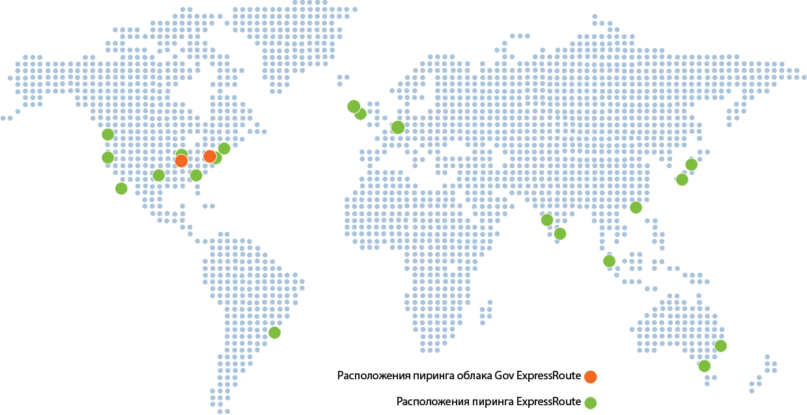

<properties
   pageTitle="Расположения ExpressRoute"
   description="На этой странице приведена подробная информация о расположениях, где предлагаются услуги, и способах подключения к регионам Azure."
   services="expressroute"
   documentationCenter="na"
   authors="cherylmc"
   manager="carolz"
   editor="tysonn" />
<tags 
   ms.service="expressroute"
   ms.devlang="na"
   ms.topic="get-started-article"
   ms.tgt_pltfrm="na"
   ms.workload="infrastructure-services"
   ms.date="08/04/2015"
   ms.author="cherylmc" />

# Партнеры и одноранговые расположения ExpressRoute
Таблицы на этой странице содержат информацию о поставщиках услуг подключения ExpressRoute (поставщиках Exchange и поставщиках сетевых услуг), территориальном покрытии ExpressRoute, облачных службах Майкрософт, поддерживаемых через ExpressRoute и системных интеграторах ExpressRoute (копий SIs).

## Поставщики услуг подключения ExpressRoute
ExpressRoute поддерживается во всех регионах и расположениях Azure. На приведенной ниже карте обозначены регионы Azure и расположения ExpressRoute. Расположения ExpressRoute соответствуют тем территориям, где Майкрософт взаимодействует с несколькими одноранговыми поставщиками услуг.
 

Вы сможете получить доступ ко всем службам Azure во всех регионах соответствующего геополитического региона, если вы подключены по меньшей мере к одному расположению ExpressRoute в этом регионе. В таблице ниже сопоставлены регионы Azure с расположениями ExpressRoute в пределах геополитических регионов.

|**Геополитический регион**|**Регионы Azure**|**Расположения ExpressRoute**|
|---|---|---|
|**США**|Все регионы США — восточная часть США, западная часть США, восточная часть США 2, центральная часть США, юго-центральная часть США, северо-центральная часть США|Атланта, Чикаго, Даллас, Лос-Анджелес, Нью-Йорк, Сиэтл, Кремниевая долина, Вашингтон (округ Колумбия)|
|**США**|Айова, Вирджиния|Эшберн, Чикаго|
|**Северная Америка**|Южная Бразилия|Сан-Паулу|
|**Европа**|Северная Европа, Западная Европа|Амстердам, Лондон|
|**Азия**|Восточная Азия, Юго-Восточная Азия|Гонконг, Сингапур|
|**Япония**|Западная Япония, Восточная Япония|Токио|
|**Австралия**|Восточная Австралия, Юго-Восточная Австралия|Мельбурн, Сидней|
|**Индия**|Западная Индия, Центральная Индия, Южная Индия|Ченнаи, Мумбаи|

Подключение между геополитическими регионами не поддерживается. Вы можете обратиться к вашему поставщику услуг подключения, чтобы расширить возможности подключения между геополитическими регионами по их сети.

## Поставщики Exchange и их расположения

| **Поставщик услуг** |**Microsoft Azure** | **Office 365** | **Расположения** |
|-----------------------|--------------------|----------------|---------------|
| **[Сети Aryaka](http://www.aryaka.com/)** | Поддерживаются | Не поддерживается | Кремниевая долина, Сингапур, Вашингтон, округ Колумбия |
| **[Colt Ethernet](http://www.colt.net/uk/en/news/colt-announces-dedicated-cloud-access-for-microsoft-azure-services-en.htm)** | Поддерживаются | Не поддерживается | Амстердам, Лондон |
| **Comcast** | Поддерживаются | Не поддерживается | Кремниевая долина, Вашингтон, округ Колумбия |
| **[Equinix](http://www.equinix.com/partners/microsoft-azure/)** | Поддерживаются | Скоро | Амстердам, Атланта, Чикаго, Dallas, Гонконг Hong, Лондон, Лос-Анджелес, Мельбурн, Нью-Йорк, Сан-Паулу, Сиэтл, Кремниевая долина, Сингапур, Сидней, Токио, Вашингтон, округ Колумбия |
| **[InterCloud](https://www.intercloud.com/)** | Поддерживаются | Не поддерживается | Амстердам, Лондон, Сингапур, Вашингтон, округ Колумбия |
| **Internet Solutions - Cloud Connect** | Поддерживаются | Не поддерживается | Амстердам, Лондон |
| **Interxion** | Поддерживаются | Не поддерживается | Амстердам |
| **[Level 3 Communications - Exchange](http://your.level3.com/LP=882?WT.tsrc=02192014LP882AzureVanityAzureText)** | Поддерживаются | Не поддерживается | Чикаго, Даллас, Лондон, Сиэтл, Кремниевая долина, Вашингтон, округ Колумбия |
| **NEXTDC** | Поддерживаются | Не поддерживается | Мельбурн, Сидней+ |
| **[TeleCity Group](http://www.telecitygroup.com/investor-centre/news_details.htm?locid=03100500400b00d&xml)** | Поддерживаются | Скоро | Амстердам, Лондон |
| **[Telstra Corporation](http://www.telstra.com.au/business-enterprise/network-services/networks/cloud-direct-connect/)** | Поддерживаются | Не поддерживается | Мельбурн+, Сидней |
| **[Zayo Group](http://www.zayo.com/)** | Поддерживаются | Не поддерживается | Вашингтон, округ Колумбия |

 Знак **+** означает «скоро»

Пошаговые инструкции по настройке подключения см. в статье [Настройка подключения через поставщика EXP](expressroute-configuring-exps.md).

## Поставщики сетевых услуг и их расположения

| **Поставщик услуг** |**Microsoft Azure** | **Office 365** | **Расположения** |
|-----------------------|--------------------|----------------|---------------|
| **[AT&T](https://www.synaptic.att.com/clouduser/html/productdetail/ATT_NetBond.htm)** | Поддерживаются | Скоро | Амстердам+, Лондон+, Даллас, Кремниевая долина, Вашингтон, округ Колумбия |
| **[British Telecom](http://www.globalservices.bt.com/uk/en/news/bt_to_provide_connectivity_to_microsoft_azure)** | Поддерживаются | Скоро | Амстердам, Лондон, Кремниевая долина+, Вашингтон, округ Колумбия |
|**China Telecom Global** | Скоро | Не поддерживается | Гонконг+ |
| **[Colt IPVPN](http://www.colt.net/uk/en/news/colt-announces-dedicated-cloud-access-for-microsoft-azure-services-en.htm)** | Поддерживаются | Не поддерживается | Амстердам, Лондон |
| **[Internet Initiative Japan Inc. - IIJ](http://www.iij.ad.jp/en/news/pressrelease/2013/pdf/Azure_E.pdf)** | Поддерживаются | Не поддерживается | Токио |
| **[Level 3 Communications - IPVPN](http://your.level3.com/LP=882?WT.tsrc=02192014LP882AzureVanityAzureText)** | Поддерживаются | Не поддерживается | Чикаго, Даллас, Лондон, Сиэтл, Кремниевая долина, Вашингтон, округ Колумбия |
| **NTT Communications** | Скоро | Не поддерживается | Токио + | 
| **[Orange](http://www.orange-business.com/)** | Поддерживаются | Не поддерживается | Амстердам, Лондон, Кремниевая долина, Вашингтон, округ Колумбия |
| **PCCW Global Limited** | Поддерживаются | Не поддерживается | Гонконг |
| **[SingTel](http://info.singtel.com/about-us/news-releases/singtel-provide-secure-private-access-microsoft-azure-public-cloud)** | Поддерживаются | Не поддерживается | Сингапур |
| **[Tata Communications](http://www.tatacommunications.com/lp/izo/azure/azure_index.html)** | Поддерживаются | Скоро | Амстердам, Ченнаи+, Гонконг, Лондон, Мумбаи+, Сингапур |
| **[Telstra Corporation](http://www.telstra.com.au/business-enterprise/network-services/networks/cloud-direct-connect/)** | Поддерживаются | Не поддерживается | Мельбурн+, Сидней |
| **[Verizon](http://news.verizonenterprise.com/2014/04/secure-cloud-interconnect-solutions-enterprise/)** | Поддерживаются | Не поддерживается | Лондон, Гонконг, Кремниевая долина, Вашингтон, округ Колумбия, Айова, США, Вирджиния, США |

 Знак **+** означает «скоро»

Пошаговые инструкции по настройке подключения см. в статье [Настройка подключения через поставщика сетевых услуг](expressroute-configuring-nsps.md).

## Подключение через других поставщиков услуг 

Вы можете создать подключение, даже если ваш поставщик услуг подключения не указан в списке выше.

- Узнайте у своего поставщика подключения, подключен ли он к какому-либо из поставщиков Exchange в указанных выше расположениях. Вы можете воспользоваться ссылками ниже, чтобы получить дополнительную информацию об услугах, предлагаемых поставщиками Exchange. Несколько поставщиков услуг подключения уже подключены к серверам Ethernet Exchange поставщика Exchange.
	- [Equnix Cloud Exchange](http://www.equinix.com/services/interconnection-connectivity/cloud-exchange/) 
	- [TeleCity CloudIX](http://www.telecitygroup.com/colocation-services/cloud-ix.htm)
- Обратитесь к своему поставщику услуг подключения, чтобы он расширил вашу сеть, добавив необходимое расположение Exchange.
	- Убедитесь, что поставщик услуг подключения расширяет границы вашего подключения, сохраняя высокую доступность во избежание влияния единых точек отказа.
	- Для обеспечения высокой доступности некоторые поставщики услуг подключения (в частности, поставщики подключения Ethernet) могут потребовать приобрести пару дополнительных каналов двухсторонней связи с точками обмена трафиком Ethernet. 
- Закажите канал ExpressRoute через поставщика Exchange, чтобы подключиться к Azure.
	- Чтобы настроить подключение, выполните шаги, описанные в статье [Настройка подключения через поставщика Exchange](expressroute-configuring-exps.md).

|**Поставщик услуг подключения**|**Поставщики Exchange**|**Одноранговые расположения**|
|---|---|---|
|**[XO Communications](http://www.xo.com/)**|Equinix|Кремниевая долина|

## Системные интеграторы ExpressRoute
Возможность частного подключения, соответствующего вашим потребностям, будет зависеть от масштаба сети. Вы можете обратиться к одному из системных интеграторов, перечисленных в таблице ниже, чтобы упростить переход на подключение ExpressRoute.

|**Системный интегратор**|**Континент**|
|---|---|
|**[Nimbo](http://www.nimbo.com/)**|США||
|**[Dotnet Solutions](http://www.dotnetsolutions.co.uk/)**|EMEA|

## Дальнейшие действия
- Убедитесь, что соблюдаются [предварительные требования к подключению ExpressRoute](expressroute-prerequisites.md).
- Ознакомьтесь со статьей с [часто задаваемыми вопросами](expressroute-faqs.md), чтобы получить дополнительную информацию.
- Если вы хотите настроить подключение ExpressRoute, см. статью [Настройка подключения через поставщика EXP](expressroute-configuring-exps.md) или [Настройка подключения через поставщика сетевых услуг](expressroute-configuring-nsps.md).
- Если вы хотите настроить VPN-подключение «сеть — сеть» и ExpressRoute для одной и той же виртуальной сети, см. статью [Настройка подключения существующих одновременно VPN типа ExpressRoute и «сеть —-сеть»](expressroute-coexist.md).
 

<!---HONumber=August15_HO6-->