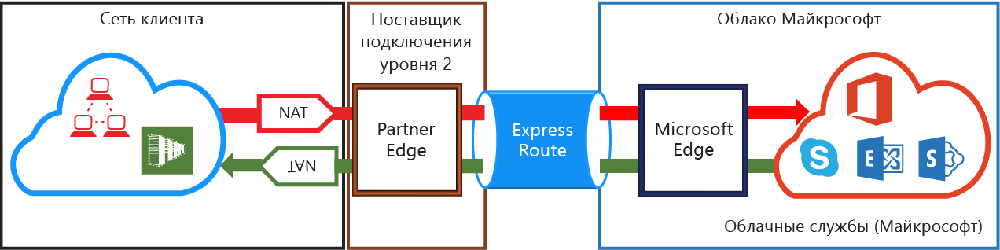
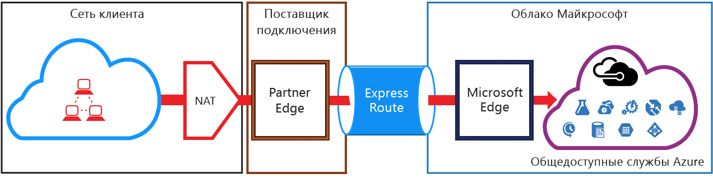

# Требования ExpressRoute к NAT
Для подключения к облачным службам Майкрософт с помощью ExpressRoute необходима настройка и управление NAT. Некоторые поставщики услуг подключения предлагают настройку NAT как управляемой службы и управление этой службой. Узнайте у поставщика услуг подключения, предоставляет ли он такую услугу. В противном случае необходимо выполнить требования, описанные ниже. 

Общие сведения о различных доменах маршрутизации см. в статье [Каналы ExpressRoute и домены маршрутизации](expressroute-circuit-peerings.md). Для выполнения требований об открытых IP-адресах для общедоступного пиринга Azure и пиринга Майкрософт рекомендуем настроить NAT между вашей сетью и Майкрософт. В этом разделе подробно описана инфраструктура NAT, которую вам нужно настроить.

## Требования NAT для пиринга Майкрософт
Путь пиринга Майкрософт позволяет подключаться к облачным службам Майкрософт, которые не поддерживаются по пути общедоступного пиринга Azure. В список этих служб входят службы Office 365, такие как Exchange Online, SharePoint Online, Skype для бизнеса и Dynamics 365. Корпорация Майкрософт рассчитывает на поддержку двустороннего подключения через пиринг Майкрософт. Прежде чем попасть в сеть Майкрософт, трафик, предназначенный для передачи в облачные службы Майкрософт через общедоступный пиринг, необходимо подвергнуть исходящему преобразованию сетевых адресов в действительные адреса IPv4. Чтобы предотвратить [асимметричную маршрутизацию](expressroute-asymmetric-routing.md), трафик, передаваемый из облачных служб Майкрософт, необходимо подвергнуть преобразованию исходящих сетевых адресов на границе с Интернетом. На представленной ниже схеме показано, как настроить NAT для пиринга Майкрософт.

 

### Трафик, исходящий из локальной сети и предназначенный для Microsoft
* Убедитесь, что трафик поступает по пути пиринга Майкрософт с действительным открытым адресом IPv4. У Майкрософт должна быть возможность проверить владельца пула адресов IPv4 для NAT по региональному интернет-реестру (RIR) или интернет-реестру маршрутизации (IRR). Проверка выполняется по номеру AS для пиринга и IP-адресам, используемым для NAT. Сведения о реестрах маршрутизации см. в статье [Требования ExpressRoute к маршрутизации](expressroute-routing.md).
* IP-адреса, используемые для настройки общедоступного пиринга Azure и других каналов ExpressRoute .нельзя объявлять Майкрософт в сеансе BGP. Длина префиксов IP-адресов для NAT, объявляемых с помощью этого пиринга, не ограничивается.
  
  > [!IMPORTANT]
  > Пул IP-адресов для NAT, объявленных для Майкрософт, не должен объявляться в Интернете. Это приведет к разрыву подключения к другим службам Microsoft.
  > 
  > 

### Трафик, исходящий из Майкрософт и предназначенный для вашей сети
* В некоторых сценариях от Майкрософт требуется запуск подключения к конечным точкам службы, размещенным в вашей сети. В качестве типового примера можно привести подключение Office 365 к серверам ADFS, размещенным в вашей сети. В таких случаях необходима передача соответствующих префиксов из вашей сети в пиринг Майкрософт. 
* Чтобы предотвратить [асимметричную маршрутизацию](expressroute-asymmetric-routing.md), необходимо подвергнуть преобразованию исходящих сетевых адресов трафик Майкрософт на границе с Интернетом для конечных точек службы в вашей сети. Запросы **и ответы** с конечным IP-адресом, которые соответствуют маршруту, полученному через ExpressRoute, всегда будут отправляться через ExpressRoute. Асимметричная маршрутизация будет существовать, если запрос, полученный через Интернет, содержит ответ, отправленный через ExpressRoute. Если подвергнуть преобразованию исходящих сетевых адресов входящий трафик Майкрософт на границе с Интернетом, то для разрешения проблемы необходимо будет отправить ответ обратно на границу с Интернетом.

## Требования к NAT для общедоступного пиринга Azure
Путь общедоступного пиринга Azure позволяет подключаться ко всем службам, размещенным в Azure, по их открытым IP-адресам. Сюда входят службы, перечисленные в статье [Вопросы и ответы по ExpessRoute](expressroute-faqs.md), а также все службы, размещенные независимыми поставщиками программного обеспечения в Microsoft Azure. 

> [!IMPORTANT]
> Подключение к службам Microsoft Azure через общедоступный пиринг всегда осуществляется от локальной сети к сети Microsoft. Таким образом, через ExpressRoute невозможно инициировать сеансы из служб Microsoft Azure к вашей сети. При попытке это сделать пакеты, отправляемые по объявленным IP-адресам, вместо ExpressRoute будут использовать Интернет.
> 

Прежде чем попасть в сеть Майкрософт, трафик, предназначенный для передачи в Microsoft Azure через общедоступный пиринг, необходимо подвергнуть исходящему преобразованию сетевых адресов в действительные адреса IPv4. На представленной ниже схеме показано, как настроить NAT в соответствии с указанным выше требованием.

 

### Пул IP-адресов и объявления маршрутов для NAT
Убедитесь, что трафик поступает в Azure по пути общедоступного пиринга с действительным открытым адресом IPv4. У Майкрософт должна быть возможность проверить владельца пула адресов IPv4 для NAT по региональному интернет-реестру (RIR) или интернет-реестру маршрутизации (IRR). Проверка выполняется по номеру AS для пиринга и IP-адресам, используемым для NAT. Сведения о реестрах маршрутизации см. в статье [Требования ExpressRoute к маршрутизации](expressroute-routing.md).

Длина префиксов IP-адресов для NAT, объявляемых с помощью этого пиринга, не ограничивается. Пул NAT необходимо отслеживать, чтобы не остаться без сеансов NAT.

> [!IMPORTANT]
> Пул IP-адресов для NAT, объявленных для Майкрософт, не должен объявляться в Интернете. Это приведет к разрыву подключения к другим службам Microsoft.
> 
> 

## Дополнительная информация
* См. сведения о требованиях к [маршрутизации](expressroute-routing.md) и [качеству обслуживания](expressroute-qos.md).
* Сведения о рабочем процессе см. в статье [Процедуры ExpressRoute для подготовки каналов и состояний каналов](expressroute-workflows.md).
* Настройте подключение ExpressRoute.
  
  * [Создайте канал ExpressRoute.](expressroute-howto-circuit-portal-resource-manager.md)
  * [Настройка маршрутизации](expressroute-howto-routing-portal-resource-manager.md)
  * [Связывание виртуальной сети с каналом ExpressRoute](expressroute-howto-linkvnet-portal-resource-manager.md)

