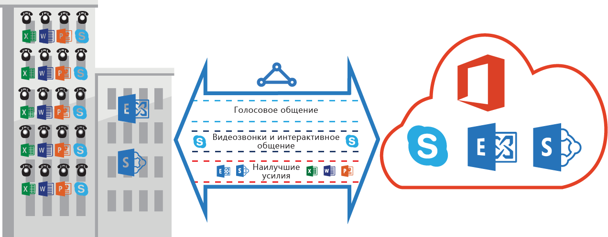

# Требования к качеству обслуживания для ExpressRoute
В Skype для бизнеса имеются различные рабочие нагрузки, требующие дифференцированного подхода к качеству обслуживания. Если вы планируете использовать голосовые службы с помощью ExpressRoute, то необходимо соблюдать указанные ниже требования.

> [!NOTE]
> Требования к качеству обслуживания применяются только к пирингу Майкрософт. Значения DSCP в сетевом трафике, полученном через общедоступный или частный пиринг Azure, будут сброшены до "0". 
> 
> 

В таблице ниже перечислены пометки DSCP, используемые в Skype для бизнеса. Дополнительные сведения см. в статье [Управление качеством обслуживания для Skype для бизнеса](https://technet.microsoft.com/library/gg405409.aspx).

| **Класс трафика** | **Обработка (пометки DSCP)** | **Рабочие нагрузки Skype для бизнеса** |
| --- | --- | --- |
| **Голосовая связь** |EF (46) |Голосовая связь Skype и Lync |
| **Интерактивный** |AF41 (34) |Видео, VBSS |
| AF21 (18) |Совместный доступ к приложениям | |
| **По умолчанию** |AF11 (10) |Передача файлов |
| CS0 (0) |Другие варианты | |

* Вам необходимо классифицировать рабочие нагрузки и пометить правильные значения DSCP. Следуйте указанным [здесь](https://technet.microsoft.com/library/gg405409.aspx) инструкциям по настройке пометок DSCP в сети.
* Вам необходимо настроить и поддерживать несколько очередей качества обслуживания в сети. Голосовая связь должна быть изолированным классом и использовать обработку EF согласно документу RFC 3246. 
* Вы можете решить, какие механизм очередей, политику обнаружения перегрузки и пропускную способность использовать для каждого класса трафика. Тем не менее необходимо сохранить пометки DSCP для рабочих нагрузок Skype для бизнеса. Если вы используете пометки DSCP, которых нет в списке выше, например AF31 (26), то перед отправкой пакета в корпорацию Майкрософт необходимо перезаписать это значение DSCP и сделать его равным 0. Корпорация Майкрософт отправляет только те пакеты, которые помечены значениями DSCP, указанными в таблице выше. 

## Дополнительная информация
* См. сведения о требованиях для [маршрутизации](expressroute-routing.md) и [преобразования сетевых адресов (NAT)](expressroute-nat.md).
* Чтобы настроить подключение ExpressRoute, см. следующие статьи:
  
  * [Создание канала ExpressRoute](expressroute-howto-circuit-classic.md)
  * [Настройка маршрутизации](expressroute-howto-routing-classic.md)
  * [Связывание виртуальной сети с каналом ExpressRoute](expressroute-howto-linkvnet-classic.md)

