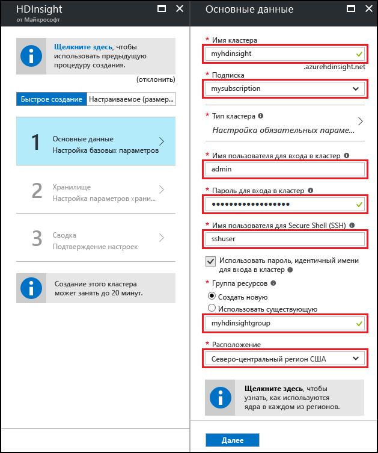
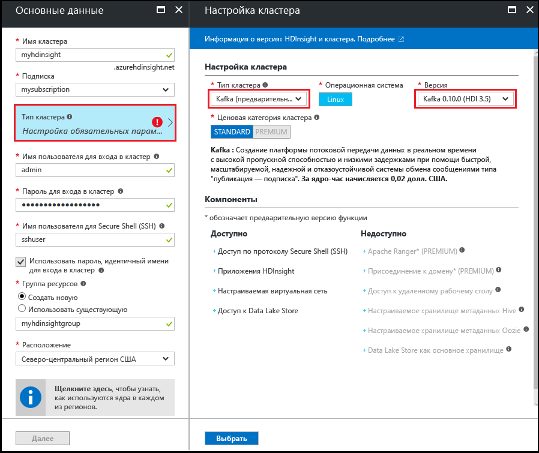
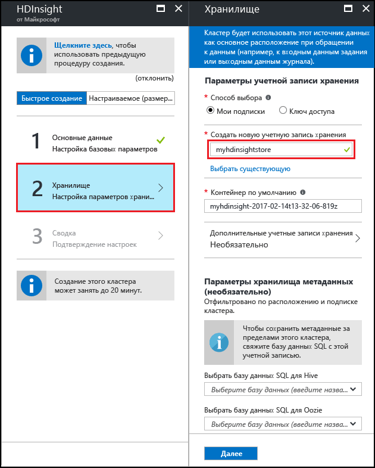
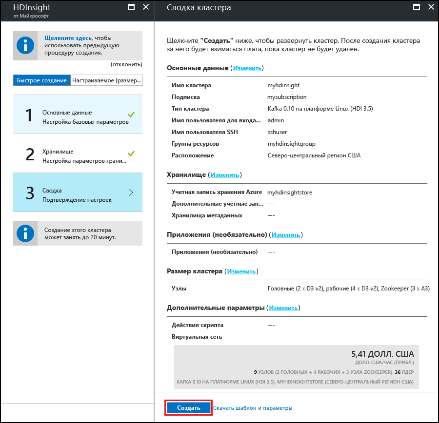

# <a name="start-with-apache-kafka-preview-on-hdinsight"></a>Приступая к работе с Apache Kafka (предварительная версия) в HDInsight

Узнайте, как создать кластер [Apache Kafka](https://kafka.apache.org) и использовать его в Azure HDInsight. Kafka — это распределенная платформа потоковой передачи с открытым кодом, которая доступна в HDInsight. Она часто используется как брокер сообщений, предоставляя такие же функциональные возможности, как и очередь сообщений типа "публикация-подписка".

> [!NOTE]
> Сейчас в HDInsight доступны две версии Kafka: 0.9.0 (HDInsight 3.4) и 0.10.0 (HDInsight 3.5 и 3.6). В этой статье предполагается, что вы используете Kafka с версией HDInsight 3.6.

[!INCLUDE [delete-cluster-warning](../../includes/hdinsight-delete-cluster-warning.md)]

## <a name="create-a-kafka-cluster"></a>Создание кластера Kafka

Чтобы создать Kafka в кластере HDInsight, сделайте следующее.

1. На [портале Azure](https://portal.azure.com) последовательно выберите элементы **+Создать**, **Аналитика** и **HDInsight**.
   
    

2. В колонке **Основные сведения** задайте следующие параметры:

    * **Имя кластера.** Имя кластера HDInsight.
    * **Подписка.** Выберите нужную подписку.
    * **Имя пользователя для входа в кластер** и **Пароль для входа в кластер**. Имя для входа в кластер по протоколу HTTPS. Эти учетные данные используются для доступа к таким службам, как веб-интерфейс Ambari или REST API.
    * **Secure Shell (SSH) username** (Имя пользователя Secure Shell (SSH)). Имя для доступа к кластеру по протоколу SSH. По умолчанию пароль совпадает с паролем для входа в кластер.
    * **Группа ресурсов.** Группа ресурсов, в которой будет создан кластер.
    * **Расположение.** Регион Azure, в котором будет создан кластер.

        > [!IMPORTANT]
        > Для обеспечения высокой доступности данных рекомендуется выбрать расположение (регион), содержащий __три домена сбоя__. Дополнительные сведения см. в разделе [Высокая доступность данных](#data-high-availability).
   
 

3. Выберите **Тип кластера** и в колонке **Конфигурация кластера** задайте следующие значения:
   
    * **Тип кластера**: Kafka.

    * **Версия**: Kafka 0.10.0 (HDI 3.6).

    * **Ценовая категория кластера**: "Стандартный".
     
 Затем нажмите кнопку **Выбрать**, чтобы сохранить эти параметры.
     
 

4. Выбрав тип кластера, нажмите кнопку __Выбрать__, чтобы установить выбранный тип. Затем нажмите кнопку __Далее__, чтобы завершить настройку основных параметров.

5. В колонке **Хранилище** выберите или создайте учетную запись хранения. Для действий, описанных в этом документе, в других полях этой колонки оставьте значения по умолчанию. Нажмите кнопку __Далее__, чтобы сохранить конфигурацию хранилища.

    

6. Чтобы продолжить, в колонке __Приложения (необязательно)__ щелкните __Далее__. Для этого примера приложения не требуются.

7. Чтобы продолжить, в колонке __Размер кластера__ щелкните __Далее__.

    > [!WARNING]
    > Чтобы обеспечить доступность Kafka в HDInsight, кластер должен содержать не менее трех рабочих узлов. Дополнительные сведения см. в разделе [Высокая доступность данных](#data-high-availability).

    

    > [!IMPORTANT]
    > **Число дисков для каждой записи рабочего узла** определяет степень масштабируемости Kafka в HDInsight. Kafka в HDInsight использует локальный диск для виртуальных машин в кластере. Kafka обрабатывает большое количество операций ввода-вывода, поэтому используются [управляемые диски Azure](../virtual-machines/windows/managed-disks-overview.md), чтобы обеспечить высокую пропускную способность и предоставить дополнительное хранилище для каждого узла. Управляемый диск может быть двух типов: __Стандартный__ (HDD) или __Премиум__ (SSD). Диски категории "Премиум" используются с виртуальными машинами серий DS и GS. Для всех остальных виртуальных машин используются стандартные управляемые диски.

8. Чтобы продолжить, в колонке __Дополнительные параметры__ щелкните __Далее__.

9. В колонке **Сводка** проверьте конфигурацию для кластера. Используйте ссылки __Изменить__, чтобы изменить неправильные параметры. Наконец, нажмите кнопку "Создать" для создания кластера.
   
    
   
    > [!NOTE]
    > Операция создания кластера может занять до 20 минут.

## <a name="connect-to-the-cluster"></a>Подключение к кластеру

> [!IMPORTANT]
> При выполнении следующих шагов необходимо использовать клиент SSH. Дополнительные сведения см. в статье [Подключение к HDInsight (Hadoop) с помощью SSH](hdinsight-hadoop-linux-use-ssh-unix.md).

На своем клиенте используйте SSH, чтобы подключиться к кластеру:

```ssh SSHUSER@CLUSTERNAME-ssh.azurehdinsight.net```

Замените **SSHUSER** именем пользователя SSH, указанным при создании кластера. Замените **CLUSTERNAME** именем кластера.

При появлении запроса введите пароль, который используется для учетной записи SSH.

См. дополнительные сведения об [использовании SSH в HDInsight](hdinsight-hadoop-linux-use-ssh-unix.md).

## <a id="getkafkainfo"></a>Получение сведений об узлах Zookeeper и брокера

Для работы с Kafka вам нужно предоставить данные о двух узлах: *Zookeeper* и *брокера*. Эти узлы используются Kafka API и многими другими служебными программами, поставляемыми с платформой Kafka.

Ниже описано, как создать переменные среды, которые содержат сведения об узле. Эти переменные используются в нашем примере далее.

1. Используя SSH-подключение к кластеру, выполните следующую команду, чтобы установить служебную программу `jq`. Эта служебная программа используется для синтаксического анализа документов JSON. С ее помощью также удобно получать сведения об узле брокера.
   
    ```bash
    sudo apt -y install jq
    ```

2. Используйте следующие команды, чтобы набрать переменные среды на основе информации, полученной из Ambari.

    ```bash
    CLUSTERNAME='your cluster name'
    PASSWORD='your cluster password'
    export KAFKAZKHOSTS=`curl -sS -u admin:$PASSWORD -G https://$CLUSTERNAME.azurehdinsight.net/api/v1/clusters/$CLUSTERNAME/services/ZOOKEEPER/components/ZOOKEEPER_SERVER | jq -r '["\(.host_components[].HostRoles.host_name):2181"] | join(",")' | cut -d',' -f1,2`

    export KAFKABROKERS=`curl -sS -u admin:$PASSWORD -G https://$CLUSTERNAME.azurehdinsight.net/api/v1/clusters/$CLUSTERNAME/services/KAFKA/components/KAFKA_BROKER | jq -r '["\(.host_components[].HostRoles.host_name):9092"] | join(",")' | cut -d',' -f1,2`

    echo '$KAFKAZKHOSTS='$KAFKAZKHOSTS
    echo '$KAFKABROKERS='$KAFKABROKERS
    ```

    > [!IMPORTANT]
    > В качестве значения параметра `CLUSTERNAME=` задайте имя кластера Kafka. Замените `PASSWORD=` паролем администратора, который использовался при создании кластера.

    Ниже приведен пример содержимого `$KAFKAZKHOSTS`:
   
    `zk0-kafka.eahjefxxp1netdbyklgqj5y1ud.ex.internal.cloudapp.net:2181,zk2-kafka.eahjefxxp1netdbyklgqj5y1ud.ex.internal.cloudapp.net:2181`
   
    Ниже приведен пример содержимого `$KAFKABROKERS`:
   
    `wn1-kafka.eahjefxxp1netdbyklgqj5y1ud.cx.internal.cloudapp.net:9092,wn0-kafka.eahjefxxp1netdbyklgqj5y1ud.cx.internal.cloudapp.net:9092`

    > [!NOTE]
    > Команда `cut` используется для сокращения списка узлов для двух записей узлов. При создании объект-получателя или производителя Kafka не нужно предоставлять полный список узлов.
   
    > [!WARNING]
    > Учтите, что данные, возвращаемые этим сеансом, могут быть неточными. Масштабирование кластера обычно сопровождается добавлением или удалением брокеров. Если происходит сбой, и узел заменяется, имя узла также может измениться.
    >
    > Чтобы получить допустимые значения, всегда следует извлекать сведения об узлах Zookeeper и брокера непосредственно перед их использованием.

## <a name="create-a-topic"></a>Создание раздела

Kafka хранит потоки данных в категориях, называемых *разделами*. Чтобы создать такой раздел, запустите скрипт, который поставляется с Kafka, используя SSH-подключение к головному узлу кластера:

```bash
/usr/hdp/current/kafka-broker/bin/kafka-topics.sh --create --replication-factor 3 --partitions 8 --topic test --zookeeper $KAFKAZKHOSTS
```

Эта команда создает подключение к Zookeeper, используя хранящиеся в `$KAFKAZKHOSTS` сведения об узле, а затем создает раздел Kafka с именем **test**. Чтобы убедиться, что раздел создан, используйте следующий скрипт, который отображает список разделов.

```bash
/usr/hdp/current/kafka-broker/bin/kafka-topics.sh --list --zookeeper $KAFKAZKHOSTS
```

В выходных данных этой команды перечислены разделы Kafka, среди которых должен быть и новый раздел **test**.

## <a name="produce-and-consume-records"></a>Создание и использование записей

Kafka хранит *записи* в разделах. Записи создаются *производителями*, а используются *потребителями*. Производители извлекают записи из *брокеров* Kafka. Каждый рабочий узел в кластере HDInsight — это брокер Kafka.

Ниже описано, как сначала сохранить записи в созданный ранее тестовый раздел, а затем считать их с помощью потребителя.

1. Запустите сеанс SSH и выполните скрипт, предоставленный службой Kafka для сохранения записей в раздел:
   
    ```bash
    /usr/hdp/current/kafka-broker/bin/kafka-console-producer.sh --broker-list $KAFKABROKERS --topic test
    ```
   
    Эта команда не возвращает запрос после запуска. Вместо этого введите несколько текстовых сообщений, а затем нажмите клавиши **Ctrl+C**, чтобы остановить отправку данных в раздел. Каждая строка отправляется как отдельная запись.

2. Используйте скрипт, поставляемый с платформой Kafka, чтобы считать записи из раздела:
   
    ```bash
    /usr/hdp/current/kafka-broker/bin/kafka-console-consumer.sh --bootstrap-server $KAFKABROKERS --topic test --from-beginning
    ```
   
    Эта команда извлекает записи из раздела, а затем отображает их. Параметр `--from-beginning` указывает потребителю считывать данные с самого начала потока, поэтому будут извлечены все записи.

3. Нажмите клавиши __Ctrl+C__, чтобы остановить потребитель.

## <a name="producer-and-consumer-api"></a>API производителя и потребителя

Вы также можете создавать и использовать записи программным способом — с помощью [API-интерфейсов Kafka](http://kafka.apache.org/documentation#api). Чтобы создать производитель и объект-получатель Java, выполните следующие действия в среде разработки.

> [!IMPORTANT]
> В среде разработки необходимо установить следующие компоненты:
>
> * [Java JDK 8](http://www.oracle.com/technetwork/java/javase/downloads/index.html) или эквивалент, например OpenJDK.
>
> * [Apache Maven](http://maven.apache.org/)
>
> * Клиент SSH и команда `scp`. Дополнительные сведения см. в статье [Подключение к HDInsight (Hadoop) с помощью SSH](hdinsight-hadoop-linux-use-ssh-unix.md).

1. Скачайте примеры на странице [https://github.com/Azure-Samples/hdinsight-kafka-java-get-started](https://github.com/Azure-Samples/hdinsight-kafka-java-get-started). В примере с производителем и потребителем используется проект в каталоге `Producer-Consumer`. В примере ниже используются следующие классы.
   
    * **Run** — запускает потребителя или производителя.

    * **Producer** — сохраняет 1 000 000 записей в раздел.

    * **Consumer** — считывает записи из раздела.

2. Измените путь к каталогам на расположение каталога `Producer-Consumer` с примером. Затем используйте следующую команду, чтобы создать пакет JAR:

    ```
    mvn clean package
    ```

    Эта команда создает каталог с именем `target`, который содержит файл с именем `kafka-producer-consumer-1.0-SNAPSHOT.jar`.

3. С помощью следующих команд скопируйте файл `kafka-producer-consumer-1.0-SNAPSHOT.jar` в свой кластер HDInsight.
   
    ```bash
    scp ./target/kafka-producer-consumer-1.0-SNAPSHOT.jar SSHUSER@CLUSTERNAME-ssh.azurehdinsight.net:kafka-producer-consumer.jar
    ```
   
    Замените **SSHUSER** именем пользователя SSH для кластера, а **CLUSTERNAME** — именем кластера. При появлении запроса введите пароль пользователя SSH.

4. Когда команда `scp` закончит копирование файла, подключитесь к кластеру с помощью SSH. Для записи в тестовый раздел используйте следующую команду:

    ```bash
    java -jar kafka-producer-consumer.jar producer $KAFKABROKERS
    ```

5. Когда процесс завершится, используйте следующую команду для считывания записей из раздела:
   
    ```bash
    java -jar kafka-producer-consumer.jar consumer $KAFKABROKERS
    ```
   
    Отобразятся считанные записи, а также их количество. Вы можете увидеть, что в разделе сохранено больше 1 000 000 записей, так как ранее мы уже отправили несколько записей с помощью скрипта.

6. Нажмите клавиши __Ctrl+C__, чтобы закрыть потребитель.

### <a name="multiple-consumers"></a>Несколько потребителей

При считывании записей объект-получатель Kafka использует группу объектов-получателей. Использование одной группы с несколькими потребителями приведет к считыванию записей с балансировкой нагрузки из раздела. Каждый потребитель в группе получает часть записей. Увидеть это в действии можно так:

1. Откройте еще один сеанс SSH в кластере (сеансов должно быть два). В каждом сеансе используйте следующую команду, чтобы запустить объект-получатель с идентификатором группы объектов-получателей:
   
    ```bash
    java -jar kafka-producer-consumer.jar consumer $KAFKABROKERS mygroup
    ```

    Эта команда запускает объект-получатель с помощью идентификатора группы `mygroup`.

    > [!NOTE]
    > Используйте команды, приведенные в разделе [Получение сведений об узлах Zookeeper и брокера](#getkafkainfo), чтобы определить `$KAFKABROKERS` для этого сеанса SSH.

2. Вы увидите, как каждый сеанс отображает число записей, получаемых из раздела. Общее число, полученное в двух сеансах, должно совпадать с ранее полученным числом от одного потребителя.

Потребление по клиентам, входящих в одну группу, обрабатывается по секциям раздела. Созданный ранее раздел `test` содержит восемь секций. Если открыть восемь сеансов SSH и запустить в них потребителей, каждый потребитель будет считывать записи из одной секции этого раздела.

> [!IMPORTANT]
> Число экземпляров потребителя, входящих в группу потребителей, должно соответствовать числу секций. В этом примере одна группа объектов-получателей может содержать не больше восьми объектов-получателей, так как это число секций в разделе. Но у вас может быть несколько групп объектов-получателей, в каждую из которых входит не более восьми из них.

Записи хранятся в Kafka в том порядке, в котором они поступают в секцию. Чтобы обеспечить упорядоченную доставку записей *в секцию*, нужно создать группу потребителей. При этом число входящих в нее экземпляров потребителя должно соответствовать числу секций. Чтобы обеспечить упорядоченную доставку записей *в раздел*, нужно создать группу потребителей, которая содержит только один экземпляр потребителя.

## <a name="streaming-api"></a>API для потоковой передачи

API для потоковой передачи реализован в версии Kafka 0.10.0. В более ранних выпусках для обработки потоков используются Apache Spark или Storm.

1. При необходимости скачайте примеры на странице [https://github.com/Azure-Samples/hdinsight-kafka-java-get-started](https://github.com/Azure-Samples/hdinsight-kafka-java-get-started) и сохраните их в своей среде разработки. В этом примере потоковой передачи используется проект в каталоге `streaming`.
   
    Этот проект содержит только один класс `Stream`, который считывает данные из ранее созданного раздела `test`. Он подсчитывает считанные слова, передавая каждое слово и их число в раздел с именем `wordcounts`. (Раздел `wordcounts` в нашем примере создается позже.)

2. Из командной строки в среде разработки измените путь к каталогам на расположение каталога `Streaming`. Затем используйте следующую команду, чтобы создать пакет JAR.

    ```bash
    mvn clean package
    ```

    Эта команда создает каталог с именем `target`, который содержит файл с именем `kafka-streaming-1.0-SNAPSHOT.jar`.

3. С помощью следующих команд скопируйте файл `kafka-streaming-1.0-SNAPSHOT.jar` в свой кластер HDInsight.
   
    ```bash
    scp ./target/kafka-streaming-1.0-SNAPSHOT.jar SSHUSER@CLUSTERNAME-ssh.azurehdinsight.net:kafka-streaming.jar
    ```
   
    Замените **SSHUSER** именем пользователя SSH для кластера, а **CLUSTERNAME** — именем кластера. При появлении запроса введите пароль пользователя SSH.

4. Когда команда `scp` завершит копирование файла, подключитесь к кластеру по протоколу SSH. Затем используйте следующую команду, чтобы создать раздел `wordcounts`.

    ```bash
    /usr/hdp/current/kafka-broker/bin/kafka-topics.sh --create --replication-factor 3 --partitions 8 --topic wordcounts --zookeeper $KAFKAZKHOSTS
    ```

5. Теперь запустите процесс потоковой передачи с помощью приведенной ниже команды.
   
    ```bash
    java -jar kafka-streaming.jar $KAFKABROKERS $KAFKAZKHOSTS 2>/dev/null &
    ```
   
    Потоковая передача будет запущена в фоновом режиме.

6. Используйте следующую команду для отправки сообщений в раздел `test`. В рамках потоковой передачи начнется их обработка:
   
    ```bash
    java -jar kafka-producer-consumer.jar producer $KAFKABROKERS &>/dev/null &
    ```

7. Используйте приведенную ниже команду для просмотра выходных данных, записанных в раздел `wordcounts` процессом потоковой передачи.
   
    ```bash
    /usr/hdp/current/kafka-broker/bin/kafka-console-consumer.sh --bootstrap-server $KAFKABROKERS --topic wordcounts --from-beginning --formatter kafka.tools.DefaultMessageFormatter --property print.key=true --property key.deserializer=org.apache.kafka.common.serialization.StringDeserializer --property value.deserializer=org.apache.kafka.common.serialization.LongDeserializer
    ```
   
    > [!NOTE]
    > Чтобы просмотреть данные, необходимо указать потребителю вывести ключ (который содержит значение) и десериализатор. Имя ключа — это слово, а значение ключа содержит число.
   
    Результат будет аналогичен приведенному ниже:
   
        dwarfs  13635
        ago     13664
        snow    13636
        dwarfs  13636
        ago     13665
        a       13803
        ago     13666
        a       13804
        ago     13667
        ago     13668
        jumped  13640
        jumped  13641
        a       13805
        snow    13637
   
    > [!NOTE]
    > Число увеличивается каждый раз, когда в сообщении встречается слово.

7. Нажмите клавиши __Ctrl+C__, чтобы закрыть потребитель, а затем с помощью команды `fg` выведите фоновую задачу потоковой передачи на передний план. Для завершения работы также нажмите клавиши __Ctrl+C__.

## <a name="data-high-availability"></a>Высокая доступность данных

В каждом регионе Azure (расположении) предоставляются _домены сбоя_. Домен сбоя — это логическое объединение базового оборудования в центре обработки данных Azure. Все домены сбоя используют общий источник питания и сетевой коммутатор. Виртуальные машины и управляемые диски, на которых реализуются узлы в кластере HDInsight, распределяются по этим доменам сбоя. Такая архитектура ограничивает потенциальное влияние сбоев физического оборудования.

Дополнительные сведения о количестве доменов сбоя в регионе см. в разделе [Использование управляемых дисков для виртуальных машин в группе доступности](../virtual-machines/linux/manage-availability.md#use-managed-disks-for-vms-in-an-availability-set).

> [!IMPORTANT]
> Мы рекомендуем использовать регион Azure с тремя доменами сбоя и коэффициент репликации 3.

Если необходимо указать регион с двумя доменами сбоя, используйте коэффициент репликации 4, чтобы равномерно распределить реплики на этих доменах.

### <a name="kafka-and-fault-domains"></a>Kafka и домены сбоя

В Kafka нет сведений о доменах сбоя. При создании реплик секций для разделов реплики могут быть неправильно распределены с точки зрения высокой доступности. Для обеспечения высокой доступности используйте [средство перераспределения секций Kafka](https://github.com/hdinsight/hdinsight-kafka-tools). Это средство следует запускать из сеанса SSH на главном узле кластера Kafka.

Чтобы обеспечить максимально высокий уровень доступности данных Kafka, следует перераспределять реплики секций для раздела в следующих случаях:

* при создании раздела или секции;

* при масштабировании кластера.

## <a name="delete-the-cluster"></a>Удаление кластера

[!INCLUDE [delete-cluster-warning](../../includes/hdinsight-delete-cluster-warning.md)]

## <a name="troubleshoot"></a>Устранение неполадок

Если при создании кластеров HDInsight возникли проблемы, см. раздел [Создание кластеров](hdinsight-administer-use-portal-linux.md#create-clusters).

## <a name="next-steps"></a>Дальнейшие действия

В этой статье описаны основные принципы работы с Apache Kafka в HDInsight. Дополнительные сведения о работе с Kafka см. в следующих материалах.

* [Анализ журналов Kafka](apache-kafka-log-analytics-operations-management.md)
* [Репликация разделов Apache Kafka с помощью Kafka в HDInsight (предварительная версия) и MirrorMaker](hdinsight-apache-kafka-mirroring.md)
* [Пример потоковой передачи Apache Spark (DStream) с использованием Kafka (предварительная версия) в HDInsight](hdinsight-apache-spark-with-kafka.md)
* [Использование структурированной потоковой передачи Spark с Kafka (предварительная версия) в HDInsight](hdinsight-apache-kafka-spark-structured-streaming.md)
* [Совместное использование Apache Kafka (предварительная версия) и Storm в HDInsight](hdinsight-apache-storm-with-kafka.md)
* [Подключение к Kafka через виртуальную сеть Azure](hdinsight-apache-kafka-connect-vpn-gateway.md)
