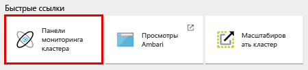

# Начало работы. Создание кластера Apache Spark в Azure HDInsight и выполнение интерактивных запросов с помощью SQL Spark

Узнайте, как создать кластер [Apache Spark](hdinsight-apache-spark-overview.md) в HDInsight и выполнять интерактивные запросы Spark SQL в кластере Spark с помощью записной книжки [Jupyter](https://jupyter.org).

   

## Предварительные требования
* **Подписка Azure**. Прежде чем приступать к изучению этого руководства, необходимо оформить подписку Azure. Ознакомьтесь со страницей [Создайте бесплатную учетную запись Azure уже сегодня](https://azure.microsoft.com/free).

## Создание кластера Spark
В этом разделе вы создадите в HDInsight кластер Spark, используя [шаблон Azure Resource Manager](https://azure.microsoft.com/resources/templates/101-hdinsight-spark-linux/). Другие способы создания кластера см. в статье [Создание кластеров Hadoop под управлением Linux в HDInsight](hdinsight-hadoop-provision-linux-clusters.md).

1. Щелкните следующее изображение, чтобы открыть шаблон на портале Azure.         

    

2. Введите следующие значения.

    

    * **Подписка.** Выберите свою подписку Azure для этого кластера.
    * **Группа ресурсов.** Создайте группу ресурсов или выберите существующую. Она используется для управления ресурсами Azure для ваших проектов.
    * **Расположение**. Выберите расположение группы ресурсов.  Это расположение также используется для хранилища кластера по умолчанию и кластера HDInsight.
    * **Имя кластера.** Введите имя создаваемого кластера Hadoop.
    * **Версия Spark.** Выберите версию Spark, которую необходимо установить в кластере.
    * **Имя для входа в кластер и пароль**: имя для входа по умолчанию — admin.
    * **Имя пользователя SSH и пароль**.

   Запишите эти значения.  Они потребуются позже в данном руководстве.

3. Установите флажок **Я принимаю указанные выше условия** и **Закрепить на панели мониторинга**, а затем нажмите кнопку **Приобрести**. Появится новый элемент под названием "Идет отправка развертывания для развертывания шаблона". Процесс создания кластеров занимает около 20 минут.

> [!NOTE]
> В этой статье описано, как создать кластер Spark, использующий [большие двоичные объекты службы хранилища Azure в качестве хранилища кластера](hdinsight-hadoop-use-blob-storage.md). Кроме того, вы можете создать кластер Spark, использующий [Azure Data Lake Store](../data-lake-store/data-lake-store-overview.md) в качестве дополнительного хранилища (в придачу к большим двоичным объектам службы хранилища Azure, которые служат основными хранилищами). Инструкции см. в инструкциях по [созданию кластера HDInsight с Data Lake Store](../data-lake-store/data-lake-store-hdinsight-hadoop-use-portal.md).
>
>

## Выполнение запроса Spark SQL

В этом разделе мы будем выполнять запросы Spark SQL к кластеру Spark, используя документ Jupyter Notebook. Кластеры HDInsight Spark предоставляют три ядра, которые можно использовать с записными книжками Jupyter. а именно:

* **PySpark** (для приложений, написанных на языке Python).
* **PySpark3** (для приложений, написанных на языке Python3).
* **Spark** (для приложений, написанных на языке Scala);

В этой статье вы будете использовать ядро **PySpark**. Дополнительные сведения о ядрах см. в статье [Ядра для записных книжек Jupyter с кластерами Apache Spark в HDInsight](hdinsight-apache-spark-jupyter-notebook-kernels.md). Основные преимущества использования ядра PySpark:

* контексты Spark и Hive устанавливаются автоматически;
* для запуска запросов SQL или Hive напрямую без предшествующих фрагментов кода можно использовать волшебный текст ячеек, например `%%sql`.
* Выходные данные для запросов SQL или Hive визуализируются автоматически.

### Создание документа Jupyter Notebook с помощью ядра PySpark

1. Откройте [портал Azure](https://portal.azure.com/).

2. Если закрепили кластер на панели мониторинга, щелкните элемент кластера на панели мониторинга, чтобы открыть колонку кластера.

    Если вы не закрепили кластер на панели мониторинга, в области слева щелкните **Кластеры HDInsight**, а затем выберите созданный кластер.

3. В разделе **Быстрые ссылки** щелкните **Панели мониторинга кластера**, а затем — **Записная книжка Jupyter**. При появлении запроса введите учетные данные администратора для кластера.

   

   > [!NOTE]
   > Также можно открыть Jupyter Notebook для своего кластера, открыв следующий URL-адрес в браузере. Замените **CLUSTERNAME** именем кластера:
   >
   > `https://CLUSTERNAME.azurehdinsight.net/jupyter`
   >
   >
3. Создайте записную книжку. Щелкните **Создать**, а затем выберите **PySpark**.

   

   Будет создана и открыта записная книжка с именем Untitled (Untitled.pynb).

4. Щелкните имя записной книжки вверху и по желанию введите понятное имя.

    

5. Вставьте указанный ниже код в пустую ячейку и нажмите клавиши **SHIFT + ВВОД**, чтобы выполнить его. Код импортирует типы, необходимые для этого сценария:

        from pyspark.sql.types import *

    Так как записная книжка была создана с помощью ядра PySpark, задавать контексты явно необязательно. Контексты Spark и Hive будут созданы автоматически при выполнении первой ячейки кода.

    

    При каждом запуске задания в Jupyter в заголовке окна веб-браузера будет отображаться состояние **(Занято)**, а также название записной книжки. Кроме того, рядом с надписью **PySpark** в верхнем правом углу окна будет показан закрашенный кружок. После завершения задания он изменится на кружок без заливки.

6. Зарегистрируйте пример набора данных в виде временной таблицы (**hvac**), выполнив следующий код:

        # Load the data
        hvacText = sc.textFile("wasbs:///HdiSamples/HdiSamples/SensorSampleData/hvac/HVAC.csv")

        # Create the schema
        hvacSchema = StructType([StructField("date", StringType(), False),StructField("time", StringType(), False),StructField("targettemp", IntegerType(), False),StructField("actualtemp", IntegerType(), False),StructField("buildingID", StringType(), False)])

        # Parse the data in hvacText
        hvac = hvacText.map(lambda s: s.split(",")).filter(lambda s: s[0] != "Date").map(lambda s:(str(s[0]), str(s[1]), int(s[2]), int(s[3]), str(s[6]) ))

        # Create a data frame
        hvacdf = sqlContext.createDataFrame(hvac,hvacSchema)

        # Register the data frame as a table to run queries against
        hvacdf.registerTempTable("hvac")

    Кластеры Spark в HDInsight поставляются с файлом демонстрационных данных **hvac.csv** в разделе **\HdiSamples\HdiSamples\SensorSampleData\hvac**.

7. Для запроса данных выполните следующий код:

        %%sql
        SELECT buildingID, (targettemp - actualtemp) AS temp_diff, date FROM hvac WHERE date = \"6/1/13\"

   Так как вы используете ядро PySpark, вы можете отправить SQL-запрос непосредственно к временной таблице **hvac**, которую вы создали выполнив магическую команду `%%sql`. Дополнительные сведения о магической команде `%%sql`, а также других магических командах, доступных в ядре PySpark, приведены в статье [Ядра для записных книжек Jupyter с кластерами Apache Spark в HDInsight](hdinsight-apache-spark-jupyter-notebook-kernels.md#parameters-supported-with-the-sql-magic).

   По умолчанию выводятся следующие табличные данные.

     

    Результаты также можно просмотреть и в других визуализациях. Например, диаграмма областей для тех же выходных данных будет выглядеть следующим образом.

    

9. Завершив работу с приложением, можно закрыть записную книжку, чтобы освободить ресурсы кластера. Для этого в записной книжке в меню **Файл** выберите пункт **Close and Halt** (Закрыть и остановить).

## Устранение неполадок

Ниже приведены некоторые распространенные проблемы, с которыми вы можете столкнуться при работе с кластерами HDInsight.

### Требования к контролю доступа
[!INCLUDE [access-control](../../includes/hdinsight-access-control-requirements.md)]

## Удаление кластера
[!INCLUDE [delete-cluster-warning](../../includes/hdinsight-delete-cluster-warning.md)]

## Дополнительные материалы
* [Обзор: Apache Spark в Azure HDInsight](hdinsight-apache-spark-overview.md)

### Сценарии
* [Использование Spark со средствами бизнес-аналитики. Выполнение интерактивного анализа данных с использованием Spark в HDInsight с помощью средств бизнес-аналитики](hdinsight-apache-spark-use-bi-tools.md)
* [Использование Spark с машинным обучением. Использование Spark в HDInsight для анализа температуры в здании на основе данных системы кондиционирования](hdinsight-apache-spark-ipython-notebook-machine-learning.md)
* [Использование Spark с машинным обучением. Использование Spark в HDInsight для прогнозирования результатов контроля качества пищевых продуктов](hdinsight-apache-spark-machine-learning-mllib-ipython.md)
* [Потоковая передача Spark. Использование Spark в HDInsight для сборки приложений потоковой передачи данных в режиме реального времени](hdinsight-apache-spark-eventhub-streaming.md)
* [Анализ журнала веб-сайта с использованием Spark в HDInsight](hdinsight-apache-spark-custom-library-website-log-analysis.md)
* [Analyze Application Insights telemetry logs with Spark on HDInsight (Анализ журналов телеметрии Application Insights с помощью Spark в HDInsight)](hdinsight-spark-analyze-application-insight-logs.md)

### Создание и запуск приложений
* [Создание автономного приложения с использованием Scala](hdinsight-apache-spark-create-standalone-application.md)
* [Удаленный запуск заданий с помощью Livy в кластере Spark](hdinsight-apache-spark-livy-rest-interface.md)

### Средства и расширения
* [Использование подключаемого модуля средств HDInsight для IntelliJ IDEA для создания и отправки приложений Spark Scala](hdinsight-apache-spark-intellij-tool-plugin.md)
* [Удаленная отладка приложений Spark в кластере HDInsight Spark Linux с помощью подключаемого модуля средств HDInsight для IntelliJ IDEA](hdinsight-apache-spark-intellij-tool-plugin-debug-jobs-remotely.md)
* [Использование записных книжек Zeppelin с кластером Spark в HDInsight](hdinsight-apache-spark-use-zeppelin-notebook.md)
* [Ядра, доступные для записной книжки Jupyter в кластере Spark в HDInsight](hdinsight-apache-spark-jupyter-notebook-kernels.md)
* [Использование внешних пакетов с записными книжками Jupyter](hdinsight-apache-spark-jupyter-notebook-use-external-packages.md)
* [Установка записной книжки Jupyter на компьютере и ее подключение к кластеру Apache Spark в Azure HDInsight (предварительная версия)](hdinsight-apache-spark-jupyter-notebook-install-locally.md)

### Управление ресурсами
* [Управление ресурсами кластера Apache Spark в Azure HDInsight](hdinsight-apache-spark-resource-manager.md)
* [Отслеживание и отладка заданий в кластере Apache Spark в HDInsight на платформе Linux](hdinsight-apache-spark-job-debugging.md)

[hdinsight-versions]: hdinsight-component-versioning.md
[hdinsight-upload-data]: hdinsight-upload-data.md
[hdinsight-storage]: hdinsight-hadoop-use-blob-storage.md

[azure-purchase-options]: http://azure.microsoft.com/pricing/purchase-options/
[azure-member-offers]: http://azure.microsoft.com/pricing/member-offers/
[azure-free-trial]: http://azure.microsoft.com/pricing/free-trial/
[azure-management-portal]: https://manage.windowsazure.com/
[azure-create-storageaccount]: storage-create-storage-account.md

