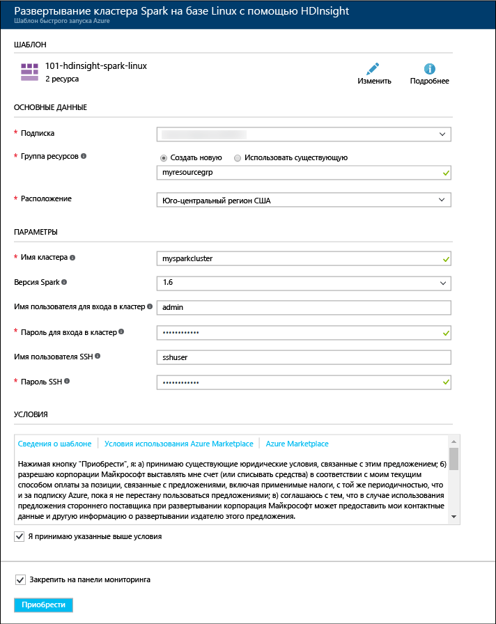

# Создание кластера Apache Spark в Azure HDInsight

Из этой статьи вы узнаете, как создать кластер Apache Spark в Azure HDInsight и отправить запросы Spark SQL к таблице Hive. Сведения о Spark в HDInsight см. в [этой статье](hdinsight-apache-spark-overview.md).

   

## Предварительные требования

* **Подписка Azure**. Прежде чем приступать к изучению этого руководства, необходимо оформить подписку Azure. Ознакомьтесь со страницей [Создайте бесплатную учетную запись Azure уже сегодня](https://azure.microsoft.com/free).

## Создание кластера HDInsight Spark

Следуя инструкциям из этого раздела, вы создадите кластер HDInsight Spark, используя [шаблон Azure Resource Manager](https://azure.microsoft.com/resources/templates/101-hdinsight-spark-linux/). Другие способы создания кластера см. в статье [Создание кластеров Hadoop под управлением Linux в HDInsight](hdinsight-hadoop-provision-linux-clusters.md).

1. Щелкните следующее изображение, чтобы открыть шаблон на портале Azure.         

    

2. Введите следующие значения.

    

    * **Подписка.** Выберите свою подписку Azure для этого кластера.
    * **Группа ресурсов.** Создайте группу ресурсов или выберите существующую. Она используется для управления ресурсами Azure для ваших проектов.
    * **Расположение**. Выберите расположение группы ресурсов. В шаблоне используется это расположение для создания кластера и его хранения по умолчанию.
    * **Имя кластера**. Введите имя создаваемого кластера HDInsight.
    * **Версия Spark**. Для версии, которую необходимо установить в кластере, выберите значение **2.0**.
    * **Имя для входа в кластер и пароль**: имя для входа по умолчанию — admin.
    * **Имя пользователя SSH и пароль**.

   Запишите эти значения.  Они потребуются позже в данном руководстве.

3. Установите флажок **Я принимаю указанные выше условия** и **Закрепить на панели мониторинга**, а затем нажмите кнопку **Приобрести**. Появится новый элемент под названием "Идет отправка развертывания для развертывания шаблона". Процесс создания кластеров занимает около 20 минут.

Если при создании кластера HDInsight возникают проблемы, возможно, у вас нет необходимых разрешений. Дополнительные сведения см. в разделе [Требования к контролю доступа](hdinsight-administer-use-portal-linux.md#create-clusters).

> [!NOTE]
> В этой статье описано, как создать кластер Spark, использующий [большие двоичные объекты службы хранилища Azure в качестве хранилища кластера](hdinsight-hadoop-use-blob-storage.md). Кроме того, вы можете создать кластер Spark, использующий [Azure Data Lake Store](hdinsight-hadoop-use-data-lake-store.md) в качестве хранилища по умолчанию. Инструкции см. в инструкциях по [созданию кластера HDInsight с Data Lake Store](../data-lake-store/data-lake-store-hdinsight-hadoop-use-portal.md).
>
>

## Выполнение инструкций Spark SQL в таблице Hive

SQL — это наиболее распространенный и широко используемый язык для создания запросов и определения данных. Основатели Spark в полной мере использовали эти знания, чтобы сделать широко известный язык запросов доступным для более широкого круга аналитиков, которые хотят работать с данными, хранящимися в распределенной файловой системе Hadoop (HDFS). Со Spark SQL это стало возможным. Spark SQL работает как расширение Apache Spark для обработки структурированных данных с использованием знакомого синтаксиса SQL.

Это расширение поддерживает такие языки запросов, как SQL и HiveQL. Его возможности включают привязки в Python, Scala и Java. Это позволяет запрашивать данные, хранящиеся в различных расположениях, таких как внешние базы данных, структурированные файлы данных (например, JSON) и таблицы Hive.

### Выполнение запросов Spark SQL в кластере HDInsight

При использовании записной книжки Jupyter, настроенной для кластера HDInsight Spark, вы получаете предустановку `sqlContext`, которую можно применять для выполнения запросов Hive с помощью Spark SQL. Из этого раздела вы узнаете, как запустить записную книжку Jupyter и выполнить простой запрос Spark SQL к существующей таблице Hive (**hivesampletable**), доступной на всех кластерах HDInsight.

1. Откройте [портал Azure](https://portal.azure.com/).

2. Если закрепили кластер на панели мониторинга, щелкните элемент кластера на панели мониторинга, чтобы открыть колонку кластера.

    Если вы не закрепили кластер на панели мониторинга, в области слева щелкните **Кластеры HDInsight**, а затем выберите созданный кластер.

3. В разделе **Быстрые ссылки** щелкните **Панели мониторинга кластера**, а затем — **Записная книжка Jupyter**. При появлении запроса введите учетные данные администратора для кластера.

   

   > [!NOTE]
   > Также можно открыть записную книжку Jupyter для своего кластера, открыв следующий URL-адрес в браузере. Замените **CLUSTERNAME** именем кластера:
   >
   > `https://CLUSTERNAME.azurehdinsight.net/jupyter`
   >
   >
3. Создайте записную книжку. Щелкните **Создать**, а затем выберите **PySpark**.

   

   Будет создана и открыта записная книжка с именем Untitled (Untitled.pynb).

4. Щелкните имя записной книжки вверху и по желанию введите понятное имя.

    

5.  Вставьте указанный ниже код в пустую ячейку и нажмите сочетание клавиш **SHIFT + ВВОД**, чтобы выполнить код. В примере кода ниже `%%sql` (sql magic) указывает записной книжке Jupyter использовать предустановку `sqlContext` для выполнения запроса Hive. Запрос извлекает первые 10 строк из таблицы Hive (**hivesampletable**), которая по умолчанию доступна для всех кластеров HDInsight.

        %%sql
        SELECT * FROM hivesampletable LIMIT 10

    

    Дополнительные сведения о `%%sql` magic и предустановленных контекстах см. в статье [Ядра для записной книжки Jupyter в кластерах Spark в Azure HDInsight](hdinsight-apache-spark-jupyter-notebook-kernels.md).

    > [!NOTE]
    > При каждом выполнении запроса в Jupyter в заголовке окна веб-браузера будет отображаться состояние **(Занято)**, а также название записной книжки. Кроме того, рядом с надписью **PySpark** в верхнем правом углу окна будет показан закрашенный кружок. После завершения задания он изменится на кружок без заливки.
    >
    >
    
6. Экран обновится, и отобразятся выходные данные запроса.

    

7. Завершив работу с приложением, можно закрыть записную книжку, чтобы освободить ресурсы кластера. Для этого в записной книжке в меню **Файл** выберите пункт **Close and Halt** (Закрыть и остановить).

8. Если вы планируете выполнить следующие действия позже, обязательно удалите кластер HDInsight, созданный во время работы с этой статьей. 

[!INCLUDE [delete-cluster-warning](../../includes/hdinsight-delete-cluster-warning.md)]

## Дальнейшие действия 

Из этой статьи вы узнали, как создать кластер HDInsight Spark и выполнить базовый запрос Spark SQL. Из следующей статьи вы узнаете, как с помощью кластера HDInsight Spark выполнять интерактивные запросы, используя пример данных.

> [!div class="nextstepaction"]
>[Выполнение интерактивных запросов в кластере HDInsight Spark](hdinsight-apache-spark-load-data-run-query.md)

