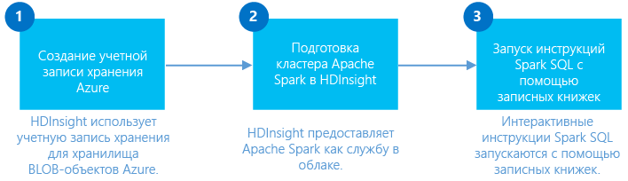

<properties
	pageTitle="Создание кластера Spark в HDInsight на платформе Linux и использование запросов Spark SQL из Jupyter для интерактивного анализа | Microsoft Azure"
	description="Пошаговые инструкции по быстрому созданию кластера Apache Spark в HDInsight и последующему использованию запросов Spark SQL из записных книжек Jupyter для выполнения интерактивных запросов."
	services="hdinsight"
	documentationCenter=""
	authors="nitinme"
	manager="paulettm"
	editor="cgronlun"
	tags="azure-portal"/>

<tags
	ms.service="hdinsight"
	ms.workload="big-data"
	ms.tgt_pltfrm="na"
	ms.devlang="na"
	ms.topic="get-started-article"
	ms.date="02/17/2016"
	ms.author="nitinme"/>

# Начало работы. Создание кластера Apache Spark в Azure HDInsight (Linux) и выполнение интерактивных запросов с помощью SQL Spark

Узнайте, как создать кластер Apache Spark в HDInsight и выполнять интерактивные запросы Spark SQL в кластере Spark с помощью записной книжки [Jupyter](https://jupyter.org).

   

**Предварительные требования:**

- **Подписка Azure.**. Прежде чем приступать к изучению этого учебника, необходимо оформить подписку Azure. См. [Бесплатная пробная версия Azure](https://azure.microsoft.com/documentation/videos/get-azure-free-trial-for-testing-hadoop-in-hdinsight/).

- **Клиент SSH**: в системах Linux, Unix и OS X клиент SSH предоставляется с помощью команды `ssh`. Для систем Windows рекомендуем использовать [PuTTY](http://www.chiark.greenend.org.uk/~sgtatham/putty/download.html).
    
- **Ключи SSH** (необязательно): для защиты учетной записи SSH, которая используется для подключения к кластеру с использованием пароля или открытого ключа. Использование пароля позволяет быстро начать работу, и этот вариант следует использовать, если вы хотите быстро создать кластер и запустить некоторые тестовые задания. Использование ключа более безопасно, но требует дополнительной настройки. Этот вариант вы можете использовать при создании рабочего кластера. В этой статье мы используем вариант с паролем. Инструкции по созданию и использованию ключей SSH в HDInsight см. в следующих статьях:

	-  на компьютере под управлением Linux — [Использование SSH с Hadoop под управлением Linux в HDInsight в Linux, Unix или OS X](hdinsight-hadoop-linux-use-ssh-unix.md);
    
	-  на компьютере под управлением Windows — [Использование SSH с кластерами HDInsight (Hadoop) под управлением Linux в Windows](hdinsight-hadoop-linux-use-ssh-windows.md).

## Создание кластера Spark в HDInsight на платформе Linux

В этом разделе представлены сведения о создании кластера HDInsight версии 3.3 на базе Spark версии 1.5.1. Дополнительную информацию о различных версиях HDInsight и их соглашениях об уровне обслуживания см. в статье [Версии компонентов НDInsight](hdinsight-component-versioning.md).

>[AZURE.NOTE] В этой статье описаны действия по созданию кластера Apache Spark в HDInsight с использованием базовых параметров конфигурации. Сведения о других параметрах конфигурации кластера (например, относящихся к использованию дополнительного хранилища, виртуальной сети Azure или метахранилища для Hive) см. в статье [Создание кластеров Spark в HDInsight с использованием настраиваемых параметров](hdinsight-hadoop-provision-linux-clusters.md).

**Создание кластера Spark**

1. Войдите на [портал предварительной версии Azure](https://ms.portal.azure.com/).

2. Щелкните **СОЗДАТЬ**, **Аналитика данных**, а затем — **HDInsight**.

    

3. Введите **имя кластера**, выберите значение **Hadoop** для параметра **Тип кластера**, в раскрывающемся списке **Операционная система кластера** выберите **Ubuntu**, а затем укажите версию Spark. Рядом с именем кластера (если оно доступно) отобразится зеленый флажок.

	

4. Если у вас несколько подписок, выберите запись **Подписка**, чтобы выбрать подписку Azure для кластера.

5. Щелкните **Группа ресурсов**, чтобы отобразить список имеющихся групп ресурсов и выбрать ту, в которой необходимо создать кластер, или выберите **Создать** и введите имя новой группы ресурсов. Если имя новой группы доступно, то рядом с ним отобразится зеленый флажок.

	> [AZURE.NOTE] Эта запись будет выбрана по умолчанию для одной из групп ресурсов (при их наличии).

6. Щелкните **Учетные данные** и введите пароль для пользователя с правами администратора. Также необходимо ввести **Имя пользователя SSH**. В разделе **Тип проверки подлинности SSH** щелкните **Пароль** и укажите пароль для пользователя SSH. Нажмите **Выбрать** внизу страницы, чтобы сохранить конфигурацию учетных данных.

	

    > [AZURE.NOTE] SSH используется для удаленного доступа к кластеру HDInsight с помощью командной строки. Эти имя пользователя и пароль будут использоваться при подключении к кластеру через SSH. Имя пользователя SSH должно быть уникальным, так как на его основе создается учетная запись пользователя на всех узлах кластера HDInsight. Вот некоторые имена учетных записей, которые зарезервированы для служб в кластере и не должны использоваться в качестве имени пользователя SSH:
    >
    > root, hdiuser, storm, hbase, ubuntu, zookeeper, hdfs, yarn, mapred, hbase, hive, oozie, falcon, sqoop, admin, tez, hcat, hdinsight-zookeeper.

	Дополнительные сведения об использовании SSH с HDInsight см. в следующих статьях.

	* [Использование SSH с Hadoop под управлением Linux в HDInsight в Linux, Unix или OS X](hdinsight-hadoop-linux-use-ssh-unix.md)
	* [Использование SSH с Hadoop под управлением Linux в HDInsight в Windows](hdinsight-hadoop-linux-use-ssh-windows.md)

7. Щелкните **Источник данных**, чтобы выбрать для кластера существующий источник данных или создать новый. При создании кластера Hadoop в HDInsight нужно указать учетную запись хранения Azure. Конкретный контейнер хранилища BLOB-объектов из этой учетной записи назначается в качестве файловой системы по умолчанию, так же как и в распределенной файловой системе Hadoop (HDFS). По умолчанию создание кластера HDInsight выполняется в том же центре обработки данных, в котором находится указанная учетная запись хранения. Дополнительные сведения см. в статье [Использование хранилища BLOB-объектов Azure с HDInsight][hdinsight-storage]

	

	В настоящее время в качестве источника данных для кластера HDInsight можно выбрать учетную запись хранения Azure. Далее приводится описание элементов интерфейса, которое поможет вам лучше понять записи в колонке **Источник данных**.

	- **Метод выбора**: выберите значение **Из всех подписок**, чтобы активировать поиск учетных записей хранения во всех своих подписках. Задайте для этого параметра значение **Ключ доступа**, если вы хотите ввести **имя хранилища** и **ключ доступа** существующей учетной записи хранения.

	- **Выбрать учетную запись хранения или создать новую**: щелкните **Выбрать учетную запись хранения**, чтобы найти и выбрать существующую учетную запись хранения, которую нужно связать с кластером. Чтобы создать новую учетную запись хранения, выберите **Создать**. В появившееся поле введите имя учетной записи хранения. Если имя доступно, то отобразится зеленый флажок.

	- **Выбрать контейнер по умолчанию**: позволяет ввести имя контейнера по умолчанию и использовать его для кластера. Вы можете ввести любое имя, однако мы рекомендуем использовать такое же имя, как у кластера, чтобы легко распознавать, какой контейнер используется для конкретного кластера.

	- **Расположение**: географический регион, к которому будет относиться существующая или новая учетная запись хранения.

		> [AZURE.IMPORTANT] Выбранное расположение для источника данных по умолчанию будет определять расположение кластера HDInsight. Кластер и источник данных по умолчанию должны находиться в одном регионе.

	Нажмите **Выбрать**, чтобы сохранить конфигурацию источника данных.

8. Щелкните **Ценовые категории узла**, чтобы отобразить сведения об узлах, которые будут созданы для этого кластера. Задайте количество рабочих узлов, необходимых для кластера. Оценочная стоимость кластера отобразится в колонке.

	

	Нажмите **Выбрать**, чтобы сохранить конфигурацию цен узла.

9. В колонке **Новый кластер HDInsight** обязательно выберите параметр **Закрепить на начальной панели**, а затем нажмите кнопку **Создать**. После этого будет создан кластер, а на начальную панель портала Azure будет добавлена его плитка. Значок указывает, что выполняется создание кластера. После завершения создания вместо него будет отображаться значок HDInsight.

	| При создании | создание завершено |
	| ------------------ | --------------------- |
	|  |  |

	> [AZURE.NOTE] Обычно создание кластера занимает около 15 минут. Вы можете отслеживать процесс создания с помощью элемента на начальной панели или записи **Уведомления** в левой части страницы.

10. После завершения создания щелкните элемент кластера Spark на начальной панели, чтобы открыть колонку кластера.

## Выполнение запросов Spark SQL с помощью записной книжки Jupyter

В этом разделе записная книжка Jupyter используется для выполнения запросов Spark SQL к кластеру Spark. По умолчанию записная книжка Jupyter предоставляется с ядром **Python2**. Кластеры Spark в HDInsight предоставляют два дополнительных ядра, которые вы можете использовать с записной книжкой Jupyter, а именно:

* **PySpark** (для приложений, написанных на языке Python).
* **Spark** (для приложений, написанных на языке Scala);

В этой статье вы будете использовать ядро PySpark. В статье [Ядра, доступные в записных книжках Jupyter с кластерами Spark в HDInsight](hdinsight-apache-spark-jupyter-notebook-kernels.md#why-should-i-use-the-new-kernels) можно узнать подробности о преимуществах использования ядра PySpark. Однако несколько основных преимуществ использования ядра PySpark заключаются в следующем:

* Не нужно задавать контексты для Spark, SQL и Hive. Они устанавливаются автоматически.
* Вы можете использовать различные волшебные слова ячеек (такие как %%sql или %%hive) для запуска запросов SQL или Hive напрямую без предшествующих фрагментов кода.
* Выходные данные для запросов SQL или Hive визуализируются автоматически.

### Создание записной книжки Jupyter с ядром PySpark 

1. На начальной панели [портала предварительной версии Azure](https://portal.azure.com/) щелкните плитку кластера Spark (если она закреплена на начальной панели). Кроме того, вы можете перейти к кластеру, выбрав пункты **Просмотреть все** и **Кластеры HDInsight**.   

2. В колонке кластера Spark щелкните **Быстрые ссылки**, затем в колонке **Панель мониторинга кластера** выберите **Jupyter Notebook**. При появлении запроса введите учетные данные администратора для кластера.

	> [AZURE.NOTE] Также можно открыть Jupyter Notebook для своего кластера, открыв следующий URL-адрес в браузере. Замените __CLUSTERNAME__ именем кластера.
	>
	> `https://CLUSTERNAME.azurehdinsight.net/jupyter`

2. Создайте новую записную книжку. Щелкните **Создать**, а затем выберите **PySpark**.

	

3. Будет создана и открыта записная книжка с именем Untitled.pynb. Щелкните имя записной книжки в верхней части страницы сверху и введите понятное имя.

	

4. Так как записная книжка была создана с помощью ядра PySpark, задавать контексты явно необязательно. Контексты Spark, SQL и Hive будут созданы автоматически при выполнении первой ячейки кода. Можно начать с импорта различных типов, необходимых для этого сценария. Для этого вставьте следующий фрагмент кода в пустую ячейку и нажмите сочетание клавиш **SHIFT+ВВОД**.

		from pyspark.sql.types import *
		
	При каждом запуске задания в Jupyter в заголовке окна веб-браузера будет отображаться состояние **(Занято)**, а также название записной книжки. Кроме того, рядом с надписью **PySpark** в верхнем правом углу окна будет показан закрашенный кружок. После завершения задания этот значок изменится на кружок без заливки.

	 

4. Загрузите демонстрационные данные во временную таблицу. При создании кластера Spark в HDInsight файл с демонстрационными данными **hvac.csv** копируется в связанную учетную запись хранения по следующему пути: **\\HdiSamples\\HdiSamples\\SensorSampleData\\hvac**.

	Вставьте указанный ниже пример кода в пустую ячейку и нажмите клавиши **SHIFT + ВВОД**. Этот пример кода регистрирует данные во временной таблице с именем **hvac**.

		# Load the data
		hvacText = sc.textFile("wasb:///HdiSamples/HdiSamples/SensorSampleData/hvac/HVAC.csv")
		
		# Create the schema
		hvacSchema = StructType([StructField("date", StringType(), False),StructField("time", StringType(), False),StructField("targettemp", IntegerType(), False),StructField("actualtemp", IntegerType(), False),StructField("buildingID", StringType(), False)])
		
		# Parse the data in hvacText
		hvac = hvacText.map(lambda s: s.split(",")).filter(lambda s: s[0] != "Date").map(lambda s:(str(s[0]), str(s[1]), int(s[2]), int(s[3]), str(s[6]) ))
		
		# Create a data frame
		hvacdf = sqlContext.createDataFrame(hvac,hvacSchema)
		
		# Register the data fram as a table to run queries against
		hvacdf.registerTempTable("hvac")

5. Поскольку вы используете ядро PySpark, вы можете запускать SQL-запрос напрямую для временной таблицы **hvac**, только что созданной с помощью волшебного слова `%%sql`. Дополнительные сведения о волшебном слове `%%sql`, а также о других волшебных словах, доступных в ядре PySpark, приведены в разделе [Ядра, доступные в записных книжках Jupyter с кластерами Spark в HDInsight](hdinsight-apache-spark-jupyter-notebook-kernels.md#why-should-i-use-the-new-kernels).
		
		%%sql
		SELECT buildingID, (targettemp - actualtemp) AS temp_diff, date FROM hvac WHERE date = "6/1/13"")

5. После успешного выполнения задания по умолчанию будет показаны следующие табличные данные.

 	

	Результаты также можно просмотреть и в других визуализациях. Например, диаграмма областей для тех же выходных данных будет выглядеть следующим образом.

	

6. Завершив работу с приложением, следует закрыть записную книжку, чтобы освободить ресурсы. Для этого в записной книжке в меню **Файл** выберите пункт **Закрыть и остановить**. Это завершит работу записной книжки и закроет ее.

## См. также:

* [Обзор: Apache Spark в Azure HDInsight](hdinsight-apache-spark-overview.md)

### Сценарии

* [Использование Spark со средствами бизнес-аналитики. Выполнение интерактивного анализа данных с использованием Spark в HDInsight с помощью средств бизнес-аналитики](hdinsight-apache-spark-use-bi-tools.md)

* [Использование Spark с машинным обучением. Использование Spark в HDInsight для анализа температуры в здании на основе данных системы кондиционирования](hdinsight-apache-spark-ipython-notebook-machine-learning.md)

* [Использование Spark с машинным обучением. Использование Spark в HDInsight для прогнозирования результатов контроля качества пищевых продуктов](hdinsight-apache-spark-machine-learning-mllib-ipython.md)

* [Потоковая передача Spark. Использование Spark в HDInsight для сборки приложений потоковой передачи данных в режиме реального времени](hdinsight-apache-spark-eventhub-streaming.md)

* [Анализ журнала веб-сайта с использованием Spark в HDInsight](hdinsight-apache-spark-custom-library-website-log-analysis.md)

### Создание и запуск приложений

* [Создание автономного приложения с использованием Scala](hdinsight-apache-spark-create-standalone-application.md)

* [Удаленный запуск заданий с помощью Livy в кластере Spark](hdinsight-apache-spark-livy-rest-interface.md)

### Средства и расширения

* [Использование подключаемого модуля средств HDInsight для IntelliJ IDEA для создания и отправки приложений Spark Scala](hdinsight-apache-spark-intellij-tool-plugin.md)

* [Использование записных книжек Zeppelin с кластером Spark в HDInsight](hdinsight-apache-spark-use-zeppelin-notebook.md)

* [Ядра, доступные для записной книжки Jupyter в кластере Spark в HDInsight](hdinsight-apache-spark-jupyter-notebook-kernels.md)

### Управление ресурсами

* [Управление ресурсами кластера Apache Spark в Azure HDInsight](hdinsight-apache-spark-resource-manager.md)

### Известные проблемы

* [Известные проблемы Apache Spark в Azure HDInsight (Linux)](hdinsight-apache-spark-known-issues.md)

[hdinsight-versions]: hdinsight-component-versioning.md
[hdinsight-upload-data]: hdinsight-upload-data.md
[hdinsight-storage]: hdinsight-hadoop-use-blob-storage.md

[azure-purchase-options]: http://azure.microsoft.com/pricing/purchase-options/
[azure-member-offers]: http://azure.microsoft.com/pricing/member-offers/
[azure-free-trial]: http://azure.microsoft.com/pricing/free-trial/
[azure-management-portal]: https://manage.windowsazure.com/
[azure-create-storageaccount]: storage-create-storage-account.md

<!---HONumber=AcomDC_0302_2016-->