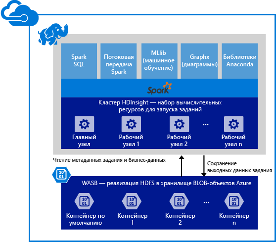

<properties 
	pageTitle="Обзор Apache Spark в HDInsight | Microsoft Azure" 
	description="Общие сведения о Spark в HDInsight и сценарии использования Spark в HDInsight в приложениях." 
	services="hdinsight" 
	documentationCenter="" 
	authors="nitinme" 
	manager="paulettm" 
	editor="cgronlun"
	tags="azure-portal"/>

<tags 
	ms.service="hdinsight" 
	ms.workload="big-data" 
	ms.tgt_pltfrm="na" 
	ms.devlang="na" 
	ms.topic="article" 
	ms.date="02/05/2016" 
	ms.author="nitinme"/>

# Обзор. Apache Spark в Azure HDInsight (Linux)
 
<a href="http://spark.apache.org/" target="_blank">Apache Spark</a> — это платформа параллельной обработки с открытым исходным кодом, которая поддерживает обработку в памяти, чтобы повысить производительность приложений для анализа данных большого размера. Подсистема обработки Spark призвана ускорить разработку, повысить удобство использования и реализовать сложную аналитику. Возможности вычисления в памяти Spark отлично подходят для итеративных алгоритмов в машинном обучении и графовых вычислениях. Spark также совместима с хранилищем больших двоичных объектов Azure (WASB), поэтому существующие данные, хранящиеся в Azure, можно с легкостью обрабатывать с помощью Spark.

При создании кластера Spark в HDInsight создание вычислительных ресурсов Azure следует выполнять после установки и настройки Spark. Создание кластера Spark в HDInsight не займет больше десяти минут. Данные для обработки находятся в хранилище больших двоичных объектов Azure. См. раздел [Использование хранилища больших двоичных объектов Azure с HDInsight][hdinsight-storage].

**Хотите начать работу с Apache Spark в Azure HDInsight?** Ознакомьтесь с [кратким руководством по созданию кластера Spark в HDInsight в Linux и запуску примеров приложений с помощью Jupyter](hdinsight-apache-spark-jupyter-spark-sql.md).

>[AZURE.NOTE] Список известных проблем и ограничения в текущем выпуске см. в разделе [Известные проблемы Apache Spark в Azure HDInsight (Linux)](hdinsight-apache-spark-jupyter-spark-sql.md).

## Зачем использовать Spark в Azure HDInsight? 

Azure HDInsight предлагает полностью управляемую службу Spark. Ниже перечислены преимущества использования Spark в HDInsight.

| Функция | Описание |
|-------------------------------------|-------------------|
| Простота создания | Создание нового кластера Spark в HDInsight с помощью портала управления Azure, Azure PowerShell или пакета SDK .NET HDInsight занимает всего несколько минут. См. раздел [Приступая к работе с кластером Spark в HDInsight](hdinsight-apache-spark-jupyter-spark-sql.md). |
| Простота использования | Spark в кластерах HDInsight включает предварительно настроенные записные книжки Jupyter. Их можно использовать для интерактивной обработки и визуализации данных. Их URL-адреса — https://CLUSTERNAME.azurehdinsight.net/jupyter. Замените __CLUSTERNAME__ именем кластера Spark HDInsight.|
| Интерфейсы API REST | Spark в HDInsight включает [Livy](https://github.com/cloudera/hue/tree/master/apps/spark/java#welcome-to-livy-the-rest-spark-server), сервер заданий Spark на основе API REST, который позволяет пользователям удаленно отправлять задания и отслеживать их выполнение. |
| Параллельные запросы | Spark в HDInsight поддерживает параллельные запросы. Благодаря этому несколько запросов от одного пользователя или несколько запросов от разных пользователей и из различных приложений могут использовать одни и те же ресурсы кластера. |
| Кэширование на накопители SSD | Можно выбрать кэширование данных в памяти или на накопители SSD, подключенные к узлам кластера. Кэширование в память обеспечивает наилучшую производительность, однако может оказаться ресурсоемким; кэширование на накопители SSD предоставляет возможность повысить производительность запросов без необходимости создания кластера такого размера, который необходим для размещения всего набора данных в памяти.|
| Интеграция со службами Azure | Spark в HDInsight поставляется с соединителем для концентраторов событий Azure. Клиенты могут создавать приложения потоковой передачи с помощью концентраторов событий (в дополнение к системе [Kafka](http://kafka.apache.org/), которая уже входит в состав Spark). |
| Интеграция со средствами бизнес-аналитики | В состав Spark для HDInsight входят соединители для распространенных средств бизнес-аналитики, таких как [Power BI](http://www.powerbi.com/) и [Tableau](http://www.tableau.com/products/desktop) для анализа данных.|
| Предварительно загруженные библиотеки Anaconda | Кластеры Spark в HDInsight поставляются с предустановленными библиотеками Anaconda. [Anaconda](http://docs.continuum.io/anaconda/) содержит порядка 200 библиотек для машинного обучения, анализа данных, визуализации и т. д.|
| Масштабируемость | Количество узлов указывается во время создания кластера. Тем не менее рабочая нагрузка может меняться, и тогда возникает необходимость увеличить или уменьшить размер кластера. Все кластеры HDInsight позволяют изменять количество узлов в кластере. Кроме того, кластеры Spark можно удалить без потери данных, поскольку все данные хранятся в хранилище больших двоичных объектов Azure. |
| Круглосуточная и ежедневная поддержка | Для Spark в HDInsight предоставляются круглосуточная и ежедневная поддержка корпоративного уровня и соглашения об уровне обслуживания, гарантирующие время 99,9 % бесперебойной работы.|

## Каковы примеры использования Spark в HDInsight?

Использование Apache Spark в HDInsight включает следующие основные сценарии.

### Интерактивный анализ данных и бизнес-аналитика

[Учебник](hdinsight-apache-spark-use-bi-tools.md)

Apache Spark в HDInsight хранит данные в больших двоичных объектах Azure. Бизнес-эксперты и лица, ответственные за принятие решений, могут анализировать и создавать отчеты на основе этих данных, а также создавать интерактивные отчеты из проанализированных данных с помощью средств Microsoft Power BI. Аналитики могут использовать неструктурированные или полуструктурированные данные в хранилище Azure, определить схему для данных с помощью записных книжек, а затем создать модели данных с помощью средств Microsoft Power BI. Spark в HDInsight также поддерживает ряд средств бизнес-аналитики сторонних разработчиков, такие как Tableau, Qlikview и Lumira SAP, что делает Spark идеальной платформой для аналитиков, бизнес-экспертов и лиц, ответственных за принятие решений.

### Итеративное машинное обучение

[Учебник. Прогнозирование температуры зданий с помощью данных системы кондиционирования](hdinsight-apache-spark-ipython-notebook-machine-learning.md)

[Учебник. Прогнозирование результатов контроля качества пищевых продуктов](hdinsight-apache-spark-machine-learning-mllib-ipython.md)

В состав Apache Spark входит [MLlib](http://spark.apache.org/mllib/), библиотека машинного обучения, созданная на основе Spark. Кроме того, Spark в HDInsight также включает библиотеку Anaconda, распространяемую Python и содержащую различные пакеты для машинного обучения. Все это дополнено встроенной поддержкой записных книжек Jupyter — в итоге вы получаете в свое распоряжение первоклассную среду для создания приложений машинного обучения.

### Потоковая передача и анализ данных в режиме реального времени

[Учебник](hdinsight-apache-spark-eventhub-streaming.md)

Анализ данных в режиме реального времени используется для широкого набора сценариев, начиная от ускорения представления данных путем обработки данных по мере их поступления, и заканчивая созданием надежных решений для потоковой передачи. Spark в HDInsight обладает широкой поддержкой для создания решений для аналитики в режиме реального времени. Поскольку в состав Spark уже входят соединители для приема данных из различных источников, таких как Flume, Kafka, Twitter, ZeroMQ или сокеты TCP, Spark в HDInsight позволяет реализовать первоклассную поддержку для приема данных из концентраторов событий Azure. Концентраторы событий — это наиболее широко используемые службы очередей в Azure. Встроенная поддержка концентраторов событий делает Spark в HDInsight идеальной платформой для создания конвейеров аналитики в режиме реального времени.

##Какие компоненты входят в состав кластера Spark?

Spark в HDInsight включает следующие компоненты, доступные в кластерах по умолчанию.

- [Ядро Spark](https://spark.apache.org/docs/1.5.1/). Включает ядро Spark, Spark SQL, потоковые API-интерфейсы Spark, GraphX и MLlib.
- [Anaconda](http://docs.continuum.io/anaconda/)
- [Livy](https://github.com/cloudera/hue/tree/master/apps/spark/java#welcome-to-livy-the-rest-spark-server)
- [Портативный компьютер Jupyter](https://jupyter.org)

Spark в HDInsight, кроме того, включает [драйвер ODBC](http://go.microsoft.com/fwlink/?LinkId=616229) для подключения к кластерам Spark в HDInsight из таких средств бизнес-аналитики, как Microsoft Power BI и Tableau.

## С чего начать?

Начните с создания кластера Spark в HDInsight на платформе Linux. Ознакомьтесь с [кратким руководством по созданию кластера Spark в HDInsight в Linux и запуску примеров приложений с помощью Jupyter](hdinsight-apache-spark-jupyter-spark-sql.md).

## Дальнейшие действия

### Сценарии

* [Использование Spark со средствами бизнес-аналитики. Выполнение интерактивного анализа данных с использованием Spark в HDInsight с помощью средств бизнес-аналитики](hdinsight-apache-spark-use-bi-tools.md)

* [Использование Spark с машинным обучением. Использование Spark в HDInsight для анализа температуры в здании на основе данных системы кондиционирования](hdinsight-apache-spark-ipython-notebook-machine-learning.md)

* [Использование Spark с машинным обучением. Использование Spark в HDInsight для прогнозирования результатов контроля качества пищевых продуктов](hdinsight-apache-spark-machine-learning-mllib-ipython.md)

* [Потоковая передача Spark. Использование Spark в HDInsight для сборки приложений потоковой передачи данных в режиме реального времени](hdinsight-apache-spark-eventhub-streaming.md)

* [Анализ журнала веб-сайта с использованием Spark в HDInsight](hdinsight-apache-spark-custom-library-website-log-analysis.md)

### Создание и запуск приложений

* [Создание автономного приложения с использованием Scala](hdinsight-apache-spark-create-standalone-application.md)

* [Удаленный запуск заданий с помощью Livy в кластере Spark](hdinsight-apache-spark-livy-rest-interface.md)

### Средства и расширения

* [Использование подключаемого модуля средств HDInsight для IntelliJ IDEA для создания и отправки приложений Spark Scala](hdinsight-apache-spark-intellij-tool-plugin.md)

* [Использование записных книжек Zeppelin с кластером Spark в HDInsight](hdinsight-apache-spark-use-zeppelin-notebook.md)

* [Ядра, доступные для записной книжки Jupyter в кластере Spark в HDInsight](hdinsight-apache-spark-jupyter-notebook-kernels.md)

### Управление ресурсами

* [Управление ресурсами кластера Apache Spark в Azure HDInsight](hdinsight-apache-spark-resource-manager.md)

[hdinsight-storage]: hdinsight-hadoop-use-blob-storage.md

<!---HONumber=AcomDC_0218_2016-->