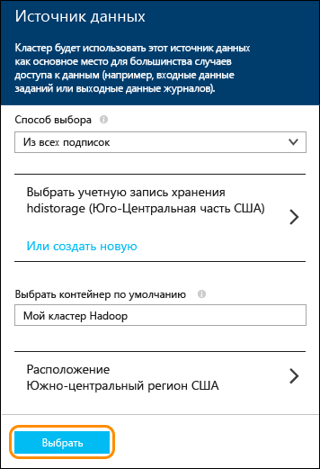

<properties
	pageTitle="Подготовка кластера Spark в Azure HDInsight и использование SQL Spark из Zeppelin и Jupyter для интерактивного анализа | Microsoft Azure"
	description="Пошаговые инструкции по быстрой подготовке кластера Apache Spark в HDInsight и последующему использованию запросов Spark SQL из записных книжек Zeppelin и Jupyter для выполнения интерактивных запросов."
	services="hdinsight"
	documentationCenter=""
	authors="nitinme"
	manager="paulettm"
	editor="cgronlun"
	tags="azure-portal"/>

<tags
	ms.service="hdinsight"
	ms.workload="big-data"
	ms.tgt_pltfrm="na"
	ms.devlang="na"
	ms.topic="article"
	ms.date="09/30/2015"
	ms.author="nitinme"/>

# Начало работы: подготовка к работе Apache Spark в Azure HDInsight и выполнение интерактивных запросов с помощью SQL Spark

[AZURE.INCLUDE [hdinsight-azure-preview-portal](../../includes/hdinsight-azure-preview-portal.md)]

* [Подготовка Apache Spark в HDInsight и выполнение интерактивных запросов с помощью Spark SQL](hdinsight-apache-spark-zeppelin-notebook-jupyter-spark-sql-v1.md)

Узнайте, как подготовить кластер Apache Spark в HDInsight с помощью параметра "Быстрое создание", а затем использовать записные веб-книжки [Zeppelin](https://zeppelin.incubator.apache.org) и [Jupyter](https://jupyter.org) для выполнения интерактивных запросов Spark SQL в кластере Spark.

   

**Предварительные требования:**

Прежде чем приступать к изучению этого учебника, необходимо оформить подписку Azure. См. [Бесплатная пробная версия Azure](http://azure.microsoft.com/documentation/videos/get-azure-free-trial-for-testing-hadoop-in-hdinsight/).

## Подготовка кластера HDInsight Spark

В этом разделе представлены сведения о подготовке кластер HDInsight версии 3.2 на базе Spark версии 1.3.1. Дополнительную информацию о различных версиях HDInsight и их соглашениях об уровне обслуживания см. в статье [Версии компонентов НDInsight](hdinsight-component-versioning.md).

>[AZURE.NOTE]В этой статье описаны действия по созданию кластера Apache Spark в HDInsight с использованием базовых параметров конфигурации. Сведения о других параметрах конфигурации кластера (например, относящихся к использованию дополнительного хранилища, виртуальной сети Azure или метахранилища для Hive) см. в статье [Подготовка кластеров HDInsight с использованием настраиваемых параметров](hdinsight-apache-spark-provision-clusters.md).

**Подготовка кластера Spark**

1. Войдите на [портал Azure](https://ms.portal.azure.com/).

2. Последовательно выберите пункты **СОЗДАТЬ**, **Данные и аналитика** и **HDInsight**.

    

3. Введите **имя кластера**, выберите значение **Hadoop** для параметра **Тип кластера** и в раскрывающемся списке **Операционная система кластера** выберите **Windows Server 2012 R2 Datacenter**. Рядом с именем кластера (если оно доступно) отобразится зеленый флажок.

	

4. Если у вас несколько подписок, выберите запись **Подписка**, чтобы выбрать подписку Azure для кластера.

5. Щелкните **Группа ресурсов**, чтобы отобразить список имеющихся групп ресурсов и выбрать ту, в которой необходимо создать кластер. Или выберите **Создать** и введите имя новой группы ресурсов. Если имя новой группы доступно, то рядом с ним отобразится зеленый флажок.

	> [AZURE.NOTE]Эта запись будет выбрана по умолчанию для одной из групп ресурсов (при их наличии).

6. Щелкните **Учетные данные**, а затем введите данные в поля **Имя пользователя для входа в кластер** и **Пароль для входа в кластер**. Если необходимо включить удаленный рабочий стол на узле кластера, то выберите для параметра **Включить удаленный рабочий стол** значение **Да**, а затем укажите требуемые значения. Мы не будем использовать удаленный рабочий стол, поэтому этот шаг можно пропустить. Нажмите **Выбрать** внизу страницы, чтобы сохранить конфигурацию учетных данных.

	

7. Щелкните **Источник данных**, чтобы выбрать для кластера существующий источник данных или создать новый. При подготовке кластера Hadoop в HDInsight нужно указать учетную запись хранения Azure. Конкретный контейнер хранилища BLOB-объектов из этой учетной записи назначается в качестве файловой системы по умолчанию, так же как и в распределенной файловой системе Hadoop (HDFS). По умолчанию подготовка кластера HDInsight выполняется в том же центре обработки данных, в котором находится указанная учетная запись хранения. Дополнительные сведения см. в статье [Использование хранилища BLOB-объектов Azure с HDInsight][hdinsight-storage]

	

	В настоящее время в качестве источника данных для кластера HDInsight можно выбрать учетную запись хранения Azure. Следующие элементы интерфейса помогут вам понять записи в колонке **Источник данных**.

	- **Метод выбора** — выберите значение **Из всех подписок**, чтобы активировать поиск учетных записей хранения во всех своих подписках. Задайте для этого параметра значение **Ключ доступа**, если вы хотите ввести **имя хранилища** и **ключ доступа** существующей учетной записи хранения.

	- **Выбрать учетную запись хранения / Создать** — щелкните **Выбрать учетную запись хранения**, чтобы найти и выбрать существующую учетную запись хранения, которую нужно связать с кластером. Чтобы создать новую учетную запись хранения, выберите **Создать**. В появившееся поле введите имя учетной записи хранения. Если имя доступно, то отобразится зеленый флажок.

	- **Выбрать контейнер по умолчанию** — позволяет ввести имя контейнера по умолчанию и использовать его для кластера. Вы можете ввести любое имя, однако мы рекомендуем использовать такое же имя, как у кластера, чтобы легко распознавать, какой контейнер используется для конкретного кластера.

	- **Расположение** — географический регион, к которому будет относиться существующая или новая учетная запись хранения.

		> [AZURE.IMPORTANT]Выбранное расположение для источника данных по умолчанию будет определять расположение кластера HDInsight. Кластер и источник данных по умолчанию должны находиться в одном регионе.

	Нажмите **Выбрать**, чтобы сохранить конфигурацию источника данных.

8. Щелкните **Ценовые категории узла**, чтобы отобразить сведения об узлах, которые будут созданы для этого кластера. Задайте количество рабочих узлов, необходимых для кластера. Оценочная стоимость кластера отобразится в колонке.

	

	Нажмите **Выбрать**, чтобы сохранить конфигурацию цен узла.

9. В колонке **Новый кластер HDInsight** обязательно выберите параметр **Закрепить на начальной панели**, а затем нажмите кнопку **Создать**. После этого будет создан кластер, а на начальную панель портала Azure будет добавлена его плитка. Значок указывает, что выполняется подготовка кластера. После завершения подготовки вместо него будет отображаться значок HDInsight.

	| Подготовка выполняется | Подготовка завершена |
	| ------------------ | --------------------- |
	|  |  |

	> [AZURE.NOTE]Обычно создание кластера занимает около 15 минут. Отслеживать процесс подготовки можно с помощью плитки на начальной панели или записи **Уведомления** в левой части страницы.

10. После завершения подготовки щелкните плитку кластера Spark на начальной панели, чтобы открыть колонку кластера.

## Выполнение интерактивных запросов Spark SQL с помощью записной книжки Zeppelin

После подготовки кластера можно воспользоваться веб-записной книжкой Zeppelin для выполнения интерактивных запросов Spark SQL в кластер Spark HDInsight. В этом разделе мы используем файл с демонстрационными данными (hvac.csv), который по умолчанию доступен в кластере, для выполнения некоторых интерактивных запросов Spark SQL.

>[AZURE.NOTE]Записная книжка, которую вы создадите, следуя инструкциям ниже, также по умолчанию доступна в кластере. После запуска Zeppelin эту записную книжку можно будет найти по имени **Zeppelin HVAC tutorial**.

1. На начальной панели [портала Azure](https://portal.azure.com/) щелкните элемент кластера Spark (если он закреплен на начальной панели). Кроме того, можно перейти к кластеру, выбрав пункты **Просмотреть все** и **Кластеры HDInsight**.   

2. В колонке кластера Spark щелкните **Быстрые ссылки**, затем в колонке **Панель мониторинга кластера** выберите **Zeppelin Notebook**. При появлении запроса введите учетные данные администратора для кластера.

	> [AZURE.NOTE]Также можно открыть Zeppelin Notebook для своего кластера, открыв следующий URL-адрес в браузере. Замените __CLUSTERNAME__ именем кластера.
	>
	> `https://CLUSTERNAME.azurehdinsight.net/zeppelin`

2. Создайте новую записную книжку. На панели заголовка щелкните элемент **Notebook**, а затем щелкните **Создать новую заметку**.

	

	На той же странице под заголовком **Notebook** отобразится новая записная книжка с именем, начинающимся с **Заметка XXXXXXXXX**. Щелкните новую записную книжку.

3. На веб-странице для новой записной книжки щелкните заголовок и, при необходимости, переименуйте записную книжку. Нажмите клавишу ВВОД, чтобы сохранить изменения. Кроме того, убедитесь, что в правом верхнем углу в заголовке записной книжки отображается состояние **Подключено**.

	

4. Загрузите демонстрационные данные во временную таблицу. При подготовке кластера Spark в HDInsight файл с демонстрационными данными **hvac.csv** копируется в связанную учетную запись хранения по следующему пути: **\\HdiSamples\\SensorSampleData\\hvac**.

	В пустой абзац, созданный по умолчанию в новой записной книжке, вставьте указанный ниже код.

		// Create an RDD using the default Spark context, sc
		val hvacText = sc.textFile("wasb:///HdiSamples/SensorSampleData/hvac/HVAC.csv")

		// Define a schema
		case class Hvac(date: String, time: String, targettemp: Integer, actualtemp: Integer, buildingID: String)

		// Map the values in the .csv file to the schema
		val hvac = hvacText.map(s => s.split(",")).filter(s => s(0) != "Date").map(
    		s => Hvac(s(0),
            		s(1),
            		s(2).toInt,
            		s(3).toInt,
            		s(6)
        	)
		).toDF()

		// Register as a temporary table called "hvac"
		hvac.registerTempTable("hvac")

	Нажмите клавиши **SHIFT + ВВОД** или нажмите кнопку **Воспроизвести** для абзаца, чтобы выполнить этот код. Состояние, которое отображается в правом верхнем углу абзаца, должно изменяться в следующей последовательности: "ГОТОВО", "ОЖИДАЕТ", "ВЫПОЛНЯЕТСЯ" и "ЗАВЕРШЕНО". Выходные данные отображаются в нижней части того же абзаца. Снимок экрана выглядит следующим образом:

	

	Можно указать заголовок для каждого абзаца. В правом верхнем углу экрана щелкните значок **Параметры**, а затем щелкните элемент **Показать заголовок**.

5. Теперь можно выполнить инструкции Spark SQL для таблицы **hvac**. Вставьте следующий запрос в новый абзац. Запрос извлекает идентификатор здания и разницу между целевой и фактической температурами для каждого здания в указанный день. Нажмите **SHIFT + ВВОД**.

		%sql
		select buildingID, (targettemp - actualtemp) as temp_diff, date
		from hvac
		where date = "6/1/13"

	Инструкция **% sql** в начале сообщает записной книжке, что необходимо использовать интерпретатор Spark SQL. Просмотреть определенные интерпретаторы можно на вкладке **Интерпретатор** в заголовке записной книжки.

	Выходные данные показаны на снимке экрана ниже.

	

	Используйте параметры отображения (выделены красным прямоугольником) для переключения между различными представлениями одних и тех же выходных данных. Щелкните элемент **Параметры**, чтобы определить ключи и значения в выходных данных. На снимке экрана выше параметр **buildingID** используется в качестве ключа, а среднее значение **temp\_diff** — в качестве значения.

6. Можно также запустить инструкции Spark SQL с помощью переменных в запросе. В примере кода ниже показано, как определить переменную (**Temp**) в запросе с возможными значениями, которые необходимо использовать в запросе. При первом выполнении запроса раскрывающийся список автоматически заполняется значениями, указанными для переменной.

		%sql
		select buildingID, date, targettemp, (targettemp - actualtemp) as temp_diff
		from hvac
		where targettemp > "${Temp = 65,65|75|85}"

	Вставьте этот пример кода в новый абзац и нажмите **SHIFT + ВВОД**. Выходные данные показаны на снимке экрана ниже.

	

	Для последующих запросов можно выбрать новое значение из раскрывающегося списка и повторно выполнить запрос. Щелкните элемент **Параметры**, чтобы определить ключи и значения в выходных данных. На снимке экрана выше параметр **buildingID** используется в качестве ключа, среднее значение **temp\_diff** используется как значение, а **targettemp** — как группа.

7. Перезапустите интерпретатор Spark SQL, чтобы выйти из приложения. Перейдите на вкладку **Интерпретатор** в верхней части окна, а затем для интерпретатора Spark нажмите кнопку **Перезапустить**.

	

## Выполнение запросов Spark SQL с помощью Jupyter Notebook

В этом разделе записная книжка Jupyter используется для выполнения запросов Spark SQL к кластеру Spark.

>[AZURE.NOTE]Записная книжка, которую вы создадите, следуя инструкциям ниже, также по умолчанию доступна в кластере. После запуска Jupyter эту записную книжку можно найти по имени **HVACTutorial.ipynb**.

1. На начальной панели [портала Azure](https://portal.azure.com/) щелкните элемент кластера Spark (если он закреплен на начальной панели). Кроме того, можно перейти к кластеру, выбрав пункты **Просмотреть все** и **Кластеры HDInsight**.   

2. В колонке кластера Spark щелкните **Быстрые ссылки**, затем в колонке **Панель мониторинга кластера** выберите **Jupyter Notebook**. При появлении запроса введите учетные данные администратора для кластера.

	> [AZURE.NOTE]Также можно открыть Jupyter Notebook для своего кластера, открыв следующий URL-адрес в браузере. Замените __CLUSTERNAME__ именем кластера.
	>
	> `https://CLUSTERNAME.azurehdinsight.net/jupyter`

2. Создайте новую записную книжку. Щелкните **Создать**, а затем выберите пункт **Python2**.

	

3. Будет создана и открыта записная книжка с именем Untitled.pynb. Щелкните имя записной книжки в верхней части страницы сверху и введите понятное имя.

	

4. Импортируйте необходимые модули и создайте контексты Spark и SQL. Вставьте указанный ниже пример кода в пустую ячейку и **SHIFT + ВВОД**.

		from pyspark import SparkContext
		from pyspark.sql import SQLContext
		from pyspark.sql.types import *

		# Create Spark and SQL contexts
		sc = SparkContext('spark://headnodehost:7077', 'pyspark')
		sqlContext = SQLContext(sc)

	При каждом запуске задания в Jupyter в заголовке окна веб-браузера будет отображаться состояние **(Занято)**, а также название записной книжки. Кроме того, рядом с надписью **Python 2** в верхнем правом углу окна будет показан закрашенный кружок. После завершения задания этот значок изменится на кружок без заливки.

	 

4. Загрузите демонстрационные данные во временную таблицу. При подготовке кластера Spark в HDInsight файл с демонстрационными данными **hvac.csv** копируется в связанную учетную запись хранения по следующему пути: **\\HdiSamples\\SensorSampleData\\hvac**.

	Вставьте указанный ниже пример кода в пустую ячейку и нажмите **SHIFT + ВВОД**. Этот пример кода регистрирует данные во временной таблице с именем **hvac**.

		# Load the data
		hvacText = sc.textFile("wasb:///HdiSamples/SensorSampleData/hvac/HVAC.csv")

		# Create the schema
		hvacSchema = StructType([StructField("date", StringType(), False),StructField("time", StringType(), False),StructField("targettemp", IntegerType(), False),StructField("actualtemp", IntegerType(), False),StructField("buildingID", StringType(), False)])

		# Parse the data in hvacText
		hvac = hvacText.map(lambda s: s.split(",")).filter(lambda s: s[0] != "Date").map(lambda s:(str(s[0]), str(s[1]), int(s[2]), int(s[3]), str(s[6]) ))

		# Create a data frame
		hvacdf = sqlContext.createDataFrame(hvac,hvacSchema)

		# Register the data fram as a table to run queries against
		hvacdf.registerAsTable("hvac")

		# Run queries against the table and display the data
		data = sqlContext.sql("select buildingID, (targettemp - actualtemp) as temp_diff, date from hvac where date = "6/1/13"")
		data.show()

5. После успешного выполнения задания будут выведены указанные ниже данные.

		buildingID temp_diff date  
		4          8         6/1/13
		3          2         6/1/13
		7          -10       6/1/13
		12         3         6/1/13
		7          9         6/1/13
		7          5         6/1/13
		3          11        6/1/13
		8          -7        6/1/13
		17         14        6/1/13
		16         -3        6/1/13
		8          -8        6/1/13
		1          -1        6/1/13
		12         11        6/1/13
		3          14        6/1/13
		6          -4        6/1/13
		1          4         6/1/13
		19         4         6/1/13
		19         12        6/1/13
		9          -9        6/1/13
		15         -10       6/1/13

6. Перезапустите ядро, чтобы выйти из приложения. В меню в верхней части страницы щелкните элемент **Ядро**, выберите команду **Перезапустить** и снова нажмите кнопку **Перезапустить** в окне подтверждения действия.

	

## См. также:

* [Обзор: Apache Spark в Azure HDInsight](hdinsight-apache-spark-overview.md)
* [Подготовка Spark в кластере HDInsight](hdinsight-apache-spark-provision-clusters.md)
* [Выполнение интерактивного анализа данных с использованием Spark в HDInsight с помощью средств бизнес-аналитики](hdinsight-apache-spark-use-bi-tools.md)
* [Создание приложений машинного обучения с помощью Spark в HDInsight](hdinsight-apache-spark-ipython-notebook-machine-learning.md)
* [Использование Spark в HDInsight для создания приложений потоковой передачи данных в режиме реального времени](hdinsight-apache-spark-csharp-apache-zeppelin-eventhub-streaming.md)
* [Управление ресурсами кластера Apache Spark в Azure HDInsight](hdinsight-apache-spark-resource-manager.md)

[hdinsight-versions]: ../hdinsight-component-versioning/
[hdinsight-upload-data]: ../hdinsight-upload-data/
[hdinsight-storage]: ../hdinsight-use-blob-storage/

[azure-purchase-options]: http://azure.microsoft.com/pricing/purchase-options/
[azure-member-offers]: http://azure.microsoft.com/pricing/member-offers/
[azure-free-trial]: http://azure.microsoft.com/pricing/free-trial/
[azure-management-portal]: https://manage.windowsazure.com/
[azure-create-storageaccount]: ../storage-create-storage-account/

<!---HONumber=AcomDC_1203_2015-->