<properties
	pageTitle="Учебник по Apache Storm: начало работы со Storm | Microsoft Azure"
	description="Начало работы с анализом больших объемов данных с помощью Apache Storm и примеров Storm Starter в HDInsight. Информация об использовании Storm для обработки данных в режиме реального времени."
	keywords="apache storm, учебник sapache storm, анализ больших данных, storm starter"
	services="hdinsight"
	documentationCenter=""
	authors="Blackmist"
	manager="jhubbard"
	editor="cgronlun"
	tags="azure-portal"/>

<tags
   ms.service="hdinsight"
   ms.devlang="java"
   ms.topic="article"
   ms.tgt_pltfrm="na"
   ms.workload="big-data"
   ms.date="09/07/2016"
   ms.author="larryfr"/>

# Учебник по Apache Storm в HDInsight: начало работы с анализом больших объемов данных в HDInsight с помощью примеров Storm Starter

Apache Storm — это масштабируемая отказоустойчивая распределенная система выполнения расчетов для обработки данных потоковой передачи в режиме реального времени. С помощью Storm в Microsoft Azure HDInsight можно создать облачный кластер Storm для анализа больших данных в режиме реального времени.

> [AZURE.NOTE] С помощью действий, описанных в данной статье, можно создать кластер HDInsight под управлением Windows. Действия по созданию Storm под управлением Linux в кластере HDInsight см. в статье [Учебник по Apache Storm в HDInsight: начало работы с анализом больших объемов данных в HDInsight с помощью примеров Storm Starter](hdinsight-apache-storm-tutorial-get-started-linux.md).

## Перед началом работы

[AZURE.INCLUDE [delete-cluster-warning](../../includes/hdinsight-delete-cluster-warning.md)]

Необходимое условие для успешного выполнения инструкций этого учебника:

- **Подписка Azure.**. См. [Бесплатная пробная версия Azure](https://azure.microsoft.com/documentation/videos/get-azure-free-trial-for-testing-hadoop-in-hdinsight/).

## Создание кластера Storm

Storm в HDInsight использует хранилище BLOB-объектов Azure для хранения файлов журнала и топологий, отправленных в кластер. Чтобы создать учетную запись хранения Azure для работы с кластером, выполните указанные ниже действия.

1. Войдите на [портал Azure][preview-portal].

2. Последовательно выберите элементы **Создать**, __Анализ данных__ и __HDInsight__.

	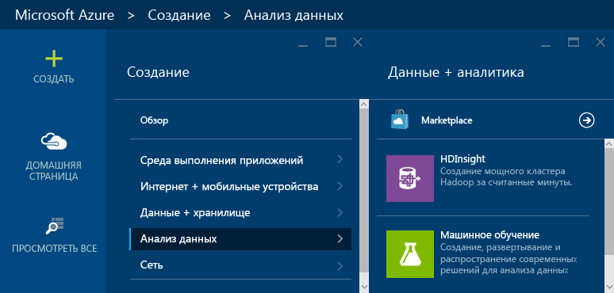

3. Введите __имя кластера__. Рядом с __именем кластера__ (если оно доступно) отобразится зеленый флажок.

4. Если у вас есть несколько подписок, выберите запись __Подписка__, чтобы выбрать подписку Azure для кластера.

5.  В поле __Выберите тип кластера__ выберите кластер __Storm__. В поле __Операционная система__ выберите Windows. В поле __Уровень кластера__ выберите STANDARD. И, наконец, нажмите кнопку выбора, чтобы сохранить эти параметры.

	

5. В разделе __Группа ресурсов__ откройте раскрывающийся список, чтобы увидеть список существующих групп ресурсов и выбрать ту, в которой будет создан кластер. Вы также можете щелкнуть __Создать__ и ввести имя новой группы ресурсов. Если имя новой группы доступно, то рядом с ним отобразится зеленый флажок.

6. Выберите __Учетные данные__, а затем введите данные в поля __Имя пользователя для входа в кластер__ и __Пароль для входа в кластер__. В завершение нажмите кнопку __Выбрать__, чтобы задать учетные данные. В этом учебнике удаленный рабочий стол не будет использоваться, поэтому его можно не включать.

	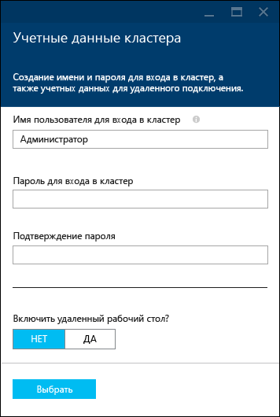

6. Выберите запись __Источник данных__, чтобы выбрать существующий источник данных или создать новый.

	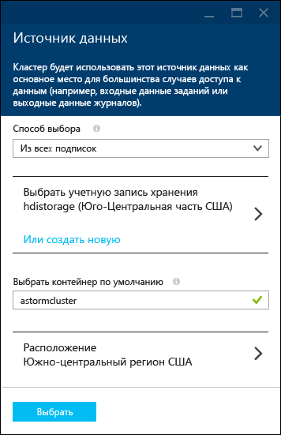

	В настоящее время в качестве источника данных для кластера HDInsight можно выбрать учетную запись хранения Azure. Далее приводится описание элементов интерфейса. Эти сведения помогут вам лучше понять записи в колонке __Источник данных__.

	- __Метод выбора__. Выберите значение __Из всех подписок__, чтобы активировать поиск учетных записей хранения в своих подписках. Задайте значение __Ключ доступа__, если вы хотите ввести __имя хранилища__ и __ключ доступа__ существующей учетной записи хранения.

	- __Создать__. Эта команда позволяет создавать новые учетные записи хранения. В появившееся поле введите имя учетной записи хранения. Если имя доступно, то отобразится зеленый флажок.

	- __Выбрать контейнер по умолчанию__: позволяет ввести имя контейнера по умолчанию и использовать его для кластера. Вы можете ввести любое имя, однако мы рекомендуем использовать такое же имя, как у кластера, чтобы легко распознавать, какой контейнер используется для конкретного кластера.

	- __Расположение__. Географический регион, к которому будет относиться существующая или новая учетная запись хранения.

		> [AZURE.IMPORTANT] Выбранное расположение для источника данных по умолчанию будет определять расположение кластера HDInsight. Кластер и источник данных по умолчанию должны находиться в одном регионе.

	- __Выбрать__. Эта кнопка позволяет сохранить конфигурацию источника данных.

7. Выберите __Ценовые категории узла__, чтобы отобразить сведения об узлах, которые будут созданы для этого кластера. По умолчанию выбрано __4__ рабочих узла. Выберите значение __1__. Этого количества достаточно для работы с данным руководством. Кроме того, это позволит снизить стоимость кластера. Оценочная стоимость кластера отображается в нижней части этой колонки.

	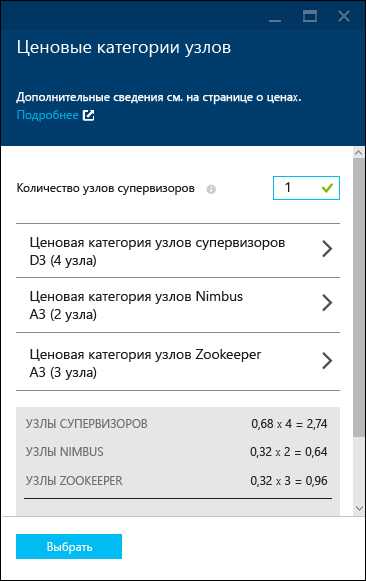

	Нажмите кнопку __Выбрать__, чтобы сохранить сведения о __ценовых категориях узлов__.

8. Выберите __Необязательная конфигурация__. В этой колонке можно выбрать версию кластера, а также настроить другие необязательные параметры, включая присоединение к __виртуальной сети__.

	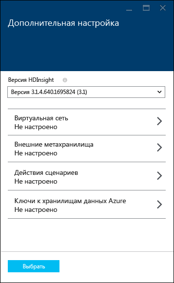

9. Обязательно выберите параметр __Закрепить на начальной панели__, а затем щелкните __Создать__. После этого будет создан кластер, а на начальную панель портала Azure будет добавлена его плитка. Значок указывает, что выполняется подготовка кластера. После завершения подготовки вместо него будет отображаться значок HDInsight.

	| Подготовка выполняется | Подготовка завершена |
	| ------------------ | --------------------- |
	|  | 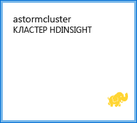 |

	> [AZURE.NOTE] Обычно создание кластера занимает около 15 минут. Отслеживать процесс подготовки можно с помощью плитки на начальной панели или записи __Уведомления__ в левой части страницы.

## Запуск образца Storm Starter в HDInsight

В этом учебнике Apache Storm вы познакомитесь с анализом больших объемов данных с использованием примеров Storm Starter на портале GitHub.

Каждый экземпляр Storm в кластере HDInsight поставляется с панелью мониторинга Storm, которую можно использоваться для загрузки и запуска топологий Storm в кластере. Каждый кластер также поставляется с примерами топологий, которые можно запускать непосредственно из панели мониторинга Storm.

### Подключение к панели мониторинга

Панель мониторинга находится по адресу **https://&lt;clustername>.azurehdinsight.net//**, где **clustername** — имя кластера. Чтобы воспользоваться ссылкой на панель мониторинга, выберите кластер на начальной панели, а затем — ссылку __Панель мониторинга__ в верхней части колонки.

> [AZURE.NOTE] При подключении к панели мониторинга отобразится запрос на ввод имени пользователя и пароля. Это имя администратора (**admin**) и пароль, который вы использовали при создании кластера.

После загрузки панели мониторинга Storm отобразится форма **Submit Topology** (Отправка топологии).

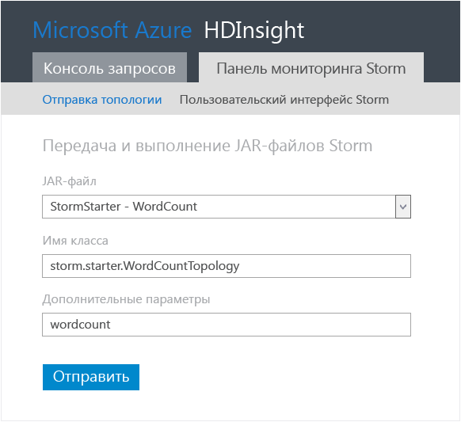

C помощью формы **Отправка топологии** можно отправлять и запускать JAR-файлы, содержащие топологии Storm. Она также включает несколько основных примеров, входящих в состав кластера.

### Запуск примера подсчета слов из проекта Storm Starter на портале GitHub

Образцы, поставляемые с кластером, включают несколько вариантов топологии подсчета слов. Эти примеры включают **воронку**, которая случайным образом создает предложения, и **сито**, которое разбивает каждое предложение на отдельные слова, а затем подсчитывает случаи употребления каждого слова. Эти примеры взяты из [примеров Storm Starter](https://github.com/apache/storm/tree/master/examples/storm-starter), которые являются частью Apache Storm.

Выполните следующие действия, чтобы запустить пример Storm Starter.

1. Выберите **StormStarter - WordCount** (StormStarter — Подсчет слов) из раскрывающегося списка **Jar File** (JAR-файл). После этого действия в поля **Имя класса** и **Дополнительные параметры** будут внесены параметры, использующиеся в данном примере.

	

	* **Имя класса** — класс в JAR-файле, который отправляет топологии.
	* **Дополнительные параметры** — любые параметры, необходимые для топологии. В этом примере это поле используется для присвоения понятного имени отправленной топологии.

2. Нажмите кнопку **Submit** (Отправить). Через некоторое время в поле **Результат** отобразится команда, используемая для отправки задания, а также результаты ее выполнения. В поле **Ошибка** будут отображаться все ошибки, возникающие при отправке топологии.

	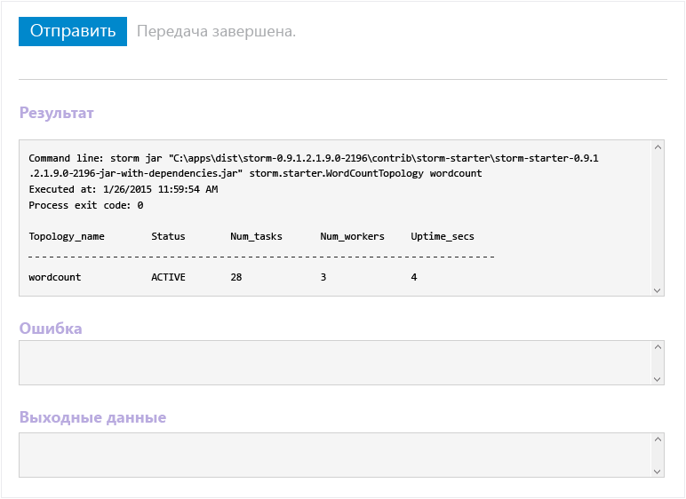

	> [AZURE.NOTE] Отображение результатов не означает завершение топологии — **топология Storm выполняется после запуска, пока вы ее не остановите** Топология подсчета слов генерирует случайные предложения и подсчитывает частоту употребления каждого слова в них, пока вы ее не остановите.

### Мониторинг топологии

Пользовательский интерфейс Storm можно использовать для мониторинга топологии.

1. В верхней части панели мониторинга Storm выберите **Storm UI** (Пользовательский интерфейс Storm). Отобразится сводная информация о кластере и обо всех работающих топологиях.

	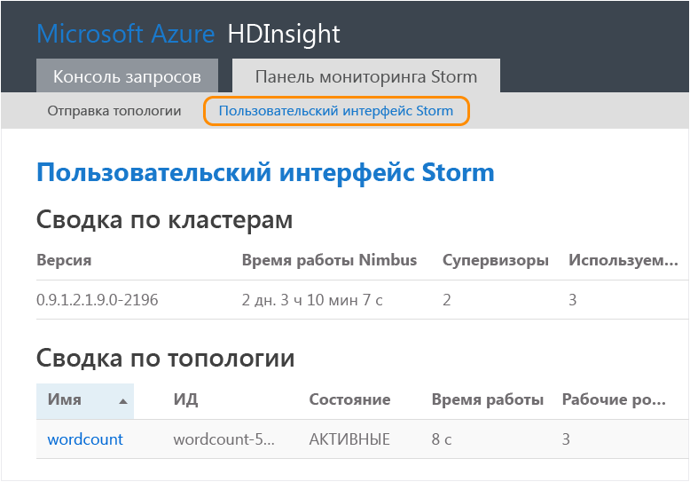

	На странице выше можно просмотреть время активности топологии, а также количество используемых рабочих процессов, исполнителей и задач.

	> [AZURE.NOTE] Столбец **Name** (Имя) содержит понятное имя, введенное в поле **Additional Parameters** (Дополнительные параметры).

4. В разделе **Topology summary** (Сводка топологии) выберите запись **wordcount** (количество слов) в столбце **Name** (Имя). После этого отобразится дополнительная информация о топологии.

	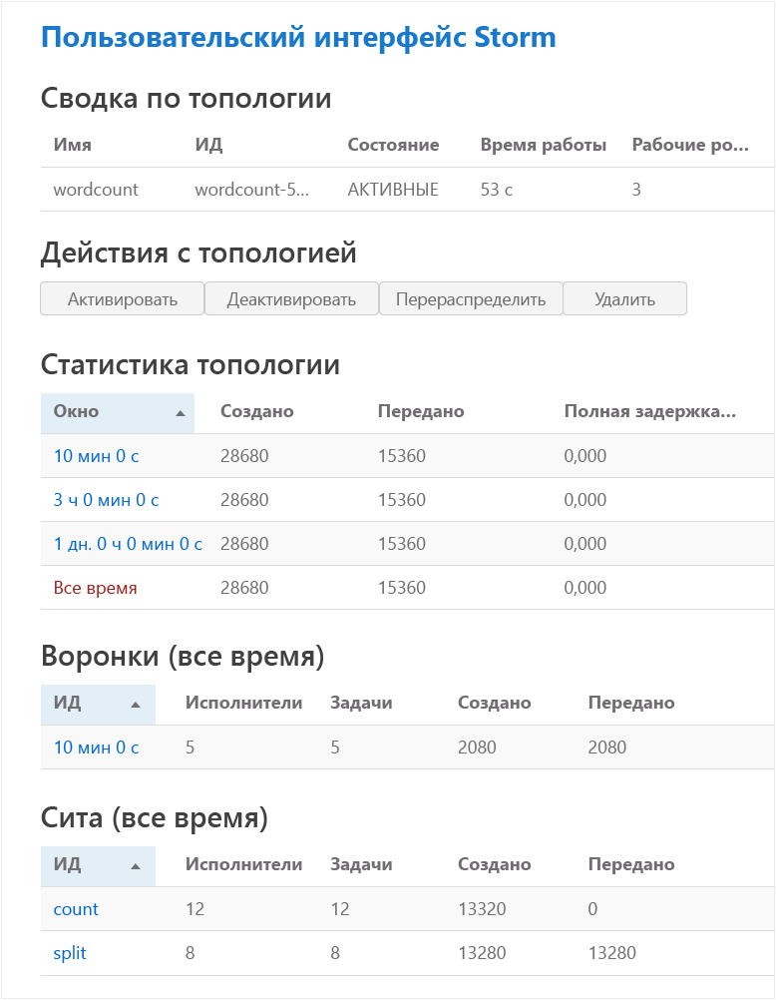

	Эта страница содержит следующую информацию.

	* **Topology stats** (Статистика топологий) —основная информация о производительности топологии, упорядоченная по временным промежуткам.

		> [AZURE.NOTE] При выборе определенного временного промежутка меняется информация, отображаемая в других разделах страницы.

	* **Spouts** (Воронки) — основная информация о воронках, в том числе последняя ошибка, возвращенная каждой воронкой.

	* **Bolts** (Сита) — основная информация о ситах.

	* **Topology configuration** (Конфигурация топологии) — подробная информация о конфигурации топологии.

	Эта страница также содержит действия, которые можно выполнять в топологии.

	* **Activate** (Включить) — возобновление обработки отключенной топологии.

	* **Deactivate** (Отключить) — приостановка выполняемой топологии.

	* **Rebalance** (Повторная балансировка) — корректировка параллелизма топологии. После изменения числа узлов в кластере необходимо выполнить повторную балансировку топологий. Это позволяет топологии скорректировать параллелизм для компенсации увеличения или уменьшения количества узлов в кластере. Дополнительные сведения см. в статье [Общие сведения о параллелизме топологии Storm](http://storm.apache.org/documentation/Understanding-the-parallelism-of-a-Storm-topology.html).

	* **Kill** (Удалить) — останавливает выполнение топологии Storm по истечении заданного времени ожидания.

5. На этой странице выберите запись и раздела **Spouts** (Воронки) или **Bolts** (Сита). Отобразится информация о выбранном компоненте.

	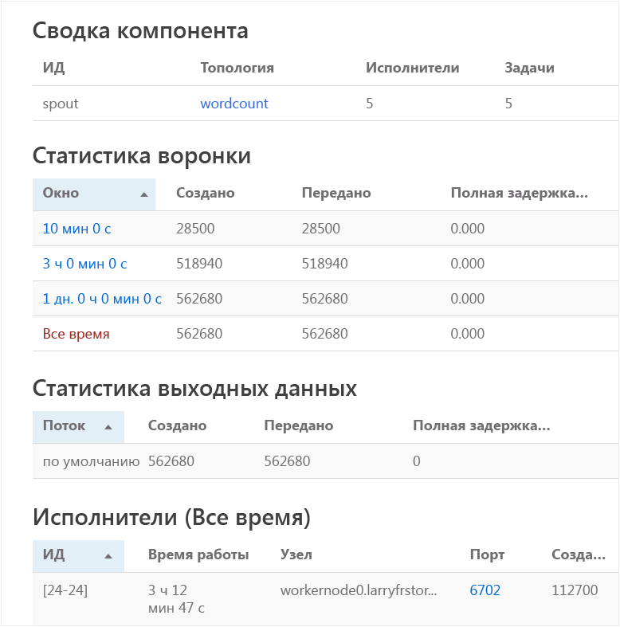

	На этой странице отображается следующая информация.

	* **Spout/Bolt stats** (Статистика воронки/сита) —основная информация о производительности соответствующего компонента, упорядоченная по временным промежуткам.

		> [AZURE.NOTE] При выборе определенного временного промежутка меняется информация, отображаемая в других разделах страницы.

	* **Input stats** (Статистика ввода, только для сита) — информация о компонентах, которые производят данные, используемые ситом.

	* **Output stats** (Статистика вывода) — информация о данных, созданных этим ситом.

	* **Executors** (Исполнители) — информация об экземплярах этого компонента.

	* **Errors** (Ошибки) — ошибки, созданные этим компонентом.

5. Во время просмотра информации о воронке и сите выберите запись из столбца **Port** (Порт) в разделе **Executors** (Исполнители), чтобы просмотреть информацию о конкретном экземпляре компонента.

		2015-01-27 14:18:02 b.s.d.task [INFO] Emitting: split default ["with"]
		2015-01-27 14:18:02 b.s.d.task [INFO] Emitting: split default ["nature"]
		2015-01-27 14:18:02 b.s.d.executor [INFO] Processing received message source: split:21, stream: default, id: {}, [snow]
		2015-01-27 14:18:02 b.s.d.task [INFO] Emitting: count default [snow, 747293]
		2015-01-27 14:18:02 b.s.d.executor [INFO] Processing received message source: split:21, stream: default, id: {}, [white]
		2015-01-27 14:18:02 b.s.d.task [INFO] Emitting: count default [white, 747293]
		2015-01-27 14:18:02 b.s.d.executor [INFO] Processing received message source: split:21, stream: default, id: {}, [seven]
		2015-01-27 14:18:02 b.s.d.task [INFO] Emitting: count default [seven, 1493957]

	Эти данные показывают, что слово **seven** (семь) использовалось 1 493 957 раз. Столько раз оно было обнаружено с момента запуска данной топологии.

### Остановка топологии

Вернитесь на страницу **Сводка топологии**, найдите необходимую топологию подсчета слов, и в разделе **Действия топологии** нажмите кнопку **Удалить**. При появлении запроса введите 10 секунд ожидания перед остановкой топологии. По истечении времени ожидания топология перестанет отображаться при переходе к разделу **Пользовательский интерфейс Storm** на панели мониторинга.

##Удаление кластера

[AZURE.INCLUDE [delete-cluster-warning](../../includes/hdinsight-delete-cluster-warning.md)]

## Сводка

В этом учебнике Apache Storm используется Storm Starter для объяснения принципов создания Storm в кластере HDInsight и использования панели мониторинга Storm для развертывания и отслеживания топологий Storm, а также управления ими.

## Дальнейшие действия

* **Средства HDInsight для Visual Studio** —средства HDInsight позволяют использовать Visual Studio для отправки и отслеживания топологии Storm, а также управления ею, точно также как панель мониторинга Storm, которая упоминалась выше. Средства HDInsight также позволяют создавать топологии Storm C# и включает примеры топологий, которые можно развернуть и запустить в кластере.

	Дополнительные сведения см. в статье [Приступая к работе с инструментами Hadoop в Visual Studio для HDInsight для выполнения запроса Hive](hdinsight-hadoop-visual-studio-tools-get-started.md).

* **Примеры файлов** — кластер HDInsight Storm приводит несколько примеров в каталоге **%STORM\_HOME%\\contrib**. Каждый пример должен содержать следующие элементы:

	* Исходный код, например, storm-starter-0.9.1.2.1.5.0-2057-sources.jar

	* Документы Java, например, storm-starter-0.9.1.2.1.5.0-2057-javadoc.jar

	* Пример, например, storm-starter-0.9.1.2.1.5.0-2057-jar-with-dependencies.jar

	Для извлечения исходного кода или документов Java используйте команду 'jar'. Например, 'jar -xvf storm-starter-0.9.1.2.1.5.0.2057-javadoc.jar'.

	> [AZURE.NOTE] Документы Java состоят из веб-страниц. После извлечения откройте файл **index.html** браузером.

	Чтобы открыть эти образцы, необходимо включить удаленный рабочий стол для Storm в кластере HDInsight и скопировать файлы из папки **%STORM\_HOME%\\contrib**.

* Следующий документ содержит список других примеров, которые могут использоваться со Storm на HDInsight:

	* [Примеры топологий для Storm в HDInsight](hdinsight-storm-example-topology.md)

[apachestorm]: https://storm.incubator.apache.org
[stormdocs]: http://storm.incubator.apache.org/documentation/Documentation.html
[stormstarter]: https://github.com/apache/storm/tree/master/examples/storm-starter
[stormjavadocs]: https://storm.incubator.apache.org/apidocs/
[azureportal]: https://manage.windowsazure.com/
[hdinsight-provision]: hdinsight-provision-clusters.md
[preview-portal]: https://portal.azure.com/

<!---HONumber=AcomDC_0914_2016-->