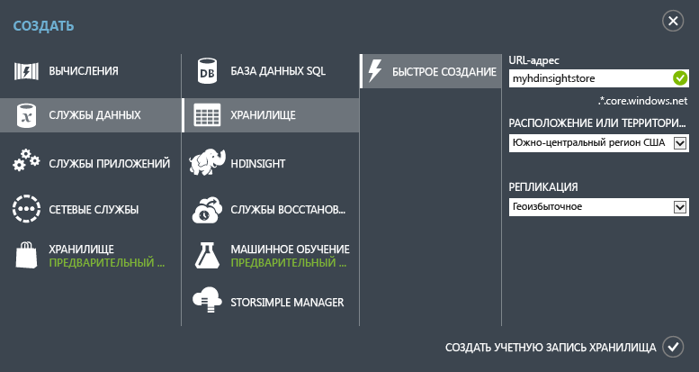

<properties
	pageTitle="Учебник по Apache Storm: начало работы со Storm | Microsoft Azure"
	description="Начало работы с анализом больших объемов данных с помощью Apache Storm и примеров Storm Starter в HDInsight. Информация об использовании Storm для обработки данных в режиме реального времени."
	keywords="apache storm,apache storm tutorial,big data analytics,storm starter"
	services="hdinsight"
	documentationCenter=""
	authors="Blackmist"
	manager="paulettm"
	editor="cgronlun"/>

<tags
   ms.service="hdinsight"
   ms.devlang="java"
   ms.topic="get-started-article"
   ms.tgt_pltfrm="na"
   ms.workload="big-data"
   ms.date="07/06/2015"
   ms.author="larryfr"/>

# Учебник по Apache Storm в HDInsight: начало работы с анализом больших объемов данных в HDInsight с помощью примеров Storm Starter

Apache Storm — это масштабируемая отказоустойчивая распределенная система выполнения расчетов для обработки данных потоковой передачи в режиме реального времени. С помощью Storm вы можете создать в Azure HDInsight облачный кластер, который анализирует данные в режиме реального времени.

## Перед началом работы

Необходимое условие для успешного выполнения инструкций этого учебника:

- **Подписка Azure.**. См. [Бесплатная пробная версия Azure](http://azure.microsoft.com/documentation/videos/get-azure-free-trial-for-testing-hadoop-in-hdinsight/).

## Создание учетной записи хранения Azure

Storm в HDInsight использует хранилище BLOB-объектов Azure для хранения файлов журнала и топологий, отправленных в кластер. Чтобы создать учетную запись хранения Azure, которую вы будете использовать с кластером, выполните следующие действия:

1. Войдите на [портал Azure](http://manage.windowsazure.com/).

2. Щелкните **СОЗДАТЬ** в левом нижнем углу, выберите **СЛУЖБЫ ДАННЫХ**, **ХРАНИЛИЩЕ**, а затем щелкните **БЫСТРО СОЗДАТЬ**.

	

3. Введите сведения в поля **URL-АДРЕС**, **РАСПОЛОЖЕНИЕ** и **РЕПЛИКАЦИЯ**, а затем щелкните **СОЗДАТЬ УЧЕТНУЮ ЗАПИСЬ ХРАНЕНИЯ**. Не выбирайте территориальную группу при создании хранилища для HDInsight. Вы увидите новую учетную запись хранения в списке хранилищ.

	>[AZURE.NOTE]Если для подготовки кластера HDInsight используется параметр «Быстрое создание», как в этом учебнике, то расположение при подготовке кластера не указывается. Вместо этого по умолчанию кластер располагается в том же центре обработки данных, что и учетная запись хранения. Убедитесь, что вы создаете учетную запись хранения в местонахождении, которое поддерживает кластер. Такими местонахождениями являются **Восточная Азия**, **Юго-Восточная Азия**, **Северная Европа**, **Западная Европа**, **Восток США**, **Запад США**, **Северный центр США**, **Южный центр США**.

4. Дождитесь, пока **СОСТОЯНИЕ** новой учетной записи хранения не изменится на **В сети**.

Дополнительную информацию о создании новой учетной записи хранения см. в статье [Создание учетной записи хранения](../storage/storage-create-storage-account.md).

##Подготовка кластера Storm на портале Azure

При подготовке кластера HDInsight происходит подготовка вычислительных ресурсов Azure, содержащих Apache Storm и соответствующие приложения. Также можно создать кластеры Hadoop для других версий, использующих портал Azure, командлеты Azure PowerShell для HDInsight или пакет HDInsight .NET SDK. Указания см. в разделе [Подготовка кластеров HDInsight с использованием настраиваемых параметров][hdinsight-provision]. Для получения дополнительной информации о различных версиях HDInsight и их соглашениях об уровне обслуживания см. страницу [Версии компонентов НDInsight](hdinsight-component-versioning.md).

[AZURE.INCLUDE [provisioningnote](../../includes/hdinsight-provisioning.md)]

1. Войдите на [портал Azure][azureportal].

2. Щелкните **HDInsight** слева, затем **+СОЗДАТЬ** в левом нижнем углу страницы.

3. Щелкните во втором столбце значок HDInsight и выберите **STORM**.

	

4. Введите уникальное имя кластера и уникальный пароль для учетной записи администратора. В поле **УЧЕТНАЯ ЗАПИСЬ ХРАНЕНИЯ** выберите учетную запись хранения, которую вы создали ранее.

	В поле **РАЗМЕР КЛАСТЕРА** выберите размер **1 узел данных** для этого кластера. Это позволяет свести к минимуму затраты, связанные с кластером. Для использования кластера в рабочей среде он должен быть большего размера.

	> [AZURE.NOTE]Имя учетной записи администратора кластера — **admin**. Введенный пароль — это пароль для этой учетной записи. Эта информация потребуется для выполнения действий с кластером, таких как отправка или управление топологиями Storm.

5. Теперь установите флажок рядом с параметром **СОЗДАТЬ КЛАСТЕР HDINSIGHT**, чтобы создать кластер.

> [AZURE.NOTE]Подготовка кластера занимает некоторое время, обычно менее 15 минут. В это время создается кластер, настраивается программное обеспечение и устанавливаются демонстрационные данные и топологии.

##Запуск образца Storm Starter в HDInsight

В этом учебнике Apache Storm вы познакомитесь с анализом больших объемов данных с использованием примеров Storm Starter на портале GitHub.

Каждый экземпляр Storm в кластере HDInsight поставляется с панелью мониторинга Storm, которую можно использоваться для загрузки и запуска топологий Storm в кластере. Каждый кластер также поставляется с примерами топологий, которые можно запускать непосредственно из панели мониторинга Storm.

###Подключение к панели мониторинга

Панель мониторинга находится по адресу **https://&lt;clustername>.azurehdinsight.net//**, где **clustername** — имя кластера. Ссылка на панель мониторинга также находится в нижней части страницы портала Azure вашего кластера.

> [AZURE.NOTE]При подключении к панели мониторинга появится запрос на ввода имени пользователя и пароля. Это имя администратора (**admin**) и пароль, который вы использовали при создании кластера.

После загрузки панели мониторинга Storm отобразится форма **Submit Topology** (Отправка топологии).

Форма **Submit Topology** (Отправка топологии) позволяет загружать и запускать JAR-файлы, содержащие топологии Storm. Она также включает несколько основных примеров, входящих в состав кластера.

###Запуск примера подсчета слов из проекта Storm Starter на портале GitHub

Образцы, поставляемые с кластером, включают несколько вариантов топологии подсчета слов. Эти примеры включают **воронку**, которая случайным образом создает предложения, и **сито**, которое разбивает каждое предложение на отдельные слова, а затем подсчитывает случаи употребления каждого слова. Эти примеры взяты из [примеров Storm Starter](https://github.com/apache/storm/tree/master/examples/storm-starter), которые являются частью Apache Storm.

Выполните следующие действия, чтобы запустить пример Storm Starter.

1. Выберите **StormStarter - WordCount** (StormStarter — Подсчет слов) из раскрывающегося списка **Jar File** (JAR-файл). После этого действия поля **Class Name** (Имя класса) и **Additional Parameter** (Дополнительные параметры) заполнятся соответствующими параметрами для этого образца.

	

	* **Имя класса** — класс в JAR-файле, который отправляет топологии.
	* **Дополнительные параметры** — любые параметры, необходимые для топологии. В этом примере это поле используется для присвоения понятного имени отправленной топологии.

2. Нажмите кнопку **Submit** (Отправить). Через некоторое время в поле **Result** (Результат) отобразится команда, используемая для отправки задания, а также результаты выполнения команды. В поле **Error** (Ошибка) будут отображаться все ошибки, возникающие при отправке топологии.

	

	> [AZURE.NOTE]Отображение результатов не означает завершение топологии — **топология Storm выполняется после запуска, пока вы ее не остановите** Топология подсчета слов генерирует случайные предложения и подсчитывает частоту употребления каждого слова в них, пока вы ее не остановите.

###Мониторинг топологии

Пользовательский интерфейс Storm можно использовать для мониторинга топологии.

1. В верхней части панели мониторинга Storm выберите **Storm UI** (Пользовательский интерфейс Storm). Отобразится информация о кластере и обо всех запущенных топологиях.

	

	На странице выше можно просмотреть время активности топологии, а также количество используемых рабочих процессов, исполнителей и задач.

	> [AZURE.NOTE]Столбец **Name** (Имя) содержит понятное имя, введенное в поле **Additional Parameters** (Дополнительные параметры).

4. В разделе **Topology summary** (Сводка топологии) выберите запись **wordcount** (количество слов) в столбце **Name** (Имя). После этого отобразится дополнительная информация о топологии.

	

	Эта страница содержит следующую информацию.

	* **Topology stats** (Статистика топологий) —основная информация о производительности топологии, упорядоченная по временным промежуткам.

		> [AZURE.NOTE]При выборе определенного временного промежутка меняется информация, отображаемая в других разделах страницы.

	* **Spouts** (Воронки) — основная информация о воронках, в том числе последняя ошибка, возвращенная каждой воронкой.

	* **Bolts** (Сита) — основная информация о ситах.

	* **Topology configuration** (Конфигурация топологии) — подробная информация о конфигурации топологии.

	Эта страница также содержит действия, которые можно выполнять в топологии.

	* **Activate** (Включить) — возобновление обработки отключенной топологии.

	* **Deactivate** (Отключить) — приостановка выполняемой топологии.

	* **Rebalance** (Повторная балансировка) — корректировка параллелизма топологии. После изменения числа узлов в кластере необходимо выполнить повторную балансировку топологий. Это позволяет топологии скорректировать параллелизм для компенсации увеличения или уменьшения количества узлов в кластере. Дополнительные сведения см. в статье [Understanding the parallelism of a Storm topology](http://storm.apache.org/documentation/Understanding-the-parallelism-of-a-Storm-topology.html) (Общие сведения о параллелизме топологии Storm).

	* **Kill** (Удалить) — останавливает выполнение топологии Storm по истечении заданного времени ожидания.

5. На этой странице выберите запись и раздела **Spouts** (Воронки) или **Bolts** (Сита). Отобразится информация о выбранном компоненте.

	

	На этой странице отображается следующая информация.

	* **Spout/Bolt stats** (Статистика воронки/сита) —основная информация о производительности соответствующего компонента, упорядоченная по временным промежуткам.

		> [AZURE.NOTE]При выборе определенного временного промежутка меняется информация, отображаемая в других разделах страницы.

	* **Input stats** (Статистика ввода, только для сита) — информация о компонентах, которые производят данные, используемые ситом.

	* **Output stats** (Статистика вывода) — информация о данных, созданных этим ситом.

	* **Executors** (Исполнители) — информация об экземплярах этого компонента.

	* **Errors** (Ошибки) — ошибки, созданные этим компонентом.

5. Во время просмотра информации о воронке и сите выберите запись из столбца **Port** (Порт) в разделе **Executors** (Исполнители), чтобы просмотреть информацию о конкретном экземпляре компонента.

		2015-01-27 14:18:02 b.s.d.task [INFO] Emitting: split default ["with"]
		2015-01-27 14:18:02 b.s.d.task [INFO] Emitting: split default ["nature"]
		2015-01-27 14:18:02 b.s.d.executor [INFO] Processing received message source: split:21, stream: default, id: {}, [snow]
		2015-01-27 14:18:02 b.s.d.task [INFO] Emitting: count default [snow, 747293]
		2015-01-27 14:18:02 b.s.d.executor [INFO] Processing received message source: split:21, stream: default, id: {}, [white]
		2015-01-27 14:18:02 b.s.d.task [INFO] Emitting: count default [white, 747293]
		2015-01-27 14:18:02 b.s.d.executor [INFO] Processing received message source: split:21, stream: default, id: {}, [seven]
		2015-01-27 14:18:02 b.s.d.task [INFO] Emitting: count default [seven, 1493957]

	Эти данные показывают, что слово **seven** (семь) использовалось 1 493 957 раз. Столько раз оно было обнаружено с момента запуска данной топологии.

###Остановка топологии

Вернитесь к странице **Topology summary** (Сводка топологии), чтобы найти топологию подсчета слов, и нажмите кнопку **Kill** (Удалить) в разделе **Topology actions ** (Действия топологии). При появлении запроса введите 10 секунд ожидания перед остановкой топологии. После истечения времени ожидания топология перестанет отображаться во время входа в раздел **Storm UI** (Пользовательский интерфейс Storm) панели мониторинга.

##Сводка

В этом учебнике Apache Storm используется Storm Starter для объяснения принципов создания Storm в кластере HDInsight и использования панели мониторинга Storm для развертывания и отслеживания топологий Storm, а также управления ими.

##Дальнейшие действия

* **Средства HDInsight для Visual Studio** —средства HDInsight позволяют использовать Visual Studio для отправки и отслеживания топологии Storm, а также управления ею, точно также как панель мониторинга Storm, которая упоминалась выше. Средства HDInsight также позволяют создавать топологии Storm C# и включает примеры топологий, которые можно развернуть и запустить в кластере.

	Дополнительную информацию см. в статье [Начало работы со средствами HDInsight Hadoop для Visual Studio](hdinsight-hadoop-visual-studio-tools-get-started.md).

* **Примеры файлов** — кластер HDInsight Storm приводит несколько примеров в каталоге **%STORM_HOME%\contrib**. Каждый пример должен содержать следующие элементы:

	* Исходный код, например, storm-starter-0.9.1.2.1.5.0-2057-sources.jar

	* Документы Java, например, storm-starter-0.9.1.2.1.5.0-2057-javadoc.jar

	* Пример, например, storm-starter-0.9.1.2.1.5.0-2057-jar-with-dependencies.jar

	Для извлечения исходного кода или документов Java используйте команду 'jar'. Например, 'jar -xvf storm-starter-0.9.1.2.1.5.0.2057-javadoc.jar'.

	> [AZURE.NOTE]Документы Java состоят из веб-страниц. После извлечения откройте файл **index.html** браузером.

	Чтобы открыть эти образцы, необходимо включить удаленный рабочий стол для Storm в кластере HDInsight и скопировать файлы из папки **%STORM_HOME%\contrib**.

* Следующий документ содержит список других примеров, которые могут использоваться со Storm на HDInsight:

	* [Примеры топологий для Storm в HDInsight](hdinsight-storm-example-topology.md)

[apachestorm]: https://storm.incubator.apache.org
[stormdocs]: http://storm.incubator.apache.org/documentation/Documentation.html
[stormstarter]: https://github.com/apache/storm/tree/master/examples/storm-starter
[stormjavadocs]: https://storm.incubator.apache.org/apidocs/
[azureportal]: https://manage.windowsazure.com/
[hdinsight-provision]: hdinsight-provision-clusters.md

<!---HONumber=July15_HO4-->