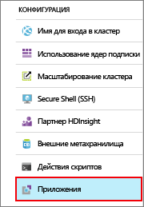
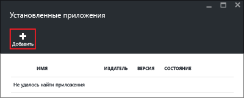
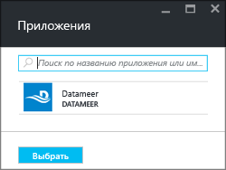
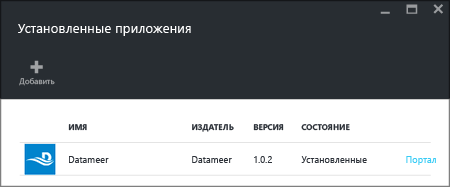

<properties
   	pageTitle="Установка приложений Hadoop в кластере HDInsight | Microsoft Azure"
   	description="Инструкции по установке приложений HDInsight в кластере HDInsight."
   	services="hdinsight"
   	documentationCenter=""
   	authors="mumian"
   	manager="paulettm"
   	editor="cgronlun"
	tags="azure-portal"/>

<tags
   	ms.service="hdinsight"
   	ms.devlang="na"
   	ms.topic="hero-article"
   	ms.tgt_pltfrm="na"
   	ms.workload="big-data"
   	ms.date="06/29/2016"
   	ms.author="jgao"/>

# Установка приложений HDInsight

Пользователи могут устанавливать приложения HDInsight в кластере HDInsight под управлением Linux. Разработчиками этих приложений могут быть корпорация Майкрософт, независимые поставщики программного обеспечения или вы сами. Из этой статьи вы узнаете, как установить опубликованное приложение. Дополнительные сведения об установке собственного приложения см. в статье [Установка пользовательских приложений HDInsight](hdinsight-apps-install-custom-applications.md).

В настоящее время существует одно опубликованное приложение.

- **Datameer**. [Datameer](http://www.datameer.com/documentation/display/DAS50/Home?ls=Partners&lsd=Microsoft&c=Partners&cd=Microsoft) предоставляет аналитикам возможность находить, анализировать и визуализировать результаты по большим данным в интерактивном режиме. С его помощью вы можете с легкостью обнаруживать новые связи и быстро получать необходимые ответы, используя дополнительные источники данных.

>[AZURE.NOTE] В настоящее время Datameer поддерживается в кластерах Azure HDInsight версии 3.2.

В указаниях, приведенных в данной статье, используется портал Azure. Вы можете экспортировать шаблон Azure Resource Manager с портала или получить его копию от поставщиков, а затем использовать Azure PowerShell и интерфейс командной строки Azure для его развертывания. Дополнительные сведения см. в статье [Создание кластеров Hadoop под управлением Linux в HDInsight с помощью шаблонов ARM](hdinsight-hadoop-create-linux-clusters-arm-templates.md).

## Предварительные требования

Если вы хотите установить приложение HDInsight в существующем кластере HDInsight, вы должны создать кластер HDInsight. Указания по созданию кластера см. в разделе [Создание кластера](hdinsight-hadoop-linux-tutorial-get-started.md#create-cluster). Вы также можете установить приложения HDInsight во время создания кластера HDInsight.

## Установка приложений в имеющиеся кластеры

Здесь приведена процедура установки приложения HDInsight в имеющийся кластер HDInsight.

**Установка приложения HDInsight**

1. Войдите на [портал Azure](https://portal.azure.com).
2. В меню слева щелкните **Кластеры HDInsight**. Если меню не отображается, нажмите кнопку **Обзор**, а затем щелкните **Кластеры HDInsight**.
3. Щелкните кластер HDInsight. Если у вас нет кластера, сначала его необходимо создать. Дополнительные сведения см. в разделе [Создание кластера](hdinsight-hadoop-linux-tutorial-get-started.md#create-cluster).
4. В колонке **Параметры** в категории **Общие** щелкните **Приложения**. В колонке **Установленные приложения** перечислены все установленные приложения.

    

5. В меню колонки щелкните **Добавить**.

    

	Откроется список всех доступных приложений HDInsight.

	

6. Щелкните необходимое приложение, примите условия использования и нажмите кнопку **Выбрать**.

Состояние установки приложения можно отслеживать в уведомлениях портала (щелкните значок колокольчика в верхней части портала). После установки приложение отобразится в колонке "Установленные приложения".

## Установка приложения во время создания кластера

Вы также можете установить приложения HDInsight во время создания кластера. Их установка осуществляется после создания и запуска кластера. Ниже приведены сведения о том, как установить приложение HDInsight во время создания кластера.

**Установка приложения HDInsight**

1. Войдите на [портал Azure](https://portal.azure.com).
2. Щелкните **СОЗДАТЬ**, **Данные+аналитика**, а затем — **HDInsight**.
3. Введите **имя кластера**. Оно должно быть глобально уникальным.
4. Щелкните **Подписка**, чтобы выбрать подписку Azure, которая будет использоваться для кластера.
5. Щелкните **Выберите тип кластера**, а затем задайте следующие параметры:

    - **Тип кластера**: если вы не знаете, что выбрать, выберите **Hadoop**. Это наиболее популярный тип кластера.
    - **Операционная система**: выберите **Linux**.
    - **Версия**: если вы не знаете, что выбрать, используйте версию по умолчанию. Дополнительную информацию см. в статье [Версии кластеров HDInsight](hdinsight-component-versioning.md).
    - **Уровень кластера**: Azure HDInsight предлагает облачные решения для работы с большими данными в двух категориях: "Стандартный" и "Премиум". Дополнительные сведения см. в статье [Уровни кластера](hdinsight-hadoop-provision-linux-clusters.md#cluster-tiers).
6. Щелкните **Приложения**, выберите необходимое опубликованное приложение и нажмите кнопку **Выбрать**.
6. Щелкните **Учетные данные** и введите пароль для пользователя с правами администратора. Необходимо также ввести **Имя пользователя SSH** и **ПАРОЛЬ** или **ОТКРЫТЫЙ КЛЮЧ**, которые будут использоваться для проверки подлинности пользователя SSH. Мы рекомендуем использовать открытый ключ. Нажмите кнопку **Выбрать** внизу страницы, чтобы сохранить учетные данные конфигурации.
8. Щелкните **Источник данных**, выберите имеющуюся учетную запись хранения или создайте новую, которая будет использоваться по умолчанию для кластера.
9. Щелкните **Группа ресурсов**, чтобы выбрать имеющуюся группу ресурсов, или создайте группу ресурсов, щелкнув **Создать**.

10. В колонке **Новый кластер HDInsight** обязательно выберите параметр **Закрепить на начальной панели**, а затем нажмите кнопку **Создать**.

## Отображение списка установленных приложений HDInsight и их свойств

На портале содержится список установленных приложений HDInsight для кластера и их свойств.

**Отображение списка приложений и их свойств**

1. Войдите на [портал Azure](https://portal.azure.com).
2. В меню слева щелкните **Кластеры HDInsight**. Если меню не отображается, нажмите кнопку **Обзор**, а затем щелкните **Кластеры HDInsight**.
3. Щелкните кластер HDInsight.
4. В колонке **Параметры** в категории **Общие** щелкните **Приложения**. В колонке "Установленные приложения" перечислены все установленные приложения.

	

5. Чтобы открыть свойства установленного приложения, щелкните его. В колонке свойств содержатся следующие сведения:

    - Имя приложения— имя вашего приложения.
    - Состояние — состояние вашего приложения.
    - Веб-страница — URL-адрес веб-приложения, развернутого на граничном узле (если имеется). В качестве учетных данных используются учетные данные пользователя HTTP, настроенные для кластера.
    - Конечная точка HTTP — в качестве учетных данных используются учетные данные пользователя HTTP, настроенные для кластера.
    - Конечная точка SSH — для подключения к граничному узлу можно использовать [SSH](hdinsight-hadoop-linux-use-ssh-unix.md). В качестве учетных данных SSH используются учетные данные пользователя SSH, настроенные для кластера.

6. Чтобы удалить приложение, щелкните его правой кнопкой мыши и в контекстном меню выберите **Удалить**.

## Подключение к граничному узлу

Для подключения к граничному узлу можно использовать протокол HTTP и SSH. Дополнительные сведения о конечной точке см. на [портале](#list-installed-hdinsight-apps-and-properties). Дополнительные сведения об использовании SSH см. в статье [Использование SSH с Hadoop на основе Linux в HDInsight из Linux, Unix или OS X](hdinsight-hadoop-linux-use-ssh-unix.md).

В качестве учетных данных конечной точки HTTP используются учетные данные пользователя HTTP, настроенные для кластера HDInsight. Что же касается конечной точки SSH, используются учетные данные пользователя SSH, настроенные для кластера HDInsight.

## Устранение неполадок

Дополнительные сведения см. в статье [Установка пользовательских приложений HDInsight](hdinsight-apps-install-custom-applications.md#troubleshoot-the-installation).

## Дальнейшие действия

- [Установка пользовательских приложений HDInsight](hdinsight-apps-install-custom-applications.md) — узнайте, как развернуть в HDInsight приложение HDInsight с отмененной публикацией.
- [Публикация приложений HDInsight в Azure Marketplace](hdinsight-apps-publish-applications.md) — узнайте, как опубликовать пользовательские приложения HDInsight в Azure Marketplace.
- [Install an HDInsight application](https://msdn.microsoft.com/library/mt706515.aspx) (Установка приложения HDInsight) — сведения об определении приложений HDInsight.
- [Настройка кластеров HDInsight под управлением Linux с помощью действия сценария](hdinsight-hadoop-customize-cluster-linux.md) — узнайте, как использовать действие скрипта для установки дополнительных приложений.
- [Создание кластеров Hadoop под управлением Linux в HDInsight с помощью шаблонов ARM](hdinsight-hadoop-create-linux-clusters-arm-templates.md) — узнайте, как вызывать шаблоны Resource Manager для создания кластеров HDInsight.

<!---HONumber=AcomDC_0706_2016-->