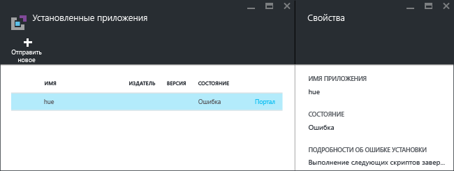
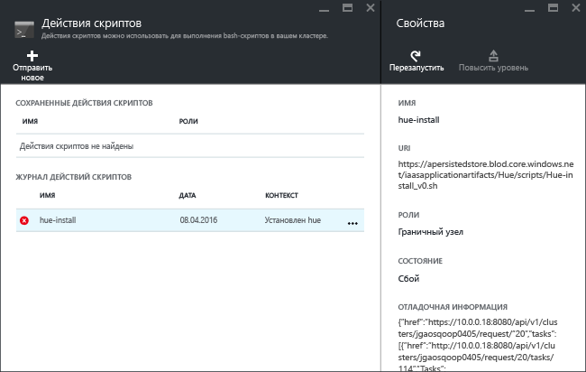

# Установка пользовательских приложений Hadoop в Azure HDInsight

Из этой статьи вы узнаете, как установить в Azure HDInsight приложение Hadoop, которое не было опубликовано на портале Azure. В этой статье описана установка приложения [Hue](http://gethue.com/).

Пользователи могут устанавливать приложения HDInsight в кластере HDInsight под управлением Linux.  Разработчиками этих приложений могут быть корпорация Майкрософт, независимые поставщики программного обеспечения или вы сами.  

Другие статьи по этой теме:

* [Установка приложений HDInsight](hdinsight-apps-install-applications.md)— узнайте, как устанавливать в кластер приложения HDInsight.
* [Публикация приложений HDInsight в Azure Marketplace](hdinsight-apps-publish-applications.md)— узнайте, как опубликовать пользовательские приложения HDInsight в Azure Marketplace.
* [Install an HDInsight application](https://msdn.microsoft.com/library/mt706515.aspx)(Установка приложения HDInsight) — сведения об определении приложений HDInsight.

## предварительным требованиям
Если вы хотите установить приложение HDInsight в существующем кластере HDInsight, вы должны создать кластер HDInsight. Инструкции по созданию кластера см. в [этом разделе](hadoop/apache-hadoop-linux-tutorial-get-started.md#create-cluster). Вы также можете установить приложения HDInsight во время создания кластера HDInsight.

## Установка приложений HDInsight
Приложения HDInsight можно устанавливать во время создания кластера или в уже существующем кластере HDInsight. Инструкции по определению шаблонов Azure Resource Manager см. в статье [Install an HDInsight application](https://msdn.microsoft.com/library/mt706515.aspx) (Установка приложения HDInsight) на сайте MSDN.

Далее перечислены файлы, необходимые для развертывания этого приложения (Hue).

* [azuredeploy.json](https://github.com/hdinsight/Iaas-Applications/blob/master/Hue/azuredeploy.json) — шаблон Resource Manager для установки приложения HDInsight. Инструкции по разработке собственного шаблона Resource Manager см. в статье [Install an HDInsight application](https://msdn.microsoft.com/library/mt706515.aspx) (Установка приложения HDInsight) на сайте MSDN.
* [hue-install_v0.sh](https://github.com/hdinsight/Iaas-Applications/blob/master/Hue/scripts/Hue-install_v0.sh) — действие скрипта, вызываемое шаблоном Resource Manager для настройки граничного узла.
* [hue-binaries.tgz](https://hdiconfigactions.blob.core.windows.net/linuxhueconfigactionv01/hue-binaries-14-04.tgz) — двоичный файл hue, вызываемый из hui-install_v0.sh.
* [hue-binaries-14-04.tgz](https://hdiconfigactions.blob.core.windows.net/linuxhueconfigactionv01/hue-binaries-14-04.tgz) — двоичный файл hue, вызываемый из hui-install_v0.sh.
* [webwasb-tomcat.tar.gz](https://hdiconfigactions.blob.core.windows.net/linuxhueconfigactionv01/webwasb-tomcat.tar.gz) — пример веб-приложения (Tomcat), вызываемый из hui-install_v0.sh.

**Установка приложения Hue в существующем кластере HDInsight**

1. Нажмите следующую кнопку, чтобы войти в Azure и открыть шаблон Resource Manager на портале Azure.

    

    Эта кнопка открывает шаблон Resource Manager на портале Azure.  Шаблон Resource Manager доступен по адресу [https://github.com/hdinsight/Iaas-Applications/tree/master/Hue](https://github.com/hdinsight/Iaas-Applications/tree/master/Hue).  Дополнительные сведения о создании шаблона Resource Manager см. в статье [Install an HDInsight application](https://msdn.microsoft.com/library/mt706515.aspx) (Установка приложения HDInsight) на сайте MSDN.
2. В колонке **Параметры** задайте следующие параметры.

   * **Имя кластера**— имя кластера, в котором вы хотите установить приложение. Это должен быть существующий кластер.
3. Нажмите кнопку **ОК** , чтобы сохранить параметры.
4. В колонке **Настраиваемое развертывание** укажите **группу ресурсов**.  Группа ресурсов — это контейнер, в который входит кластер, зависимая учетная запись хранения и другие ресурсы. Необходимо использовать группу ресурсов, в которую входит кластер.
5. Щелкните **Условия использования**, а затем — кнопку **Создать**.
6. Установите флажок **Закрепить на панели мониторинга** и нажмите кнопку **Создать**. Состояние установки можно наблюдать на плитке, закрепленной на панели мониторинга, и в уведомлении портала (щелкните значок колокольчика в верхней части портала).  Установка приложения занимает около 10 минут.

**Установка приложения Hue во время создания кластера**

1. Нажмите следующую кнопку, чтобы войти в Azure и открыть шаблон Resource Manager на портале Azure.

    

    Эта кнопка открывает шаблон Resource Manager на портале Azure.  Шаблон Resource Manager доступен по адресу [https://hditutorialdata.blob.core.windows.net/hdinsightapps/create-linux-based-hadoop-cluster-in-hdinsight.json](https://hditutorialdata.blob.core.windows.net/hdinsightapps/create-linux-based-hadoop-cluster-in-hdinsight.json).  Дополнительные сведения о создании шаблона Resource Manager см. в статье [Install an HDInsight application](https://msdn.microsoft.com/library/mt706515.aspx) (Установка приложения HDInsight) на сайте MSDN.
2. Выполните инструкции по созданию кластера и установите приложение Hue. Дополнительные сведения о создании кластеров HDInsight см. в статье [Создание кластеров Hadoop под управлением Linux в HDInsight](hdinsight-hadoop-provision-linux-clusters.md).

Вызывать шаблоны Resource Manager можно с помощью портала Azure, а также [Azure PowerShell](hdinsight-hadoop-create-linux-clusters-arm-templates.md#deploy-using-powershell) и [интерфейса командной строки Azure](hdinsight-hadoop-create-linux-clusters-arm-templates.md#deploy-using-cli).

## проверка установки
Вы можете просмотреть состояние приложения на портале Azure, чтобы проверить установку приложения. Кроме того, вы можете проверить появление правильных конечных точек HTTP и веб-страницу (если она есть).

**Вход на портал Hue**

1. Войдите на [портале Azure](https://portal.azure.com).
2. В меню слева щелкните **Кластеры HDInsight** .  Если меню не отображается, нажмите кнопку **Обзор**, а затем щелкните **Кластеры HDInsight**.
3. Щелкните кластер, в котором установлено приложение.
4. В колонке **Параметры** в категории **Общие** щелкните **Приложения**. В колонке **Установленные приложения** вы увидите приложение **Hue**.
5. Выберите приложение **Hue** в списке, чтобы просмотреть его свойства.  
6. Щелкните ссылку на веб-страницу, чтобы проверить веб-сайт. Откройте конечную точку HTTP в браузере, чтобы проверить веб-интерфейс Hue. Откройте конечную точку SSH с помощью SSH. См. дополнительные сведения об [использовании SSH в HDInsight](hdinsight-hadoop-linux-use-ssh-unix.md).

## Устранение неполадок, связанных с установкой
Состояние установки приложения можно наблюдать в уведомлении портала (щелкните значок колокольчика в верхней части портала).

Если произошел сбой установки приложения, вы можете увидеть сообщения об ошибках и информацию об отладке в трех местах.

* Приложения HDInsight: общие сведения об ошибке.

    Откройте кластер на портале и в колонке "Параметры" щелкните пункт "Приложения".

    
* Действие сценария HDInsight: если сообщение об ошибке приложений HDInsight указывает на сбой действия сценария, дополнительные сведения о сбое сценария отобразятся на панели действий сценария.

    В колонке "Параметры" выберите пункт "Действия сценария". Журнал действий сценария отображает сообщения об ошибках.

    
* Веб-интерфейс Ambari: если сценарий установки был причиной сбоя, используйте веб-интерфейс Ambari, чтобы просмотреть полные журналы сценариев установки.

    Дополнительные сведения см. в разделе [Устранение неполадок](hdinsight-hadoop-customize-cluster-linux.md#troubleshooting).

## Удаление приложений HDInsight
Есть несколько способов удалить приложения HDInsight.

### С помощью портала
**Удаление приложения с помощью портала**

1. Войдите на [портале Azure](https://portal.azure.com).
2. В меню слева щелкните **Кластеры HDInsight** .  Если меню не отображается, нажмите кнопку **Обзор**, а затем щелкните **Кластеры HDInsight**.
3. Щелкните кластер, в котором установлено приложение.
4. В колонке **Параметры** в категории **Общие** щелкните **Приложения**. Вы увидите список установленных приложений. В нашем примере в колонке **Установленные приложения** отображается приложение **Hue**.
5. Щелкните правой кнопкой мыши приложение, которое нужно удалить, и выберите пункт **Удалить**.
6. Нажмите кнопку **Да** для подтверждения.

На портале можно также удалить кластер или группу ресурсов, которая содержит приложение.

### Использование Azure PowerShell
С помощью PowerShell можно удалить кластер или группу ресурсов. Сведения об удалении кластеров с помощью Azure PowerShell см. [здесь](hdinsight-administer-use-powershell.md#delete-clusters).

### Использование интерфейса командной строки Azure
С помощью интерфейса командной строки можно удалить кластер или группу ресурсов. Сведения об удалении кластеров с помощью интерфейса командной строки Azure см. [здесь](hdinsight-administer-use-command-line.md#delete-clusters).

## Дополнительная информация
* [Install an HDInsight application](https://msdn.microsoft.com/library/mt706515.aspx)(Установка приложения HDInsight) — узнайте, как разрабатывать шаблоны Resource Manager для развертывания приложений HDInsight.
* [Установка приложений HDInsight](hdinsight-apps-install-applications.md)— узнайте, как устанавливать в кластер приложения HDInsight.
* [Публикация приложений HDInsight в Azure Marketplace](hdinsight-apps-publish-applications.md)— узнайте, как опубликовать пользовательские приложения HDInsight в Azure Marketplace.
* [Настройка кластеров HDInsight под управлением Linux с помощью действия сценария](hdinsight-hadoop-customize-cluster-linux.md)— узнайте, как использовать действие скрипта для установки дополнительных приложений.
* [Создание кластеров Hadoop под управлением Linux в HDInsight с помощью шаблонов ARM](hdinsight-hadoop-create-linux-clusters-arm-templates.md)— узнайте, как вызывать шаблоны Resource Manager для создания кластеров HDInsight.
* [Использование пустых граничных узлов в HDInsight](hdinsight-apps-use-edge-node.md)— узнайте, как использовать пустой граничный узел для доступа к кластеру HDInsight, а также тестирования и размещения приложений HDInsight.
