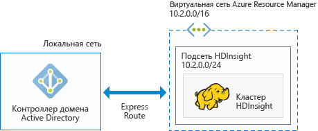

# Планирование архитектуры присоединенных к домену кластеров Hadoop в Azure HDInsight

Стандартный кластер Hadoop — это однопользовательский кластер. Он подходит для большинства организаций с небольшими отделами по работе с приложениями, создающими объемные рабочие нагрузки данных. В связи с ростом популярности кластера Hadoop многие организации переходят на модель, когда ИТ-специалисты управляют кластерами и несколько отделов по работе с приложениями совместно используют кластеры. Таким образом, возможности работы с многопользовательскими кластерами стали одними из самых запрашиваемых в Azure HDInsight.

Вместо создания собственной многопользовательской проверки подлинности и авторизации HDInsight полагается на самого популярного поставщика удостоверений — Azure Active Directory (AD). Расширенные возможности безопасности в Azure AD можно использовать для управления многопользовательской проверкой подлинности в HDInsight. Интегрировав HDInsight с Azure AD, вы сможете взаимодействовать с кластерами, используя свои учетные данные Azure AD. HDInsight сопоставляет пользователя Azure AD с локальным пользователем Hadoop. За счет этого все пользовательские службы, запущенные в HDInsight (Ambari, сервер Hive, Ranger, сервер Thrift Spark и т. д.), работают эффективнее.

## Интеграция HDInsight с Azure AD

Если выполнить интеграцию HDInsight с Azure AD, узлы кластера HDInsight присоединяются к домену Azure AD. HDInsight создает субъекты-службы для служб Hadoop, запущенных в кластере, и помещает их в определенное подразделение в Azure AD. Кроме того, он создает в домене Azure AD обратные сопоставления DNS для IP-адресов узлов, присоединенных к домену.

Чтобы получить эту конфигурацию, нужно использовать несколько архитектур. Вы можете выбрать один из следующих вариантов.

**Интеграция HDInsight с Azure AD, выполняющейся в Azure IaaS**

Это самый простой вариант архитектуры для интеграции HDInsight с Azure AD. Контроллер домена Azure AD запущен на одной (или нескольких) виртуальных машинах в Azure. Обычно эти виртуальные машины находятся в виртуальной сети. Для кластера HDInsight необходимо настроить еще одну виртуальную сеть. Чтобы обеспечить взаимодействие между HDInsight и Azure AD, потребуется настроить между этими виртуальными сетями пиринговую связь. Как это сделать, описано в статье [Настройка пиринга виртуальных сетей с помощью портала Azure](../virtual-network/virtual-networks-create-vnetpeering-arm-portal.md).

> [!NOTE]
> В этой архитектуре вы не можете использовать Azure Data Lake Store с кластером HDInsight.

Необходимые условия для Azure AD:

* Необходимо создать [подразделение](../active-directory-domain-services/active-directory-ds-admin-guide-create-ou.md), в котором будут размещены виртуальные машины кластера HDInsight и используемые в кластере субъекты-службы.
* Для взаимодействия с Azure AD необходимо настроить [протоколы LDAPS](../active-directory-domain-services/active-directory-ds-admin-guide-configure-secure-ldap.md). Сертификат, используемый для настройки протокола LDAPS, должен быть реальным (а не самозаверяющим).
* В домене необходимо создать обратные зоны DNS для диапазона IP-адресов из подсети HDInsight (например, 10.2.0.0/24 на предыдущем рисунке).
* Потребуется учетная запись службы или учетная запись пользователя. Используйте эту учетную запись для создания кластера HDInsight. Эта учетная запись должна иметь следующие разрешения:

    - разрешения на создание объектов субъекта-службы и объектов компьютеров в рамках подразделения;
    - разрешения на создание правил прокси-сервера для обратных зон DNS;
    - разрешения на присоединение компьютеров к домену Active Directory.

**Интеграция HDInsight с облачной службой Azure AD**

Чтобы интегрировать HDInsight с облачной службой Azure AD, необходимо настроить контроллер домена. Для этого вы можете использовать [доменные службы Azure Active Directory](../active-directory-domain-services/active-directory-ds-overview.md). Доменные службы Azure AD создают в облаке компьютеры контроллера домена и предоставляют их IP-адреса. Чтобы обеспечить высокий уровень доступности, они создают два контроллера домена.

В настоящее время доменные службы Azure AD доступны только в классических виртуальных сетях. Доступ к ним можно получить только с помощью классического портала Azure. Между существующей на портале Azure виртуальной сетью HDInsight и классической виртуальной сетью необходимо настроить пиринговую связь.

> [!NOTE]
> Создать пиринг между классической виртуальной сетью и виртуальной сетью Azure Resource Manager возможно, только если они находятся в одном регионе и относятся к одной подписке Azure.

Необходимые условия для Azure AD:

* Необходимо создать [подразделение](../active-directory-domain-services/active-directory-ds-admin-guide-create-ou.md), в котором будут размещены виртуальные машины кластера HDInsight и используемые в кластере субъекты-службы.
* При настройке доменных служб Azure AD вам необходимо настроить [протокол LDAPS](../active-directory-domain-services/active-directory-ds-admin-guide-configure-secure-ldap.md). Сертификат, используемый для настройки протокола LDAPS, должен быть реальным (а не самозаверяющим).
* В домене необходимо создать обратные зоны DNS для диапазона IP-адресов из подсети HDInsight (например, 10.2.0.0/24 на предыдущем рисунке).
* Необходимо синхронизировать [хэши паролей](../active-directory-domain-services/active-directory-ds-getting-started-password-sync.md) из Azure AD в доменные службы Azure AD.
* Потребуется учетная запись службы или учетная запись пользователя. Используйте эту учетную запись для создания кластера HDInsight. Эта учетная запись должна иметь следующие разрешения:

    - разрешения на создание объектов субъекта-службы и объектов компьютеров в рамках подразделения;
    - разрешения на создание правил прокси-сервера для обратных зон DNS;
    - разрешения на присоединение компьютеров к домену Azure AD.

**Интеграция HDInsight с локальной службой Active Directory через VPN-подключение**

Эта архитектура подобна интеграции HDInsight с Azure AD в Azure IaaS. Единственное различие заключается в том, что здесь используется локальная служба Azure AD, для доступа к которой из HDInsight используется [подключение VPN из Azure к локальной сети](../expressroute/expressroute-introduction.md).

> [!NOTE]
> В этой архитектуре вы не можете использовать Azure Data Lake Store с кластером HDInsight.

Необходимые условия для Azure AD:

* Необходимо создать [подразделение](../active-directory-domain-services/active-directory-ds-admin-guide-create-ou.md), в котором будут размещены виртуальные машины кластера HDInsight и используемые в кластере субъекты-службы.
* Для взаимодействия с Azure AD необходимо настроить [протокол LDAPS](../active-directory-domain-services/active-directory-ds-admin-guide-configure-secure-ldap.md). Сертификат, используемый для настройки протокола LDAPS, должен быть реальным (а не самозаверяющим).
* В домене необходимо создать обратные зоны DNS для диапазона IP-адресов из подсети HDInsight (например, 10.2.0.0/24 на предыдущем рисунке).
* Потребуется учетная запись службы или учетная запись пользователя. Используйте эту учетную запись для создания кластера HDInsight. Эта учетная запись должна иметь следующие разрешения:

    - разрешения на создание объектов субъекта-службы и объектов компьютеров в рамках подразделения;
    - разрешения на создание правил прокси-сервера для обратных зон DNS;
    - разрешения на присоединение компьютеров к домену Azure AD.

**Интеграция HDInsight с локальной службой Active Directory, синхронизированной с Azure AD**

Эта архитектура подобна интеграции HDInsight с облачной службой Azure AD. Единственное различие заключается в том, что локальная служба Active Directory синхронизирована с Azure AD. Чтобы интегрировать HDInsight с Azure AD, необходимо настроить контроллер домена в облаке. Вы можете использовать для этого [доменные службы Azure Active Directory](../active-directory-domain-services/active-directory-ds-overview.md). Доменные службы Azure AD создают в облаке компьютеры контроллера домена и предоставляют их IP-адреса. Чтобы обеспечить высокий уровень доступности, они создают два контроллера домена.

В настоящее время доменные службы Azure AD доступны только в классических виртуальных сетях. Доступ к ним можно получить только с помощью классического портала Azure. Между существующей на портале Azure виртуальной сетью HDInsight и классической виртуальной сетью необходимо настроить пиринговую связь.

> [!NOTE]
> Создать пиринг между классической виртуальной сетью и виртуальной сетью Azure Resource Manager возможно, только если они находятся в одном регионе и относятся к одной подписке Azure.

Необходимые условия для Azure AD:

* Необходимо создать [подразделение](../active-directory-domain-services/active-directory-ds-admin-guide-create-ou.md), в котором будут размещены виртуальные машины кластера HDInsight и используемые в кластере субъекты-службы.
* При настройке доменных служб Azure AD вам необходимо настроить [протокол LDAPS](../active-directory-domain-services/active-directory-ds-admin-guide-configure-secure-ldap.md). Сертификат, используемый для настройки протокола LDAPS, должен быть реальным (а не самозаверяющим).
* В домене необходимо создать обратные зоны DNS для диапазона IP-адресов из подсети HDInsight (например, 10.2.0.0/24 на предыдущем рисунке).
* Необходимо синхронизировать [хэши паролей](../active-directory-domain-services/active-directory-ds-getting-started-password-sync.md) из Azure AD в доменные службы Azure AD.
* Потребуется учетная запись службы или учетная запись пользователя. Используйте эту учетную запись для создания кластера HDInsight. Эта учетная запись должна иметь следующие разрешения:

    - разрешения на создание объектов субъекта-службы и объектов компьютеров в рамках подразделения;
    - разрешения на создание правил прокси-сервера для обратных зон DNS;
    - разрешения на присоединение компьютеров к домену Active Directory.

**Интеграция HDInsight с Azure AD не по умолчанию (мы рекомендуем использовать этот вариант только для тестирования и разработки)**

Эта архитектура подобна интеграции HDInsight с облачной службой Azure AD. В большинстве организаций административный доступ к Azure AD имеют только определенные сотрудники. Таким образом, при проверке концепции или попытке создать присоединенный к домену кластер эффективнее будет просто создать экземпляр Azure AD в подписке, а не ждать, пока администратор настроит предварительные требования в Azure AD. Так как экземпляр Azure AD создали вы, у вас есть все разрешения для настройки доменных служб Azure AD.

Доменные службы Azure AD создают в облаке компьютеры контроллера домена и предоставляют их IP-адреса. Чтобы обеспечить высокий уровень доступности, они создают два контроллера домена.

Доменные службы Azure AD поддерживаются только в классической виртуальной сети, поэтому вам необходим доступ к классическому порталу Azure, а также необходимо создать классическую виртуальную сеть для настройки этих служб. Между существующей на портале Azure виртуальной сетью HDInsight и классической виртуальной сетью необходимо настроить пиринговую связь.

> [!NOTE]
> Создать пиринг между классической виртуальной сетью и виртуальной сетью Azure Resource Manager возможно, только если они находятся в одном регионе и относятся к одной подписке Azure.

Необходимые условия для Azure AD:

* Необходимо создать [подразделение](../active-directory-domain-services/active-directory-ds-admin-guide-create-ou.md), в котором будут размещены виртуальные машины кластера HDInsight и используемые в кластере субъекты-службы.
* При настройке доменных служб Azure AD вам необходимо настроить [протокол LDAPS](../active-directory-domain-services/active-directory-ds-admin-guide-configure-secure-ldap.md). Чтобы настроить этот протокол, можно создать [самозаверяющий сертификат](../active-directory-domain-services/active-directory-ds-admin-guide-configure-secure-ldap.md). Однако чтобы его использовать, необходимо запросить исключение по адресу <a href="mailto:hdipreview@microsoft.com">hdipreview@microsoft.com</a>.
* В домене необходимо создать обратные зоны DNS для диапазона IP-адресов из подсети HDInsight (например, 10.2.0.0/24 на предыдущем рисунке).
* Необходимо синхронизировать [хэши паролей](../active-directory-domain-services/active-directory-ds-getting-started-password-sync.md) из Azure AD в доменные службы Azure AD.
* Потребуется учетная запись службы или учетная запись пользователя. Используйте эту учетную запись для создания кластера HDInsight. Эта учетная запись должна иметь следующие разрешения:

    - разрешения на создание объектов субъекта-службы и объектов компьютеров в рамках подразделения;
    - разрешения на создание правил прокси-сервера для обратных зон DNS;
    - разрешения на присоединение компьютеров к домену Azure Active Directory.

## Дальнейшие действия
* Сведения о настройке присоединенного к домену кластера HDInsight см. в [этой статье](hdinsight-domain-joined-configure.md).
* Сведения об управлении присоединенными к домену кластерами HDInsight см. в [этой статье](hdinsight-domain-joined-manage.md).
* Сведения о настройке политик Hive и выполнении запросов Hive см. в статье [Настройка политик Hive в присоединенном к домену кластере HDInsight (предварительная версия)](hdinsight-domain-joined-run-hive.md).
* Сведения о выполнении запросов Hive с помощью SSH в присоединенных к домену кластерах HDInsight см. в статье [Подключение к HDInsight (Hadoop) с помощью SSH](hdinsight-hadoop-linux-use-ssh-unix.md).

