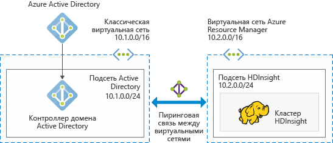
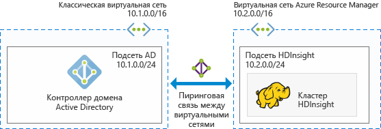

# Планирование архитектуры присоединенных к домену кластеров Hadoop в Azure HDInsight

Стандартный кластер Hadoop — это однопользовательский кластер. Он подходит для большинства организаций с небольшими отделами по работе с приложениями, создающими объемные рабочие нагрузки данных. В связи с ростом популярности кластера Hadoop многие организации переходят на модель, когда ИТ-специалисты управляют кластерами и несколько отделов по работе с приложениями совместно используют кластеры. Таким образом, возможности работы с многопользовательскими кластерами стали одними из самых запрашиваемых в Azure HDInsight.

Вместо создания собственной многопользовательской проверки подлинности и авторизации HDInsight полагается на самого популярного поставщика удостоверений — Active Directory (AD). Расширенные возможности безопасности в AD можно использовать для управления многопользовательской проверкой подлинности в HDInsight. Интегрировав HDInsight с AD, вы сможете взаимодействовать с кластерами, используя свои учетные данные AD. HDInsight сопоставляет пользователя AD с локальным пользователем Hadoop. За счет этого все пользовательские службы, запущенные в HDInsight (Ambari, сервер Hive, Ranger, сервер Thrift Spark и т. д.), работают эффективнее.

## Интеграция HDInsight с Active Directory

В процессе интеграции HDInsight с Active Directory узлы кластера HDInsight присоединяются к домену AD. HDInsight создает субъекты-службы для служб Hadoop, запущенных в кластере, и помещает их в определенное подразделение в домене. Кроме того, он создает в домене обратные сопоставления DNS для IP-адресов узлов, присоединенных к домену.

Существует два варианта развертывания Active Directory:
* **[Доменные службы Azure Active Directory](../active-directory-domain-services/active-directory-ds-overview.md):** эта служба предоставляет управляемый домен Active Directory, который полностью совместим с Windows Server Active Directory. Корпорация Майкрософт управляет доменом AD, применяет исправления к домену и осуществляет мониторинг домена. Вы можете развернуть свой кластер, не беспокоясь о поддержке контроллеров домена. Пользователи, группы и пароли синхронизируются из Azure Active Directory. Это позволяет пользователям входить в кластер со своими корпоративными учетными данными.

* **Домен Windows Server Active Directory на виртуальных машинах Azure IaaS:** в этом случае вы разворачиваете собственный домен Windows Server Active Directory на виртуальных машинах Azure IaaS и управляете этим доменом. 

Чтобы получить эту конфигурацию, нужно использовать несколько архитектур. Вы можете выбрать один из следующих вариантов.

### Кластер HDInsight, интегрированный в управляемый домен AD доменных служб Azure AD
Вы можете развернуть управляемый домен [доменных служб Azure Active Directory](../active-directory-domain-services/active-directory-ds-overview.md) (Azure AD DS). Azure AD DS предоставляет управляемый домен AD в Azure. Управление этим доменом, а также его обновление и мониторинг осуществляет корпорация Майкрософт. Для обеспечения высокой доступности создаются два контроллера домена со службами DNS. Затем вы можете интегрировать кластер HDInsight с этим управляемым доменом. С таким вариантом развертывания вам не придется беспокоиться об управлении, обновлении и мониторинге контроллеров домена, а также о применении исправлений к контроллерам домена.

Предварительные требования для интеграции с доменными службами Azure AD:

* [Подготовка управляемого домена доменных служб Azure AD](../active-directory-domain-services/active-directory-ds-getting-started.md).
* Создайте [подразделение](../active-directory-domain-services/active-directory-ds-admin-guide-create-ou.md), в котором будут размещены виртуальные машины кластера HDInsight и используемые в кластере субъекты-службы.
* Настройте [протокол LDAPS](../active-directory-domain-services/active-directory-ds-admin-guide-configure-secure-ldap.md) при настройке доменных служб Azure AD. Сертификат, используемый для настройки протокола LDAPS, должен быть выдан общедоступным центром сертификации (самозаверяющий сертификат использовать нельзя).
* Создайте обратные зоны DNS для диапазона IP-адресов из подсети HDInsight в управляемом домене (например, 10.2.0.0/24 на предыдущем рисунке).
* Настройте [синхронизацию хэша паролей, необходимых для проверки подлинности NTLM и Kerberos](../active-directory-domain-services/active-directory-ds-getting-started-password-sync.md), из Azure AD в управляемый домен Azure AD DS.
* Потребуется учетная запись службы или учетная запись пользователя. Используйте эту учетную запись для создания кластера HDInsight. Эта учетная запись должна иметь следующие разрешения:

    - разрешения на создание объектов субъекта-службы и объектов компьютеров в рамках подразделения;
    - разрешения на создание правил прокси-сервера для обратных зон DNS;
    - разрешения на присоединение компьютеров к домену Azure AD.

### Кластер HDInsight, интегрированный в каталог Windows Server AD, запущенный в Azure IaaS

Вы можете развернуть роль доменных служб Active Directory Windows Server на одной или нескольких виртуальных машинах в Azure и повысить их до контроллеров домена. Эти виртуальные машины контроллеров домена можно развернуть с помощью модели развертывания Resource Manager в той же виртуальной сети, что и кластер HDInsight. Если контроллеры домена разворачиваются в другую виртуальную сеть, необходимо настроить пиринг для этих виртуальных сетей с помощью [пиринга между виртуальными сетями](../virtual-network/virtual-network-create-peering.md). 

[Дополнительные сведения о развертывании Windows Server Active Directory на виртуальных машинах Azure](../active-directory/virtual-networks-windows-server-active-directory-virtual-machines.md)

> [!NOTE]
> В этой архитектуре вы не можете использовать Azure Data Lake Store с кластером HDInsight.

Предварительные требования для интеграции с Windows Server Active Directory на виртуальных машинах Azure:

* Необходимо создать [подразделение](../active-directory-domain-services/active-directory-ds-admin-guide-create-ou.md), в котором будут размещены виртуальные машины кластера HDInsight и используемые в кластере субъекты-службы.
* Для взаимодействия с AD необходимо настроить [протоколы LDAPS](../active-directory-domain-services/active-directory-ds-admin-guide-configure-secure-ldap.md). Сертификат, используемый для настройки протокола LDAPS, должен быть реальным (а не самозаверяющим).
* В домене необходимо создать обратные зоны DNS для диапазона IP-адресов из подсети HDInsight (например, 10.2.0.0/24 на предыдущем рисунке).
* Потребуется учетная запись службы или учетная запись пользователя. Используйте эту учетную запись для создания кластера HDInsight. Эта учетная запись должна иметь следующие разрешения:

    - разрешения на создание объектов субъекта-службы и объектов компьютеров в рамках подразделения;
    - разрешения на создание правил прокси-сервера для обратных зон DNS;
    - разрешения на присоединение компьютеров к домену Active Directory.

## Дальнейшие действия
* Сведения о настройке присоединенного к домену кластера HDInsight см. в [этой статье](hdinsight-domain-joined-configure.md).
* Сведения об управлении присоединенными к домену кластерами HDInsight см. в [этой статье](hdinsight-domain-joined-manage.md).
* Сведения о настройке политик Hive и выполнении запросов Hive см. в статье [Настройка политик Hive в присоединенном к домену кластере HDInsight (предварительная версия)](hdinsight-domain-joined-run-hive.md).
* Сведения о выполнении запросов Hive с помощью SSH в присоединенных к домену кластерах HDInsight см. в статье [Подключение к HDInsight (Hadoop) с помощью SSH](hdinsight-hadoop-linux-use-ssh-unix.md).

