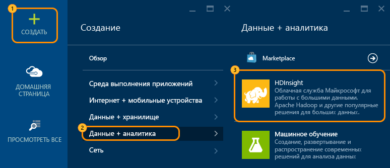
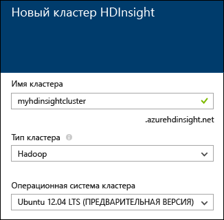
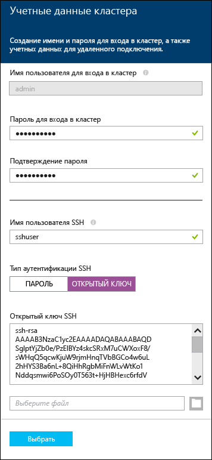
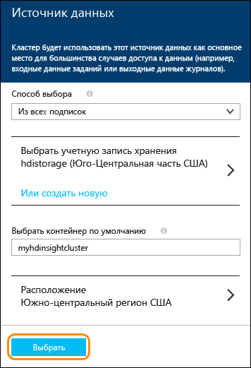
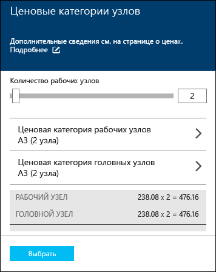
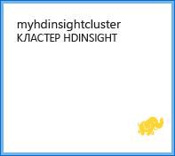

<properties
   	pageTitle="Учебник для Linux: начало работы с Hadoop и Hive | Microsoft Azure"
   	description="Следуйте инструкциям этого учебника для Linux, чтобы начать работу с Hadoop в HDInsight. Узнайте, как подготовить кластеры в Linux и запросить данные с помощью Hive."
   	services="hdinsight"
   	documentationCenter=""
   	authors="nitinme"
   	manager="paulettm"
   	editor="cgronlun"
	tags="azure-portal"/>

<tags
   	ms.service="hdinsight"
   	ms.devlang="na"
   	ms.topic="hero-article"
   	ms.tgt_pltfrm="na"
   	ms.workload="big-data"
   	ms.date="12/03/2015"
   	ms.author="nitinme"/>

# Учебник по Hadoop: приступая к работе с Hadoop с Hive в HDInsight на платформе Linux

> [AZURE.SELECTOR]
- [Windows](hdinsight-hadoop-tutorial-get-started-windows.md)
- [Linux](hdinsight-hadoop-linux-tutorial-get-started.md)

Этот документ поможет вам быстро ознакомиться с принципами работы Azure HDInsight в Linux. Вы узнаете, как создать кластер Hadoop под управлением Linux, открыть веб-интерфейс Ambari и выполнить запрос Hive, используя представление Hive Ambari.

> [AZURE.NOTE]Если вы не знакомы с Hadoop и программами больших данных, ознакомьтесь с такими терминами, как [Apache Hadoop](http://go.microsoft.com/fwlink/?LinkId=510084), [MapReduce](http://go.microsoft.com/fwlink/?LinkId=510086), [распределенная файловая система Hadoop (HDFS)](http://go.microsoft.com/fwlink/?LinkId=510087) и [Hive](http://go.microsoft.com/fwlink/?LinkId=510085). Чтобы разобраться, как HDInsight поддерживает Hadoop в Azure, см. [Введение для Hadoop в HDInsight](hdinsight-hadoop-introduction.md).

## Предварительные требования

Перед началом работы с этим учебником по Hadoop на базе Linux необходимо иметь следующее:

- **Подписку на Azure**: См. [Получение бесплатной пробной версии Azure](http://azure.microsoft.com/documentation/videos/get-azure-free-trial-for-testing-hadoop-in-hdinsight/).

## Подготовка кластера HDInsight на платформе Linux

При подготовке кластера создаются вычислительные ресурсы Azure, которые содержат службы и ресурсы Hadoop. В этом разделе подготавливается кластер HDInsight версии 3.2, содержащий Hadoop версии 2.2. Дополнительную информацию о различных версиях HDInsight и их соглашениях об уровне обслуживания см. в статье [Версии компонентов НDInsight](hdinsight-component-versioning.md). Дополнительные сведения о создании кластера HDInsight см. в статье [Создание кластеров Hadoop в HDInsight][hdinsight-provision].

>[AZURE.NOTE]Вы также можете создать кластеры Hadoop под управлением операционной системы Windows Server. Инструкции см. в статье [Руководство по Hadoop: приступая к работе с Hadoop в HDInsight на платформе Windows](hdinsight-hadoop-tutorial-get-started-windows.md).

Чтобы создать новый кластер, выполните следующие действия.

1. Войдите на [портал Azure](https://ms.portal.azure.com/).
2. Щелкните **Создать**, **Аналитика данных**, а затем — **HDInsight**.

    

3. Введите **Имя кластера**, выберите **Hadoop** в качестве **Типа кластера** и в раскрывающемся списке **Операционная система кластера** выберите **Ubuntu**. Если имя кластера доступно, рядом с ним появится зеленый флажок.

	

4. Если у вас есть несколько подписок, выберите запись **Подписка**, чтобы выбрать подписку Azure для кластера.

5. Щелкните **Группа ресурсов**, чтобы просмотреть список существующих групп ресурсов и выбрать ту, в которой будет создан кластер. Или выберите **Создать** и введите имя новой группы ресурсов. Если новое имя группы доступно, рядом с ним появится зеленый флажок.

	> [AZURE.NOTE]Эта запись будет выбрана по умолчанию для одной из существующих групп ресурсов (при их наличии).

6. Щелкните **Учетные данные** и введите пароль для пользователя с правами администратора. Также необходимо ввести **Имя пользователя SSH**. В разделе **Тип проверки подлинности SSH** щелкните **Пароль** и укажите пароль для пользователя SSH. Нажмите **Выбрать** внизу страницы, чтобы сохранить конфигурацию учетных данных.

	

    > [AZURE.NOTE]SSH используется для удаленного доступа к кластеру HDInsight с помощью командной строки. Эти имя пользователя и пароль будут использоваться при подключении к кластеру через SSH.

	Дополнительные сведения об использовании SSH с HDInsight см. в следующих статьях:

	* [Использование SSH с Hadoop под управлением Linux в HDInsight в Linux, Unix или OS X](hdinsight-hadoop-linux-use-ssh-unix.md)
	* [Использование SSH с Hadoop под управлением Linux в HDInsight в Windows](hdinsight-hadoop-linux-use-ssh-windows.md)

7. Щелкните **Источник данных**, чтобы выбрать для кластера существующий источник данных или создать новый. При подготовке кластера Hadoop в HDInsight нужно указать учетную запись хранения Azure. Конкретный контейнер хранилища BLOB-объектов из этой учетной записи назначается в качестве файловой системы по умолчанию, так же как и в распределенной файловой системе Hadoop (HDFS). По умолчанию подготовка кластера HDInsight выполняется в том же центре обработки данных, в котором находится указанная учетная запись хранения. Дополнительные сведения см. в статье [Использование хранилища BLOB-объектов Azure с HDInsight](hdinsight-use-blob-storage.md)

	

	В настоящее время в качестве источника данных для кластера HDInsight можно выбрать учетную запись хранения Azure. Ниже описаны элементы интерфейса, доступные для настройки в колонке **Источник данных**.

	- **Метод выбора**. Выберите значение **Из всех подписок**, чтобы активировать поиск учетных записей хранения во всех своих подписках. Задайте для этого параметра значение **Ключ доступа**, если вы хотите ввести **имя хранилища** и **ключ доступа** существующей учетной записи хранения.

	- **Выбрать учетную запись хранения или создать новую**. Щелкните **Выбрать учетную запись хранения**, чтобы найти и выбрать существующую учетную запись хранения, которую нужно связать с кластером. Чтобы создать новую учетную запись хранения, щелкните **Создать**. В появившееся поле введите имя учетной записи хранения. Если имя доступно, появится зеленый флажок.

	- **Выбрать контейнер по умолчанию**. Эта команда позволяет ввести имя контейнера по умолчанию и использовать его для кластера. Вы можете ввести любое имя, однако мы рекомендуем использовать такое же имя, как у кластера, чтобы легко распознавать, какой контейнер используется для конкретного кластера.

	- **Расположение**. Географический регион, к которому будет относиться существующая или новая учетная запись хранения.

		> [AZURE.IMPORTANT]Выбранное расположение для источника данных по умолчанию будет также определять расположение кластера HDInsight. Кластер и источник данных по умолчанию должны находиться в одном регионе.

	Нажмите **Выбрать**, чтобы сохранить конфигурацию источника данных.

8. Щелкните **Ценовые категории узла**, чтобы отобразить сведения об узлах, которые будут созданы для этого кластера. Задайте количество рабочих узлов, необходимых для кластера. Оценочная стоимость кластера отобразится в колонке.

	
    
    > [AZURE.IMPORTANT]Если вы планируете использовать более 32 рабочих узлов (при создании кластера или в ходе масштабирования после создания кластера), для головного узла потребуется минимум 8-ядерный процессор и 14 ГБ ОЗУ.
    >
    > Дополнительные сведения о размерах узлов и их стоимости см. в статье [HDInsight — цены](https://azure.microsoft.com/pricing/details/hdinsight/).

	Нажмите **Выбрать**, чтобы сохранить конфигурацию цен узла.

9. В колонке **Новый кластер HDInsight** обязательно выберите параметр **Закрепить на начальной панели**, а затем нажмите кнопку **Создать**. После этого кластер будет создан, а на начальную панель портала Azure будет добавлена его плитка. Значок указывает, что выполняется подготовка кластера. После завершения подготовки вместо него будет отображаться значок HDInsight.

Подготовка выполняется|Подготовка завершена
------------------|---------------------
	|

> [AZURE.NOTE]Обычно создание кластера занимает около 15 минут. Отслеживать процесс подготовки можно с помощью плитки на начальной панели или записи **Уведомления** в левой части страницы.

После завершения подготовки щелкните плитку кластера на начальной панели, чтобы открыть колонку кластера.

##Подключение к представлению Hive

Представления Ambari позволяют использовать несколько служебных программ через веб-страницу. В следующих разделах вы научитесь использовать представление Hive для выполнения запросов Hive в кластере HDInsight.

> [AZURE.NOTE]Ambari — это служебная программа для управления и мониторинга, предоставляемая с кластерами HDInsight под управлением Linux. У Ambari много разных функций, которые не рассматриваются в этом документе. Дополнительные сведения см. в статье [Управление кластерами HDInsight с помощью веб-интерфейса Ambari](hdinsight-hadoop-manage-ambari.md).

Вы можете получить доступ к представлениям Ambari на портале Azure, выбрав в разделе __Быстрые ссылки__ нужный кластер HDInsight, а затем — пункт __Представления Ambari__.

Кроме того, вы можете непосредственно открыть Ambari. Перейдите в веб-браузере по адресу https://CLUSTERNAME.azurehdinsight.net (где __CLUSTERNAME__ — это имя вашего кластера HDInsight) и выберите набор квадратов в меню страницы (рядом со ссылкой и кнопкой __Администратор__ в левой части страницы), чтобы отобразился список доступных представлений. Выберите __Представление Hive __.

.

> [AZURE.NOTE]При открытии сайта Ambari вы получите запрос на проверку подлинности. Введите имя и пароль учетной записи администратора (по умолчанию — `admin`), которые использовались при создании кластера.

Вы должны увидеть страницу, аналогичную показанной ниже:

##Выполнение запроса Hive

В представлении Hive выполните описанные ниже действия, чтобы выполнить запрос Hive для получения данных, входящих в состав кластера.

1. На странице в разделе __Редактор запросов__ вставьте в рабочий лист следующие операторы HiveQL:

		DROP TABLE log4jLogs;
		CREATE EXTERNAL TABLE log4jLogs(t1 string, t2 string, t3 string, t4 string, t5 string, t6 string, t7 string)
		ROW FORMAT DELIMITED FIELDS TERMINATED BY ' '
		STORED AS TEXTFILE LOCATION 'wasb:///example/data/';
		SELECT t4 AS sev, COUNT(*) AS cnt FROM log4jLogs WHERE t4 = '[ERROR]' GROUP BY t4;

	Эти инструкции выполняют следующие действия.

	- **DROP TABLE** — удаляет таблицу и файл данных, если таблица уже существует.
	- **CREATE EXTERNAL TABLE** — создает новую внешнюю таблицу в Hive. Внешние таблицы хранят только описание самой таблицы в Hive, в то время как данные остаются в исходном расположении.
	- **ROW FORMAT** — указывает Hive, как следует форматировать данные. В данном случае поля всех журналов разделены пробелом.
	- **STORED AS TEXTFILE LOCATION**: информация для Hive о расположении хранения данных (каталог example/data) и об их формате (текстовый).
	- **SELECT**: подсчитывает количество строк, у которых столбец t4 содержит значение [ERROR].

	>[AZURE.NOTE]Внешние таблицы необходимо использовать в тех случаях, когда ожидается, что исходные данные будут обновляться внешним источником, таким как автоматизированный процесс передачи данных, или другой операцией MapReduce, и при этом нужно, чтобы запросы Hive использовали самые последние данные. Удаление внешней таблицы *не* приводит к удалению данных. Будет удалено только описание таблицы.

2. Чтобы выполнить запрос, нажмите кнопку __Выполнить__ в нижней части окна редактора запросов. Кнопка станет оранжевой, а текст на ней изменится на __Остановить выполнение__. Под окном редактора запросов появится раздел __Результаты обработки запроса__, содержащий сведения о выполнении задачи.

    > [AZURE.IMPORTANT]В некоторых браузерах записи журнала или результаты могут не обновляться надлежащим образом. Если при выполнении задачи записи журнала или полученные результаты не обновляются, попробуйте воспользоваться Mozilla FireFox или Google Chrome.
    
3. После выполнения запроса в разделе __Результаты обработки запроса__ будут отображены результаты операции. Кнопка __Остановить выполнение__ снова станет зеленой, а текст на ней изменится на __Выполнить__. Вкладка __Результаты__ должна содержать указанные ниже сведения.

        sev       cnt
        [ERROR]   3

    На вкладке __Журналы__ отображаются сведения, регистрируемые в процессе выполнения задания. Эти сведения можно использовать для устранения неполадок, возникающих при выполнении запроса.
    
    > [AZURE.TIP]Обратите внимание на раскрывающийся список __Сохранить результаты__, расположенный в разделе __Результаты обработки запроса__ слева вверху. Этот список можно использовать для загрузки или сохранения результатов в хранилище HDInsight в формате CSV-файла.

3. Выберите четыре первые строки запроса, а затем — команду __Выполнить__. Обратите внимание на отсутствие результатов после выполнения задания. Это связано с тем, что вы нажали кнопку __Выполнить__, выбрав часть запроса. Следовательно, запрос выполняется только с использованием выбранных операторов. В нашем примере не выбран последний оператор, который извлекает строки из таблицы. Если выбрать только эту строку, а затем нажать кнопку __Выполнить__, отобразятся ожидаемые результаты.

3. В нижней части __редактора запросов__ нажмите кнопку __Создать лист__, чтобы создать рабочий лист. На новом листе введите указанные ниже операторы HiveQL.

		CREATE TABLE IF NOT EXISTS errorLogs (t1 string, t2 string, t3 string, t4 string, t5 string, t6 string, t7 string) STORED AS ORC;
		INSERT OVERWRITE TABLE errorLogs SELECT t1, t2, t3, t4, t5, t6, t7 FROM log4jLogs WHERE t4 = '[ERROR]';

	Эти инструкции выполняют следующие действия.

	- **CREATE TABLE IF NOT EXISTS**: создание таблицы, если она до этого не существовала. Так как ключевое слово **EXTERNAL** не было использовано, данная таблица будет внутренней. То есть она хранится в хранилище данных Hive, и ею полностью управляет Hive. В отличие от внешних таблиц, удаление внутренних таблиц приводит также к удалению данных.
	- **STORED AS ORC** — сохраняет данные в формате Optimized Row Columnar (ORC). Это высокооптимизированный и эффективный формат для хранения данных Hive.
	- **INSERT OVERWRITE ... SELECT** — выбирает из таблицы **log4jLogs** строки, которые содержат значение [ERROR], а затем вставляет данные в таблицу **errorLogs**.
    
    Нажмите кнопку __Выполнить__, чтобы выполнить этот запрос. Хотя вкладка __Результаты__ не будет содержать никаких сведений (этот запрос не возвращает строки), состояние должно измениться на __Выполнено__.
    
4. Справа от окна редактора запросов отображается ряд значков. Выберите значок, который выглядит как цепочка.

    
    
    Это представление запроса __Визуальное объяснение__, которое помогает разобраться в потоке сложных запросов. Можно просмотреть текстовый эквивалент этого представления, нажав кнопку __Объяснить__ в редакторе запросов.
    
    
    
    Ниже описаны функции других значков.
    
        * Settings: The gear icon allows you to change Hive settings, such as setting `hive.execution.engine` or Tez parameters.
        * Tez: Displays the Directed Acyclic Graph (DAG) that Tez used to perform the query. If you want to view the DAG for queries you've ran in the past, use the __Tez View__ instead.
        * Notifications: Displays notifications, such as "Query has been submitted" or if an error occurs when running a query.

5. Щелкните значок __SQL__, чтобы вернуться в редактор запросов, а затем создайте рабочий лист и введите указанный ниже запрос.

        SELECT * from errorLogs;
    
    Нажмите кнопку __Сохранить как__ в нижней части экрана. Присвойте этому запросу имя __Errorlogs__ и нажмите __ОК__. Обратите внимание, что имя листа изменилось на __Errorlogs__.
    
    Сохраненные запросы также отображаются на вкладке __Сохраненные запросы__ в верхней части страницы. Перейдя на эту вкладку, вы увидите запрос __Errorlogs__ в списке. Выбрав имя, можно открыть запрос в редакторе.

4. Выполните запрос __Errorlogs__. Результат будет следующим:

        errorlogs.t1 	errorlogs.t2 	errorlogs.t3 	errorlogs.t4 	errorlogs.t5 	errorlogs.t6 	errorlogs.t7
        2012-02-03 	18:35:34 	SampleClass0 	[ERROR] 	incorrect 	id 	
        2012-02-03 	18:55:54 	SampleClass1 	[ERROR] 	incorrect 	id 	
        2012-02-03 	19:25:27 	SampleClass4 	[ERROR] 	incorrect 	id

## Дальнейшие действия

Из этого документа вы узнали, как создать кластер HDInsight под управлением Linux с использованием портала Azure, подключиться к кластеру с помощью SSH и выполнить основные запросы Hive.

Дополнительные сведения об анализе данных с помощью HDInsight см. в следующих статьях:

- Дополнительные сведения об использовании Hive с HDInsight, включая выполнение запросов Hive из Visual Studio, см. в статье [Использование Hive с HDInsight][hdinsight-use-hive].

- Дополнительные сведения о Pig, языке, который используется для преобразования данных, см. в статье [Использование Pig с HDInsight][hdinsight-use-pig].

- Дополнительные сведения о MapReduce, способе записи программ, которые обрабатывают данные в Hadoop, см. в статье [Использование MapReduce с HDInsight][hdinsight-use-mapreduce].

- Дополнительные сведения об анализе данных в HDInsight с помощью средств HDInsight для Visual Studio см. в статье [Приступая к работе с инструментами Hadoop в Visual Studio для HDInsight для выполнения запроса Hive](hdinsight-hadoop-visual-studio-tools-get-started.md).

Если вы готовы приступить к работе с собственными данными и хотите узнать больше о том, как HDInsight сохраняет данные или как получать данные в HDInsight, см. следующие статьи:

- Информацию о том, как HDInsight использует хранилище BLOB-объектов Azure, см. в статье [Использование хранилища BLOB-объектов Azure с HDInsight](hdinsight-use-blob-storage.md).

- Сведения об отправке данных в HDInsight см. в статье [Отправка данных в HDInsight][hdinsight-upload-data].

Дополнительные сведения о создании кластера HDInsight и управлении этим кластером см. в следующих статьях:

- Информацию об управлении кластером HDInsight под управлением Linux см. в статье [Управление кластерами HDInsight с помощью Ambari](hdinsight-hadoop-manage-ambari.md).

- Дополнительные сведения о параметрах, которые можно выбрать при создании кластера HDInsight, см. в статье [Создание кластеров под управлением Linux в HDInsight](hdinsight-hadoop-provision-linux-clusters.md).

- Если вы уже знакомы с Linux и Hadoop, но хотите узнать об особенностях работы с Hadoop в HDInsight, см. статью [Сведения об использовании HDInsight в Linux](hdinsight-hadoop-linux-information.md). Она содержит следующую информацию:

	* URL-адреса для служб, размещенных в кластере, например Ambari и WebHCat;
	* расположение файлов Hadoop и примеры в локальной файловой системе;
	* использование хранилища Azure (WASB) вместо HDFS в качестве хранилища данных по умолчанию.

[1]: ../HDInsight/hdinsight-hadoop-visual-studio-tools-get-started.md

[hdinsight-provision]: hdinsight-provision-clusters.md
[hdinsight-admin-powershell]: hdinsight-administer-use-powershell.md
[hdinsight-upload-data]: hdinsight-upload-data.md
[hdinsight-use-mapreduce]: hdinsight-use-mapreduce.md
[hdinsight-use-hive]: hdinsight-use-hive.md
[hdinsight-use-pig]: hdinsight-use-pig.md

[powershell-download]: http://go.microsoft.com/fwlink/p/?linkid=320376&clcid=0x409
[powershell-install-configure]: ../install-configure-powershell.md
[powershell-open]: ../install-configure-powershell.md#Install

[img-hdi-dashboard]: ./media/hdinsight-hadoop-tutorial-get-started-windows/HDI.dashboard.png
[img-hdi-dashboard-query-select]: ./media/hdinsight-hadoop-tutorial-get-started-windows/HDI.dashboard.query.select.png
[img-hdi-dashboard-query-select-result]: ./media/hdinsight-hadoop-tutorial-get-started-windows/HDI.dashboard.query.select.result.png
[img-hdi-dashboard-query-select-result-output]: ./media/hdinsight-hadoop-tutorial-get-started-windows/HDI.dashboard.query.select.result.output.png
[img-hdi-dashboard-query-browse-output]: ./media/hdinsight-hadoop-tutorial-get-started-windows/HDI.dashboard.query.browse.output.png
[image-hdi-clusterstatus]: ./media/hdinsight-hadoop-tutorial-get-started-windows/HDI.ClusterStatus.png
[image-hdi-gettingstarted-powerquery-importdata]: ./media/hdinsight-hadoop-tutorial-get-started-windows/HDI.GettingStarted.PowerQuery.ImportData.png
[image-hdi-gettingstarted-powerquery-importdata2]: ./media/hdinsight-hadoop-tutorial-get-started-windows/HDI.GettingStarted.PowerQuery.ImportData2.png

<!---HONumber=AcomDC_1210_2015-->