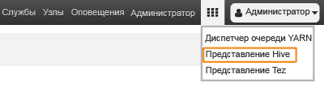

<properties
   	pageTitle="Учебник для Linux: начало работы с Hadoop и Hive | Microsoft Azure"
   	description="Следуйте инструкциям этого учебника для Linux, чтобы начать работу с Hadoop в HDInsight. Узнайте, как подготовить кластеры в Linux и запросить данные с помощью Hive."
   	services="hdinsight"
   	documentationCenter=""
   	authors="mumian"
   	manager="paulettm"
   	editor="cgronlun"
	tags="azure-portal"/>

<tags
   	ms.service="hdinsight"
   	ms.devlang="na"
   	ms.topic="hero-article"
   	ms.tgt_pltfrm="na"
   	ms.workload="big-data"
   	ms.date="03/01/2016"
   	ms.author="jgao"/>

# Руководство по Hadoop. Начало работы с Hadoop в HDInsight на платформе Linux

> [AZURE.SELECTOR]
- [Windows](hdinsight-hadoop-tutorial-get-started-windows.md)
- [Linux](hdinsight-hadoop-linux-tutorial-get-started.md)

Узнайте, как создавать кластеры Hadoop в HDInsight под управлением Linux и запускать задания Hive в представлении Hive Ambari.

Если вы не знакомы с Hadoop и концепцией больших данных, изучите материалы о [Apache Hadoop](http://go.microsoft.com/fwlink/?LinkId=510084), [MapReduce](http://go.microsoft.com/fwlink/?LinkId=510086), [распределенной файловой системе Hadoop (HDFS)](http://go.microsoft.com/fwlink/?LinkId=510087) и [Hive](http://go.microsoft.com/fwlink/?LinkId=510085). Чтобы разобраться, как HDInsight поддерживает Hadoop в Azure, см. [Введение для Hadoop в HDInsight](hdinsight-hadoop-introduction.md).

### Предварительные требования

Для работы с этим руководством вам потребуется:

- **Подписка Azure**. Сведения о том, как получить бесплатную пробную версию, см. [здесь](https://azure.microsoft.com/documentation/videos/get-azure-free-trial-for-testing-hadoop-in-hdinsight/).

## Создание кластера

Большинство заданий Hadoop — пакетные. Вы создаете кластер и выполняете нужные задания. В этом разделе мы создадим в HDInsight кластер Hadoop под управлением Linux, используя [шаблон Azure ARM](../resource-group-template-deploy.md). Знакомство с шаблонами Azure ARM не является обязательным условием для работы с этим руководством. Сведения о других способах создания кластеров и их параметрах см. в статье [Создание кластеров Hadoop под управлением Linux в HDInsight](hdinsight-hadoop-provision-linux-clusters.md). Дополнительные сведения о создании в HDInsight кластеров Hadoop с помощью шаблонов ARM см. в статье [Создание кластеров Hadoop под управлением Windows в HDInsight с помощью шаблонов ARM](hdinsight-hadoop-create-windows-clusters-arm-templates.md).

1. Щелкните следующие изображение, чтобы открыть шаблон ARM на портале Azure. Шаблон ARM хранится в общедоступном контейнере больших двоичных объектов по ссылке **https://hditutorialdata.blob.core.windows.net/armtemplates/create-linux-based-hadoop-cluster-in-hdinsight.json*.

    

2. В колонке **Параметры** заполните следующие поля.

    - **Имя кластера**. Введите имя создаваемого кластера Hadoop.
    - **Имя учетной записи хранения в кластере**. У каждого кластера есть зависимость учетной записи хранения BLOB-объектов Azure. После удаления кластера данные сохраняются в учетной записи хранения.
    - **Имя для входа и пароль кластера**. По умолчанию для входа используется имя **admin**.
    - **Имя пользователя SSH и пароль**. По умолчанию используется имя **sshuser**. Это имя можно изменить. 
    
    Все остальные параметры являются необязательными. Их можно не изменять. Имя учетной записи хранения в кластере — это имя кластера, к которому добавлено слово store. Это прописано в коде шаблона в разделе переменных.
3. Нажмите кнопку **ОК**, чтобы сохранить параметры.
4. В колонке **Настраиваемое развертывание** щелкните раскрывающийся список **Группа ресурсов** и выберите пункт **Создать**, чтобы создать группу ресурсов. Группа ресурсов — это контейнер, в который входит кластер, зависимая учетная запись хранения и другие связанные ресурсы. Расположение группы ресурсов может отличаться от расположения кластера.
5. Щелкните **Условия**, а затем нажмите кнопку **Создать**.
6. Щелкните **Создать**. Вы увидите новую плитку под названием **Отправка развертывания для развертывания шаблона**. Процесс создания кластера занимает около 20 минут. Когда кластер будет создан, щелкните его колонку на портале, чтобы открыть его.

После завершения работы с этим руководством кластер можно удалить. В случае с HDInsight ваши данные хранятся в службе хранилища Azure, что позволяет безопасно удалить неиспользуемый кластер. Плата за кластеры HDInsight взимается, даже когда они не используются. Поскольку стоимость кластера во много раз превышает стоимость хранилища, экономически целесообразно удалять неиспользуемые кластеры. Инструкции по удалению кластера см. в статье [Управление кластерами Hadoop в HDInsight с помощью портала Azure](hdinsight-administer-use-management-portal.md#delete-clusters).

##Выполнение запросов Hive

Представления [Ambari](hdinsight-hadoop-manage-ambari.md) позволяют использовать несколько служебных программ прямо на веб-странице. Одна из таких программ — представление Hive. В этом разделе мы будем использовать представление Hive для выполнения запросов Hive в кластере HDInsight. Другие способы выполнения запросов Hive описаны в статье [Использование Hive и HiveQL с Hadoop в HDInsight для анализа примера файла Apache log4j](hdinsight-use-hive.md).

1. Чтобы открыть Ambari, перейдите по ссылке **https://&lt;ClusterName>.azurehdinsight.net**, где &lt;ClusterName> — это кластер, который вы создали в предыдущем разделе.
2. Введите имя пользователя Hadoop и пароль, указанные в предыдущем разделе. Имя пользователя по умолчанию — **admin**.
3. Откройте **представление Hive**, как показано на снимке экрана ниже.

    .
4. На странице в разделе __Редактор запросов__ вставьте в рабочий лист следующие инструкции HiveQL:

		SHOW tables;
5. Нажмите __Execute (Выполнить)__. Под окном редактора запросов появится раздел __Результаты обработки запроса__, содержащий сведения о выполнении задания. 

    После выполнения запроса в разделе __Результаты обработки запроса__ будут отображены результаты операции. Вы увидите одну таблицу с именем **hivesampletable**. Этот пример таблицы Hive входит в состав всех кластеров HDInsight.
    
    > [AZURE.TIP] Обратите внимание на раскрывающийся список __Сохранить результаты__, расположенный в разделе __Результаты обработки запроса__ слева вверху. Этот список можно использовать для загрузки или сохранения результатов в хранилище HDInsight в формате CSV-файла.
6. Повторите шаги 4 и 5 и выполните следующий запрос.

        SELECT * FROM hivesampletable;

Когда задание Hive будет завершено, вы сможете [экспортировать результаты в базу данных SQL Azure или базу данных SQL Server](hdinsight-use-sqoop-mac-linux.md) или [визуализировать их с помощью Excel](hdinsight-connect-excel-power-query.md). Дополнительные сведения об использовании Hive в HDInsight см. в статье [Использование Hive и HiveQL с Hadoop в HDInsight для анализа примера файла Apache log4j](hdinsight-use-hive.md).

## Дальнейшие действия

В этом руководстве вы узнали, как с помощью шаблона ARM создать кластер HDInsight под управлением Linux и как выполнять базовые запросы Hive.

Дополнительные сведения об анализе данных с помощью HDInsight см. в следующих статьях.

- Дополнительные сведения об использовании Hive с HDInsight, включая выполнение запросов Hive из Visual Studio, см. в статье [Использование Hive с HDInsight][hdinsight-use-hive].

- Дополнительные сведения о Pig, языке, который используется для преобразования данных, см. в статье [Использование Pig с HDInsight][hdinsight-use-pig].

- Дополнительные сведения о MapReduce, способе записи программ, которые обрабатывают данные в Hadoop, см. в статье [Использование MapReduce с HDInsight][hdinsight-use-mapreduce].

- Дополнительные сведения об анализе данных в HDInsight с помощью средств HDInsight для Visual Studio см. в статье [Приступая к работе с инструментами Hadoop в Visual Studio для HDInsight для выполнения запроса Hive](hdinsight-hadoop-visual-studio-tools-get-started.md).

Если вы готовы приступить к работе с собственными данными и хотите узнать больше о том, как HDInsight сохраняет данные или как получать данные в HDInsight, см. следующие статьи:

- Информацию о том, как HDInsight использует хранилище BLOB-объектов Azure, см. в статье [Использование хранилища BLOB-объектов Azure с HDInsight](hdinsight-hadoop-use-blob-storage.md).

- Сведения об отправке данных в HDInsight см. в статье [Отправка данных в HDInsight][hdinsight-upload-data].

Дополнительные сведения о создании кластера HDInsight и управлении этим кластером см. в следующих статьях:

- Информацию об управлении кластером HDInsight под управлением Linux см. в статье [Управление кластерами HDInsight с помощью Ambari](hdinsight-hadoop-manage-ambari.md).

- Дополнительные сведения о параметрах, которые можно выбрать при создании кластера HDInsight, см. в статье [Создание кластеров Hadoop под управлением Linux в HDInsight](hdinsight-hadoop-provision-linux-clusters.md).

- Если вы уже знакомы с Linux и Hadoop, но хотите узнать об особенностях Hadoop в HDInsight, см. статью [Работа с HDInsight в Linux](hdinsight-hadoop-linux-information.md). Она содержит следующую информацию:

	* URL-адреса для служб, размещенных в кластере, например Ambari и WebHCat;
	* расположение файлов Hadoop и примеры в локальной файловой системе;
	* использование хранилища Azure (WASB) вместо HDFS в качестве хранилища данных по умолчанию.

[1]: ../HDInsight/hdinsight-hadoop-visual-studio-tools-get-started.md

[hdinsight-provision]: hdinsight-provision-clusters.md
[hdinsight-admin-powershell]: hdinsight-administer-use-powershell.md
[hdinsight-upload-data]: hdinsight-upload-data.md
[hdinsight-use-mapreduce]: hdinsight-use-mapreduce.md
[hdinsight-use-hive]: hdinsight-use-hive.md
[hdinsight-use-pig]: hdinsight-use-pig.md

[powershell-download]: http://go.microsoft.com/fwlink/p/?linkid=320376&clcid=0x409
[powershell-install-configure]: powershell-install-configure.md
[powershell-open]: powershell-install-configure.md#Install

[img-hdi-dashboard]: ./media/hdinsight-hadoop-tutorial-get-started-windows/HDI.dashboard.png
[img-hdi-dashboard-query-select]: ./media/hdinsight-hadoop-tutorial-get-started-windows/HDI.dashboard.query.select.png
[img-hdi-dashboard-query-select-result]: ./media/hdinsight-hadoop-tutorial-get-started-windows/HDI.dashboard.query.select.result.png
[img-hdi-dashboard-query-select-result-output]: ./media/hdinsight-hadoop-tutorial-get-started-windows/HDI.dashboard.query.select.result.output.png
[img-hdi-dashboard-query-browse-output]: ./media/hdinsight-hadoop-tutorial-get-started-windows/HDI.dashboard.query.browse.output.png
[image-hdi-clusterstatus]: ./media/hdinsight-hadoop-tutorial-get-started-windows/HDI.ClusterStatus.png
[image-hdi-gettingstarted-powerquery-importdata]: ./media/hdinsight-hadoop-tutorial-get-started-windows/HDI.GettingStarted.PowerQuery.ImportData.png
[image-hdi-gettingstarted-powerquery-importdata2]: ./media/hdinsight-hadoop-tutorial-get-started-windows/HDI.GettingStarted.PowerQuery.ImportData2.png

<!---HONumber=AcomDC_0302_2016-->