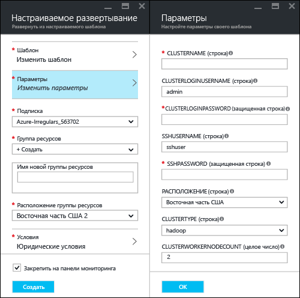
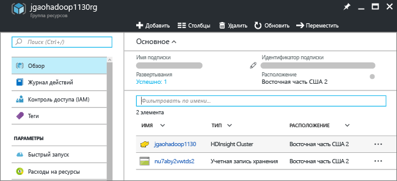
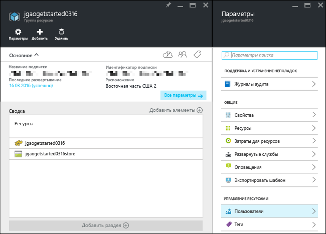

# Руководство по Hadoop. Приступая к работе с Hadoop в HDInsight

Узнайте, как создавать кластеры [Hadoop](http://hadoop.apache.org/) в HDInsight и запускать задания Hive в HDInsight. [Apache Hive](https://hive.apache.org/) — это самый популярный компонент экосистемы Hadoop. Сейчас в HDInsight предусмотрено шесть разных типов кластеров: [Hadoop](hdinsight-hadoop-introduction.md), [Spark](hdinsight-apache-spark-overview.md), [HBase](hdinsight-hbase-overview.md), [Storm](hdinsight-storm-overview.md), [Interactive Hive (предварительная версия)](hdinsight-hadoop-use-interactive-hive.md) и [R Server](hdinsight-hadoop-r-server-overview.md).  Каждый тип кластера поддерживает свой набор компонентов. Все шесть типов кластеров поддерживают инфраструктуру Hive. Дополнительные сведения о поддерживаемых компонентах в HDInsight см. в статье [Что представляют собой различные компоненты Hadoop, доступные в HDInsight?](hdinsight-component-versioning.md)  

[!INCLUDE [delete-cluster-warning](../../includes/hdinsight-delete-cluster-warning.md)]
## Предварительные требования
Для работы с этим руководством вам потребуется:

* **Подписка Azure**: чтобы создать бесплатную пробную учетную запись (на один месяц), перейдите по адресу [azure.microsoft.com/free](https://azure.microsoft.com/free).

### Требования к контролю доступа
[!INCLUDE [access-control](../../includes/hdinsight-access-control-requirements.md)]

## Создание кластера

Большинство заданий Hadoop — пакетные. Вы создаете кластер, выполняете несколько заданий, а затем удаляете его. В этом разделе вы создадите в HDInsight кластер Hadoop, используя [шаблон Azure Resource Manager](../azure-resource-manager/resource-group-template-deploy.md). Полностью настраиваемый шаблон Resource Manager упрощает создание таких ресурсов Azure, как HDInsight. Знакомство с шаблонами Resource Manager не является обязательным для работы с этим руководством. Сведения о других способах создания кластеров, а также о свойствах, используемых в этом руководстве, см. в статье [Создание кластеров Hadoop под управлением Linux в HDInsight](hdinsight-hadoop-provision-linux-clusters.md). Воспользуйтесь селектором в верхней части страницы, чтобы выбрать параметры создания кластера.

Используемый в этом руководстве шаблон Resource Manager расположен на портале [GitHub](https://azure.microsoft.com/resources/templates/101-hdinsight-linux-ssh-password/). 

1. Щелкните следующее изображение, чтобы войти в Azure и открыть шаблон Resource Manager на портале Azure. 
   
    
2. Введите или выберите следующие значения:
   
    .
   
    * **Подписка**. Выберите подписку Azure.
    * **Группа ресурсов.** Создайте группу ресурсов Azure или выберите имеющуюся.  Группа ресурсов — это контейнер компонентов Azure.  В этом случае группа ресурсов содержит кластер HDInsight и зависимую учетную запись службы хранилища Azure. 
    * **Расположение.** Выберите расположение Azure для создания кластера.  Выберите ближайшее к себе расположение для повышения производительности. 
    * **Тип кластера**. Для работы с этим руководством выберите **Hadoop**.
    * **Имя кластера**: введите имя кластера Hadoop.
    * **Имя для входа и пароль кластера**: имя для входа по умолчанию — **admin**.
    * **Имя пользователя SSH и пароль**: по умолчанию используется имя **sshuser**.  Это имя можно изменить. 
     
    Некоторые свойства жестко заданы в шаблоне.  Эти значения можно настроить из шаблона.

    * **Расположение.** Кластер и зависимая учетная запись хранения используют то же расположение, что и группа ресурсов.
    * **Версия кластера**: 3.5.
    * **Тип ОС**: Linux.
    * **Количество рабочих узлов**: 2.

     У каждого кластера есть зависимость учетной записи хранения для службы хранилища Azure. Обычно она называется учетной записью хранения по умолчанию. Кластер HDInsight должен находиться в том же регионе Azure, что и его учетная запись хранения, используемая по умолчанию. Удаление кластеров не приведет к удалению учетной записи хранения. 
     
     Дополнительные сведения об этих свойствах см. в инструкциях по [созданию кластеров Hadoop в HDInsight](hdinsight-hadoop-provision-linux-clusters.md).

3. Установите флажок **Я принимаю указанные выше условия** и **Закрепить на панели мониторинга** и нажмите кнопку **Приобрести**. На панели мониторинга портала появится новый элемент под названием **Deploying Template deployment** (Развертывание для развертывания шаблона). Процесс создания кластера занимает около 20 минут. После создания кластера заголовок элемента меняется на имя группы ресурсов, которое вы указали. Кроме того, на портале группа ресурсов автоматически откроется в новой колонке. Отобразятся кластер и хранилище по умолчанию.
   
    .

4. Щелкните имя кластера, чтобы открыть его в колонке.

   

## Выполнение запросов Hive
[Apache Hive](hdinsight-use-hive.md) — это самый популярный компонент службы HDInsight. Существует множество способов выполнения заданий Hive в HDInsight. В этом руководстве для выполнения некоторых заданий Hive используется представление Hive Ambari на портале. Другие способы отправки заданий Hive описаны в статье [Использование Hive в HDInsight](hdinsight-use-hive.md).

1. Щелкните **Панель мониторинга кластера** и **Панель мониторинга кластера HDInsight**, как показано на предыдущем снимке экрана.  Чтобы открыть Ambari, можно также перейти по ссылке **https://&lt;ClusterName>.azurehdinsight.net**, где &lt;ClusterName> — это кластер, созданный в предыдущем разделе.
2. Введите имя пользователя Hadoop и пароль, указанные в предыдущем разделе. Имя пользователя по умолчанию — **admin**.
3. Откройте **представление Hive** , как показано на снимке экрана ниже:
   
    .
4. На странице в разделе **Редактор запросов** вставьте в рабочий лист следующие инструкции HiveQL:
   
        SHOW TABLES;
   
   > [!NOTE]
   > Для Hive требуется точка с запятой.       
   > 
   > 
5. Нажмите **Execute (Выполнить)**. Под окном редактора запросов появится раздел **Query Process Results** (Результаты обработки запроса), содержащий сведения о выполнении задания. 
   
    Когда запрос будет выполнен, в разделе с **результатами обработки запроса** появятся результаты операции. Вы увидите одну таблицу с именем **hivesampletable**. Этот пример таблицы Hive входит в состав всех кластеров HDInsight.
   
    .
6. Повторите шаги 4 и 5 и выполните следующий запрос.
   
        SELECT * FROM hivesampletable;
   
   > [!TIP]
   > Обратите внимание на раскрывающийся список **Сохранить результаты**, расположенный в разделе **Query Process Results** (Результаты обработки запроса) слева вверху. Этот список можно использовать для скачивания или сохранения результатов в хранилище HDInsight в формате CSV-файла.
   > 
   > 
7. Щелкните **журнал** для получения списка заданий.

Когда задание Hive будет завершено, вы сможете [экспортировать результаты в базу данных SQL Azure или базу данных SQL Server](hdinsight-use-sqoop-mac-linux.md) либо [визуализировать их с помощью Excel](hdinsight-connect-excel-power-query.md). Дополнительные сведения об использовании Hive в HDInsight см. в статье [Использование Hive и HiveQL с Hadoop в HDInsight для анализа примера файла Apache log4j](hdinsight-use-hive.md).

## Очистка учебника
После завершения работы с этим руководством кластер можно удалить. В случае с HDInsight ваши данные хранятся в службе хранилища Azure, что позволяет безопасно удалить неиспользуемый кластер. Плата за кластеры HDInsight взимается, даже когда они не используются. Поскольку стоимость кластера во много раз превышает стоимость хранилища, экономически целесообразно удалять неиспользуемые кластеры. 

> [!NOTE]
> С помощью [фабрики данных Azure](hdinsight-hadoop-create-linux-clusters-adf.md) можно создать кластеры HDInsight по требованию, а также настроить параметр TimeToLive, чтобы автоматически удалять кластеры. 
> 
> 

**Удаление кластера и/или учетной записи хранения по умолчанию**

1. Войдите на [портал Azure](https://portal.azure.com).
2. На панели мониторинга щелкните элемент с именем группы ресурсов, с помощью которой вы создали кластер.
3. Щелкните **Удалить** в колонке ресурсов, чтобы удалить группу ресурсов, которая содержит кластер и учетную запись хранения по умолчанию. Или щелкните имя кластера в элементе **Ресурсы** и щелкните **Удалить** в колонке кластера. Обратите внимание, что удаление группы ресурсов приводит к удалению учетной записи хранения. Если вы хотите сохранить учетную запись хранения, удалите только кластер.

## Дальнейшие действия
В этом руководстве вы узнали, как с помощью шаблона Resource Manager создать кластер HDInsight под управлением Linux и как выполнять базовые запросы Hive.

Дополнительные сведения об анализе данных с помощью HDInsight см. в следующих статьях.

* Дополнительные сведения об использовании Hive с HDInsight, включая выполнение запросов Hive из Visual Studio, см. в статье [Использование Hive с HDInsight][hdinsight-use-hive].
* Дополнительные сведения о Pig, языке, который используется для преобразования данных, см. в статье [Использование Pig с HDInsight][hdinsight-use-pig].
* Дополнительные сведения о MapReduce, способе записи программ, которые обрабатывают данные в Hadoop, см. в статье [Использование MapReduce с HDInsight][hdinsight-use-mapreduce].
* Дополнительные сведения об анализе данных в HDInsight с помощью средств HDInsight для Visual Studio см. в статье [Приступая к работе с инструментами Hadoop в Visual Studio для HDInsight для выполнения запроса Hive](hdinsight-hadoop-visual-studio-tools-get-started.md).

Если вы готовы приступить к работе с собственными данными и хотите узнать больше о том, как HDInsight сохраняет данные или как получать данные в HDInsight, см. следующие статьи:

* Сведения о том, как HDInsight использует службу хранилища Azure, см. в статье [Использование HDFS-совместимой службы хранилища с Hadoop в HDInsight](hdinsight-hadoop-use-blob-storage.md).
* Сведения об отправке данных в HDInsight см. в статье [Отправка данных в HDInsight][hdinsight-upload-data].

Дополнительные сведения о создании кластера HDInsight и управлении этим кластером см. в следующих статьях:

* Сведения об управлении кластером HDInsight под управлением Linux см. в статье [Управление кластерами HDInsight с помощью веб-интерфейса Ambari](hdinsight-hadoop-manage-ambari.md).
* Дополнительные сведения о параметрах, которые можно выбрать при создании кластера HDInsight, см. в статье [Создание кластеров Hadoop под управлением Linux в HDInsight](hdinsight-hadoop-provision-linux-clusters.md).
* Если вы уже знакомы с Linux и Hadoop, но хотите узнать об особенностях Hadoop в HDInsight, см. статью [Сведения об использовании HDInsight в Linux](hdinsight-hadoop-linux-information.md). Она содержит следующую информацию:
  
  * URL-адреса для служб, размещенных в кластере, например Ambari и WebHCat;
  * расположение файлов Hadoop и примеры в локальной файловой системе;
  * использование хранилища Azure (WASB) вместо HDFS в качестве хранилища данных по умолчанию.

[1]: ../HDInsight/hdinsight-hadoop-visual-studio-tools-get-started.md

[hdinsight-provision]: hdinsight-provision-linux-clusters.md
[hdinsight-upload-data]: hdinsight-upload-data.md
[hdinsight-use-mapreduce]: hdinsight-use-mapreduce.md
[hdinsight-use-hive]: hdinsight-use-hive.md
[hdinsight-use-pig]: hdinsight-use-pig.md

