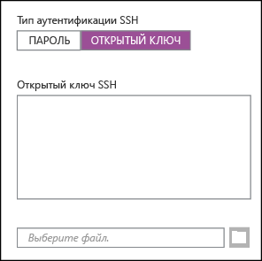
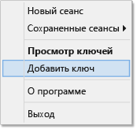

<properties
   pageTitle="Использование ключей SSH с Hadoop в кластерах на платформе Linux из Windows | Microsoft Azure"
   description="Узнайте, как создавать и использовать ключи SSH для аутентификации в кластерах HDInsight на основе Linux. Подключайте кластеры с клиентов под управлением Windows с помощью клиента PuTTY SSH."
   services="hdinsight"
   documentationCenter=""
   authors="Blackmist"
   manager="paulettm"
   editor="cgronlun"/>

<tags
   ms.service="hdinsight"
   ms.devlang="na"
   ms.topic="article"
   ms.tgt_pltfrm="na"
   ms.workload="big-data"
   ms.date="07/06/2015"
   ms.author="larryfr"/>

#Использование SSH с Hadoop в HDInsight под управлением Linux в Windows (предварительная версия)

> [AZURE.SELECTOR]
- [Windows](hdinsight-hadoop-linux-use-ssh-windows.md)
- [Linux, Unix, OS X](hdinsight-hadoop-linux-use-ssh-unix.md)

Кластеры Azure HDInsight под управлением Linux предоставляют возможность защиты доступа по протоколу Secure Shell с помощью пароля или ключа SSH. Этот документ содержит информацию о подключении к HDInsight из клиентов Windows с помощью клиента SSH PuTTY.

> [AZURE.NOTE]При описании действий в данной статье предполагается, что вы используете клиент Windows. Если вы используете клиент OS X, Linux или Unix, см. статью [Использование SSH с Hadoop под управлением Linux в HDInsight в Linux, Unix или OS X](hdinsight-hadoop-linux-use-ssh-unix.md).

##Предварительные требования

* **PuTTY** и **PuTTYGen** для клиентов Windows. Эти служебные программы доступны по адресу [http://www.chiark.greenend.org.uk/~sgtatham/putty/download.html](http://www.chiark.greenend.org.uk/~sgtatham/putty/download.html).

* Современный веб-браузер, который поддерживает HTML5.

ИЛИ

* [Интерфейс командной строки Azure для Mac, Linux и Windows](../xplat-cli.md).

##Что такое SSH?

SSH — это служебная программа для входа в систему и удаленного выполнения команд на удаленном сервере. Используя HDInsight под управлением Linux, SSH устанавливает безопасное подключение к головному узлу кластера и предоставляет окно командной строки, используемое для ввода команд. Команды выполняются непосредственно на сервере.

##Создание ключа SSH (необязательно)

При создании кластера HDInsight под управлением Linux в случае использования SSH вы можете использовать пароль или ключ SSH для аутентификации на сервере. Ключи SSH считаются более надежными, так как они основаны на сертификатах. Если вы планируете использовать ключи SSH на своем кластере, используйте следующую информацию.

1. Откройте PuTTYGen.

2. Для параметра **Тип формируемого ключа** выберите значение **RSA SSH-2**, а затем нажмите кнопку **Сформировать**.

	

3. Перемещайте указатель мыши в области под индикатором выполнения, пока он не заполнится. Перемещение указателя мыши формирует случайные данные, которые используются для создания ключа.

	

	После создания ключа отобразится открытый ключ.

4. Для большей безопасности можно ввести парольную фразу в поле **Парольная фраза ключа**, а затем ввести то же значение в поле **Подтверждение парольной фразы**.

	

	> [AZURE.NOTE]Мы настоятельно рекомендуем использовать безопасную парольную фразу для ключа. Однако если вы забудете парольную фразу, восстановить ее будет невозможно.

5. Щелкните **Сохранить закрытый ключ**, чтобы сохранить ключ в **PPK-файле**. Этот ключ будет использоваться для аутентификации в кластере HDInsight на платформе Linux.

	> [AZURE.NOTE]Этот ключ следует хранить в безопасном месте, так как он будет использоваться для доступа к кластеру HDInsight на платформе Linux.

6. Щелкните **Сохранить открытый ключ**, чтобы сохранить ключ в **TXT-файле**. Это позволяет повторно использовать открытый ключ в будущем при создании дополнительных кластеров HDInsight на платформе Linux.

	> [AZURE.NOTE]Открытый ключ также отображается в верхней части PuTTYGen. Щелкните правой кнопкой мыши это поле, скопируйте значение и вставьте его в форму, например в мастере HDInsight на портале Azure.

##Создание кластера HDInsight на основе Linux

При создании кластера HDInsight на основе Linux необходимо предоставить открытый ключ, созданный ранее. В клиентах Windows кластер HDInsight под управлением Linux можно создать двумя способами:

* **с помощью портала Azure** — для создания кластера используется веб-портал;

* **с помощью интерфейса командной строки Azure для Mac, Linux и Windows** — для создания кластера используются команды командной строки.

Для каждого из этих способов потребуется открытый ключ. Полную информацию о создании кластера HDInsight под управлением Linux см. в статье [Подготовка кластеров HDInsight под управлением Linux](hdinsight-hadoop-provision-linux-clusters.md).

###Портал Azure

При использовании портала для создания кластера HDInsight под управлением Linux необходимо ввести имя пользователя и пароль или открытый ключ в следующей форме:

Создает имя входа для указанного пользователя и позволяет выполнять аутентификацию с помощью пароля или ключа SSH.

###Интерфейс командной строки Azure для Mac, Linux и Windows

Вы можете использовать [интерфейс командной строки Azure для Mac, Linux и Windows](../xplat-cli.md) для создания нового кластера с помощью команды `azure hdinsight cluster create`.

Дополнительную информацию об использовании этой команды см. в статье [Подготовка кластеров Hadoop под управлением Linux в HDInsight с помощью настраиваемых параметров](hdinsight-hadoop-provision-linux-clusters.md).

##Подключение к кластеру HDInsight на основе Linux

1. Откройте PuTTY.

	

2. Если вы указали ключ SSH при создании учетной записи пользователя, необходимо выполнить следующий шаг, чтобы выбрать закрытый ключ, который будет использоваться при аутентификации в кластере.

	В разделе **Категория** последовательно разверните **Подключение**, **SSH** и выберите **Аутентификация**. Наконец, нажмите кнопку **Обзор** и выберите PPK-файл, содержащий закрытый ключ.

	

3. В поле **Категория** выберите **Сеанс**. На экране **Основные параметры вашего сеанса PuTTY** в поле **Имя узла (или IP-адрес)** введите адрес SSH своего сервера HDInsight. Адрес SSH — это имя кластера с суффиксом **-ssh.azurehdinsight.net**. Например, **mycluster-ssh.azurehdinsight.net**.

	

4. Чтобы сохранить данные о подключении для использования в будущем, в разделе **Сохраненные сеансы** введите имя для этого подключения и нажмите кнопку **Сохранить**. Соединение будет добавлено в список сохраненных сеансов.

5. Щелкните **Открыть** для подключения к кластеру.

	> [AZURE.NOTE]При первом подключении к кластеру, вы получите оповещение системы безопасности. Это нормально. Для продолжения выберите **Да**, чтобы кэшировать ключ RSA2 сервера.

6. При появлении запроса введите имя пользователя, которое было введено при создании кластера. Если для пользователя использовался пароль, отобразится также запрос на ввода пароля.

###Подключение к рабочим узлам

К рабочим узлам нельзя получить прямой доступ за пределами центра обработки данных Azure, но к ним можно получить доступ с головного узла кластера через SSH.

Если вы указали ключ SSH при создании учетной записи пользователя, необходимо выполнить следующие шаги, чтобы использовать закрытый ключ при аутентификации в кластере для подключения к рабочим узлам.

1. Загрузите файл установки Pageant с этой страницы: [http://www.chiark.greenend.org.uk/~sgtatham/putty/download.html](http://www.chiark.greenend.org.uk/~sgtatham/putty/download.html). Эта служебная программа используется для кэширования ключей SSH для PuTTY.

2. Запустите агент Pageant. Он будет свернут в значок в области состояния. Щелкните его правой кнопкой мыши и выберите **Добавить ключ**.

    

3. При появлении диалогового окна обзора выберите PPK-файл, который содержит ключ, и щелкните **Открыть**. Таким образом ключ будет добавлен в Pageant, который предоставит его PuTTY при подключении к кластеру.

    > [AZURE.IMPORTANT]Если ключ SSH используется для защиты вашей учетной записи, прежде чем можно будет подключиться к рабочим узлам, потребуется выполнить предыдущие шаги.

4. Откройте PuTTY.

5. При использовании ключа SSH для аутентификации в разделе **Категории** последовательно разверните **Подключение** и **SSH** и выберите **Аутентификация**.

    В разделе **Параметры аутентификации** установите флажок **Разрешить пересылку агента**. Это позволяет PuTTY автоматически пройти аутентификацию с использованием сертификата с помощью подключения к головному узлу кластера при подключении к рабочим узлам.

    

6. Подключитесь к кластеру, как описано выше. При использовании ключа SSH для аутентификации кластера вам не требуется выбирать ключ, так как для этого будет использоваться ключ SSH, добавленный в Pageant.

7. После подключения выполните следующие действия, чтобы получить список узлов в кластере. Замените *ADMINPASSWORD* паролем учетной записи администратора кластера. Замените *CLUSTERNAME* именем кластера.

        curl --user admin:ADMINPASSWORD https://CLUSTERNAME.azurehdinsight.net/api/v1/hosts

    В результате будет возвращена информация в формате JSON для узлов кластера, включая `host_name`, в котором содержится полное доменное имя (FQDN) каждого узла. Ниже приведен пример записи `host_name`, возвращенной командой **curl**:

        "host_name" : "workernode0.workernode-0-e2f35e63355b4f15a31c460b6d4e1230.j1.internal.cloudapp.net"

8. После создания списка необходимых для подключения рабочих узлов используйте следующую команду сеанса PuTTY для подключения к рабочему узлу:

        ssh USERNAME@FQDN

    Замените *USERNAME* своим именем пользователя SSH, а *FQDN* — полным доменным именем рабочего узла. Например, `workernode0.workernode-0-e2f35e63355b4f15a31c460b6d4e1230.j1.internal.cloudapp.net`.

    > [AZURE.NOTE]При использовании пароля для аутентификации сеанса SSH появится запрос на повторный ввод пароля. При использовании ключа SSH подключение завершается без запросов.

9. После установления сеанса PuTTY строка `username@headnode` изменится на `username@workernode`, чтобы указать, что вы подключены к рабочему узлу. Все команды на этом этапе выполняются на рабочем узле.

10. После выполнения всех действий на рабочем узле закройте сеанс рабочего узла с помощью команды `exit`. Таким образом вы вернетесь к запросу `username@headnode`.

##Добавление дополнительных учетных записей

Если требуется добавить дополнительные учетные записи в кластер, сделайте следующее:

1. Создайте новый открытый ключ и закрытый ключ для новой учетной записи пользователя, как было описано ранее.

2. Из сеанса SSH добавьте в кластер нового пользователя с помощью следующей команды:

		sudo adduser --disabled-password <username>

	Она создаст новую учетную запись пользователя, но отключит проверку пароля.

3. Создайте каталог и файлы для хранения ключа, используя следующие команды:

        sudo mkdir -p /home/<username>/.ssh
        sudo touch /home/<username>/.ssh/authorized_keys
        sudo nano /home/<username>/.ssh/authorized_keys

4. Когда откроется редактор nano, скопируйте и вставьте в него содержимое открытого ключа для новой учетной записи пользователя. Наконец, нажмите клавиши **Ctrl-X**, чтобы сохранить файл и закрыть редактор.

	

5. Используйте следующую команду, чтобы изменить владельца папки в формате SSH и ее содержимого на новую учетную запись пользователя:

		sudo chown -hR <username>:<username> /home/<username>/.ssh

6. Теперь можно будет проходить аутентификацию на сервере с новой учетной записью пользователя и закрытым ключом.

##Туннелирование SSH

SSH может также использоваться для туннелирования локальных запросов, например веб-запросов, к кластеру HDInsight. Запрос будет затем перенаправлен к запрошенному ресурсу, как если бы исходил от головного узла кластера HDInsight.

Это может пригодиться при доступе к веб-службам в кластере HDInsight, использующим внутренние доменные имена для головного или рабочих узлов в кластере. Например, некоторые части веб-страницы Ambari используют внутренние доменные имена, например **headnode0.mycluster.d1.internal.cloudapp.net**. Эти имена нельзя разрешить вне кластера, но запросы, туннелированные через SSH, создаются внутри кластера и будут разрешены правильно.

Выполните следующие действия, чтобы создать туннель SSH и настроить браузер для подключения к кластеру:

1. Откройте PuTTY и введите информацию о подключении, как указано выше в разделе [Подключение к кластеру под управлением Linux](#connect-to-a-linux-based-hdinsight-cluster).

2. В разделе **Категории** в левой части диалогового окна последовательно разверните **Подключение**, **SSH** и выберите **Туннели**.

3. Введите следующую информацию в форме **Параметры, управляющие перенаправлением портов SSH**:

	* **Порт источника** — порт на стороне клиента, трафик которого нужно перенаправлять. Например, **9876**.

	* **Назначение** — адрес SSH для кластера HDInsight под управлением Linux. Например, **mycluster-ssh.azurehdinsight.net**.

	* **Динамическая** — включает динамическую маршрутизацию прокси-сервера SOCKS.

	

4. Щелкните **Добавить**, чтобы добавить параметры, а затем щелкните **Открыть**, чтобы открыть подключение SSH.

5. При появлении запроса войдите на сервер. При этом будет установлен сеанс SSH и включен туннель.

6. Настройте клиентскую программу, например Firefox, чтобы использовать **localhost:9876** в качестве прокси-сервера **SOCKS v5**. Вот как выглядят параметры Firefox:

	

	> [AZURE.NOTE]Если выбрать параметр **Удаленная служба DNS**, то запросы DNS будут разрешаться с использованием кластера HDInsight. Если этот параметр не выбран, запросы DNS будут разрешаться локально.

	Вы можете убедиться, что трафик направляется через туннель, посетив сайт [http://www.whatismyip.com/](http://www.whatismyip.com/), при включенных и выключенных параметрах прокси в Firefox. Если они включены, IP-адрес будет относиться к компьютеру в центре обработки данных Microsoft Azure.

###Расширения браузера

Обычно при настройке браузера для использования туннеля вы не хотите направлять через туннель весь трафик. Расширения браузера, такие как [FoxyProxy](http://getfoxyproxy.org/), поддерживают сопоставление шаблонов для запросов URL-адресов (только FoxyProxy Standard или Plus), что позволяет отправлять через туннель только запросы определенных URL-адресов.

Если вы установили FoxyProxy Standard, выполните следующие действия, чтобы настроить его для перенаправления через туннель только трафика для HDInsight.

1. Откройте расширение FoxyProxy в браузере. Например, в Firefox щелкните значок FoxyProxy рядом с полем адреса.

	

2. Щелкните **Добавить новый прокси-сервер**, а затем выберите вкладку **Общие** и введите имя прокси-сервера **HDInsightProxy**.

	

3. Выберите вкладку **Сведения о прокси** и заполните следующие поля.

	* **Хост или IP-адрес** — необходимо указать значение localhost, так как мы используем туннель SSH на локальном компьютере.

	* **Порт** — порт, используемый для туннеля SSH.

	* **Прокси-сервер SOCKS** — выберите этот параметр, чтобы позволить браузеру использовать туннель в качестве прокси-сервера.

	* **SOCKS v5** — выберите этот параметр, чтобы задать требуемую версию прокси-сервера.

	

4. Выберите вкладку **Шаблоны URL-адреса**, а затем нажмите кнопку **Добавить новый шаблон**. Используйте следующие значения параметров, чтобы определить шаблон, а затем нажмите кнопку **ОК**:

	* **Имя шаблона** — **headnode** (это просто понятное имя для шаблона);

	* **Шаблон URL** — ***headnode*** — определяет шаблон, которому соответствует любой URL-адрес со словом **headnode**.

	

4. Нажмите кнопку **ОК**, чтобы добавить прокси-сервер и закрыть окно **Параметры прокси-сервера**.

5. В верхней части диалогового окна FoxyProxy в раскрывающемся списке **Выбрать режим** выберите пункт **Использовать прокси-серверы на основе шаблонов и приоритетов**, а затем нажмите кнопку **Закрыть**.

	

После выполнения этих действий только запросы URL-адресов, которые содержат строку **headnode**, будут направляться через туннель SSL.

##Дальнейшие действия

Теперь, когда вы знаете, как пройти аутентификацию с помощью ключа SSH, узнайте, как использовать MapReduce с Hadoop в HDInsight.

* [Использование Hive с HDInsight](hdinsight-use-hive.md)

* [Использование Pig с HDInsight](hdinsight-use-pig.md)

* [Использование заданий MapReduce с HDInsight](hdinsight-use-mapreduce.md)

<!---HONumber=July15_HO4-->